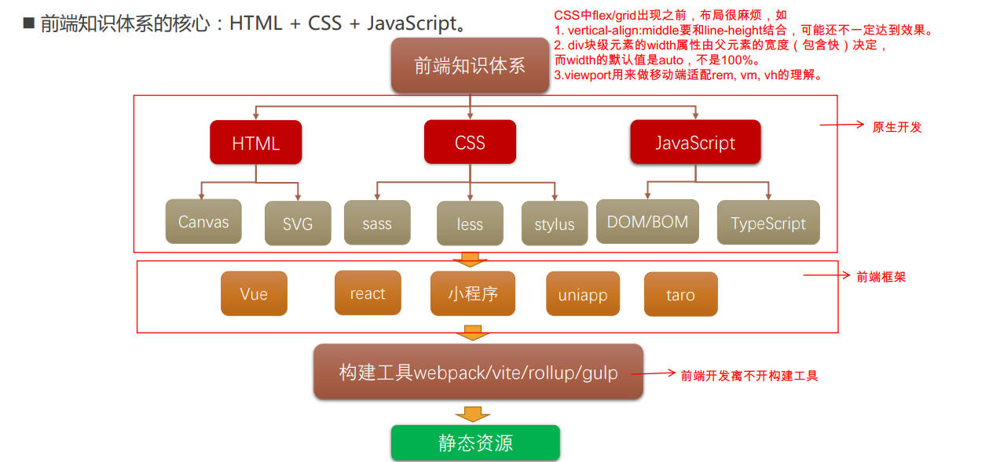
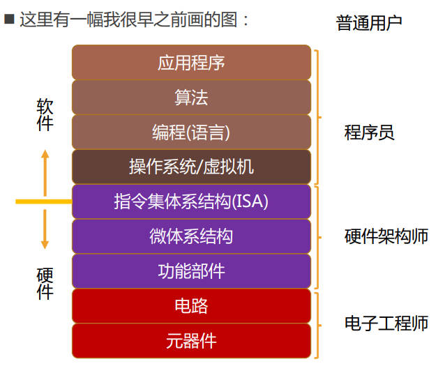
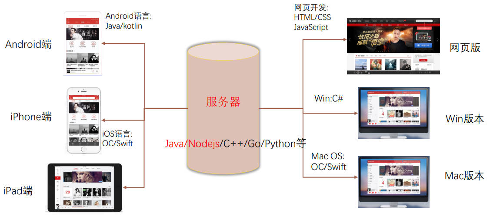

# 邂逅前端开发，邂逅web开发

## 一、前端的核心知识体系

前端的核心知识体系 3 个它们的地位。

- HTML：网页的结构；
- CSS：网页的样式（美化）；
- JavaScript：网页的交互（灵魂）；

> 构成 HTML 的是元素（Element）。
>
> HTML 中的 `<i>`, `<strong>` 元素由一些历史原因诞生，现已淘汰。
>
> CSS 中 `flex`, `grid` 出现之前，布局很麻烦，比如：
>
> - `vertical-align: middle;` 不能做垂直居中。
> - `
` 块级元素的 width 属性由父元素（包含快）的宽度决定，而 width 的默认值是 auto，不是 100%。
> - viewport 用来做移动端适配，衍生出的 rem, vm, vh 的理解。
> - ...

## 二、前端 3 大体系分支图

## 三、前端可视化需要学习的知识点

canvas / svg / c3 动画 / echarts / 大屏适配（基于矢量图，不会失真）

## 四、为什么还需要学习 jQuery

jQuery 已退出历史舞台，为不出现断层，需要回顾下其中某些 api，例举。

- ajax，http 请求头 / 响应头，fetch 等网络请求相关的 api

## 五、Node 学习

Node 中分为服务器开发和数据库，在此基础上学习 SSR，开发自己脚手架。

## 六、软件的概念

### 1.软件的定义

一系列按照特定顺序组织的计算机数据和指令，是电脑的非有型部分。

什么是软件开发？告诉计算机一系列的指令，这些指令也称之为程序。

### 2.与应用程序的区别

软件开发和应用程序开发有什么区别？

- **软件（software）**指的是基于底层操作系统，利用编程语言和算法，构建出来的应用程序。
- **应用程序（Application）**通常指用户使用和交互的软件前端部分。

软件可以理解为应用程序（App）的超集。

理解软硬件层级架构图。

### 3.一个完善的软件系统

理解一个完善的软件系统组成图，以网易云音乐为例。

## 七、网页的概念

### 1.网页和网站的区别

网页（Web Page）是打开浏览器查看到的页面，可包含丰富的内容，如文字，链接，图片，音乐，视频等等。

网站，由多个网页组成。

### 2.网页的显示过程

网页的显示过程，用户角度：

1. 用户在浏览器输入一个网站域名。
2. 浏览器会找到对应的服务器 ip 地址，请求静态资源。
3. 服务器返回静态资源给浏览器。
4. 浏览器对静态资源进行解析和展示。

网页的显示过程，开发角度。

1. 开发项目（由 HTML / CSS / JS / Vue / React/... 组成）。
2. 打包，部署项目到服务器里面。

## 八、大前端的概念

大前端开发的内容包括：

- web 开发、小程序开发（前端）
- 移动端、桌面端（electron、vscode）、服务器开发（Node）

## 九、学习方法和建议

学习方法和学习建议 2 点。

- 学习任何新的东西时，最好了解它的**历史、局限性、本质**；
- 知识进行分类：
  - 常用的知识：必须非常熟练；
  - 不常用的知识：知道有它，知道在哪里查；

## 十、开发工具

推荐开发使用软件：Chrome，VSCode，Xmind Zen，Typora。
