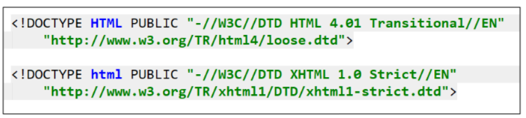

!（叹号）生成 html 结构，使用的是 Emmet 语法。

------

一个完整的 html 结构，包含哪几部分。

- HTML5的文档声明。`<!DOCTYPE html>`
- html元素。
  - head元素。
  - body元素。

------

HTML文档声明的2个作用。（文档声明不是元素）

1. 告诉当前页面是HTML5页面。
2. 让浏览器用HTML5的标准去解析识别内容。

HTML文档声明的1个注意事项：

- 必须放在HTML文档的最前面，不能省略，否则会出现兼容性问题。

HTML5的文档声明，比HTML4.01，XHTML1.0简洁很多，如图所示。



------

html元素有什么作用。

- 表示HTML文档的根（顶级元素），被称为根元素，其它元素必须是此元素的后代。

------

W3C建议为html元素设置 lang 属性（一种全局属性），有什么作用？

- 帮助语音合成工具确定要使用的发音（帮助残障人士）。
- 帮助翻译工具要使用的翻译规则（根据lang属性的值，与浏览器的语言做比较，决定是否提示需要翻译）。

例举2个常用属性值。

- `lang="en"`：表示HTML文档语言是英文。
- `lang="zh-CN"`：表示HTML文档的语言是中文。

------

head 元素有什么用，例举说明。

- 可用于配置标题（ title 元素），设置图标（ link 元素），配置编码（ meta 元素），链接样式（ link 元素），引用脚本（ link 元素）（一般不在这里引用）

```html
<head>
  <!-- 配置编码 -->
	<meta charset="UTF-8">
  <!-- 适配IE的配置 -->
	<meta http-equiv="X-UA-Compatible" content="IE=edge">
  <!-- 移动端适配，视口相关配置 -->
	<meta name="viewport" content="width=device-width, initial-scale=1.0">
  <!-- 设置标题小图标 -->
  <link rel="shortcut icon" type="image/x-icon" href="favicon.ico">
	<title>Document</title>
</head>
```

------

计算机只能存储 0 和 1，需要通过编码对文字等内容做转换，如 utf-8 编码。

------

body 元素里面的内容是用来编写网页中的内容和结构的，大部分HTML元素都是在 body 中编写呈现的。

------

HTML中常用元素有哪些？

- p元素，h元素；
- img元素，a元素，iframe元素；
- div元素，span元素。

后续会学习的元素有哪些？

- ul，ol，li元素；
- button，imput元素；
- table、thead、tbody，th，tr，td元素

HTML5新增元素，后续学习。

------

h元素是`Heading`的简称；表示的是不同级别的标题（h1~h6）；与`SEO`优化有关；**本质上是浏览器添加不同的css，展示出不同的效果**。

------

p元素是`Paragraph`简称，表示的是段落，分段，多个p元素之间也会有一定间距。

------

多个p元素或h元素，他们之间的空隙合并了。

------

img元素是将一份图像嵌入文档，它是一个**可替换元素**（一个元素，可使用另外资源或另外形式替换掉，称之为可替换元素。）。

------

img 元素的2个属性，分别有什么用。

- src 属性（source）：
  - 必须的，包含了想要嵌入的图片路径。
- alt 属性：
  - 非强制性，
  - 作用一：图片加载不成功，会显示这段文本。
  - 作用二：屏幕阅读器会将这些描述读给需要使用阅读器的使用者听。让他们知道图像含义（帮助残障人士）。

```html
	
```

------

img 的一些其它属性，如 width, height, border，已不再使用，使用css来完成他们的功能。

------

img 的 src 属性，可设置哪2种类型的图片？

- 网络图片：一个URL地址。
- 本地图片：本地电脑上的图片，会和html一起部署到服务器，此时对于用户来说，该图片还是网络图片，使用相对路径访问。

```html


```

设置图片的路径有哪2种方式。

- 绝对路径（几乎不用）
- 相对路径（常用）：
  - `./`代表当前文件夹，可省略。
  - `../`代表上级文件夹。

------

对于网页来说，不管什么操作系统（Win，Linux，Mac），路径分割符都是“/”（斜杠），不是“\”（反斜杠）。

------

a元素是`anchor`简称，也称为锚元素，表示超链接，

a元素2个属性的理解。

- href（Hypertext Reference）：指定要打开的URL地址（本质上是请求），也可是本地地址，也可以是片段名。
- target：指定在何处显示链接的资源。
  - _self：默认值，在当前窗口打开URL。
  - _blank：在一个新的窗口打开URL。
  - 其它不常用，讲iframe时补充，如 _top, _parent

```html
	<a href="https://www.baidu.com" target="_blank">百度一下</a>
```

