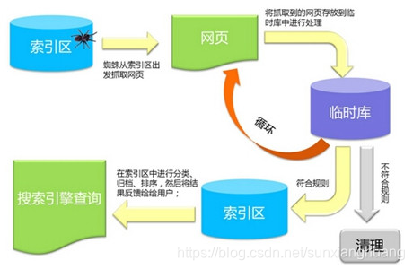
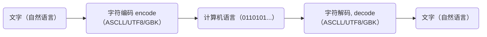

# 元素语义化、块级元素、SEO、网页渲染、字符编码、邂逅CSS（一）

## 一、元素的语义化

元素的语义化指的是：用正确的元素做正确的事。

元素语义化 4 点好处。

- 方便代码维护。
- 减少让开发者之间的沟通成本。
- 能让语音合成工具正确的识别网页元素的用途，以便做出正确的反应。
- 有利于 SEO。

## 二、块级元素

理解 span 元素添加 `display: block;` 属性后，与 div 元素的区别。

- div 元素默认有 `display: block;` 属性，在浏览器调试中，类型是 `user agent stylesheet`；
- 相对的 span 元素，手动添加 `display: block;` 属性后，在浏览器调试中可勾选属性。

> 浏览器调试时，`computed` 选项的使用，可查看元素在浏览器中应用的样式。

## 三、SEO

SEO 指的是搜索引擎优化（Search Engine Optimization）

SEO 是一种网页优化手段，通过了解搜索引擎的运作规则来调整网站，以及提高网站在搜索引擎内排名的方式。

理解搜索引擎的原理图。



## 四、网页渲染模式

在开发后台管理系统时，一般推荐使用 SPA（simple page application)）的开发模式，因为不用在意 SEO 优化，

在开发门户网站时，一般推荐使用 SSR 开发模式，这样有利于 SEO 优化。

## 五、字符编码

计算机只能存储和处理 0、1 组成的二进制数字；它的底层硬件实现，是用电路的开和闭两个状态，表示 0 和 1 两个数字的。

为了在计算机上处理文字，符号或者更复杂的内容；需要将这些字符（或更复杂内容）转换成二进制数字，

这就是字符编码和解码的过程：



## 六、CSS

CSS (Cascading Style Sheet)，意为层叠样式表。

CSS 是样式表语言，计算机语言，不是编程语言。

### 1.CSS 历史

1. 早期的网页都是通过 HTML 来编写，如果希望 HTML 页面可以更加丰富，就要增加很多具备特殊样式的元素：比如 i、strong、del...；
2. 然后各浏览器，实现各自的样式语言，但是没有统一的规划；
3. 1994 年，哈肯·维姆·莱和伯特·波斯合作设计 CSS。
4. 1996 年，发布了 CSS1；
5. 1997 年初，W3C 组织专门成立了 CSS 的工作组；
6. 1998 年 5 月发布了 CSS2；
7. 2006~2009 年，非常流行 “DIV+CSS” 布局的方式来替代所有的 html 标签；
8. 2011 年 6 月 7 日，CSS Color Module 发布为 W3C Recommendation，标志着第一个 CSS 模块发布。这个版本的 CSS 被广泛称为 CSS3，从 CSS3 开始，所有的 CSS 分成了不同的模块（modules），每一个“modules”都有相对 CSS2 中额外增加的功能，以及向后兼容（事实上，没有真正意义上的 CSS3 版本，现在的 CSS 都是分模块发布的）。

### 2.CSS 的作用

CSS 美化 HTML 的 2 种方式。

- 为 HTML 添加各种各样的样式，比如颜色、字体、大小、下划线等等；
- 对 HTML 进行布局，按照某种结构显示（CSS 进行布局 – 浮动、flex、grid）

### 3.CSS 编写格式

一个声明（Declaration），单独的 CSS 规则的写法：`属性名: 属性值;`

- 属性名（Property name）：要添加的 css 规则的名称；
- 属性值（Property value）：要添加的 css 规则的值；

### 4.CSS 的三种形式

形式一：行内样式（inline style）。

形式二：内部样式表（internal style sheet），也称为：文档样式表（document style sheet）、内嵌样式表（embed style sheet）。

形式三：外部样式表（external style sheet）。也称为：外联样式表。

#### 1.行内样式

行内样式存在于 HTML 元素的 `style` 属性之中。

```html
<div style="color: red; font-size: 30px;">我是div元素</div>
```

#### 2.内部样式表

内部样式表写法如下（使用元素选择器，类选择器），将 CSS 放在 `<html>` 元素里的 `<head>` 元素里的 `<style>` 元素之中；

> 在 Vue 的开发过程中，每个组件也会有一个 `<style>` 元素，和内部样式表非常的相似，然而原理并不相同；

```html
<html lang="en">
  <head>
    <meta charset="UTF-8" />
    <meta http-equiv="X-UA-Compatible" content="IE=edge" />
    <meta name="viewport" content="width=device-width, initial-scale=1.0" />
    <title>Document</title>
    <style>
      /* body 中的两个 div 都可以找到 */
      div {
        color: red;
        font-size: 30px;
        background-color: orange;
      }
      
      /* bodu 中 class 为 .div-one 的元素可以找到 */
      .div-one {
        color: red;
        font-size: 30px;
        background-color: orange;
      }
    </style>
  </head>
  <body>
    <div class="div-one">我是div元素</div>
    <div>我也是div元素</div>
  </body>
</html>
```

#### 3.外部样式表

将 CSS 编写在一个独立的文件中，然后在 html 文件中，通过 `<link>` 元素（单标签元素）引入进来。

./css/style.css

```css
.title {
  font-size: 30px;
  color: red;
  background-color: purple;
}
```

./demo.html

```html
<!DOCTYPE html>
<html lang="en">
  <head>
    <meta charset="UTF-8" />
    <meta http-equiv="X-UA-Compatible" content="IE=edge" />
    <meta name="viewport" content="width=device-width, initial-scale=1.0" />
    <title>Document</title>
    <!-- link 元素是用来引入外部样式表 -->
    <link rel="stylesheet" href="./css/style.css" />
  </head>
  <body>
    <div class="title">我是01中的title</div>
  </body>
</html>
```

### 5.CSS 引入

在 css 文件中，引入其他外部样式表，`@import` 的用法：

./css/index.css

```css
/* 可以通过 @import 引入其他的 css 资源，url()，是 css 里的函数。*/
@import url('./style.css');

/* 在顶层使用 @import url(XXX) 和 @import 'XXX' 效果一样。*/
@import './test.css';
```

./demo.html

```html
<!DOCTYPE html>
<html lang="en">
  <head>
    <meta charset="UTF-8" />
    <meta http-equiv="X-UA-Compatible" content="IE=edge" />
    <meta name="viewport" content="width=device-width, initial-scale=1.0" />
    <title>Document</title>
    <!-- 引入外部样式表 -->
    <link rel="stylesheet" href="./css/index.css" />
  </head>
  <body>
    <h1>我是h1元素</h1>
    <div class="title">我是title</div>
  </body>
</html>
```

### 6.CSS 注释

CSS 的注释的写法，注释会增加文件大小，但实际用户使用的代码经过打包工具打包优化，将对代码运行无用的内容，如注释会删除掉。

```css
/* 注释 */
```

### 7.CSS 学习路线

了解常见的 CSS，必须掌握的 CSS 思维导图。

### 8.CSS 相关文档

CSS 文档优先推荐 MDN，

[MDN CSS](https://developer.mozilla.org/en-US/docs/Web/CSS/Reference)

如有描述不准确，可看 W3C 官方文档。

[W3C CSS](https://www.w3.org/TR/?tag=css)

了解查询 CSS 兼容性的网站。

[caniuse](https://caniuse.com/)
