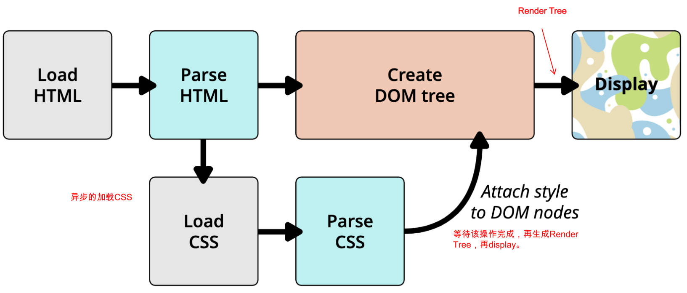

# 浏览器字号、CSS样式属性、body特性、div特性、img元素、星球介绍案例、link元素、域名解析、进制、CSS颜色、浏览器开发者工具、浏览器的渲染流程

## 一、浏览器可设置字体和字号大小

浏览器可设置字号大小和字体。

字号大小默认是 16px。

## 二、五个基础常用 CSS 样式属性

`font-size`：文字大小。

`color`：前景色（文字颜色），包括文字，装饰线，边框，外轮廓等的颜色。

`background-color`：背景色。

`width` ：宽度。

`height`：高度。

```html
<!DOCTYPE html>
<html lang="en">
  <head>
    <meta charset="UTF-8" />
    <meta http-equiv="X-UA-Compatible" content="IE=edge" />
    <meta name="viewport" content="width=device-width, initial-scale=1.0" />
    <title>Document</title>
    <style>
      .title {
        font-size: 24px;
        color: chocolate;
        background-color: black;
        width: 200px;
        height: 200px;
      }
    </style>
  </head>

  <body>
    <div class="title">Hello World</div>
  </body>
</html>
```

## 三、body 的特性

body 默认有 padding。

## 四、div 元素的特性

div 元素默认占据一整行的宽度，高度由内容撑起。

div 元素不管宽度多少，默认都独占一行。

## 五、img 元素 alt 属性

img 的 alt 属性，全称是 alternative。

## 六、星球介绍案例

星球介绍案例实现。其中介绍了快捷元素放在同一行的两种方式

```html
<!DOCTYPE html>
<html lang="en">
  <head>
    <meta charset="UTF-8" />
    <meta http-equiv="X-UA-Compatible" content="IE=edge" />
    <meta name="viewport" content="width=device-width, initial-scale=1.0" />
    <title>Document</title>
    <style>
      .item {
        width: 500px;
        background-color: skyblue;
        
        /* 方式一: 改变元素的特性和垂直方向的布局 */
        display: inline-block;
        vertical-align: top;
        
        /* 方式二: 通过浮动完成 */
        /* float: left; */
      }
      .album {
        width: 500px;
      }
      .keyword {
        font-size: 30px;
        color: white;
        background-color: orange;
      }
    </style>
  </head>

  <body>
    <h1>星球介绍</h1>

    <!-- 木星的 -->
    <div class="item">
      <h2>木星</h2>
      <!-- alt -> alternative -->
      
      <p>
        <span class="keyword">木星(Jupiter)</span
        >是太阳系八大行星中体积最大、自转最快的行星，从内向外的第五颗行星。它的质量为太阳的千分之一，是太阳系中其它七大行星质量总和的2.5倍。由于木星与土星、天王星、海王星皆属气体行星，因此四者又合称类木行星（木星和土星合称气态巨行星）。木星是一个气态巨行星，占所有太阳系行星质量的70%，主要由氢组成，占其总质量的75%，其次为氦，占总质量的25%，岩核则含有其他较重的元素。人类所看到的通常是大气中云层的顶端，压强比1个大气压略高。
      </p>
    </div>

    <!-- 地球的 -->
    <div class="item">
      <h2>地球</h2>
      
      <p>
        <span class="keyword">地球(Earth)</span
        >是太阳系八大行星之一，按离太阳由近及远的次序排为第三颗，也是太阳系中直径、质量和密度最大的类地行星，距离太阳1.5亿公里。地球自西向东自转，同时围绕太阳公转。现有40~46亿岁，
        [1] 它有一个天然卫星——月球，二者组成一个天体系统——地月系统。46亿年以前起源于原始太阳星云。
      </p>
    </div>
  </body>
</html>
```

### 1.注意事项

1.如果给 img 元素设置百分比宽度，百分比相对于包含快。

2.案例中，如果设置 div 元素为行内元素（`display: inline;`），则给 div 元素设置的宽度，高度无效。

### 2.快级元素放在同一行

设置快级元素在同一行的三个方案：

- 方案一：`display: inline-block;`，弊端：
  - 同行的块级元素之间有空隙，这是由换行符造成的；
  - 同行的块级元素之间不会垂直居中对齐，涉及到的特性（`vertical-aligin: middle;`），后续会介绍。

- 方案二：`float: left;`
- 方案三：flex 布局。

## 七、link 元素

link 元素是外部资源链接元素。用于规范文档与外部资源的关系。

通常出现在 head 元素中，常见的 2 个属性。

- href：指定被链接资源的 URL。可以是绝对的，也可以是相对的。
- ref：指定链接类型，[常见的链接类型](https://developer.mozilla.org/zh-CN/docs/Web/HTML/Link_types)有：
  - `icon`：站点图标。
  - `stylesheet`：CSS 样式。
  - `dns-prefetch` ：实验性特性，与网页优化有关，提示浏览器该资源需要在用户点击链接之前，进行 DNS 查询和协议握手，有助于性能优化。

## 八、域名解析的过程

域名 -> dns 服务器 -> ip 地址 -> 访问服务器获取静态资源。

## 九、进制

进位制是一种记数方式，亦称进位计数法，或位值计数法。

通俗理解：当数字达到某个值时，进一位（比如从 1 位变成 2 位）。

了解进制之间转换的方法（比如：使用电脑自带的计算器）。

## 十、CSS 颜色

CSS 中颜色的表示方式 2 种。

- 颜色关键字：不区分大小写的标识符，表示一个具体的颜色。[MDN 文档](https://developer.mozilla.org/zh-CN/docs/Web/CSS/color_value#%E8%AF%AD%E6%B3%95)
- RGB 颜色，RGB 是一种色彩空间，通过三原色比例组成不同的颜色，各原色取值范围是 0~255。

### 1.RGB 颜色表示法

RGB 表示颜色的方式 3 种

方式一：十六进制符号：`#RRGGBB[AA]`

- R（红）、G（绿）、B （蓝）和 A （alpha）是十六进制字符（0–9、A–F）；A 是可选的。比如：`#ff0000` 等价于 `#ff0000ff`；

方式二：十六进制符号（简写）：`#RGB[A]`

- 是六位数或八位数形式的缩减版，如 `#f09` 和 `#ff0099` 表示同一颜色。`#0f38` 和 `#00ff3388` 表示相同颜色。

方式三：函数符：`rgb[a](R, G, B, [A])`

- R（红）、G（绿）、B （蓝）可以是数字（0-255），或者百分比，255 相当于 100%。
- A（alpha）可以是 0 到 1 之间的数字，或者百分比，数字 1 相当于 100%（完全不透明）。

## 十一、浏览器开发者工具的使用技巧

浏览器开发者工具使用的 3 个技巧。

- 通过右击某个元素，选择检查，直接在调试工具中定位该元素。
- 可以通过删除某些元素来查看网页结构;
- 可以通过增删 css 来调试网页样式;

## 十二、浏览器渲染的流程图

浏览器渲染的流程图。


