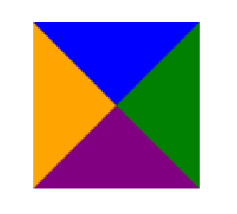

# 结构伪类

使用结构伪类选中表格的前 2 行。

```css
table tr:nth-child(-n + 2) {
  font-weight: 700;
  font-size: 20px;
}
```

`:nth-child()` 的 4 种使用方法。

- :nth-child(1)
  - 是父元素中的第 1 个子元素。`:first-child`同义。
- :nth-child(2n) ，n 代表任意正整数和 0。
  - 表示父元素中的第偶数个子元素（第 2、4、6、8......个）
  - 跟`:nth-child(even)`同义。
  - :nth-child(xn)，每 x 个元素，选中一个。
- :nth-child(2n + 1) ，n 代表任意正整数和 0。
  - 表示父元素中的第奇数个子元素（第 1、3、5、7......个）。
  - 跟`:nth-child(odd)`同义。
- :nth-child(-n + 2)
  - 代表前 2 个子元素。

```css
ul li:nth-child(2n) {
  color: green;
}
```

---

`:nth-last-child()` 的 2 种使用写法（用法与 :nth-child() 类似，从最后一个子元素开始往前计数）。

- :nth-last-child(1)，代表倒数第一个子元素 ，`:last-child`同义。
- :nth-last-child(-n + 2)，代表最后 2 个子元素

---

`:nth-of-type()` 用法跟 :nth-child() 类似，区别。

- :nth-of-type() 计数时只计算同种类型的元素，结合后代选择器，表示该选择器选中的类型。

```css
.box > div:nth-of-type(3) {
  color: blue;
}
```

```html
<div class="box">
  <div>我是列表1</div>
  <p>我是p元素</p>
  <span>我是span1</span>
  <div>我是列表2</div>
  <div>我是列表3</div>
  <!-- 被选中 -->
</div>
```

---

:nth-last-of-type() 用法跟 :nth-of-type() 类似，区别。

- :nth-last-of-type() 从最后一个这种类型的子元素开始往前计数。

---

衍生出其它常见的结构伪类简写 6 个。用法。

- :first-child，等同于:nth-child(1) 。
- :last-child，等同于:nth-last-child(1) 。
- :first-of-type，等同于:nth-of-type(1) 。
- :last-of-type，等同于:nth-last-of-type(1) 。
- :only-child，是父元素中唯一的子元素 。
- :only-of-type，是父元素中唯一的这种类型的子元素。

```css
.box > :only-child {
  font-size: 20px;
  font-weight: 700;
}

.box > :only-of-type {
  color: purple;
}
```

```html
<div class="box">
  <!-- 被 :only-child 选中 -->
  <div>我是box的div</div>
</div>

<div class="box">
  <!-- 被 :only-of-type 选中 -->
  <div>我是box的div</div>
  <div>我是box的div</div>
</div>
```

---

偶尔会使用的结构伪类 2 个，用法。

- :root，根元素，就是 html 元素。

- :empty，代表里面完全空白的元素，小程序中用来做默认插槽。

---

# 否定伪类

否定伪类选择器的用法。

- :not()，的格式是 :not(xxx)
- xxx 是一个简单选择器，如通用选择器，元素选择器、属性选择器、类选择器、伪类（**除否定伪类**）、id 选择器。

注意事项。

- :not(xxx)，表示除 xxx 以外的元素，经常需要结合后代选择器一起使用，否则会选中整个 HTML 页面大部分元素。

```css
.box :not(.zzt) {
  color: blue;
}
```

```html
<div class="box">
  <div class="item">列表内容1</div>
  <div class="zzt">列表内容3</div>
  <div class="item">列表内容5</div>
  <div>列表内容5</div>
  <div>列表内容5</div>
</div>
```

---

使用 border 制作三角形，将图形旋转。

```html
<head>
  <title>Document</title>
  <style>
    .box {
      width: 100px;
      height: 100px;
      box-sizing: border-box;
      /* border样式调整 */
      border: 50px solid transparent; /* 宽度为width的一半，使得border呈现三角形 */
      border-top-color: orange; /* border上边框作为一个有颜色的三角形 */
      /* 旋转 */
      transform-origin: center 25%;
      transform: rotate(180deg);
    }
  </style>
</head>
<body>
  <div class="box"></div>
</body>
```



---

操作系统中默认存在的字体被称为 web-safe 字体。

---

web-font 的工作原理。

- 首先, 通过渠道获取希望使用的字体（不是开发来做的事情）
  - 收费的字体, 获取到对应的授权;
  - 公司定制的字体, 需要设计人员来设计;
  - 免费的字体, 获取到对应的字体文件;
- 其次, 在我们的 CSS 代码当中使用该字体(重要):
- 最后, 在部署静态资源时, 将 HTML/CSS/JavaScript/Font 一起部署在静态服务器中。

---

使用 web-font 的步骤。

- 第一步：获取字体资源。
  - 如在网站下载一个字体。[字体天下](https://www.fonts.net.cn/fonts-zh-1.html)。
  - 默认下载下来的是 ttf 文件；
- 第二步：使用字体；

  1. 将字体放到对应的目录中。

  2. 通过`@font-face`来引入字体, 并且设置格式 。

  3. 使用字体。

```html
<head>
  <title>Document</title>
  <style>
    /* 将这个字体引入到网页中 */
    @font-face {
      font-family: 'zzt';
      src: url('./fonts/AaQingHuanYuanTi-2.ttf');
    }
    .box {
      font-family: 'zzt';
    }
  </style>
</head>
<body>
  <div class="box">我是div元素</div>
</body>
```

---

什么是 truetype 字体。

- 拓展名是`.ttf`的字体。

还有哪些字体 4 种。

- OpenType / TrueType 字体：拓展名是 .ttf、otf，建立在 TrueType 字体之上。
- Embedded OpenType 字体：拓展名是 .eot，OpenType 字体的压缩版。
- SVG 字体：拓展名是 .svg、.svgz
- WOFF 表示 Web Open Font Format，web 开放字体： 拓展名是 .woff，建立在 TrueType 字体之上

了解他们在各浏览器中的兼容性。

---

web fonts 兼容性写法。

```html
<head>
  <title>Document</title>
  <style>
    /* 这被称为"bulletproof @font-face syntax（刀枪不入的 @font-face 语法）
			这是 Paul Irish 早期的一篇文章提及后 @font-face 开始流行起来 */
    @font-face {
      font-family: 'zzt';
      /* 写2个src，用于适配老的IE浏览器。 */
      src: url('./fonts02/AaQingHuanYuanTi.eot'); /* IE9 */
      /* format 用于帮助浏览器快速识别字体的格式; */
      src: url('./fonts02/AaQingHuanYuanTi.eot?#iefix') format('embedded-opentype'), /* IE6-IE8 */
          url('./fonts02/AaQingHuanYuanTi.woff') format('woff'),
        /* chrome、firefox */ url('./fonts02/AaQingHuanYuanTi.ttf') format('truetype'), /* chrome、firefox、opera、Safari, Android, iOS 4.2+ */
          url('./fonts02/AaQingHuanYuanTi.svg#uxfonteditor') format('svg'); /* iOS 4.1- */
      font-style: normal;
      font-weight: 400;
    }
    body {
      font-family: 'zzt';
    }
  </style>
</head>
<body>
  <div class="box">我是div元素</div>
</body>
```

---

什么是字体图标？

- 把字体直接设计成图标的样子就是字体图标。

好处 3 点。

- 放大不会失真。
- 可以任意切换颜色（color）。
- 用到很多个图标时，文件相对图片较小。

---

字体图标的使用步骤。

- 字体图标的使用：
  - 登录[iconfont](https://www.iconfont.cn)
  - 下载代码，并且拷贝到项目中。
- 将字体文件和默认的 css 文件导入到项目中，并使用。
  - 第一步: 通过 link 引入 iconfont.css 文件。
  - 第二步: 使用字体图标
- 如果有新的字体图标加入，需要重复以上操作。

使用方式 2 种

- 通过对应字体图标的 Unicode 来显示代码（使用字符实体，不常用）;

  ```html
  <head>
    <title>Document</title>
    <style>
      @font-face {
        font-family: 'iconfont';
        src: url('./fonts03/iconfont.ttf');
      }
      .iconfont {
        font-family: 'iconfont';
        font-style: normal;
      }
    </style>
  </head>
  <body>
    <!-- 直接通过内容(字符实体) -->
    <i class="iconfont">&#xe654;</i>
    <i class="iconfont">&#xe664;</i>
  </body>
  ```

- 利用已经编写好的 class, 直接使用即可（使用伪元素）

  ```html
  <head>
    <title>Document</title>
    <link rel="stylesheet" href="./fonts03/iconfont.css" />
    <style>
      /* iconfont.css中已定义了.icon-shouye选择器，可直接使用，这里对它的样式做一些扩充 */
      .icon-shouye {
        font-size: 30px;
        color: red;
      }
    </style>
  </head>
  <body>
    <i class="iconfont icon-shouye"></i>
  </body>
  ```

  iconfont.css

  ```css
  @font-face {
    font-family: 'iconfont'; /* Project id  */
    src: url('iconfont.ttf?t=1649043846340') format('truetype');
  }
  .iconfont {
    font-family: 'iconfont' !important;
    font-size: 16px;
    font-style: normal;
    -webkit-font-smoothing: antialiased;
    -moz-osx-font-smoothing: grayscale;
  }
  .icon-shouye:before {
    content: '\e668';
  }
  .icon-touxiang-kong:before {
    content: '\e660';
  }
  .icon-video:before {
    content: '\e63e';
  }
  .icon-video1:before {
    content: '\e624';
  }
  .icon-music:before {
    content: '\e664';
  }
  .icon-Video:before {
    content: '\e69e';
  }
  .icon-music1:before {
    content: '\e654';
  }
  ```
