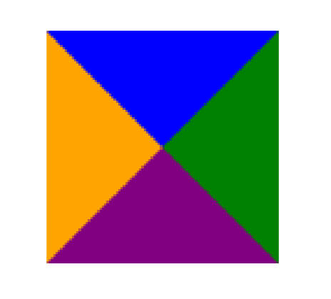

# 结构伪类、否定伪类、border制作三角形、Web字体、字体图标

## 一、结构伪类

使用结构伪类选中表格的前 2 行。

```css
table tr:nth-child(-n + 2) {
  font-weight: 700;
  font-size: 20px;
}
```

### 1.:nth-child() 用法

`:nth-child()` 的三种使用方法：

用法一：`:nth-child(1)`，表示是第 1 个子元素被选中。与  `:first-child` 同义。

用法二：`:nth-child(an + b)`，n 代表任意正整数和 0，表示每 a 个子元素的后 b 个元素被选中。

- 常见的用法有：`:nth-child(2n)`，表示第偶数个元素（第 2、4、6、8......个）被选中，与 `:nth-child(even)`同义。
- 常见的用法有：`:nth-child(2n + 1)`，表示第奇数个子元素（第 1、3、5、7......个） 被选中。与 `:nth-child(odd)` 同义。

```css
ul li:nth-child(2n) {
  color: green;
}
```

用法三：`:nth-child(-n + x)`：n 代表任意正整数和 0，表示父元素中前 x 个子元素被选中。

### 2.:nth-last-child() 用法

`:nth-last-child()` 的 2 种使用写法（用法与 `:nth-child()` 类似，从最后一个子元素开始往前计数）。

用法一：`:nth-last-child(1)`，表示父元素中倒数第一个子元素被选中 ，与 **`:last-child`** 同义。

用法二：`:nth-last-child(-n + 2)`，表示父元素中最后 2 个子元素被选中。

### 3.:nth-of-type() 用法

`:nth-of-type()` 用法跟 `:nth-child()` 类似，

它们的区别在于。`:nth-of-type()` 计数时，只计算同种类型的元素，结合后代选择器，表示该选择器选中的类型。

```css
.box > div:nth-of-type(3) {
  color: blue;
}
```

```html
<div class="box">
  <div>我是列表1</div>
  <p>我是p元素</p>
  <span>我是span1</span>
  <div>我是列表2</div>
  <!-- 被选中 -->
  <div>我是列表3</div>
</div>
```

### 4.:nth-last-of-type() 用法

`:nth-last-of-type()` 用法跟 `:nth-of-type()` 类似，区别在于 `:nth-last-of-type()` 从最后一个这种类型的子元素开始往前计数。

### 5.结构伪类简写

衍生出其它常见的结构伪类简写 6 个。用法。

- `:first-child`，等同于 `:nth-child(1)`。
- `:last-child`，等同于 `:nth-last-child(1)`。
- `:first-of-type`，等同于 `:nth-of-type(1)`。
- `:last-of-type`，等同于 `:nth-last-of-type(1)`。
- `:only-child`，是父元素中唯一的子元素 。
- `:only-of-type`，是父元素中唯一的这种类型的子元素。

```css
.box > :only-child {
  font-size: 20px;
  font-weight: 700;
}

.box > :only-of-type {
  color: purple;
}
```

```html
<div class="box">
  <!-- 被 :only-child 选中 -->
  <div>我是box的div</div>
</div>

<div class="box">
  <!-- 被 :only-of-type 选中 -->
  <div>我是box的div</div>
  <div>我是box的div</div>
</div>
```

### 6.其它结构伪类

`:root`，表示根元素，在 HTML 中匹配根元素 `<html>`。在 XML (包括 SVG) 中，`:root` 匹配的是文档树的根元素。

最常见的用法可能是在定义 CSS 自定义属性（也称为 CSS 变量）因为 `:root` 选择器对整个 HTML 文档都有效，所以在 `:root` 伪类里定义的 CSS 变量，整个文档中的元素都能访问。

```css
:root {
  --main-color: #06c;
}

body {
  background-color: var(--main-color);
}
```

`:empty`，它选择没有子节点（包括文本节点）的元素（小程序中用来做默认插槽）。

例如，下面的 CSS 会选择所有空的 `<p>` 元素，并将它们的背景色设置为红色：

```css
p:empty {
  background-color: red;
}
```

```html
<div>
  <p></p> <!-- :empty 会选择这个 -->
</div>

<div>
  <p> </p> <!-- :empty 不会选择这个，因为包含一个空格 -->
</div>
```

需要注意的是，如果一个元素内含有包括空白和换行符在内的文本，那么这个元素将不会被 `:empty` 选择器选中。同样，如果元素内含有其他元素，也无论这些元素是否空，它都不会被 `:empty` 选中。所以 `:empty` 伪类主要应用于确定一个元素是否为空，即无内容。

## 二、否定伪类

`:not()` 表示否定伪类选择器。格式是 :not(xxx)；xxx 表示一个简单选择器：

- 比如：通用选择器，元素选择器、属性选择器、类选择器、伪类（**除否定伪类**）、id 选择器。

`:not(xxx)`，表示除 xxx 以外的元素，经常需要结合后代选择器一起使用，否则会选中整个 HTML 页面大部分元素。

```css
.box :not(.zzt) {
  color: blue;
}
```

```html
<div class="box">
  <div class="item">列表内容1</div>
  <div class="zzt">列表内容3</div>
  <div class="item">列表内容5</div>
  <div>列表内容5</div>
  <div>列表内容5</div>
</div>
```

## 三、border 制作三角形

使用 border 制作三角形，将图形旋转。

```html
<head>
  <title>Document</title>
  <style>
    .box {
      width: 100px;
      height: 100px;
      box-sizing: border-box;

      /* border 样式调整 */
      border: 50px solid transparent; /* 宽度为 width 的一半，使得 border 呈现三角形 */
      border-top-color: orange; /* border 上边框作为一个有颜色的三角形 */

      /* 旋转 */
      transform-origin: center 25%;
      transform: rotate(180deg);
    }
  </style>
</head>

<body>
  <div class="box"></div>
</body>
```



## 四、Web 中的字体

操作系统中默认存在的字体，被称为 web-safe 字体。

### 1.Web 字体工作原理

web-font 的工作原理：

- 首先, 通过渠道获取希望使用的字体；
  - 收费的字体, 获取到对应的授权；
  - 公司定制的字体, 需要设计人员来设计；
  - 免费的字体, 获取到对应的字体文件，
- 其次, 在我们的 CSS 代码当中使用该字体；
- 最后, 在部署静态资源时, 将 HTML/CSS/JavaScript/Font 一起部署在静态服务器中。

### 2.Web 字体使用步骤

第一步：获取字体资源。

- 如在网站下载一个字体。[字体天下](https://www.fonts.net.cn/fonts-zh-1.html)。
- 默认下载下来的是 ttf 文件；

第二步：使用字体；

1. 将字体放到项目对应的目录中。

2. 在 CSS 中，通过 `@font-face` 来引入字体, 并且设置格式 。

3. 在其它 CSS 选择器中，使用字体。

```html
<head>
  <title>Document</title>
  <style>
    /* 将这个字体引入到网页中，并命名为 zzt */
    @font-face {
      font-family: 'zzt';
      src: url('./fonts/AaQingHuanYuanTi-2.ttf');
    }
    
    /* 使用字体 zzt */
    .box {
      font-family: 'zzt';
    }
  </style>
</head>

<body>
  <div class="box">我是div元素</div>
</body>
```

### 3.truetype 和其它常见字体类型

truetype 字体，拓展名是`.ttf` 的字体。

OpenType / TrueType 字体：拓展名是 .ttf、otf，它们建立在 TrueType 字体之上。

Embedded OpenType 字体：拓展名是 .eot，OpenType 字体的压缩版。

SVG 字体：拓展名是 .svg、.svgz

WOFF 表示 Web Open Font Format，web 开放字体： 拓展名是 .woff，建立在 TrueType 字体之上

了解他们在各浏览器中的兼容性。

### 4.web fonts 兼容性写法

```html
<head>
  <title>Document</title>
  <style>
    /* 这被称为 "bulletproof @font-face syntax（刀枪不入的 @font-face 语法）
    这是 Paul Irish 早期的一篇文章提及后 @font-face 开始流行起来 */
    @font-face {
      font-family: 'zzt';
      /* 写2个src，用于适配老的 IE 浏览器。 */
      /* format 用于帮助浏览器快速识别字体的格式; */
      src: url('./fonts02/AaQingHuanYuanTi.eot'); /* IE9 */
      src: url('./fonts02/AaQingHuanYuanTi.eot?#iefix') format('embedded-opentype'), /* IE6-IE8 */
          url('./fonts02/AaQingHuanYuanTi.woff') format('woff'),
        /* chrome、firefox */ url('./fonts02/AaQingHuanYuanTi.ttf') format('truetype'), /* chrome、firefox、opera、Safari, Android, iOS 4.2+ */
          url('./fonts02/AaQingHuanYuanTi.svg#uxfonteditor') format('svg'); /* iOS 4.1- */
      font-style: normal;
      font-weight: 400;
    }
    
    body {
      font-family: 'zzt';
    }
  </style>
</head>
<body>
  <div class="box">我是div元素</div>
</body>
```

## 五、字体图标

字体图标，指的是把字体直接设计成图标的样子。它有 3 点优势。

- 放大不会失真。
- 可以任意切换颜色（color）。
- 用到很多个图标时，文件相对图片较小。

字体图标的使用步骤。

Ⅰ.登录 [iconfont](https://www.iconfont.cn)，下载代码，并且拷贝到项目中。

Ⅱ.将字体文件和默认的 css 文件放入到项目目录中，并在项目 css 中通过 link 引入 iconfont.css 文件。

Ⅲ.如果有新的字体图标加入，需要重复以上操作。

使用方式 2 种

方式一：通过对应字体图标的 Unicode 来显示代码（使用字符实体，不常用）;

```html
<head>
  <title>Document</title>
  <style>
    @font-face {
      font-family: 'iconfont';
      src: url('./fonts03/iconfont.ttf');
    }
    .iconfont {
      font-family: 'iconfont';
      font-style: normal;
    }
  </style>
</head>
<body>
  <!-- 直接通过内容(字符实体) -->
  <i class="iconfont">&#xe654;</i>
  <i class="iconfont">&#xe664;</i>
</body>
```

方式二：利用已经编写好的 class, 直接使用即可（使用伪元素）

iconfont.css

```css
@font-face {
  font-family: 'iconfont'; /* Project id  */
  src: url('iconfont.ttf?t=1649043846340') format('truetype');
}
.iconfont {
  font-family: 'iconfont' !important;
  font-size: 16px;
  font-style: normal;
  -webkit-font-smoothing: antialiased;
  -moz-osx-font-smoothing: grayscale;
}
.icon-shouye:before {
  content: '\e668';
}
.icon-touxiang-kong:before {
  content: '\e660';
}
.icon-video:before {
  content: '\e63e';
}
.icon-video1:before {
  content: '\e624';
}
.icon-music:before {
  content: '\e664';
}
.icon-Video:before {
  content: '\e69e';
}
.icon-music1:before {
  content: '\e654';
}
```

```html
<head>
  <title>Document</title>
  <!-- 引入 iconfont.css 文件 -->
  <link rel="stylesheet" href="./fonts03/iconfont.css" />
  
  <style>
    /* iconfont .css 中已定义了 .icon-shouye 选择器，可直接使用，这里对它的样式做一些扩充 */
    .icon-shouye {
      font-size: 30px;
      color: red;
    }
  </style>
</head>

<body>
  <i class="iconfont icon-shouye"></i>
</body>
```
