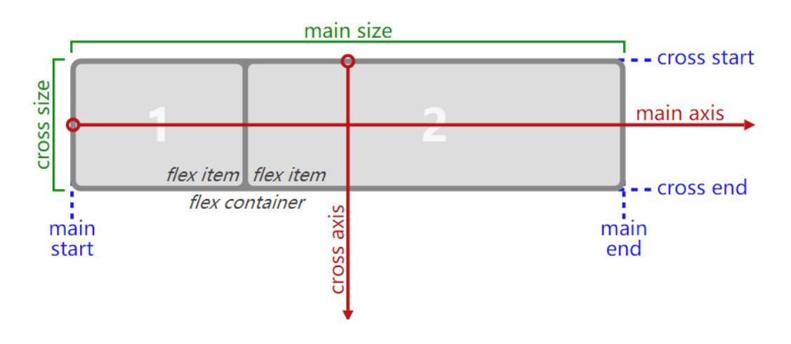
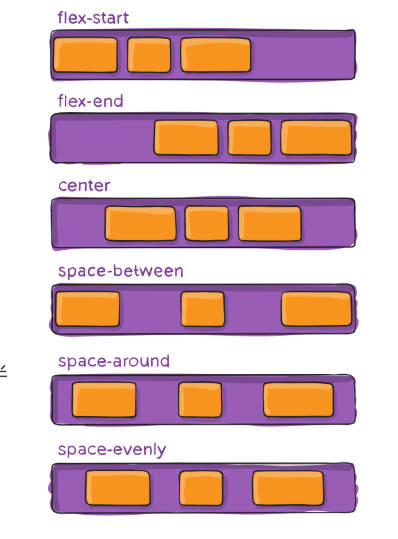
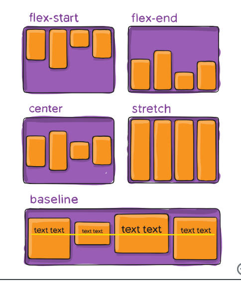
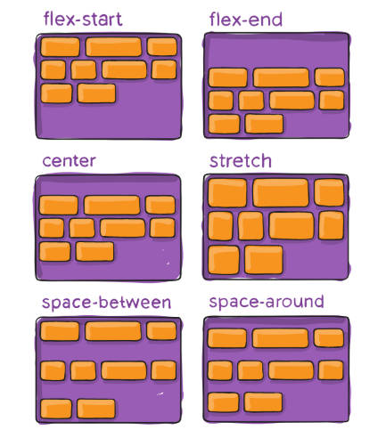
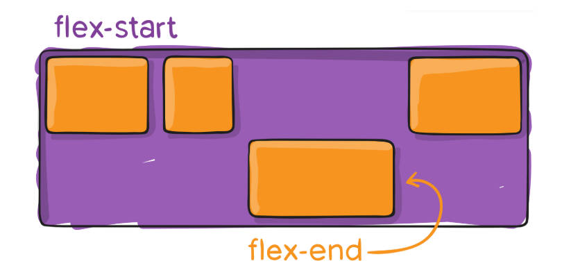
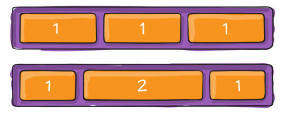
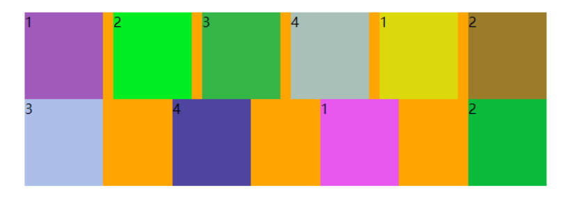

# Flex布局详解

## 一、flex 布局概念

### 1.flex 布局的概念

flex 布局的 2 个概念：

- 开启了 flex 布局的元素叫 `flex containerr`。
- flex containerr 里面的**直接子元素**叫做 `flex item`。

### 2.flex item 的概念

flex item 具备的 3 点特性：

- 布局受 flex containerr 属性的控制；
- flex item 不再严格区分块级元素和行内级元素;（flex containerr 会区分）；
- 默认是包裹内容的宽高, 但也可以设置宽高；

### 3.flex 布局设置

元素设置 `display` 属性为 `flex` 或者 `inline-flex`，该元素可以成为 flex container，

- `flex`：flex containerr 以 block-level 形式存在
- `inline-flex`：flex containerr 以 inline-level 形式存在

### 4.flex 布局模型图

理解 flex 布局模型图，主轴，交叉轴相关概念，

- 主轴（main axis），交叉轴（cross axis）。
- 主轴尺寸（main size），交叉轴尺寸（cross size）。
- 主轴开始位置（mian start），主轴结束位置（main end），
- 交叉轴开始位置（cross start），交叉轴结束位置（cross end）



flex containerr 的相关属性：

- `flex-direction`
- `flex-wrap`
- `flex-flow`
- `justify-content`
- `align-items`
- `align-content`

flex items 的相关属性。

- `order`
- `align-self`
- `flex-grow`
- `flex-shrink`
- `flex-basis`
- `flex`

## 二、flex containerr 的属性

### 1.flex-direction

flex container 的 `flex-direction` 属性有什么用，

- 决定主轴（main axis）的方向，默认从 main start 到 main end。

常用的设值有哪些？

- `row`：默认值，从 main start 到 main end。
- `row-reverse`：row 反转。
- `column`：从 cross start 到 cross end。
- `column-reverse`：column 反转。

### 2.flex-wrap

flex container 的 `flex-wrap` 属性有什么用？

- 决定了 flex-container 是单行还是多行。

常用的设值有哪些？

- `nowrap`（默认）：单行
- `wrap`：多行
- `wrap-reverse`：多行（对比 wrap，cross start 与 cross end 相反）

### 3.flex-flow

flex container 的 `flex-flow` 属性有什么用？

`flex-direction` 和 `flex-wrap` 的简写，顺序任意，并且都可以省略。

### 4.justify-content

flex container 的 `justify-content` 属性有什么用？

- 决定了 flex items 在 main axis 上的对齐方式。

常用的 6 个设值。

- `flex-start`（默认值）：与 main start 对齐
- `flex-end`：与 main end 对齐
- `center`：居中对齐
- `space-between`：
  - flex items 之间的距离相等
  - 与 main start、main end 两端对齐
- `space-around`：
  - flex items 之间的距离相等
  - flex items 与 main start、main end 之间的距离是 flex items 之间距离的一半
- `space-evenly`：
  - flex items 之间的距离相等
  - flex items 与 main start、main end 之间的距离 等于 flex items 之间的距离



### 5.align-item

flex containerr 的 `align-item` 属性有什么用？

- 决定了 flex items 在 cross axis 上的对齐方式

常用的 6 个设置。

- `normal`：在弹性布局中，效果和 stretch 一样
- `stretch`：当 flex items 在 cross axis 方向的 size 为 auto 时，会自动拉伸至填充 flex containerr。如果 flex item 有固定高度，则不会。
- `flex-start`：与 cross start 对齐，默认值。
- `flex-end`：与 cross end 对齐。
- `center`：居中对齐。
- `baseline`：与基准线对齐。



### 6.align-content

flex containerr 的 `align-content` 属性有什么用？

- 决定了多行 flex items 在 cross axis 上的对齐方式，用法与 justify-content 类似，用的较少，因为一般情况外部盒子高度由内容撑开。

常用的设值有那些？

- `stretch`（默认值）：与 align-items 的 stretch 类似
- `flex-start`：与 cross start 对齐
- `flex-end`：与 cross end 对齐
- `center`：居中对齐
- `space-between`：
  - flex items 之间的距离相等
  - 与 cross start、cross end 两端对齐
- `space-around`：
  - flex items 之间的距离相等
  - flex items 与 cross start、cross end 之间的距离是 flex items 之间距离的一半
- `space-evenly`：
  - flex items 之间的距离相等
  - flex items 与 cross start、cross end 之间的距离 等于 flex items 之间的距离



## 三、flex item 的属性

### 1.order

flex item 的 `order` 属性有什么用？

- 决定了 flex item 的排布顺序。
- 可以设置任意整数（正整数、负整数、0），值越小就越排在前面，默认值是 0

### 2.align-self

flex-item 的 `align-self` 属性有什么用？

- 覆盖 flex container 设置的 `align-items`

常用的设值。

- `stretch`、`flex-start`、`flex-end`、`center`、`baseline`，效果跟 align-items 一致。



---

### 3.flex-grow

flex item 的 `flex-grow` 属性有什么用？

- 决定了 flex items 如何扩展(拉伸/成长)

常用的设值。

- 可以设置任意非负数字（正小数、正整数、0），默认值是 0

注意事项：

- 当 flex container 在 main axis 方向上有剩余 size 时，flex-grow 属性才会有效。
- flex items 的 flex-grow 总和 sum 超过 1，每个 flex item 扩展的 size 为：
  - flex container 的剩余 size \* ( flex-grow / flex-grow sum )
- flex items 扩展后的最终 size 不能超过 max-width \ max-height。



### 4.flex-shrink

flex item 的 `flex-shrink` 属性有什么用？

- 决定了 flex items 如何收缩(缩小)

常用的设值。

- 可以设置任意非负数字（正小数、正整数、0），默认值是 1

注意事项：

- 当 flex items 在 main axis 方向上超过了 flex container 的 size，flex-shrink 属性才会有效
- 如果所有 flex items 的 flex-shrink 总和 sum 超过 1，每个 flex item 收缩的 size 为：
  - flex items 超出 flex container 的 size \* (flex-shrink / flex-shrink sum)
- flex items 收缩后的最终 size 不能小于 min-width \ min-height

### 5.flex-basis

flex item 的 `flex-basis` 属性有什么用？

- 用来设置 flex items 在 main axis 方向上的 base size，默认值是 0。

常用的设值，

- auto（默认值）、具体的宽度数值（如 100px）

使用场景：

- 将很长的英文单词显示出来，用来扩展宽度。

使用的规律。

- 决定 flex items 最终 base size 的因素，从优先级高到低：
  1. max-width \ max-height \ min-width \ min-height
  2. flex-basis
  3. width \ height
  4. 内容本身的 size

### 6.flex

flex item 的 `flex` 属性有什么用？

- 是 flex-grow || flex-shrink || flex-basis 的简写，flex 属性可以指定 1 个，2 个或 3 个值。

  `none | [ <'flex-grow'> <'flex-shrink'>? || <'flex-basis'> ]]`

语法是怎样的？

- 单值语法

  - 无单位，被当作 flex-grow，有单位，被当作 flex-basis
  - 可设置关键字：`none`（相当于 0 0 auto），`auto`（相当于 1 1 auto），`initial`（相当于 0 1 auto）

- 双值语法:
  - 第一个值必须为一个无单位数，并且它会被当作 flex-grow 的值。
  - 第二个值必须为以下之一：
    - 一个无单位数：它会被当作 flex-shrink 的值。
    - 一个有效的宽度值: 它会被当作 flex-basis 的值。
- 三值语法:
  - 第一个值必须为一个无单位数，并且它会被当作 flex-grow 的值。
  - 第二个值必须为一个无单位数，并且它会被当作 flex-shrink 的值。
  - 第三个值必须为一个有效的宽度值， 并且它会被当作 flex-basis 的值

## 四、解决 justify-content: space-between; 最后一行显示不对齐的问题

如何解决 `justify-content: space-between;` 布局后，最后一行显示不对齐的问题，如图所是。案例理解。



解决办法：添加 (列数- 2) 个没有高度的元素，可以是 i、span 等等

```html
<head>
  <title>Document</title>
  <style>
    .container {
      width: 500px;
      background-color: orange;
      display: flex;
      flex-wrap: wrap;
      justify-content: space-between;
    }
    .item {
      width: 110px; /* 比较container的宽度可知，每一行会有4个container */
      height: 140px;
    }
    .container > i {
      /* i元素成为 flex item 后，不严格区分行内级元素，可设置宽度 */
      width: 110px; /* 占位元素需要有宽度 */
    }
  </style>
</head>
<body>
  <div class="container">
    <div class="item item1">1</div>
    <div class="item item2">2</div>
    <div class="item item3">3</div>
    <div class="item item1">1</div>
    <div class="item item2">2</div>
    <div class="item item3">3</div>
    <div class="item item1">1</div>
    <div class="item item2">2</div>
    <div class="item item3">3</div>
    <div class="item item3">3</div>
    <!-- 添加 i 的个数是列数减2，也就是 4-2=2个 -->
    <i></i>
    <i></i>
  </div>
  <script src="./js/itemRandomColor.js"></script>
</body>
```
