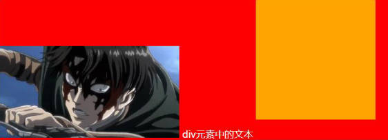
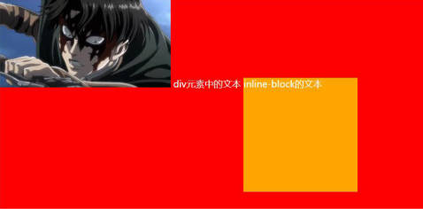

# transition-animation-vertica-align

## 一、transition  动画

### 1.transition 动画是什么

什么是 transition 动画？

- 更改 CSS 属性时控制动画速度的方法。
- 可让 CSS 属性变为持续一段时间的过程，而不是立即生效的。
- 并让这个过程加上一定的渐变效果，包括一定的曲线速率变化。

### 2.transition 动画的作用

transition 动画的作用。

- 决定哪些属性发生动画效果 (明确地列出这些属性)。
- 决定持续多久 (设置 duration)。
- 决定如何动画 (定义 timing function，比如匀速地或先快后慢)。
- 决定何时开始 (设置 delay）。

### 3.支持 transition 动画的属性

并非所有 CSS 属性都支持动画，怎么查询是否支持？

- [在 MDN 可执行动画的 CSS 属性中查询](https://developer.mozilla.org/zh-CN/docs/Web/CSS/CSS_animated_properties)
- 阅读 CSS 属性的文档说明，查看 Animation type。

### 4.transition 的属性（四个）

CSS transition 属性有哪 4 个？它们的作用？可设置的值？

`transition-property`：指定应用过渡属性的名称。

- `all`：所有属性都执行动画.
- `none`：所有属性都不执行动画；.
- 也可以是 CSS 属性名，如 `width`、`left`、`transform` 等等.

`transition-duration`：指定过渡动画所需的时间。

- 单位可以是秒（s）或毫秒（ms）.

`transition-timing-function`：指定动画的变化曲线，具体设值，查找文档。

`transition-delay`：指定过渡动画执行之前的等待时间。

```css
.box {
  position: relative;
  left: 0;
  width: 200px;
  height: 100px;
  background-color: orange;
  /* 告知浏览器 box 在进行一些 CSS 属性变化的时候有一个过渡效果 */
  /* transition-property: transform, left; */
  transition-property: all;
  transition-duration: 1s;
  transition-timing-function: ease-in;
  transition-delay: 1s;
}
.container:hover .box {
  left: 100px; /* 添加动画的属性，必须要有开始状态值和结束状态值。 */
  transform: translate(100px);
  width: 500px;
}
```

### 5.transition 简写属性

transition 简写属性的用法。

```css
.box {
  transition: all 1s ease-in 1s;
}
```

### 6.transition 动画的弊端

transition 动画的弊端 3 点。

- 只能定义开始状态，结束状态，不能定义中间状态；
- 不能重复执行，除非一再触发动画；
- 需要在特定状态下会触发才能执行，比如某个属性被修改了；

## 二、animation 动画

### 1.如何使用，两步

CSS Animation 动画可以有更多的状态，使用步骤分 2 步。

1. 使用 `@keyframes` 定义动画序列（每一帧动画如何执行）
2. 配置动画执行的名称、持续时间、动画曲线、延迟、执行次数、方向，停留状态，播放状态等。

### 2.关键帧的规则

使用 @keyframes 的规则 2 点。

- 关键帧使用 percentage 来指定动画发生的时间点；
- 0%（也可用 from）表示动画的第一时刻，100%（也可用 to）表示动画的最终时刻；

### 3.animation 的属性

CSS Animation 有哪些属性，它们分别有什么用？

- `animation-name`：指定执行哪一个关键帧动画。
- `animation-duration`：指定动画的持续时间。
- `animation-timing-function`：指定动画的变化曲线。
- `animation-delay`：指定延迟执行的时间。
- `animation-iteration-count`：指定动画执行的次数
  - `infinite`表示无限动画。
- `animation-direction`：指定方向。
  - 常用值 `normal` 和 `reverse`。
- `animation-fill-mode`：执行动画最后保留哪一个值。
  - `none`：回到没有执行动画的位置。
  - `forwards`：动画最后一帧的位置。
  - `backwards`：动画第一帧的位置。
- `animation-play-state`：指定动画运行（running）或者暂停（paused）,常结合 JavaScript 使用，用于暂停动画。

```css
.box {
  width: 200px;
  height: 100px;
  background-color: orange;
  /* 动画相关属性设置 */
  animation-name: moveAnim; /* box要执行下面声明的 moveAnim 的动画 */
  animation-duration: 3s;
  animation-timing-function: linear;
  /* 其他属性: */
  animation-delay: 1s;
  animation-iteration-count: 2; /* 动画执行的次数 */
  animation-direction: reverse;
  animation-fill-mode: forwards; /* 元素停留在动画的最后一帧位置 */
  /* animation-play-state: paused; */ /* js动态修改 */
}
@keyframes moveAnim {
  0% {
    transform: translate(0, 0) scale(0.5, 0.5);
  }
  33% {
    transform: translate(0, 200px) scale(1.2, 1.2);
  }
  66% {
    transform: translate(400px, 200px) scale(1, 1);
  }
  100% {
    transform: translate(400px, 0) scale(0.5, 0.5);
  }
}
```

### 4.animation 的简写属性

animation 简写属性的用法。

```css
.box {
  animation: moveAnim 3s linear 1s 2 reverse forwards;
}
```

## 三、vertical-align 属性

### 1.行盒的概念

行盒（line-box）的作用，将当前行里面所有的内容全部包裹在一起。

---

### 2.vertical-align 的作用

vertical-align 属性的作用。影响一个行盒中行内级元素的对齐方式。

### 3.vertical-align: baseline; 的判定

`vertical-align: baseline;`对于行盒中元素的影响 3 个方面。

- 文本的 baseline 是基线（字母 x 的下方）。

- Inline-block 元素的 baseline 是 margin-bottom 的底部（没有，就是盒子的底部）。

  

- Inline-block 中有文本时，baseline 是最后一行文本的基线（x 的下方）。

  

### 4.行内及元素下方产生3像素的原因

行内块级元素 / 行内可替换元素，下方产生 3 像素的经典问题，原因是什么。

1. 行盒会包裹当前行中所有的内容。
2. 行盒中的元素 `vertical-align` 的默认值是 `baseline`。
3. 默认情况下，行内块级元素 / 行内可替换元素的 `baseline` 是元素底部，文本的 baseline 是与字母 x 底部对齐的线。
