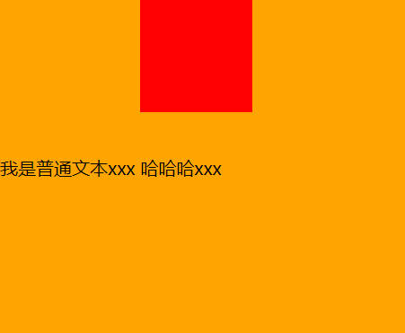

解决图片下方3像素的方法2个，代码演示。

1. 将行盒中的行内块级/行内可替换元素 vertical-align 改为 top / middle / bottom。
2. 将行盒中的行内块级/行内可替换元素改为块级元素。

```html
<head>
  <title>Document</title>
  <style>
    .content {
      background-color: orange;
    }
    .content img {
      vertical-align: top; /* 改变 vertical-align 对齐方式 */
    }
    .content .span {
      display: block; /* 改为块级元素 */
      width: 100px;
      height: 100px;
      background-color: #f00;
    }
  </style>
</head>
<body>
  <div class="content">
    我是普通文本xxx
    
    <span class="box"></span>
  </div>
</body>
```

-----

vertical-align 可以设的值。

- baseline：默认值，基线对齐。
- top：把行内级盒子的顶部跟行盒（line boxes）顶部对齐。
- middle：行内级盒子的中心点与父盒基线上字母x高度一半的线对齐。
- bottom：把行内级盒子的底部跟行盒（line box）底部对齐。
- <percentage>：使行内级元素的基线对齐到父元素的基线之上的给定百分比，该百分比是[`line-height`](https://developer.mozilla.org/zh-CN/docs/Web/CSS/line-height)属性的百分比。可以是负数。
- <length>：使元素的基线对齐到父元素的基线之上的给定长度。可以是负数。

middle 为什么不能做垂直居中？代码演示。

- 因为大部分字体，都会进行文本下沉，所以 x-height 的一半，在文本中线靠下的位置。即使文本居中了，但与文本中线对齐的图片仍不居中。

```html
<head>
  <title>Document</title>
  <style>
    .content {
      background-color: orange;
      height: 300px;
      line-height: 300px;
    }
    .content img {
      vertical-align: middle; /* 此时图片不居中，图片的垂直方向的中线，与外层行盒文本中字母x的中线对齐，而它是低于.content 垂直方向中线的。 */
    }
  </style>
</head>
<body>
  <div class="content">
    我是普通文本xxx
    
  </div>
</body>
```

-----

行内块级元素在行盒中居中的方法3步，代码实现。

1. 里层行内块级元素中有垂直居中的一行文本（不能多余一行）。
2. 外层行盒中也有垂直居中的一行文本，外层行盒的 vertical-align: baseline;
3. 里层行内块级元素中的文本与外层行盒中的文本字体大小一致。

```html
<head>
  <title>Document</title>
  <style>
    .content {
      background-color: orange;
      height: 300px;
      line-height: 300px;
    }
    .content .box {
      display: inline-block;
      width: 100px;
      height: 100px;
      background-color: #f00;
      line-height: 100px; /* 如果这里不声明 line-height，会继承 .content 的 line-height 属性，造成下图的效果。*/
    }
  </style>
</head>
<body>
  <div class="content">
    我是普通文本xxx
    <span class="box">哈哈哈xxx</span> <!-- 此时 .box 在 .content 中是居中的 -->
  </div>
</body>
```

