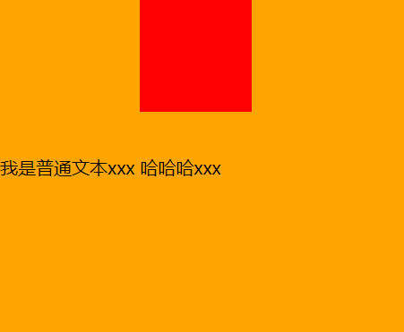

# vertical-align属性-3px解决、行内块级元素的垂直居中

## 一、行内块级元素、行内可替换元素下方产生 3px 解决

方法一：为行盒中的行内块级、行内可替换元素设置：`vertical-align: top;`（或者 `middle`、`bottom`，只要不是 `baseline`）。

方法二：将行盒中的行内块级、行内可替换元素，改为块级元素。

01-HTML+CSS/demo-project/11-行内块级元素、行内可替换元素下方产生 3px 解决.html

```html
<!DOCTYPE html>
<html lang="en">
  <head>
    <meta charset="UTF-8" />
    <meta name="viewport" content="width=device-width, initial-scale=1.0" />
    <title>行内块级元素、行内可替换元素下方产生 3px 解决</title>
    <style>
      .content {
        background-color: orange;
      }
      .content img {
        vertical-align: top; /* 方案一：改变 vertical-align 对齐方式 */
      }
      .content span {
        display: block; /* 方案二：改为块级元素 */
        width: 100px;
        height: 100px;
        background-color: #f00;
      }
    </style>
  </head>
  <body>
    <div class="content">
      我是普通文本xxx
      
      <span class="box"></span>
    </div>
  </body>
</html>
```

## 二、vertical-align 设值

vertical-align 可设值：

- `baseline`：默认值，基线对齐。
- `top`：把行内级盒子的顶部跟行盒（line boxes）顶部对齐。
- `middle`：行内级盒子的中心点与父盒基线上字母 x 高度一半的线对齐。
- `bottom`：把行内级盒子的底部跟行盒（line box）底部对齐。
- \<percentage\>：使行内级元素的基线对齐到父元素的基线之上的给定百分比，该百分比是 [line-height](https://developer.mozilla.org/zh-CN/docs/Web/CSS/line-height) 属性的百分比。可以是负数。
- \<length\>：使元素的基线对齐到父元素的基线之上的给定长度。可以是负数。

## 四、vertical-align: middle; 不能做行内块级元素、行内可替换元素的垂直居中

为行内可替换元素、行内块级元素设置 `vertical-align: middle;` 不能做垂直居中。因为大部分字体，都会进行文本下沉，所以 x-height 的一半，在文本中线靠下的位置。即使文本居中了，但与文本中线对齐的图片仍不居中。

01-HTML+CSS/demo-project/12-vertical-align-middle不能做垂直居中.html

```html
<head>
  <title>Document</title>
  <style>
    .content {
      background-color: orange;
      height: 300px;
      line-height: 300px;
    }
    .content img {
      vertical-align: middle; /* 此时图片不居中，图片的垂直方向的中线，与外层行盒文本中字母 x 的中线对齐，而它是低于.content 垂直方向中线的。 */
    }
  </style>
</head>

<body>
  <div class="content">
    我是普通文本xxx
    
  </div>
</body>
```

## 五、行内块级元素的垂直居中

行内块级元素在行盒中实现垂直居中，要满足以下条件：

1. 里层行内块级元素中有垂直居中的一行文本（不能多于一行）。
2. 外层行盒中也有垂直居中的一行文本；
3. 里层行内块级元素中的文本与外层行盒中的文本字体大小一致。
4. 外层行盒有属性 `vertical-align: baseline;`

01-HTML+CSS/demo-project/13-行内块级元素的垂直居中.html

```html
<head>
  <title>Document</title>
  <style>
    .content {
      background-color: orange;
      height: 300px;
      line-height: 300px;
    }
    .content .box {
      display: inline-block;
      width: 100px;
      height: 100px;
      background-color: #f00;
      line-height: 100px; /* 如果这里不声明 line-height，则会继承 .content 的 line-height 属性，造成下图的效果。*/
    }
  </style>
</head>
<body>
  <div class="content">
    我是普通文本xxx
    <span class="box">哈哈哈xxx</span>
    <!-- 此时 .box 在 .content 中是居中的 -->
  </div>
</body>
```


