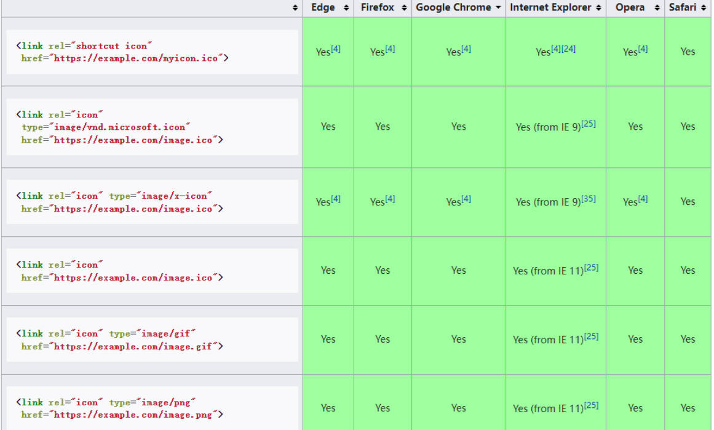

# meta元素、link元素、CSS字符编码

## 一、meta 元素

meta 元素，用于定义那些不能使用其他定元（meta-related）元素（如 title, style, link）定义的任何元数据。

meta 元素定义元数据的类型有以下几种：

类型一：设置 charset 属性，进行字符集声明，告诉文档使用哪种字符编码。

```html
<meta charset="UTF-8" />
```

类型二：设置 http-equiv 属性，设置编译指令。

```html
<meta http-equiv="X-UA-Compatible" content="IE=edge" />
```

告知 IE 浏览器，去模仿哪一个浏览器的行为；`IE=edge`，告知 IE8 去使用最高有效模式来模仿；

类型三：设置 name 属性，提供一些文档级别（document-level）的元数据，应用于整个页面。

- robots：爬虫、协作搜寻器，或者“机器人”，表示对此页面的处理行为，或者说，应当遵守的规则。
- author：文档作者的名字。
- Copyright：版权声明；
- description：一段简短而精确的、对页面内容的描述。一些浏览器，比如 Firefox 和 Opera，将其用作书签的默认描述。
- keywords：与页面内容相关的关键词，使用逗号分隔。某些搜索引擎会进行收录；
- 其它值，见[参考资料](https://developer.mozilla.org/zh-CN/docs/Web/HTML/Element/meta/name)

```html
<meta name="robots" content="all" />
<meta name="author" content="tencent" />
<meta name="Copyright" content="tencent" />
<meta name="description" content="王者荣耀开黑必备" />
<meta name="keywords" content="王者荣耀,王者荣耀下载,王者荣耀官网" />
<!-- 专门针对百度的优化 -->
<meta name="baidu-site-verification" content="6zFCAGAmfZ" />
<!-- 适用的设备为 PC -->
<meta name="applicable-device" content="pc" />
```

## 二、link 元素

是一个 link 元素，设置网页图标。

```html
<link rel="icon" href="https://pvp.qq.com/favicon.ico" />
```

它的兼容性写法



事实上，不写 link 图标，浏览器也能显示图标，因为多数浏览器会自动检测服务器根目录下的 `favicon.ico` 图标，并应用。

使用 link 元素，指定一个可替换的网址当作备用网址。

```html
<link rel="alternate" href="https://pvp.qq.com/m/" />
```

## 三、CSS 字符编码

前面通过 \<meta\> 元素指定过 HTML 文件的编码。

那么 CSS 样式字符编码可以有如下方式指定，按优先级由高到低排序：

Ⅰ、文件开头的 Unicode byte-order（字节顺序标记）字符值，也就是文件本身的编码。[参考资料](https://en.wikipedia.org/wiki/Byte_order_mark)。

Ⅱ、由请求头/响应头中 Content-Type：HTTP header 中的 charset 属性给出的值或用于提供样式表的协议中的等效值。

Ⅲ、CSS @规则 @charset。（推荐使用）

```css
/* CSS文件头部 */
@charset "UTF-8";
```

Ⅳ、使用参考文档定义的字符编码： \<link\> 元素的 charset 属性。该方法在 HTML5 标准中已废除，无法使用。

```html
<link charset="UTF-8" rel="stylesheet" href="./css/common.css" />
```

Ⅴ、以上途径都没有指定字符编码，会假设文档是 UTF-8 编码。
