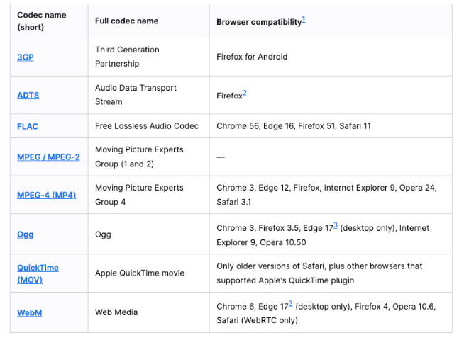

# 王者荣耀项目、HTML5新增语义化-多媒体类型支持-input元素扩展-data-*、white-space属性、text-overflow属性、CSS函数、包含快

## 一、王者荣耀项目

王者荣耀项目，当页面缩小出现滚动条，header 右侧部分没有背景色。怎么解决？

将页面中宽度最大的元素宽度，设置为 body 的最小宽度。

```css
body {
  min-width: 1300px;
}
```

王者荣耀项目，当页面缩小时，背景图片也跟着缩放，需要设置背景图片固定 size，即 `120% auto;`。

```css
.main {
  background: url(../img/bg-img.jpg) no-repeat center top/120% auto;
}
```

## 二、HTML5 新增语义化

网页使用 div + id/class 元素开发的弊端。

- 对于浏览器来说这些元素不够语义化；
- 对于搜索引擎来说, 不利于 SEO 的优化；

HTML5 新增的语义化元素有哪些？

- main 元素，表示文档的主体内容。
- header 元素：表示头部元素。
- nav 元素：表示导航元素。
- section 元素：表示定义文档某个区域的元素。
- article 元素：表示内容元素。
- aside 元素：表示侧边栏元素。
- footer 元素：表示尾部元素。

它们都为块级元素，默认没有样式。

## 三、HTML5 多媒体类型支持

HTML5 之前，通过 flash 或者其他插件，实现多媒体类型支持, 但是会有很多问题。

- 比如：无法很好的支持 HTML / CSS 特性, 兼容性问题等等;

HTML5 新增了 2 种多媒体类型的支持：

- audio 元素，用于音频
- video 元素，用于视频。

除了使用上述两个元素，也可通过 JavaScript 的 API 对其进行控制；

### 1.video 元素

video 元素，用于在 HTML 或者 XHTML 文档中嵌入媒体播放器，以支持文档内的视频播放。

```html
<video src="../video/fcrs.mp4" controls></video>
<!-- 默认没有控制栏，需要加上 controls 属性。-->
```

| 常见属性 | 值的类型               | 属性作用                                                     |
| -------- | ---------------------- | ------------------------------------------------------------ |
| src      | url 地址               | 视屏地址                                                     |
| width    | pixels（像素）         | 设置 video 宽度                                              |
| height   | pixels（像素）         | 设置 video 高度                                              |
| controls | Boolean 类型           | 是否显示控制栏（音量，暂停，恢复播放）                       |
| autoplay | Boolean 类型           | 是否自动播放（某些浏览器如 chrome，为了用户体验需要添加 `muted` 属性，才有效） |
| muted    | Boolean 类型           | 是否静音播放                                                 |
| preload  | none / metadata / auto | 是否需要预加载，metadata 表示加载元数据，如视频时长。常用 auto |
| poster   | url 地址               | 一帧海报 url                                                 |

video 支持的视屏格式有：



针对浏览器不支持此元素时候的降级处理，video 有 2 中兼容性写法。

- 通过 source 元素指定更多视频格式的源;。
- 通过 p、div 等元素指定在浏览器不支持 video 元素的情况，显示的内容;

```html
<video src="./assets/fcrs.mp4" width="600" controls muted>
  <source src="./asset/fcrs.ogg" />
  <source src="./asset/fcrs.webm" />
  <p>当前您的浏览不支持视频的播放, 请更换更好用的浏览器!</p>
</video>
```

### 2.audio 元素

audio 元素，用于在文档中嵌入音频内容, 和 video 元素的用法非常类似。

```html
<audio src="./assets/yhbk.mp3" controls autoplay muted></audio>
```

| 常见属性 | 值的类型           | 属性作用                                              |
| -------- | ------------------ | ----------------------------------------------------- |
| src      | url 地址           | 音频地址                                              |
| controls | Boolean 类型       | 是否显示控制栏（音量，暂停，进度播放）                |
| autoplay | Boolean 类型       | 是否自动播放（在 chrome 中无效）                      |
| muted    | Boolean 类型       | 是否静音播放                                          |
| preload  | none/metadata/auto | 是否需要预加载，metadata 表示加载元数据，如视频时长。 |

audio 一般使用 MP3 的格式。

针对浏览器不支持此元素时候的降级处理，audio 的兼容性写法类似 video。

```html
<audio src="./assets/fcrs.mp3" controls muted>
  <source src="./asset/fcrs.mp3" />
  <p>当前您的浏览不支持音频的播放, 请更换更好用的浏览器!</p>
</audio>
```

## 四、HTML5 input 元素扩展

input 元素在 HTML5 中扩展的属性

- `placeholder`：输入框的占位文字。
- `autofocus`：自动聚焦。

```html
<input type="text" placeholder="占位文本" autofocus />
```

> HTML5 select 元素扩展了 `multiple` 属性，用于多选：
>
> ```html
> <select multiple size="2">
>     <option value="apple">苹果</option>
>     <option value="banana">香蕉</option>
>     <option value="orange">橘子</option>
> </select>
> ```

input 元素在 HTML5 中 `type` 属性值的扩展。

- `date`，表四日期。
- `time`，表示时间。
- `number`，表示数字。
- `tel`，表示电话。
- `color`，表示颜色。
- `email`，表示电子邮箱。
- `range`，表示范围。

见[参考资料](https://developer.mozilla.org/zh-CN/docs/Web/HTML/Element/Input)。

```html
<input type="color" />
<input type="date" />
<input type="range" min="0" max="1000" />
```

## 五、HTML5 data-* 属性

HTML5 新增全局属性 `data-*`，用于自定义数据属性。

- 可以在 JavaScript 的 DOM 操作中，通过 `dataset` 轻松获取到；
- 通常用于 HTML 和 JavaScript 数据之间的传递；

```html
<div class="box" age="18" data-name="zzt" data-age="18" data-height="1.88"></div>
```

```javascript
const boxEl = document.querySelector('.box')
console.log(boxEl.dataset.age) // 18
```

> 在小程序中，经常使用 `data-*` 来传递数据。

## 六、white-space 属性

CSS 属性 `white-space` 属性，用于设置空白处理，和换行规则。它的属性有：

- `normal`：合并所有连续的空白，允许单词超屏时自动换行。
- `nowrap`：合并所有连续的空白，不允许单词超屏时自动换行。
- `pre`：阻止合并所有连续的空白，不允许单词超屏时自动换行。
- `pre-wrap`：阻止合并所有连续的空白，允许单词超屏时自动换行。
- `pre-line`：合并所有连续的空白（但保留换行），允许单词超屏时自动换行。

## 七、text-overflow 属性

CSS 属性 `text-overflow` 属性，用于设置文本超出父容器的显示效果。

- `clip`：溢出的内容直接裁剪掉（字符可能会显示不完整）。
- `ellipsis`：溢出那行的结尾处用省略号表示，

使用它的前提是 `overflow` 属性不能为 `visible`。

## 八、CSS 中的函数

目前为止，已使用过的 CSS 函数有：url、rgb、rgba、translate、rotate、scale ...

现在，再补充 4 个函数的用法：

### 1.var 函数

`var:` 函数，用于使用定义好的 CSS 变量。

- 变量名需要以两个减号 `--` 开头。
- 变量值则可以是任何有效的 CSS 值。

```css
/* :root 结构，相当于 html 元素选择器 */
:root {
  /* 定义了一个变量（CSS 属性），只有后代元素可以使用 */
  --main-color: #f00;
}

.box {
  color: var(--main-color);
}

.title {
  color: var(--main-color);
}
```

### 2.calc 函数

`calc` 函数，用于计算 CSS 值, 通常用于计算元素的大小或位置。;

- 函数中支持 +、-、*、/ 的运算（+ 和 - 运算符的两边，必须要有空白字符）。

```css
.item {
  /* width 的百分比相对于包含块（父元素）*/
  width: calc(100% - 100px);
}
```

### 3.blur 函数

`blur` 函数，用于实现毛玻璃（高斯模糊）效果。通常用于两个 CSS 属性中：

- `filter: blur(radius);` ，将模糊或颜色偏移等图形效果应用于元素。
- `backdrop-filter: blur(radius);` ，为元素后面的区域添加模糊或者其他效果，通常与 `background-color` 结合使用。

`blur(radius)`，radius 模糊的半径，用于定义高斯函数的偏差值，偏差值越大，图片越模糊。

01-HTML+CSS/demo-project/14-blur函数.html

```html
<!DOCTYPE html>
<html lang="en">
  <head>
    <meta charset="UTF-8" />
    <meta name="viewport" content="width=device-width, initial-scale=1.0" />
    <title>blur函数</title>
    <style>
      .box {
        position: relative;
        display: inline-block;
        filter: blur(5px);
      }
      .cover {
        position: absolute;
        left: 0;
        right: 0;
        top: 0;
        bottom: 0;
        /* 通常和背景颜色一起使用 */
        background-color: rgba(255, 255, 255, 0.2);
        backdrop-filter: blur(10px);
      }
    </style>
  </head>
  <body>
    <div class="box">
      
      <div class="cover"></div>
    </div>
  </body>
</html>
```

### 4.xxx-gradient 函数

`xxx-gradient` 函数，用于设置颜色渐变：

- gradient 函数返回的数据类型，是 CSS image 数据类型的子类型，用于表现两种或多种颜色的过渡转变。
- CSS image 数据类型，描述的是 2D 图形；比如：属性 `background-image`、`list-style-image`、`border-image`、`content`...；
- 得到 CSS image 数据类型，常见的方式是通过 `url` 函数来引入一个图片资源；也可以通过 CSS 的 `xxx-gradient` 函数来设置颜色的渐变；

gradient 常见的函数实现有下面几种

`linear-gradient()`：创建一个表示两种或多种颜色线性渐变的图片；

01-HTML+CSS/demo-project/15-gradient函数.html

```css
.box {
  background-image: linear-gradient(red, blue); /* 默认方向从上到下 */
  /* 改变方向 */
  background-image: linear-gradient(to right, red, blue); /* 从左到右 */
  background-image: linear-gradient(to right top, red, blue); /* 从左下到右上 */
  background-image: linear-gradient(-45deg, red, blue); /* -45度角方向 */
  background-image: linear-gradient(
    to right,
    red,
    blue 40px,
    orange 60%,
    purple 100%
  ); /*设置颜色渐变所处的位置 */
}
```

`radial-gradient()`：创建了一个图像，该图像是由从原点发出的两种或者多种颜色之间的逐步过渡组成；

01-HTML+CSS/demo-project/15-gradient函数.html

```css
.box {
  background-image: radial-gradient(red, blue);
  background-image: radial-gradient(at 0% 50%, red, blue);
}
```

`repeating-linear-gradient()`：创建一个由重复线性渐变组成的 image；

`repeating-radial-gradient()`：创建一个重复的原点出发渐变组成的 image；

## 九、包含快的概念

包含块不一定是父元素，如一个绝对定位元素的父元素不是定位元素，那么该绝对定位元素的父元素不是它的包含块。
