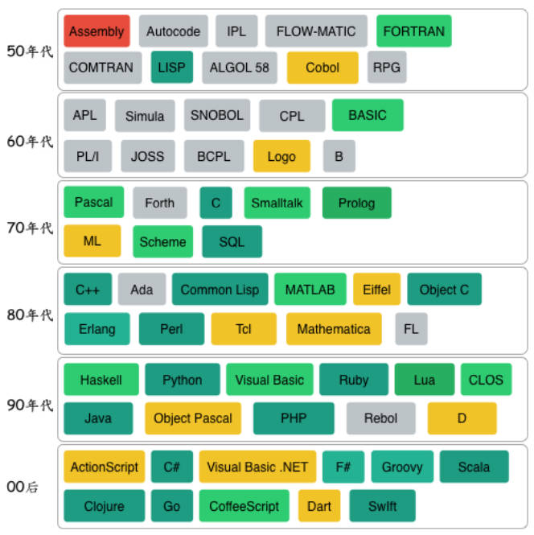
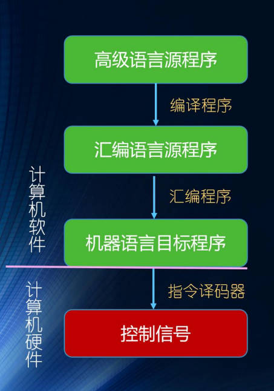
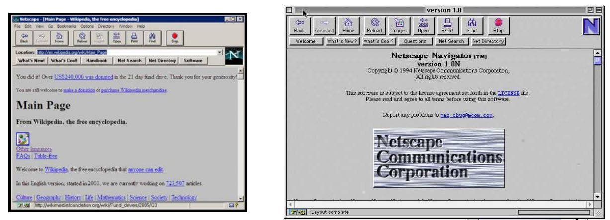
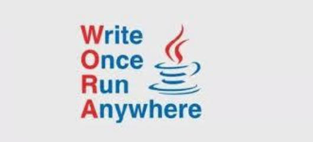
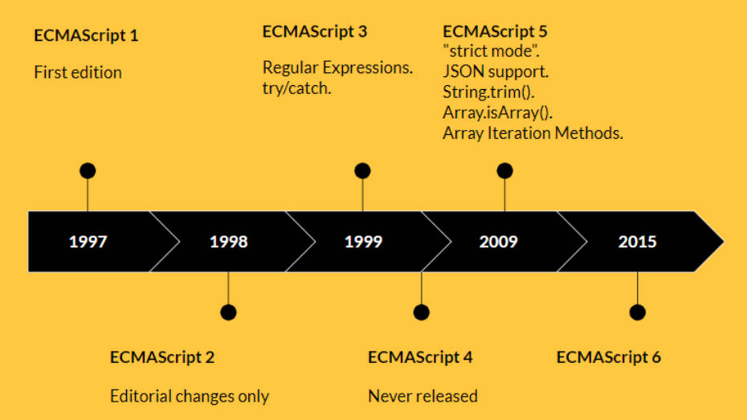
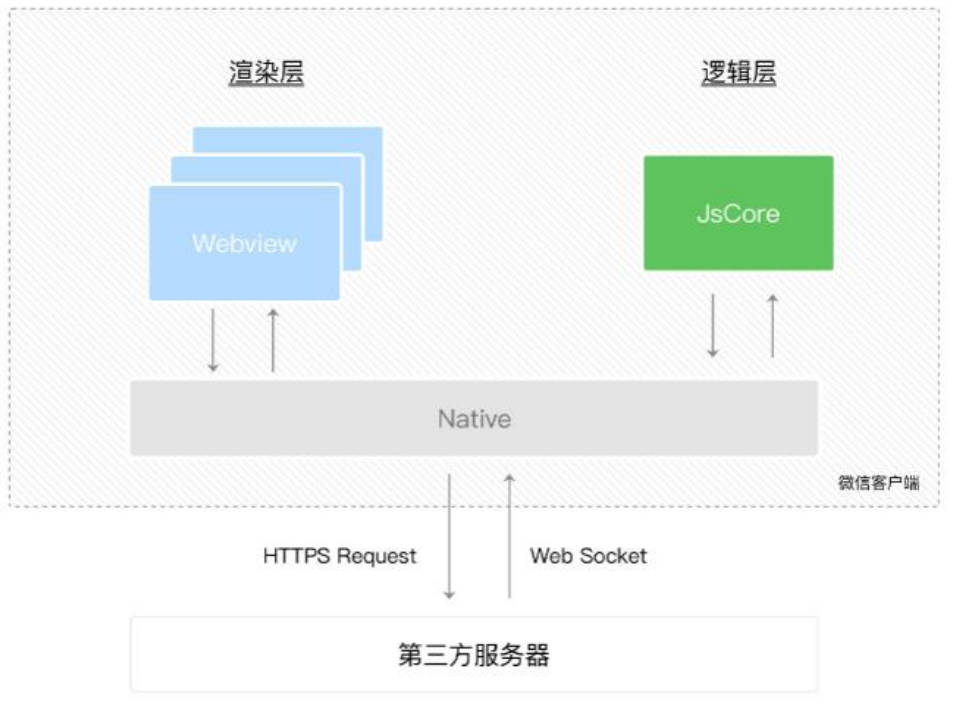

# 邂逅 JavaScript

## 一、编程语言

编程语言的 4 个特点。

- 数据和数据结构。
- 指令及流程控制。
- 引用机制和重用机制。
- 设计哲学。

编程语言，分为机器语言，汇编语言，高级语言。



### 1.机器语言

由 0 和 1 组成，按照一定规律转成机器码（二进制码），组成机器指令，再组成机器语言。

优点:：

- 被计算机直接识别，无需经过编译解析，直接对硬件产生作用，程序的执行效率非常高。

缺点：

- 没有可读性，不易编写。

### 2.汇编语言

用符号代替冗长的、难记忆的 0、1 代码。( 比如：mov / push 指令，会经过汇编器，再进一步转成 0101...)

优点：

- 像机器语言一样，可被计算机直接访问、直接对硬件产生作用；占用内存少；

缺点：

- 不同的机器有不同的汇编语言语法和编译器，代码缺乏可移植性；
- 即使是完成简单的功能也需要大量的汇编语言代码，很容易产生 BUG，难于调试；

应用场景：操作系统内核、驱动程序、单片机程序；

### 3.高级语言

高级语言，接近自然语言的语法，符合人类的思维方式；

优点：

- 简单、易用、易于理解，语法和结构类似于自然语言；
- 一个程序还可以在不同的机器上运行，具有可移植性；

缺点：

- 需要经编译器翻译成二进制指令后，才能运行到计算机上；



## 二、JavaScript

JavaScript 是什么？维基百科定义 2 点。

- JavaScript 是一种高级的、解释型的编程语言；
- JavaScript 是一门基于原型、头等函数的语言，是一门多范式的语言，它支持面向对象程序设计，指令式编程，以及函数式编程；

## 三、JavaScript 的历史

1994年，网景公司（Netscape）发布了Navigator浏览器0.9版。

- 这是历史上第一个比较成熟的网络浏览器，轰动一时。
- 但是，这个版本的浏览器只能用来浏览，不具备与访问者互动的能力。
- 网景公司急需一种网页脚本语言，使得浏览器可以与网页互动。



网景公司当时想要选择一种语言来嵌入到浏览器中：

- 采用现有的语言，比如Perl、Python、Tcl、Scheme等等, 允许它们直接嵌入网页;
- 1995年网景公司招募了程序员Brendan Eich，希望将Scheme语言作为网页脚本语言的可能性；

就在这时，发生了另外一件大事：1995年Sun公司将Oak语言改名为Java，正式向市场推出；

- Java推出之后立马在市场上引起了轰动，Java当初有一个口号：“write once run anywhere”；
- 网景公司动了心，决定与Sun公司结成联盟，希望将Java嵌入到网页中来运行；
- Brendan Eich本人非常热衷于Scheme，但是管理层那个时候有点倾向于Java，希望可以简化Java来适应网页脚本的需求；



但是 Brendan Eich 对此并不感兴趣，他用10天时间设计出来了JavaScript；

- 最初这门语言的名字是Mocha（摩卡）；
- 在 Navigator2.0 beta 版本更名为 LiveScript；
- 在 Navigator2.0 beta 3 版本正式重命名为 JavaScript，当时是为了给这门语言搭上 Java 这个热词；

当然10天设计出来语言足够说明 Brendan Eich 是天才，但是这门语言当时更像是一个多种语言的大杂烩;

- 借鉴 C 语言的基本语法；
- 借鉴 Java 语言的数据类型和内存管理；
- 借鉴 Scheme 语言，将函数提升到"第一等公民"（first class）的地位；
- 借鉴 Self 语言，使用基于原型（prototype）的继承机制。

Brendan Eich 曾经这样描述过 JavaScript：

- 与其说我爱 Javascript，不如说我恨它，它是 C 语言和 Self 语言一夜情的产物；
- 十八世纪英国文学家约翰逊博士说得好：'它的优秀之处并非原创，它的原创之处并不优秀（the part that is good is not original, and the part that is original is not good.）。

微软公司于 1995 年首次推出 Internet Explorer，从而引发了与 Netscape 的浏览器大战。

- 微软对 Netscape Navigator 解释器进行了逆向工程，创建了 JScript，以与处于市场领导地位的网景产品同台竞争；
- 这个时候对于开发者来说是一场噩耗，因为需要针对不同的浏览器进行不同的适配；

1996 年 11 月，网景正式向 ECMA（欧洲计算机制造商协会）提交语言标准。

- 1997 年 6 月，ECMA 以 JavaScript 语言为基础制定了 ECMAScript 标准规范 ECMA-262;
- ECMA-262 是一份标准，定义了 ECMAScript;
- JavaScript 成为了 ECMAScript 最著名的实现之一;
- 除此之外，ActionScript 和 JScript 也都是 ECMAScript 规范的实现语言；

所以说，ECMAScript 是一种规范，而 JavaScript 是这种规范的一种实现。

## 四、JavaScript 与 ECMAScript

JavaScript 与 ECMAScript 的关系。

- ECMA 指欧洲计算机制造商协会。
- 1997 年 6 月，ECMA 以 JavaScript 语言为基础制定了 ECMAScript 标准规范 ECMA-262，JavaScript 成为了 ECMAScript 最著名的实现之一；
- 除此之外，ActionScript 和 JScript 也都是 ECMAScript 规范的实现语言；

## 五、JavaScript 的组成部分

ECMAScript 是 JavaScript 的标准，描述了该语言的语法层面的实现

除了语言规范之外，JavaScript 还需要对页面和浏览器进行各种操作，所以还还包括 DOM 操作和 BOM操作

JavaScript 的组成分为 3 大部分。

1. ECMAScript 定义语言规范。
2. DOM 操作文档 Api。
3. BOM 操作浏览器 Api。

## 六、ECMA 规范制定和发展的历史

1. 1997 年，ECMAScript1 First edition。
2. 1998 年，ECMAScript2 Editorial change only，微小的改动。
3. 1999 年，ECMAScript3 Regular Expressions try/catch
4. ECMAScript4 未正式发布。
5. 2009 年，ECMAScript5 “strict mode”，JSON support，String.trim()，Array.isArray()，Array iteration Methods.
6. 2015 年，ECMAScript6（2015）



## 七、JavaScript 运行

### 1.浏览器内核

JavaScript 可以在浏览器中运行，不同的浏览器有不同的内核组成。

**浏览器内核**的发展历史 4 个：

- Gecko：早期被 Netscape 和 Mozilla Firefox 浏览器使用；

- Trident：微软开发，被 IE4~IE11 浏览器使用；

  > 现在的 Edge 浏览器已经转向 Blink。

- Webkit：苹果基于 KHTML 开发、开源的，用于 Safari，Google Chrome 之前也在使用；

- Blink：是 Webkit 的一个分支，Google 开发，目前应用于 Google Chrome、Edge、Opera 等等知名主流浏览器；

浏览器内核也被称为：**排版引擎（layout engine）**，**浏览器引擎（browser engine）**、**页面渲染引擎（rendering engine）**或**样版引擎**。

### 2.JavaScript 引擎

为什么需要 JavaScript 引擎 4 点？

- 高级语言，都是需要转成最终的机器指令来执行的；
- 编写的 JavaScript 代码，无论是交给浏览器或者 Node 执行，最后都是需要被 CPU 执行；
- 但是 CPU 只认识自己的指令集，即机器语言；
- 所以我们需要 JavaScript 引擎，帮助我们将 JavaScript 代码翻译成 CPU 指令来执行；

JavaScript 引擎的发展历史 4 点。

- **SpiderMonkey**：第一款 JavaScript 引擎，由 Brendan Eich 开发（也就是 JavaScript 作者）；
- **Chakra**：微软开发，用于 IE 浏览器；
- **JavaScriptCore**：WebKit 中的 JavaScript 引擎，Apple 公司开发；
- **V8**：Google 开发的强大 JavaScript 引擎，也帮助 Chrome 从众多浏览器中脱颖而出；

### 3.浏览器内核、JavaScript 引擎的关系

以 WebKit 为例，WebKit 事实上是由两部分组成的：

- **WebCore**：负责 HTML 解析、布局、渲染等等相关的工作；
- **JavaScriptCore（JSCore）**：解析、执行 JavaScript 代码；


微信小程序，就是使用 JSCore 来运行逻辑层代码的：



## 八、JavaScript 应用场景

Web 开发

- 原生 JS，React 开发，Vue 开发，Angular 开发

移动端开发

- ReactNative，Weex，uniapp，Flutter

小程序开发

- 微信小程序，uniapp，taro

桌面应用开发

- Electron（产品 VSCode ）

后端开发

- Node 框架，如 express.js，koa，egg.js

> 著名的 Atwood 定律：
>
> Stack Overflow 的创立者之一的 Jeff Atwood 在 2007 年提出了著名的 Atwood 定律：
>
> - Any application that can be written in JavaScript, will eventually be written in JavaScript.
> - 任何可以使用JavaScript来实现的应用都最终都会使用JavaScript实现。

## 九、JavaScript 代码编写的 3 个位置

再浏览器中运行 JavaScript 代码，可以在以下三个位置中编写：

Ⅰ、HTML 代码行内（不推荐）

```html
<!-- 1.编写位置一: 编写在 html 内部(了解) -->
<a href="#" onclick="alert('百度一下')">百度一下</a>
<a href="javascript: alert('百度一下')">百度一下</a>
```

Ⅱ、\<script\> 标签中

```html
<!-- 2.编写位置二: 编写在 script 元素之内 -->
<a class="google" href="#">Google一下</a>
<script>
  var googleAEl = document.querySelector('.google')
  googleAEl.onclick = function () {
    alert('Google一下')
  }
</script>
```

Ⅲ、外部 JS 文件

index.html

```html
<!-- 3.编写位置三: 独立的js文件 -->
<a class="bing" href="#">bing一下</a>
<script src="./js/bing.js"></script>
```

bing.js

```javascript
// 获取元素
var bingAEl = document.querySelector('.bing')
// 监听元素的点击
bingAEl.onclick = function () {
  alert('bing一下')
}
```

## 十、noscript 元素

浏览器不支持 JaavScript 脚本或浏览器对 JavaScript 脚本的支持被关闭。使用 \<noscript\> 标签给用户更好的提示

```html
<body>
  <noscript>
    <h1>您的浏览器不支持JavaScript, 请打开或者更换浏览器~</h1>
  </noscript>
</body>
```

## 十一、HTML 中编写 JavaScript 需注意

注意一: HTML 中的 script 元素，不能写成单标签；在使用外联方式引用 js 文件时，script 标签中不可以写 JavaScript 代码

```html
<!-- 错误写法 -->
<script src="./js/bing.js" />
<script src="./js/bing.js">
  alert('Hello bing')
</script>
```

注意二: 注意一: HTML 中的 script 元素，可省略 type 属性

- 以前的写法，`<script type="text/javascript">` ；
- 现在可省略 `type` 属性，因为 JavaScript 是所有现代浏览器以及 HTML5 中的默认脚本语言；

注意三: 加载顺序

- 作为 HTML 文档内容的一部分，JavaScript 默认遵循 HTML 文档的加载顺序，即自上而下的加载顺序；
- 推荐将 JavaScript 代码和编写位置放在 body 子元素的最后一行；

注意四: JavaScript 代码严格区分大小写

```javascript
// 两个完全不一样的值
var Name = 'zzt'
var name = 'ttz'
```

> HTML 元素和 CSS 属性不区分大小写，

后续补充：HTML 中的 script 元素还有 `defer`、`async` 属性，我们后续再详细讲解。

## 十二、JavaScript 与浏览器交互基础方式

方式一：`alert`，接受一个参数，弹窗查看

```javascript
// 1.交互方式一: alert函数
alert('Hello World')
```

方式二：`console.log`，接收多个参数，在浏览器控制台查看（重要）

```js
console.log('mu name is', name)
```

方式三：`document.write`，接收多个字符串，在浏览器页面查看。

```javascript
document.write('Hello Kobe')
```

方式四：`prompt`，接受一个参数，在浏览器接收用户输入。

```javascript
var result = prompt('请输入你的名字: ')
alert('您刚才输入的内容是:' + result)
```

## 十三、浏览器 Console 控制台

浏览器中 console （控制台）有什么用？

1. 如果在代码中出现了错误，那么可以在 console 中显示错误；
2. console 中有个 > 标志，它表示控制台的命令行
   - 在命令行中我们可以直接编写 JavaScript 代码，按下 enter 会执行代码；
   - 如果希望编写多行代码，可以按下 shift+enter 来进行换行编写；

## 十四、JavaScript 语句和分号

JavaScript 语句（Statement），怎么处理分号。

1. 当存在换行符（line break）时，在大多数情况下可以省略分号；
2. JavaScript 将换行符理解成“隐式”的分号；
3. 这也被称之为自动插入分号（an automatic semicolon）；

十五、JavaScript 的 3 种注释。

- 单行注释 //
- 多行注释 /\* \*/
- 文档注释 /\*_自动提示_/

## 十五、开发工具

推荐的开发工具：VSCode，其中推荐一个插件。

- ES7+ React/Redux/React-Native snippets，在 react 开发中会使用到的，但是经常用到它里面的打印语句提示，如输入 `clg` 提示 `console.log`；

VSCode 已经内置了括号高亮提示功能，在`setting.json`中设置

```json
"editor.bracketPairColorization.enabled": true,
"editor.guides.bracketPairs":"active"
```

## 十六、JavaScript 变量的声明

声明一个变量

```javascript
var name = 'zzt'
```

同时声明多个变量

```javascript
var name, age, height
name = 'zzt'
age = '18'
height = '1.88'

// 或者如下，不推荐

var name = 'zzt',
  age = 18,
  height = 1.88
```

变量名命的规则 4 点，

1. 第一个字符必须是一个字母、下划线（ \_ ）或一个美元符号（ $ ）
2. 其他字符可以是字母、下划线、美元符号或数字。
3. 不能使用关键字和保留字命名。
4. 变量严格区分大小写。

变量练习，不借助第 3 个变量来完成变量交换。

```javascript
var num1 = 10
var num2 = 20
num1 = num1 + num2
num2 = num1 - num2
num1 = num1 - num2
```

变量练习，浏览器页面中输入一个值，JS 用变量接受。

```javascript
var inputInfo = prompt('请输入一个值吧!')
console.log(inputInfo)
```

变量的 3 点注意事项。

- 变量未声明直接使用，会报错（xxx is not defined)。

- 变量声明未赋值，默认值是 `undefined`。

- 没有使用 var 声明变量也可以，但是不推荐（事实上在浏览器中会被添加到 window 对象上）

  ```javascript
  // admin 被添加到了 window 上
  admin = 'zzt'
  ```

## 十七、JavaScript 变量的数据类型

- 将值赋值给一个变量，那么这个变量就具备了特定的类型；
- 一个变量可以在前一刻是个字符串，下一刻就存储一个数字；
- 允许这种操作的编程语言，例如 JavaScript，被称为“动态类型”（dynamically typed）的编程语言。

## 十八、JavaScript 的八种数据类型

- Number
- String
- Boolean
- Undefined （值和类型相同）
- Null （值和类型相同）,一般赋值给空对象
- Object，复杂类型
- BigInt（后续了解）
- Symbol（后续了解）

## 十九、typeof 操作符

typeof 操作符对应的 JS 数据类型返回的值。

- Number - “number”
- String - "string"
- Boolean - "boolean"
- Undefined - "undefined"
- Null - "object"
- Object - "object"
- BigInt - "bigint"
- Symbol - "symbol"
- Fuction - "function"

typeof 操作符的 2 种用法，两种用法效果相同。

- `typeof xxx`
- `typeof(xxx)` () 是将内容当成一个整体，并不是函数的意思。
