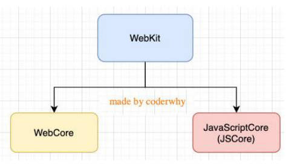

编程语言的4个特点。

- 数据和数据结构。
- 指令及流程控制。
- 引用机制和重用机制。
- 设计哲学。

-----

什么是机器语言，汇编语言，高级语言。它们的优缺点分别是什么？

- 机器语言
  - 0和1，按照一定规律转成机器码（二进制码），组成机器指令，组成机器语言。
  - 优点:：1.被计算机直接识别；无需经过编译解析；直接对硬件产生作用，程序的执行效率非常高；
  - 缺点：1.可读性差，不易编写
- 汇编语言
	- 用符号代替冗长的、难记忆的0、1代码。(mov/push指令，经过汇编器，汇编代码再进一步转成0101)
	- 优点：1.像机器语言一样，可以直接访问、控制计算机的各种硬件设备；2.占用内存少；
	- 缺点：1.不同的机器有不同的汇编语言语法和编译器，代码缺乏可移植性。2，即使是完成简单的功能也需要大量的汇编语言代码，很容易产生BUG，难于调试；
	- 应用场景：操作系统内核、驱动程序、单片机程序；
- 高级语言
  - 高级语言, 就是接近自然语言, 更符合人类的思维方式；
  - 优点：1.简单、易用、易于理解，语法和结构类似于自然语言；2.一个程序还可以在不同的机器上运行，具有可移植性；
  - 缺点：1.需要经编译器翻译成二进制指令后，才能运行到计算机上；

-----

什么是JavaScript，维基百科定义2点。

- JavaScript是一种高级的、解释型的编程语言；
- JavaScript是一门基于原型、头等函数的语言，是一门多范式的语言，它支持面向对象程序设计，指令式编程，以及函数式编程；

-----

了解 JavaScript 的历史。

-----

JavaScript与ECMAScript的关系。

- ECMA指欧洲计算机制造商协会。
- 1997年6月，ECMA以JavaScript语言为基础制定了ECMAScript标准规范ECMA-262，JavaScript成为了ECMAScript最著名的实现之一；
- 除此之外，ActionScript 和 JScript 也都是ECMAScript规范的实现语言；

-----

JavaScript的组成分为3大部分。

1. ECMAScript 定义语言规范。
2. DOM 操作文档Api。
3. BOM 操作浏览器Api。

-----

了解ECMA规范制定的历史流程。

1. 1997年，ECMAScript1 First edition。
2. 1998年，ECMAScript2 Editorial change only，微小的改动。
3. 1999年，ECMAScript3 Regular Expressions try/catch
4. ECMAScript4 未正式发布。
5. 2009年，ECMAScript5 “strict mode”，JSON support，String.trim()，Array.isArray()，Array iteration Methods.
6. 2015年，ECMAScript6（2015）

-----

浏览器内核的发展历史4个：

- Gecko：早期被Netscape和Mozilla Firefox浏览器浏览器使用；
- Trident：微软开发，被IE4~IE11浏览器使用，但是Edge浏览器已经转向Blink；
- Webkit：苹果基于KHTML开发、开源的，用于Safari，Google Chrome之前也在使用；
- Blink：是Webkit的一个分支，Google开发，目前应用于Google Chrome、Edge、Opera等；

浏览器内核也被称为：排版引擎（layout engine），浏览器引擎（browser engine）、页面渲染引擎（rendering engine）或样版引擎。

-----

为什么需要JS引擎4点？

- 高级的编程语言都是需要转成最终的机器指令来执行的；
- 事实上我们编写的JavaScript无论你交给浏览器或者Node执行，最后都是需要被CPU执行的；
- 但是CPU只认识自己的指令集，实际上是机器语言，才能被CPU所执行；
- 所以我们需要JavaScript引擎帮助我们将JavaScript代码翻译成CPU指令来执行；

JS引擎的发展历史4点。

- SpiderMonkey：第一款JavaScript引擎，由Brendan Eich开发（也就是JavaScript作者）；
- Chakra：微软开发，用于IE浏览器；
- JavaScriptCore：WebKit中的JavaScript引擎，Apple公司开发；
- V8：Google开发的强大JavaScript引擎，也帮助Chrome从众多浏览器中脱颖而出；

-----

浏览器内核和JS引擎的关系。

以WebKit为例，WebKit事实上由两部分组成的：
- WebCore：负责HTML解析、布局、渲染等等相关的工作；
- JavaScriptCore：解析、执行JavaScript代码；



-----

了解JavaScript的应用场景。

- Web开发
  - 原生JS，React开发，Vue开发，Angular开发
- 移动端开发
  - ReactNative，Weex，uniapp，Flutter
- 小程序开发
  - 微信小程序，uniapp，taro
- 桌面应用开发
  - Electron（产品VSCode）
- 后端开发
  - Node框架，如express.js，koa，egg.js

-----

编写JavaScript代码的3个位置。

- HTML代码行内（不推荐）

  ```html
  <!-- 1.编写位置一: 编写在html内部(了解) -->
  <a href="#" onclick="alert('百度一下')">百度一下</a>
  <a href="javascript: alert('百度一下')">百度一下</a>
  ```

- \<script\> 标签中

  ```html
  <!-- 2.编写位置二: 编写在script元素之内 -->
  <a class="google" href="#">Google一下</a>
  <script>
    var googleAEl = document.querySelector(".google")
    googleAEl.onclick = function() {
      alert("Google一下")
    }
  </script>
  ```

- 外部 JS 文件

  index.html

  ```html
  <!-- 3.编写位置三: 独立的js文件 -->
  <a class="bing" href="#">bing一下</a>
  <script src="./js/bing.js"></script>
  ```

  bing.js

  ```javascript
  // 获取元素
  var bingAEl = document.querySelector(".bing")
  // 监听元素的点击
  bingAEl.onclick = function() {
    alert("bing一下")
  }
  ```

-----

noscript元素的适用场景。
浏览器不支持脚本或浏览器对脚本的支持被关闭。使用  \<noscript\>  给用户更好的提示

```html
<body>
  <noscript>
    <h1>您的浏览器不支持JavaScript, 请打开或者更换浏览器~</h1>
  </noscript>
</body>
```

-----

JavaScript编写的4个注意事项。
- 注意一: script元素不能写成单标签
	- 在外联式引用js文件时，script标签中不可以写JavaScript代码，并且script标签不能写成单标签；

	  ```html
	  <!-- 错误写法 -->
	  <script src="./js/bing.js" />
	  <script src="./js/bing.js">
	  	alert('Hello bing')
	  </script>
	  ```

- 注意二: 省略type属性
	- 在以前的代码中，\<script\> 标签中会使用 type=“text/javascript”；
	- 现在可不写这个代码了，因为 JavaScript 是所有现代浏览器以及 HTML5 中的默认脚本语言；

- 注意三: 加载顺序
	- 作为HTML文档内容的一部分，JavaScript默认遵循HTML文档的加载顺序，即自上而下的加载顺序；
	- 推荐将JavaScript代码和编写位置放在body子元素的最后一行；

- 注意四: JavaScript代码严格区分大小写

	- HTML元素和CSS属性不区分大小写，但是在JavaScript中严格区分大小写；

	  ```javascript
	  // 两个完全不一样的值
	  var Name = 'zzt'
	  var name = 'ttz'
	  ```

- 后续补充：script元素还有 `defer`、`async` 属性，我们后续再详细讲解。

-----

JavaScript与浏览器交互的4个基础方式。

- alert，接受一个参数，弹窗查看

  ```javascript
  // 1.交互方式一: alert函数
  alert("Hello World");
  ```

- console.log，接收多个参数，在浏览器控制台查看（重要）

  ```js
  console.log("mu name is", name);
  ```

- document.write，接收多个字符串，在浏览器页面查看。

  ```javascript
  document.write("Hello Kobe");
  ```

- prompt，接受一个参数，在浏览器接收用户输入。

  ```javascript
  var result = prompt("请输入你的名字: ");
  alert("您刚才输入的内容是:" + result);
  ```

-----

浏览器中console有什么用？

1. 如果在代码中出现了错误，那么可以在console中显示错误；
2. console中有个 > 标志，它表示控制台的命令行
	- 在命令行中我们可以直接编写JavaScript代码，按下enter会执行代码；
	- 如果希望编写多行代码，可以按下shift+enter来进行换行编写；

-----

JavaScript 语句称为 Statement，怎么处理分号。

1. 当存在换行符（line break）时，在大多数情况下可以省略分号；
2. JavaScript 将换行符理解成“隐式”的分号；
3. 这也被称之为自动插入分号（an automatic semicolon）；

-----

JavaScript的3种注释。

- 单行注释  //
- 多行注释  /* */
- 文档注释（VSCode中需要在单独的JavaScript文件中编写才有效） /** 自动提示 */

-----

VSCode推荐的2个插件。

- ES7+ React/Redux/React-Native snippets，

	- 在react开发中会使用到的，但是经常用到它里面的打印语句提示，如输入`clg`提示`console.log`；
- VSCode已经内置了括号高亮提示功能，在`setting.json`中设置
	```json
	"editor.bracketPairColorization.enabled": true,
	"editor.guides.bracketPairs":"active"
	```

-----

变量的名命格式。

- 声明一个变量

  ```javascript
  var name = 'zzt'
  ```

- 同时声明多个变量

  ```javascript
  var name, age, height
  name = 'zzt'
  age = '18'
  height = '1.88'
  // 或者如下，不推荐
  var name = 'zzt', age = 18, height = 1.88
  ```

-----

变量的名命规则4点，

1. 第一个字符必须是一个字母、下划线（ _ ）或一个美元符号（ $ ）
2. 其他字符可以是字母、下划线、美元符号或数字。
3. 不能使用关键字和保留字命名。
4. 变量严格区分大小写。

-----

变量练习，不借助第3个变量来完成变量交换。

```javascript
var num1 = 10
var num2 = 20
num1 = num1 + num2
num2 = num1 - num2
num1 = num1 - num2
```

-----

变量练习，浏览器页面中输入一个值，JS用变量接受。

```javascript
var inputInfo = prompt("请输入一个值吧!")
console.log(inputInfo)
```

-----

变量的3点注意事项。

- 变量未声明直接使用，会报错（xxx is not defined)。

- 变量声明未赋值，默认值是`undefined`。

- 没有使用var声明变量也可以，但是不推荐（事实上会被添加到window对象上）

  ```javascript
  // admin 被添加到了 window 上
  admin = 'zzt'
  ```

-----

JS中值的类型3点理解。

- 将值赋值给一个变量，那么这个变量就具备了特定的类型；
- 一个变量可以在前一刻是个字符串，下一刻就存储一个数字；
- 允许这种操作的编程语言，例如 JavaScript，被称为“动态类型”（dynamically typed）的编程语言。

JS中有8种数据类型。

- Number
- String
- Boolean
- Undefined （值和类型相同）
- Null （值和类型相同）,一般赋值给空对象
- Object，复杂类型
- BigInt（后续了解）
- Symbol（后续了解）

-----

typeof 操作符对应的JS数据类型返回的值。

- Number - “number”
- String - "string"
- Boolean - "boolean"
- Undefined - "undefined"
- Null  - "object"
- Object - "object"
- BigInt - "bigint"
- Symbol - "symbol"
- Fuction - "function"

typeof的2种用法，两种用法效果相同。

- `typeof xxx`
- `typeof(xxx)` () 是将内容当成一个整体，并不是函数的意思。

