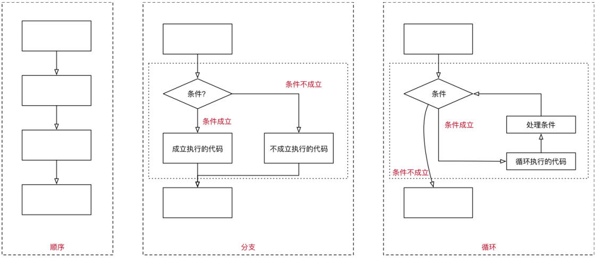

# 运算符、分支语句

## 一、运算符

运算符也称为操作符。

JavaScript 中，按照使用场景的不同，将运算符分成了很多种类型：

- 算术运算符
- 赋值运算符
- 关系（比较）运算符
- 逻辑运算符

### 1.算术运算符

算术运算符用在数学表达式中，它的使用方式和数学中也是一致的；算术运算符是对数据进行计算的符号；

常见的算术运算符。+，-，\*，/，%，\*\*

| 运算符 | 运算规则     | 范例        | 结果   |
| ------ | ------------ | ----------- | ------ |
| +      | 加法         | 2 + 3       | 5      |
| +      | 连接字符串   | '中' + '国' | '中国' |
| -      | 减法         | 2 - 3       | -1     |
| *      | 乘法         | 2 * 3       | 6      |
| /      | 除法         | 5 / 2       | 2.5    |
| %      | 取模（余数） | 5 % 2       | 1      |
| **     | 幂（ES7）    | 2 ** 3      | 8      |

### 2.赋值运算符

`=` 号，是一个赋值运算符，在 JavaScript 中它支持**链式赋值**（不推荐，阅读性差）。

语句 `x = value`，表示将值 value 写入 x 然后返回 x。

#### 1.链式赋值

链式赋值（Chaining assignments）

- 链式赋值是从右到左进行计算的；
- 首先，对最右边的表达式 2 + 2 求值，然后将其赋给左边的变量：c、b 和 a。
- 最后，所有的变量共享一个值。

```javascript
var a, b, c

a = b = c = 2 + 2

console.log(a, b, c) // 4 4 4
```

从代码的可读性的角度来说，不推荐这种写法。

#### 2.原地修改

我们经常需要对一个变量做运算，并将新的结果存储在同一个变量中。

可以使用运算符 `+=` 和 `*=` 来缩写这种表示。

```javascript
var n = 10

n += 5
n += 2
```

所有算术和位运算符，都有简短的“修改并赋值”运算符：比如：`/=`、`-=`……。

| 运算符 | 运算规则           | 范例           | 结果 |
| ------ | ------------------ | -------------- | ---- |
| =      | 赋值               | a = 5          | 5    |
| +=     | 加后赋值           | a = 5; a += 2  | 7    |
| -=     | 减后赋值           | a = 5; a -= 2  | 3    |
| *=     | 乘后赋值           | a = 5; a *= 2  | 10   |
| /=     | 除后赋值           | a = 5; a /= 2  | 2.5  |
| %=     | 取模（余数）后赋值 | a = 5; a %= 2  | 1    |
| **=    | 幂后赋值           | a = 5; a **= 2 | 25   |

#### 3.自增、自减

对一个数进行加 1、减 1，是最常见的数学运算符之一。所以，对此有一些专门的运算符：

- 自增运算符 `++`，用于将变量加 1；
- 自减运算符 `--`，用于将变量减 1；

自增、自减运算符，只能应用于变量。如果将其应用于数值（比如 `5++`）则会报错。

运算符 `++` 和 `--` 可以置于变量前，也可以置于变量后。

- 当运算符置于变量后，被称为“后置形式”（postfix form）：counter++。
- 当运算符置于变量前，被称为“前置形式”（prefix form）：++counter。

两者都做同一件事：将变量 counter 加 1。

如果自增 / 自减的值，不会被使用，那么两者形式没有区别；

如果我们想要对变量进行自增 / 自减操作，并且需要立刻使用自增 / 自减后的值，那么我们需要使用前置形式；

前置形式返回一个新的值，但后置形式返回原来的值；

```javascript
var num = 10

console.log(10 + num++) // 20 后置形式 postfix form
console.log(10 + ++num) // 22 前置形式 prefix form
```

### 3.关系（比较）运算符

JavaScript 中的关系（比较）运算符。

- 大于、小于：a > b，a < b。
- 大于等于、小于等于：a >= b，a <= b。
- 检查两个值的相等：a == b（请注意双等号 == 表示相等性检查，而单等号 a = b 表示赋值）。
- 检查两个值不相等：a != b。

比较运算符得到的结果都是 Boolean 类型的

| 运算符 | 运算规则   | 范例   | 结果  |
| ------ | ---------- | ------ | ----- |
| ==     | 宽松相等   | 4 == 3 | false |
| !=     | 宽松不相等 | 4 != 3 | true  |
| >      | 大于       | 4 > 3  | true  |
| <      | 小于       | 4 < 3  | false |
| >=     | 大于等于   | 4 >= 3 | true  |
| <=     | 小于等于   | 4 <= 3 | false |

#### 1.== 和 === 的区别

\=\=（宽松相等运算符）和 \=\=\=（严格相等运算符，全等运算符）的区别。

比较**不同类型的值**时，宽松相等运算符 == 两侧的值会先被转化为数字（object 类型，null 类型的情况特殊）。

```javascript
console.log(0 == '') // true
console.log(0 == null) // false

console.log(5 == '5');   // true
console.log(true == 1);  // true

console.log(null == undefined);  // true
console.log(NaN == NaN) // false

// 了解
var info = {
  name: 'zzt',
  age: 18,
  [Symbol.toPrimitive]() {
    return 123
  }
}

console.log(123 == info) // true
```

严格相等运算符 === 在进行比较时不会做任何的类型转换；

```javascript
console.log(5 === '5');  // false
console.log(true === 1); // false
console.log(null === undefined); // false
```

## 二、运算元

运算元，指的是运算符应用的对象。有时也称其为“参数”

如果一个运算符拥有 2 个运算元，那么它是**二元运算符**。

- 比如说乘法运算 5 * 2，有两个运算元；左运算元 5 和右运算元 2；

如果一个运算符对应的只有一个运算元，那么它是**一元运算符**。

- 比如说一元负号运算符（unary negation）`-`，它的作用是对数字进行正负转换；
- 一元运算符通常我们是使用 `–` 和 `+`，`-` 号使用的会较多一些；

## 三、运算符优先级

运算符优先级，参考 [MDN 文档](https://developer.mozilla.org/zh-CN/docs/Web/JavaScript/Reference/Operators/Operator_Precedence)

## 四、JavaScript 代码执行的方式

在程序开发中，程序有三种不同的执行方式：

- 顺序 —— 从上向下，顺序执行代码。
- 分支 —— 根据条件判断，决定执行代码的分支。
- 循环 —— 让特定代码重复执行。



## 五、JavaScript 代码块

JavaScript 中的代码块，是多行执行代码的集合，通过一个花括号 {} 放到了一起。

- 在开发中，一行代码很难完成某一个特定的功能，我们就会将这些代码放到一个代码块中。

```javascript
{
  var name = 'zzt'
  var message = 'My name is ' + name
  console.log(message)
}
```

> 在 JavaScript 中，使用 `{}` 包裹的代码创建一个代码块（code block）。代码块的主要作用包括：
>
> 1. **定义作用域**：代码块可以定义一个新的作用域，特别是对于 `let` 和 `const` 声明的变量。变量在代码块内声明，不能在代码块外被访问。这有助于避免变量污染全局作用域或其他局部作用域。
>
>    ```javascript
>    {
>      let x = 10;
>      console.log(x); // 输出 10
>    }
>
>    console.log(x); // 报错：x 未定义
>    ```
>
> 2. **控制流语句的组成部分**：代码块通常用于控制流语句（如 `if`、`for`、`while` 等）中，以组织这些语句的执行逻辑。
>
>    ```javascript
>    if (true) {
>      // 这个代码块只有在条件为 true 时才会执行
>      console.log("条件为真");
>    }
>    ```

在 JavaScript 中，我们可以通过流程控制语句来决定如何执行一个代码块：

- 通常会通过一些关键字来告知 js 引擎代码要如何被执行；
- 比如分支语句、循环语句对应的关键字等；

## 五、分支语句

程序是生活的一种抽象, 只是我们用代码表示了出来：

- 在开发中, 我们经常需要根据一定的条件, 来决定代码的执行方向。
- 如果条件满足，才能做某件事情；
- 如果条件不满足，就做另外一件事情。

分支结构：

- 分支结构的代码，就是根据条件来决定代码的执行。
- 分支结构的语句，被称为**判断结构**或者**选择结构**.。
- 几乎所有的编程语言都有分支结构（C、C++、OC、JavaScript 等等）。

JavaScript 中常见的分支结构有：

- if 分支结构
- switch 分支结构

### 1.if 分支语句

if 分支结构有三种：

单分支结构一种：

- if..

多分支结构二种：

- if..else..
- if..else if..else..

#### 1.单分支结构

if(...) 语句，会计算括号里的**条件表达式**，如果计算结果是 true，就会执行对应的代码块。

```flow
st=>start: 开始框
cond=>condition: 判断条件
op=>operation: 代码块
e=>end: 结束框
st->cond
cond(yes)->op->e
cond(no)->e
```

if 语句单分支结构使用时：

- 如果代码块中只有一行代码，那么代码块 `{}` 可以省略：

  ```javascript
  if (a > b) a++
  ```

- if (…) 语句会计算圆括号内的表达式，并将计算结果转换为布尔型（Boolean）。

  - 0、“”、null、undefined、NaN 都会被隐式转换成 false。 它们被称为“假值（falsy）”；
  - 其他值被转换为 true，所以它们被称为“真值（truthy）”

  ```javascript
  if (0) console.log('hhh') // 不会打印
  ```

#### 2.多分支结构

多分支语句一： if.. else..

- if 语句有时会包含一个可选的 “else” 块。如果判断条件不成立，就会执行它内部的代码。

```flow
st=>start: 开始框
cond=>condition: 判断条件
op=>operation: 代码块1
op2=>operation: 代码块2
e=>end: 结束框
st->cond
cond(yes)->op->e
cond(no)->op2->e
```

多分支结构二： if.. else if.. else..

- 有时我们需要判断多个条件；需要使用 else if 子句实现；

```flow
st=>start: 开始框
cond=>condition: 判断条件1
op=>operation: 代码块1
cond2=>condition: 判断条件2
op2=>operation: 代码块2
op3=>operation: 代码块3
e=>end: 结束框
st->cond
cond(yes)->op->e
cond(no)->cond2
cond2(yes)->op2
cond2(no)->op3
op2->e
op3->e
```

### 2.三元运算符

有时我们需要根据一个条件去赋值一个变量。

- 比如：比较数字大小的时候，获取较大的数字；

这个时候 if...else... 语句就会显得过于臃肿，可以使用更加简洁的三元运算符（条件运算符）：`?`

- 这个运算符通过问号 ? 表示；
- 被称为“三元”是因为该运算符中有三个操作数（运算元）；
- 实际上它是 JavaScript 中唯一一个有这么多操作数的运算符；

使用格式如下：`var result = condition ? value1 : value2`

计算条件结果，如果结果为真，则返回 value1，否则返回 value2。

> 通过嵌套三元运算符，可以组成条件链，嵌套三元运算符的标准写法如下：
>
> ```javascript
> let result = condition1 ? value1 :
>     condition2 ? value2 :
>     condition3 ? value3 :
>     defaultValue;
> ```
>
> 使用嵌套三元运算符时，务必注意以下几点：
>
> 1. **可读性**：嵌套过多会使代码难以阅读和维护。建议在逻辑复杂时使用 `if-else` 语句或其他结构代替。
> 2. **正确的缩进**：通过适当的缩进和换行提高代码可读性，使嵌套逻辑更清晰。
> 3. **避免滥用**：尽量在简单条件下使用三元运算符，对于复杂条件链，考虑其他更适合的代码结构。
