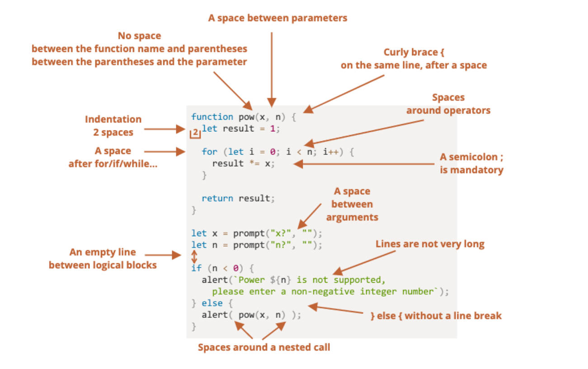
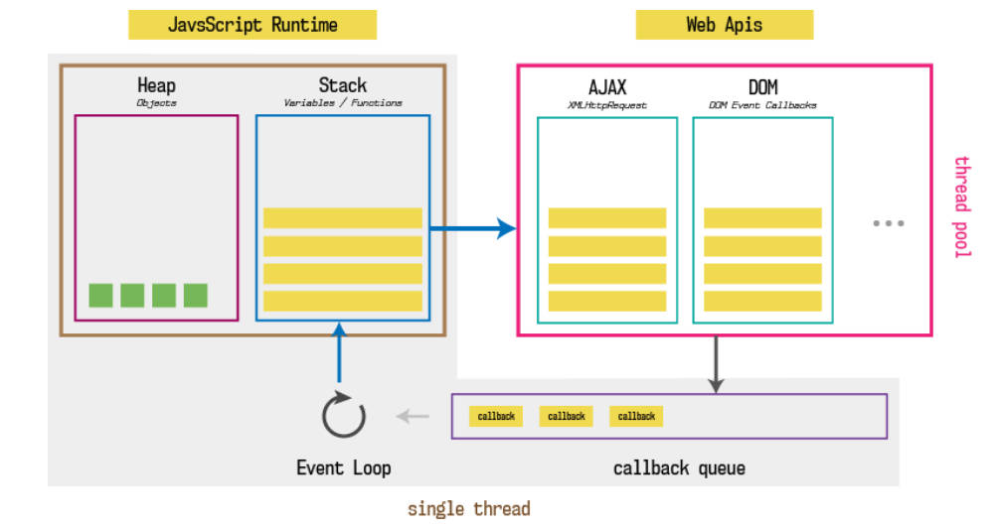
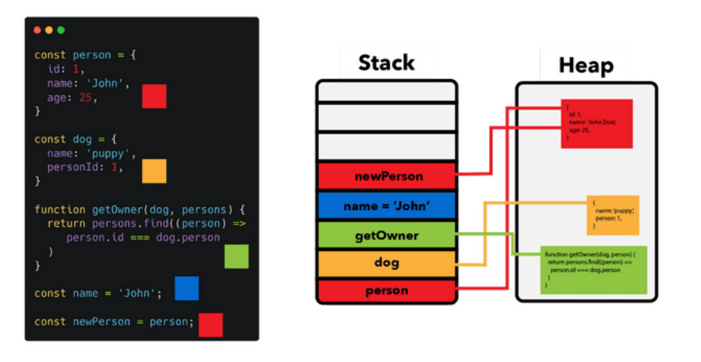

# 函数、chrome调试、面向对象

## 一、立即执行函数

立即调用函数表达式（Immediately-Invoked Function Expression）（IIFE），又称立即执行函数。

表达的含义，是一个函数定义完后被立即执行；

- 第一部分是定义了一个匿名函数，这个函数有自己独立的作用域。
- 第二部分是后面的（），表示这个函数被执行了。

```javascript
;(function () {
  console.log('立即执行函数')
})()
```

IIFE，会创建一个独立的执行上下文环境（作用域），可以避免函数内对外界的访问，也避免了外界对函数内部变量的修改。常被用于：

- 早期的 JS 合作开发时，防止变量名命冲突。
- 早期的循环中，制造闭包和作用域。

```javascript
var btns = document.querySelectorAll('.btn')

for (var i = 0; i < btns.length; i++) {
  (function (m) {
    btns[m].onclick = function () {
      console.log('第' + m  + '个按钮被点击了')
    }
  })(i)
}
```

- var 声明的变量，是没有块级作用域的，必须借助函数，来引入作用域。
- 这段代码，如果不使用 IIFE 而直接在循环中使用 var 声明的 `i` 变量，那么所有按钮的点击事件处理函数中的 `i` 都会引用同一个变量。因为 `i` 的值在循环结束时会等于 `btns.length`，所以所有按钮的点击事件处理函数，都会输出相同的结果。

> 在上一行代码结尾是 `()` / `[]` / `{}` 的情况下，立即执行函数前要加分号 `;`，因为如果不加 `;` 会造成语法解析错误。
>
> `()` / `[]` / `{}` 在 JavaScript 中的含义：
>
> - `()` 控制优先级，如 `(2 + 3) * 5` / 函数的调用和传参。
> - `[]` 定义数组 / 从数组或对象中取值 / 对象的计算属性。
> - `{}` 代码块 / 对象类型.

立即执行函数，必须是一个表达式（整体），不能是函数声明，下面这种函数声明的写法，是错误的：

```javascript
// ❌
function foo() {
  console.log('立即执行函数')
}()
```

当 `()` 小括号包裹函数时，会默认将函数作为表达式去解析，而不是函数声明：

```javascript
;(function () {
  console.log('立即执行函数')
})()
```

除了上面的写法，立即执行函数的另外 2 种写法（了解）。

第二种

```txt
+function () {
  console.log('立即执行函数')
}()
```

第三种

```txt
;(function () {
  console.log('立即执行函数')
}())
```

## 二、JavaScript 代码规范

理解代码规范图。



## 三、chrome 调试技巧

chrome 调试技巧，在 source 中查看源码，

1. 打断点。
2. 在 JavaScript 源码中写 debugger;，或者打断点。
3. 在浏览器打开调式工具，选择 source（源代码 / 来源）选项卡，右侧区域，
   1. watch（监听）中，监听变量变化。
   2. breakpoint（断点）中，查看断点信息。
   3. scope （作用域）中，查看作用域。
   4. call stack（调用堆栈）中，查看函数调用栈。
   5. Resume（暂停/继续执行脚本）按钮，恢复当前 1 个断点的执行。
4. 在浏览器打开调式工具，选择 source（源代码 / 来源）选项卡，右侧上方区域按钮的使用：
   1. Step over next function（跳过下一个函数调用），执行下一行代码。
   2. Step into next function（进入下一个函数调用），进入函数执行，可以进入异步函数。
   3. Step out of current function（跳出当前函数），跳出函数执行。
   4. Step（单步调试），进入函数执行，跳过异步函数。

## 四、面向对象

### 1.对象是什么

在数据类型中我们提到还有一种特别的类型：对象类型。

- 对象类型，涉及到 JavaScript 的各个方面，它是一种存储键值对（key-value）的更复杂的数据类型；

对象类型的作用：

- 基本数据类型可以存储一些简单的值，但是现实世界的事物抽象成程序时，往往比较复杂；
- 比如一个人，有自己的特性（姓名、年龄、身高……），有一些行为（跑步、学习、工作……）；
- 比如一辆车，有自己的特性（颜色、重量、速度……），有一些行为（行驶，刹车……）；

这个时候，我们需要一种新的类型，将这些特性和行为组织在一起，这种类型就是对象类型。

- 对象类型可以使用 `{…}`，来创建，里面包含的是键值对（“key: value”）；
- 键值对可以是属性、方法（在对象中的函数，称为“方法”）；
- 其中 key 是属性名 property name ，通常是字符串，ES6 之后也可以是 Symbol 类型（后续介绍）；
- 其中 value 可以是任意类型，包括基本数据类型、函数类型、对象类型等；

### 2.对象创建和使用

对象的创建方法有很多，包括三种：

- 对象字面量（Object Literal）：通过 `{}` 创建对象；
- `new Object` + 动态添加属性；
- `new 其他类`；

对象字面量，创建对象，属性之间是以逗号（ comma ）分割的；

```javascript
var obj = {
  name: 'zzt',
  age: '18',
  sign: '认真是一种可怕的力量'
}
```

对象的使用过程包括如下操作：

- 访问对象的属性；

  ```javascript
  obj.name
  ```

- 修改对象的属性；

  ```javascript
  obj.name = 'kobe'
  ```

- 添加对象的属性；

  ```javascript
  obj.address = '深圳市'
  ```

- 删除对象的属性，使用 delete 操作符：

  ```javascript
  delete obj.address
  ```

### 3.计算属性的使用

在对象字面量中，定义的属性有空格，JavaScript 是无法理解的，

比如：`info.good friend = "zzt"`，这是错误的写法。

因为点符号，要求 key 是有效的变量标识符，不包含空格，不以数字开头，也不包含特殊字符（允许使用 $ 和 _）；

这时，要使用计算属性动态计算和设置属性名，或在设置键值时，使用 "" 包裹的字符串语法：

```javascript
var message = "hello world"

var obj = {
  "good friend": "zzt",
  [message]: "你好，世界"
}
```

Object 类型 key 为字符串，双引号可省略，什么时候要加双（单）引号。如何对应的取值。

```javascript
var obj = {
  name: 'zzt',
  'my friend': 'Hazard'
}

console.log(obj['my friend'])

var key = 'my friend'
console.log(obj[key])
```

### 4.对象遍历

对象的遍历（迭代）：表示获取对象中所有的属性和方法。

#### 1.for 循环

`Object.keys` 方法，会返回一个由给定对象的自身可枚举属性，组成的数组；

```javascript
var info = {
  name: 'zzt',
  age: 18,
  height: 1.88
}

var infoKeys = Object.keys(info)

for (var i = 0; i < infoKeys.length; i++) {
  var key = infoKeys[i]
  var value = info[key]
  console.log(`key: ${key}, value: ${value}`)
}
```

#### 2.for...in

for..in，用于遍历对象中的可枚举属性，和原项链上的属性。

```javascript
var info = {
  name: 'zzt',
  age: 18,
  height: 1.88
}

for (var key in info) {
  var value = info[key]
  console.log(`key: ${key}, value: ${value}`)
}
```

> for...of 只能遍历可迭代对象（如数组对象）。

## 五、栈内存、堆内存

我们知道程序是需要加载到内存中来执行的，我们可以将内存划分为两个区域：栈内存和堆内存。

- 原始类型占据的空间，是在栈内存中分配的；
- 对象类型占据的空间，是在堆内存中分配的；

理解队列图：



函数本身存放在堆内存中，执行时会加载到栈内存中。

## 六、值类型，引用类型

在变量中保存的是值本身，所以原始类型也被称之为值类型；

在变量中保存的是对象的“引用”，所以对象类型也被称之为引用类型；

它们在内存中的表示如图：



值类型和对象类型的比较：

```javascript
var a = 123
var b = 123

a === b // true

var m = {}
var n = {}

m === n // false
```

理解引用传递和值传递的内存区别：

```javascript
function foo(a) {
  a.name = 'zzt'
}

var obj = {
  name: 'obj'
}

foo(obj)

console.log(obj) // { name: 'zzt' }
```

## 七、this 关键字

在常见的编程语言中，几乎都有 this 这个关键字（Objective-C 中使用的是 self），

然而，JavaScript 中的 this 和常见的面向对象语言中的 this 不太一样：

- 常见面向对象的编程语言中，比如 Java、C++、Swift、Dart 等等一系列语言中，this 通常只会出现在类的方法中（特别是实例方法），
- 也就是你需要有一个类，类中的方法（特别是实例方法）中，this 代表的是当前调用对象；

JavaScript 中的 this 更加灵活，无论是它出现的位置，还是它代表的含义（每个非箭头函数中都有 this）；

编写一个 obj 的对象，不使用 this 关键字：

```javascript
var obj = {
  name: 'zzt',
  running: function () {
    console.log(obj.name + " running")
  },
  eating: function () {
    console.log(obj.name + " eating")
  },
  studying: function () {
    console.log(obj.name + " studying")
  },
}
```

使用 this 关键字：

```javascript
var obj = {
  name: 'zzt',
  running: function () {
    console.log(this.name + " running")
  },
  eating: function () {
    console.log(this.name + " eating")
  },
  studying: function () {
    console.log(this.name + " studying")
  },
}
```

目前掌握两个 this 指向的判断方法：

- 在全局环境下面，this 指向 window 对象；
- 通过对象调用函数，函数中的 this 关键字，指向调用的对象；
