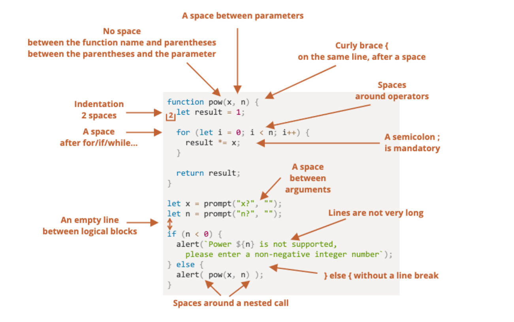
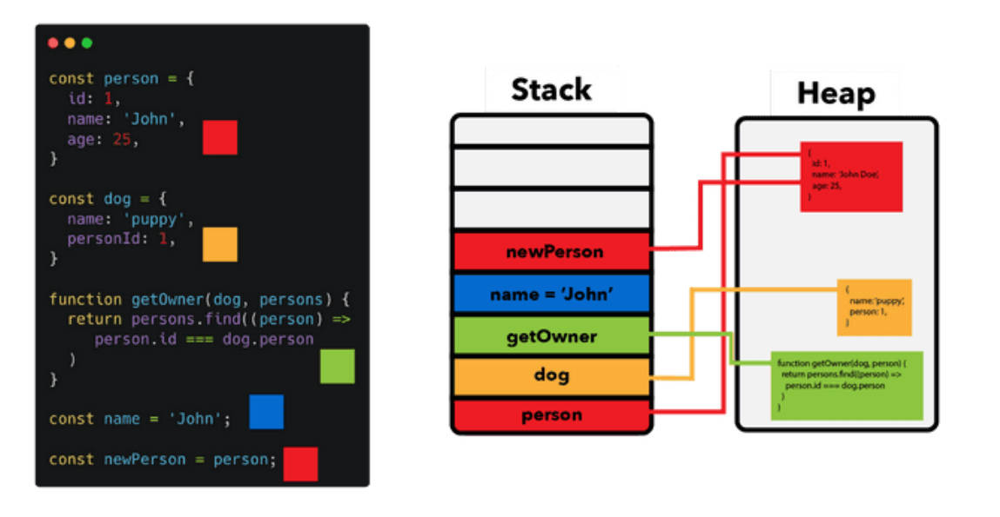

立即执行函数的全称是？

- Immediately-Invoked Function Expression（IIFE 立即调用函数表达式）

有什么用？

- 立即执行函数可以形成作用域，所以它有如下作用：
1. 早期合作开发时，防止变量名命冲突。
2. 早期在循环中，制造闭包和作用域。

-----

在某些情况下立即执行函数上一行代码要加分号。

-----

(), [], {} 在JS中分别代表什么含义？

- () 控制优先级(2+3)*5/函数的调用/函数的参数
- [] 定义数组/从数组或对象中取值/对象的计算属性
- {} 代码块/对象类型

-----

立即执行函数的3种写法。

第一种

```javascript
(functioon() {
	console.log('立即执行函数')
})()
```

第二种

```javascript
(function() {
  console.log('立即执行函数')
}())
```

第三种

```javascript
+function() {
  console.log('立即执行函数')
}()
```

-----

理解代码规范图。



-----

chrome调试技巧，在 source 中查看源码，

1. 打断点。
2. 在源码中写 debugger;，打断点。
3. 在右侧区域，watch中，监听变量变化。breakpoint 中，查看断点信息。
4. 在右侧区域，scope中，查看作用域。call stack 中，查看函数调用栈。
5. 在右侧区域，Resume 按钮，恢复当前1个断点的执行。
6. 在右侧区域，Step over next function，执行下一行代码。
7. 在右侧区域，Step into next function，进入函数执行，可以进入异步函数。
8. 在右侧区域，Step out of current function，跳出函数执行。
9. 在右侧区域，Step，进入函数执行，跳过异步函数。

-----

Object类型key为字符串，双引号可省略，什么时候要加双（单）引号。如何对应的取值。

```javascript
var obj = {
	name: 'zzt',
	'my friend': 'Hazard'
}
console.log(obj['my friend'])
var key = 'my friend'
console.log(obj[key])
```

-----

如何删除对象中的属性？

```javascript
var info = {
  name: 'zzt',
  age: 18
}
// delete关键字(操作符)
delete info.age
```

-----

遍历对象的2种方法。

- Object.keys() 方法会返回一个给定对象的自身可枚举属性组成的数组；

```javascript
var info = {
  name: "zzt",
  age: 18,
  height: 1.88
}
// 1.普通for循环
var infoKeys = Object.keys(info)
for (var i = 0; i < infoKeys.length; i++) {
  var key = infoKeys[i]
  var value = info[key]
  console.log(`key: ${key}, value: ${value}`)
}
// 2.for..in..: 遍历对象
for (var key in info) {
  var value = info[key]
  console.log(`key: ${key}, value: ${value}`)
}
```

-----

for...of 只能遍历可迭代对象（如数组对象）。

-----

栈内存和堆内存有什么用？

- 原始类型占据的空间是在栈内存中分配的； 
- 对象类型占据的空间是在堆内存中分配的；

理解队列图。


-----

函数本身存放在堆内存中，执行时会加载到栈内存中。

-----

什么是值类型，什么是引用类型，

- 原始类型也被称之为值类型，在变量中保存值本身。
- 对象类型也被称之为引用类型，在变量中保存对象的“引用”

理解图解。



-----

理解引用传递和值传递的内存区别。

```javascript
function foo(a) {
  a.name = "zzt"
}
var obj = {
  name: "obj"
}
foo(obj)
console.log(obj) // { name: 'zzt' }
```

-----

为什么需要 this。

- 常见面向对象的编程语言中，如 Java、C++、Swift、Dart，this通常只会出现在类的方法中（特别是实例方法），this代表的是当前调用对象。
- JavaScript中的this更加灵活，无论是它出现的位置还是它代表的含义（每个非箭头函数中都有this）。