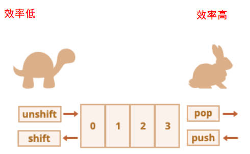

# 面向对象、包装类型、数组

我们来思考一个问题：如果需要在开发中创建一系列的相似的对象，我们应该如何操作呢？

比如下面的例子：

- 游戏中创建一系列的英雄（英雄具备的特性是相似的，比如都有名字、技能、价格，但是具体的值又不相同）
- 学生系统中创建一系列的学生（学生都有学号、姓名、年龄等等信息，但是具体的值又不相同）

当然，一种办法是挨个创建对象：

```javascript
var student1 = {
  name: '张三',
  age: 18,
  height: 1.77
  address: '北京市'
}

var student2 = {
  name: '李四',
  age: 20,
  height: 1.87
  address: '上海市'
}

var student3 = {
  name: '王五',
  age: 19,
  height: 1.88
  address: '杭州市'
}
```

这种方式有一个很大的弊端：创建同样的对象时，需要编写重复的代码；

现在需要批量创建对象，同时又让它们的属性值不一样。

## 一、对象创建

### 1.工厂函数

我们可以想到的一种创建对象的方式：**工厂函数**

我们可以封装一个函数，这个函数用于帮助我们创建一个对象，我们只需要重复调用这个函数即可；

这种模式，被称为**工厂模式**，是一种常见的设计模式；

使用工厂函数创建对象。

```javascript
// 写法一
function createStudent1(name, age, height, address) {
  var stu = {}

  stu.name = name
  stu.age = age
  stu.height = height
  stu.address = address

  stu.eating = function () {
    console.log(stu.name + ' eating')
  }
  stu.running = function () {
    console.log(stu.name + ' running')
  }

  return stu
}

var stu1 = createStudent1('zzt', 18, 1.88, '深圳市')

// 写法二
function createStudent2(name, age, height, address) {
  var stu = new Object()

  stu.name = name
  stu.age = age
  stu.height = height
  stu.address = address

  stu.eating = function () {
    console.log(stu.name + ' eating')
  }
  stu.running = function () {
    console.log(stu.name + ' running')
  }

  return stu
}

var stu1 = createStudent2('zzt', 18, 1.88, '深圳市')
```

### 2.构造函数（类）

工厂方法创建对象，有一个比较大的问题：那就是创建的对象都是 **Object 类型**。从某些角度来说，这些对象，应该有一个他们共同的类型，比如 Student 类，Person 类……；

使用构造函数的方式创建对象，可以解决这个问题：

- **构造函数**也称之为**构造器（constructor）**，通常是我们在创建对象时，会调用的函数；
- 在其他面向对象的编程语言（比如 Java）里面，**构造函数**是存在于类中的一个方法，称之为**构造方法**；
- 但是在 JavaScript 中，**构造函数扮演了其他语言中类的角色**；

> Java 中的构造函数和 JavaScript 中构造函数有什么区别？
>
> - Java：构造函数是存在于类中的一个方法，称之为构造方法；
> - JavaScript：构造函数扮演了其他语言中类的角色；
>
> 以 Javascript 中的 Date 类举例。
>
> ```javascript
> // Date 是 JavaScript 中的一个构造函数（类）
> new Date()
> ```

JavaScript 中，构造函数其实就是类的扮演者：

- 比如：系统默认给我们提供的 `Date` 就是一个构造函数，也可以看成是一个类；
- 在 ES5 之前，JavaScript 都是通过 function 来声明一个构造函数（类）的，之后通过 `new` 关键字来对其进行调用；
- 在 ES6 之后，JavaScript 可以像别的语言一样，通过 class 来声明一个类；

使用构造函数，创建对象。

```javascript
function Coder(name, age, height) {
  // 实例属性
  this.name = name
  this.age = age
  this.height = height

  // 实例方法
  this.coding = function () {
    console.log('coding~')
  }
}

var code1 = new coder('zzt', 18, 1.88)
```

那么类和对象到底是什么关系呢？

#### 1.类和对象的关系

什么是类（构造函数）呢？

- 现实生活中，往往是根据一份描述（一个模板）来创建一个实体对象的。

- 编程语言也是一样, 也必须先有一份描述，在这份描述中说明将来创建出来的对象有哪些**属性（成员变量 / 实例属性）**和**行为（成员方法 / 实例方法）**

- 函数本质上也是对象，所以函数也可以添加属性，那么给构造函数添加一个函数属性，这个函数称为**类方法（静态方法）**。

  ```javascript
  // now 是 Date 类的静态方法
  Date.now()
  ```

现实生活中，我们会如此来描述一些事物：

- 比如：水果 fruits 是一类事物的统称，苹果、橘子、葡萄等是具体的对象；
- 比如：人 person 是一类事物的统称，而 Jim、Lucy、Lily、李雷、韩梅梅是具体的对象；

#### 2.ES5 中的类

前面说过，在 JavaScript ES5 中，类的表示形式，就是构造函数。

JavaScript 中的构造函数是怎么样的？

- JavaScript 中的构造函数，也是一个普通的函数，从表现形式来说，和千千万万个普通的函数没有任何区别；
- 这么一个普通的函数，一旦被 `new` 操作符调用，那么这个函数就称之为是一个**构造函数**。

如果一个函数被 new 操作符调用，会执行如下 5 步操作。

1. 在内存中创建一个新的空对象；
2. 这个对象内部的 [[prototype]] 属性会被赋值为该构造函数的 prototype 属性；
3. 构造函数内部的 this，会指向创建出来的新对象；
4. 执行函数的内部代码（函数体代码）；
5. 如果构造函数没有返回非空对象，则返回创建出来的新对象；

接下来，我们可以用构造函数的方式来实现一下批量创建学生。

```javascript
function Studeht(name, age, height, address) {
  this.name = name
  this.age = age
  this.height = height
  this.address = address

  this.eating = function () {
    console.log(this.name + ' eating')
  }
  this.running = function () {
    console.log(this.name + ' running')
  }
}

var stu = new Student('zzt', 18, 1.88, '深圳市')
```

这个构造函数，可以确保创建的对象，是有 Student 的类型的（实际是 constructor 的属性，这个后续再介绍）；

事实上，构造函数还有很多其他的特性，后续会介绍：

- 比如：原型、原型链、实现继承的方案；
- 比如：ES6 中类、继承的实现；

## 二、window 对象

全局对象 window 的作用 3 个。

- 查找变量时, 最终会找到 window 对象上。
- 存放浏览器全局提供的变量 / 函数 / 对象。
- 使用 var 定义的变量，会被默认添加到 window 对象的属性里。

## 三、包装类的概念

### 1.包装类是什么？

JavaScript 的原始类型，并非对象类型，所以从理论上来说，它们是没有办法获取属性或者调用方法的。

但是，在开发中会看到，我们经常这样操作：

```javascript
var message = 'Hello World'

var words = message.split(' ')
var length = words.length

var num = 2.54432

num = num.toFixed(2)
```

那么，为什么会出现这样奇怪的现象（悖论）呢？

- 原始类型是简单的值，默认并不能调用属性和方法；
- 这是因为 JavaScript 为了可以使其获取属性和调用方法，对其封装了对应的包装类型，创建了一个特定对象；

常见的包装类型有：String、Number、Boolean、Symbol、BigInt 类型。

### 2.包装类的使用

默认情况，当我们调用一个原始类型的属性或者方法时，会进行如下操作：

```javascript
var name = 'Hello World'

console.log(name.length) // 内部的操作 name = new String(name)
```

- 根据原始值，创建一个原始类型对应的包装类型对象；
- 调用对应的属性或者方法，返回一个新的值；
- 创建的包装类对象被销毁；

通常 JavaScript 引擎会进行很多的优化，它可以跳过创建包装类的过程，在内部直接完成属性的获取或者方法的调用。

我们也可以显示的创建一个包装类的对象：

```javascript
var name1 = 'zzt'
console.log(typeof name1) // string

var name2 = new String('zzt')
console.log(typeof name2) // object

console.log(name1 === name2) // false
```

- name1 是字面量（literal）的创建方式，name2 是创建对象的方式；

注意事项：null、undefined 没有任何的方法，也没有对应的“对象包装类”；

## 四、包装类有哪些

### 1.Number 包装类

前面我们已经学习了 Number 类型，它有一个对应的包装类型 Number 类，我们来对它的方法做一些补充。

#### 1.Number 类属性

- `Number.MAX_SAFE_INTEGER`：JavaScript 中最大的安全整数 (2^53 - 1)；

- `Number.MIN_SAFE_INTEGER`：JavaScript 中最小的安全整数 -(2^53 - 1)

  > 最小正数值：`Number.MIN_VALUE`，表示 JavaScript 能表示的最小的正数（即最接近 0 的正数），而不是负数的最小值。它的值约为 `5e-324`。小于这个的数字会被转化为 0。
  >
  > 最大正数值：`Number.MAX_VALUE`， 表示 JavaScript 可以表示的最大正数。它的值约为 `1.7976931348623157e+308`。超过这个值的数将被表示为 `Infinity`。

#### 2.Number 类实例方法

方法一：[Number.prototype.toString()](https://developer.mozilla.org/zh-CN/docs/Web/JavaScript/Reference/Global_Objects/Number/toString)：`toString(base)`，将数字转成字符串，并且按照 base 进制进行转化

- `base` 的范围可以从 2 到 36，默认情况下是 10；

- 注意：如果是直接对一个数字操作，需要使用 `..` 运算符，或者使用小括号包裹数字；

  ```txt
  123..toString() // 默认转成十进制
  ```
  
  ```javascript
  ;(123).toString(2) // 将数字123转成二进制数字字符串。
  ```

方法二：[Number.prototype.toFixed()](https://developer.mozilla.org/zh-CN/docs/Web/JavaScript/Reference/Global_Objects/Number/toFixed) `toFixed(digits)`，格式化一个数字，保留 digits 位的小数；

- digits 的范围是 0 到 20（包含）之间；

  ```javascript
  var pi = 3.1415926
  
  console.log(pi.toFixed(3)) // 会四舍五入，返回 string 类型的值。
  ```

#### 3.Number 类静态（类）方法

方法一：[Number.parseInt()](https://developer.mozilla.org/zh-CN/docs/Web/JavaScript/Reference/Global_Objects/Number/parseInt) `Number.parseInt(string[, radix])`，将字符串解析成整数，也有对应的全局方法 `parseInt`；

方法二：[Number.parseFloat()](https://developer.mozilla.org/zh-CN/docs/Web/JavaScript/Reference/Global_Objects/Number/parseFloat) `Number.parseFloat(string)`，将字符串解析成浮点数，也有对应的全局方法 `parseFloat`；

全局对象（window）也有以上两方法，两方法的返回值，没有四舍五入。

更多 Number 类的知识，可以查看 [MDN 文档](https://developer.mozilla.org/zh-CN/docs/Web/JavaScript/Reference/Global_Objects/Number)；

#### 5.Math 内置对象

在除了 Number 类可以对数字进行处理之外，JavaScript 还提供了一个 Math 对象。

Math 是一个内置对象（不是一个构造函数），它拥有一些数学常数属性和数学函数方法；

Math 对象常见的属性：

- Math.PI：圆周率，约等于 3.14159；

Math 对象常见的方法：

- Math.floor：向下舍入取整
- Math.ceil：向上舍入取整
- Math.round：四舍五入取整
- Math.random：生成 0~1 的随机数（包含 0，不包含 1）
- Math.pow(x, y)：返回 x 的 y 次幂

Math 中还有很多其他数学相关的方法，可以查看 [MDN 文档](https://developer.mozilla.org/zh-CN/docs/Web/JavaScript/Reference/Global_Objects/Math)

写一个算法，随机生成一个 [5, 50) 的数。

```javascript
Math.floor(Math.random() * 45) + 5
```

### 2.String 包装类

在开发中，我们经常需要对字符串进行各种各样的操作，String 类提供给了我们对应的属性和方法。

#### 1.访问字符串

String 常见的属性：

- `length`：获取字符串的长度；

```javascript
var msg = 'Hello World'

msg.length
```

String 也有很多常见的方法

操作一：访问字符串的字符：

- 使用方法一：通过字符串的索引，比如：`str[0]`
- 使用方法二：通过 [String.prototype.charAt()](https://developer.mozilla.org/zh-CN/docs/Web/JavaScript/Reference/Global_Objects/String/charAt) `str.charAt(pos)` 方法

它们的区别是：

- 索引的方式，没有找到会返回 undefined；
- `charAt` 方法，没有找到会返回空字符串 ""；

```javascript
var msg = 'haha'

console.log(msg[4]) // undefined

console.log(msg.charAt(4)) // ""
```

字符串的遍历

- 方式一：普通 for 循环
- 方式二：for..of 遍历

```javascript
var msg = 'Hello World'

for (var i = 0; i < msg.length; i++) {
  console.log(msg[i])
}

for (var char of msg) {
  console.log(char)
}
```

#### 2.修改字符串

字符串具有**不可变性**：字符串在定义后，是不可以修改的，所以下面的操作是没有任何意义的；

```javascript
var message = 'Hello world'

message[1] = 'A' // 没有意义
```

在需要修改字符串的操作中，一般都是生成一个新的字符串。

比如：改变字符串大小的两个方法

- [String.prototype.toLowerCase()](https://developer.mozilla.org/zh-CN/docs/Web/JavaScript/Reference/Global_Objects/String/toLowerCase) `toLowerCase()`：将所有的字符转成小写；
- [String.prototype.toUpperCase()](https://developer.mozilla.org/zh-CN/docs/Web/JavaScript/Reference/Global_Objects/String/toUpperCase) `toUpperCase()` ：将所有的字符转成大写；

```javascript
var message = 'Hello world'

console.log(message.toLowerCase()) // 生成新字符串，将所有的字符转成大写。

console.log(message.toUpperCase()) // 生成新字符串，将所有的字符转成小写。
```

#### 3.查找字符串

在开发中，我们经常会在一个字符串中，查找或者获取另外一个字符串，String 包装类提供了如下方法：

方法一：[String.prototype.indexOf()](https://developer.mozilla.org/zh-CN/docs/Web/JavaScript/Reference/Global_Objects/String/indexOf) 查找字符串位置 `str.indexOf(searchValue [, fromIndex])`

- 从 `fromIndex` 开始，查找 `searchValue` 的索引；
- 如果没有找到，那么返回 `-1`；

> 有一个相似的方法，叫 [String.prototype.lastIndexOf()](https://developer.mozilla.org/zh-CN/docs/Web/JavaScript/Reference/Global_Objects/String/lastIndexOf)，从最后开始查找（用的较少）。

方法二：[String.prototype.includes()](https://developer.mozilla.org/zh-CN/docs/Web/JavaScript/Reference/Global_Objects/String/includes) 是否包含字符串 `str.includes(searchString[, position])`

- 从 position 位置开始查找 searchString， 根据情况返回 true 或 false
- 这是 ES7 新增的方法；

#### 4.开头和结尾

方法三：[String.prototype.startsWith()](https://developer.mozilla.org/zh-CN/docs/Web/JavaScript/Reference/Global_Objects/String/startsWith) 以 xxx 开头 `str.startsWith(searchString[, position])`

- 从 position 位置开始，判断字符串是否以 searchString 开头；
- 这是 ES6 新增的方法，

方法四：[String.prototype.endsWith()](https://developer.mozilla.org/zh-CN/docs/Web/JavaScript/Reference/Global_Objects/String/endsWith) 以 xxx 结尾 `str.endsWith(searchString[, length])`（ES6 新增）

- 在 length 长度内，判断字符串是否以 searchString 结尾；
- 这是 ES6 新增的方法，

方法五：[String.prototype.replace()](https://developer.mozilla.org/zh-CN/docs/Web/JavaScript/Reference/Global_Objects/String/replace) 替换字符串 `str.replace(regexp|substr, newSubStr|function)`

- 查找到对应的字符串，并且使用新的字符串进行替代；
- 这里也可以传入一个正则表达式来查找，也可以传入一个函数来替换；

```javascript
var message = 'zzthalo'
var newName = 'kobe'

var newMessage = message.replace('zzt', function () {
  return newName.toUpperCase()
})
```

#### 5.获取子字符串

方法一：[String.prototype.slice()](https://developer.mozilla.org/zh-CN/docs/Web/JavaScript/Reference/Global_Objects/String/slice) `slice(start, end)`，从 start 到 end（不含 end），允许负数参数（推荐使用）。

```javascript
var message = 'message'

message.slice(3, -2) // 从第三位截取到倒数第二位
```

方法二：[String.prototype.substring()](https://developer.mozilla.org/zh-CN/docs/Web/JavaScript/Reference/Global_Objects/String/substring) `substring(start, end)`，从 start 到 end（不含 end），负值代表 0.

方法三：[String.prototype.substr()](https://developer.mozilla.org/zh-CN/docs/Web/JavaScript/Reference/Global_Objects/String/substr) `substr(start, length)`，从 start 开始获取长为 length 的字符串，允许 start 为负数。（避免使用，可能被废弃）

#### 6.其他方法

拼接字符串 [String.prototype.concat()](https://developer.mozilla.org/zh-CN/docs/Web/JavaScript/Reference/Global_Objects/String/concat) `str.concat(str2, [, ...strN])`

删除首尾空格 [String.prototype.trim()](https://developer.mozilla.org/zh-CN/docs/Web/JavaScript/Reference/Global_Objects/String/trim) `str.trim()`

字符串分割 [String.prototype.split()](https://developer.mozilla.org/zh-CN/docs/Web/JavaScript/Reference/Global_Objects/String/split) `str.split([separator[, limit]])`

- separator：以什么字符串进行分割，也可以是一个正则表达式；
- limit：限制返回片段的数量；

```javascript
var message = 'abc-cba-nba-mba'

var items = message.split('-')
console.log(items) // [ 'abc', 'cba', 'nba', 'mba' ]

var newMessage = items.join('*')
console.log(newMessage) // abc*cba*nba*mba
```

## 五、数组

对象允许存储键值集合，但是在某些情况下，使用键值对来访问并不方便；

- 比如：一系列的商品、用户、英雄，包括 HTML 元素，我们如何将它们存储在一起呢？

这个时候我们需要一种**有序的集合**，里面的元素是按照某一个顺序来排列的；

这个有序的集合，我们可以通过索引来获取到它里面的元素；

这个结构就是数组（Array）；

数组和对象，都是一种保存多个数据的数据结构：

### 1.数组创建

我们可以通过中括号 `[]` 来创建一个数组：

```javascript
var arr1 = ['zzt', 'kobe', 'james', 'curry']
```

数组是一种特殊的对象类型

事实上，创建数组有 2 种方式。

```javascript
// 方式一
var arr1 = []
var arr2 = ['zzt', 'kobe', 'james', 'curry']

var arr3 = new Array()
var arr4 = new Array('abc', 'cba', 'nba')
var arr3 = new Array(5) // [empty* 5] 传入一个数字，创建对应长度的数组。
```

数组元素从 0 开始编号（索引 index）。

- 一些编程语言允许我们使用负数索引，来实现这一点，例如 `fruits[-1]`，JavaScript 并不支持这种写法；

我们先来学习一下数组的基本操作：

### 2.访问数组中的元素

访问数组的 2 种方式。

- 通过中括号 `[]` 访问
- 通过 [Array.prototype.at()](https://developer.mozilla.org/zh-CN/docs/Web/JavaScript/Reference/Global_Objects/Array/at) `at(i)` 方法访问：
  - 如果 i >= 0，则与 arr[i] 完全相同。
  - 对于 i 为负数的情况，它则从数组的尾部向前数

```javascript
var arr = ['abc', 'cba', 'nba']

// 方式一
console.log(arr[0]) // abc 不支持负数索引，没找到返回 undefined

// 方式二
console.log(arr.at(-1)) // nba 找数组的倒数第一个元素，没找到返回 undefined
```

### 3.修改数组中的元素

```javascript
var arr = ['abc', 'cba', 'nba']

arr[0] = 'zzt'

delete arr[1]
```

数组元素的新增、删除，也可通过索引直接操作，但不推荐。

### 4.新增、删除数组中的元素

在数组的末尾端，添加、删除元素：

- [Array.prototype.push()](https://developer.mozilla.org/zh-CN/docs/Web/JavaScript/Reference/Global_Objects/Array/push) push 在末端添加元素.
- [Array.prototype.pop()](https://developer.mozilla.org/zh-CN/docs/Web/JavaScript/Reference/Global_Objects/Array/pop) pop 从末端取出一个元素.

```javascript
arr.push('zzt', 'kobe') // 返回一个数字，即添加元素后数组的大小。

arr.pop() // 返回删除的元素
```

在数组的首端，添加、删除元素

- [Array.prototype.shift()](https://developer.mozilla.org/zh-CN/docs/Web/JavaScript/Reference/Global_Objects/Array/shift) shift 取出队列首端的一个元素，整个数组元素向前移动；
- [Array.prototype.unshift()](https://developer.mozilla.org/zh-CN/docs/Web/JavaScript/Reference/Global_Objects/Array/unshift) unshift 在首端添加元素，整个其他数组元素向后移动；

```javascript
names.unshift('zzt', 'kobe')

names.shift()
```

push / pop 方法效率高，而 shift / unshift 效率低。



[Array.prototype.splice()](https://developer.mozilla.org/zh-CN/docs/Web/JavaScript/Reference/Global_Objects/Array/splice) splice 方法，可以做数组元素的添加，删除，替换，它可在数组中间某个位置，添加或者删除元素。

splice 方法可以说是处理数组的利器，它可以做所有事情，它修改的是原数组。

语法：`array.splice(start[, deleteCount[, item1[, item2[, ...]]]])`

- 从 start 位置开始，处理数组中的元素；
- deleteCount：要删除元素的个数，如果为 0 或者负数表示不删除；
- item1, item2, ...：需要添加的元素；

```javascript
const months = ['Jan', 'March', 'April', 'June']

months.splice(1, 0, 'Feb')

console.log(months) // [ 'Jan', 'Feb', 'March', 'April', 'June' ]
```
