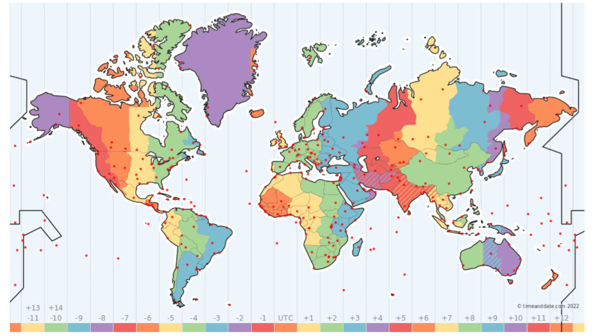
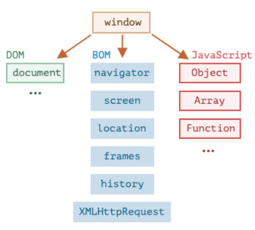
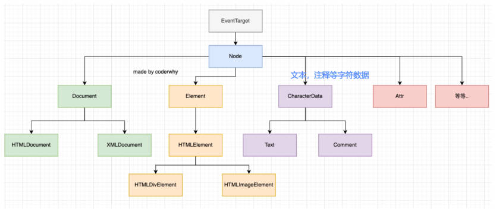

# 数组-高阶函数-Date-DOM

## 一、数组

### 1.数组的 length 属性

数组的 `length` 属性，用于获取数组的长度，当修改数组时，`length` 属性会自动更新，

`length` 属性是可写的。

- 如果我们手动增加一个大于默认 length 的数值，那么会增加数组的长度。
- 但是如果我们减少它，数组就会被截断

```javascript
var arr = ['abc', 'cba', 'nba']

arr.push('mba') // arr.length 更新为 4

arr.length = 10 // arr.length 扩充到 10

arr.length = 2 // arr length 缩小到 2，数组截取了前两个元素。
```

清空数组最简单的方法：`arr.length = 0`

### 2.数组遍历

普通 for 循环遍历：

```javaScript
for (var i = 0; i < arr.length; i++) {
  console.log(arr[i])
}
```

for..in 遍历，获取到索引值：

```javaScript
for (var i in arr) {
  console.log(i, arr[i])
}
```

for..of 遍历，获取到每一个元素：

```javaScript
for (var item of arr) {
  console.log(item)
}
```

### 3.数组实例方法

#### 1.数组的基本操作

[Array.prototype.slice()](https://developer.mozilla.org/zh-CN/docs/Web/JavaScript/Reference/Global_Objects/Array/slice) `arr.slice([begin[, end]])`：返回一个新数组，用于对数组进行截取，包含 bigin 元素，但是不包含 end 元素；

```javascript
var arr1 = ['abc', 'cba', 'nba']

var arr2 = arr1.slice(1, 2)

console.log(arr2) // ['cba']
```

[Array.prototype.concat()](https://developer.mozilla.org/zh-CN/docs/Web/JavaScript/Reference/Global_Objects/Array/concat) `arr.concat(value1[, value2[, ...[, valueN]]])`：创建一个新数组，其中包含来自于其他数组和其他项的值。

`concat` 方法和 `push` 方法有何区别？

- `push` 方法会修改原数组；`conca` 方法（纯函数）不会修改数组。
- `push` 方法会将参数中的数组，作为一个元素，加入到调用方法的数组对象末尾。

```javascript
var arr1 = ['abc']

var arr2 = arr1.concat(['123', '321'])

console.log(arr2) // [ 'abc', '123', '321' ]

arr2.push(['456', '654'])

console.log(arr2) //[ 'abc', '123', '321', [ '456', '654' ] ]
```

[Array.prototype.join()](https://developer.mozilla.org/zh-CN/docs/Web/JavaScript/Reference/Global_Objects/Array/join) `arr.join([separator])`： 将一个数组的所有元素连接成一个字符串并返回这个字符串。

```javascript
const elements = ['Fire', 'Air', 'Water'];

console.log(elements.join()); // "Fire,Air,Water"
```

#### 2.数组元素的查找

数组的 3 个查找元素的方法

[Array.prototype.indexOf()](https://developer.mozilla.org/zh-CN/docs/Web/JavaScript/Reference/Global_Objects/Array/indexOf) `arr.indexOf(searchElement[, fromIndex])` 查找某个元素的索引（**多用于查找原始类型，查找引用类型有局限性**）。

- 从 `fromIndex` 开始查找，如果找到返回对应的索引，没有找到返回 -1；
- 也有对应的从最后位置开始查找的 `lastIndexOf` 方法。

```javascript
const beasts = ['ant', 'bison', 'camel', 'duck', 'bison'];

console.log(beasts.indexOf('bison')); // 1
```

[Array.prototype.includes()](https://developer.mozilla.org/zh-CN/docs/Web/JavaScript/Reference/Global_Objects/Array/includes) `arr.includes(valueToFind[, fromIndex])` 判断数组是否包含某个元素（**多用于查找原始类型，查找引用类型有局限性**）。

- 从索引 `fromIndex` 开始搜索 item，如果找到则返回 true（如果没找到，则返回 false）。

```javascript
const array1 = [1, 2, 3];

console.log(array1.includes(2)); // true
```

[Array.prototype.find()](https://developer.mozilla.org/zh-CN/docs/Web/JavaScript/Reference/Global_Objects/Array/find) `arr.find(callback(currentValue [, index [, array]])[, thisArg])` 查找元素（ES6 之后新增的语法）

```javascript
const array1 = [5, 12, 8, 130, 44];

const found = array1.find((element) => element > 10);

console.log(found); // 12
```

[Array.prototype.findIndex()](https://developer.mozilla.org/zh-CN/docs/Web/JavaScript/Reference/Global_Objects/Array/findIndex) `arr.findIndex(callback(currentValue [, index [, array]])[, thisArg])` 查找元素的索引（ES6 之后新增的语法）

```javascript
const array1 = [5, 12, 8, 130, 44];

const isLargeNumber = (element) => element > 13;

console.log(array1.findIndex(isLargeNumber)); // 3
```

#### 3.数组的排序

数组的 2 个排序函数。

[Array.prototype.sort()](https://developer.mozilla.org/zh-CN/docs/Web/JavaScript/Reference/Global_Objects/Array/sort) `arr.sort([compareFunction])` 是一个高阶函数，用于对数组进行排序，并且生成一个排序后的新数组：

- 如果 `compareFunction(a, b) < 0` ，a 排 b 前；
- 如果 `compareFunction(a, b) = 0` ，a 和 b 的相对位置不变；
- 如果 `compareFunction(a, b) > 0` ，b 排 a 前；

也就是说，`compareFunction(a, b)` 函数中。

- 运算 `a - b` ，那么小在前（升序）排列。
- 运算 `b - a` ，那么大在前（降序）排列。

```javascript
var students = [
  { id: 100, name: 'zzt', age: 18 },
  { id: 101, name: 'kobe', age: 30 },
  { id: 102, name: 'james', age: 25 },
  { id: 103, name: 'curry', age: 22 }
]

// 按照年龄，升序排列。
students.sort((a, b) => a.age - b.age)
```

[Array.prototype.reverse()](https://developer.mozilla.org/zh-CN/docs/Web/JavaScript/Reference/Global_Objects/Array/reverse) `arr.reverse()` 将数组中元素的位置颠倒，并返回该数组。

```javascript
const array1 = ['one', 'two', 'three'];

const reversed = array1.reverse();

console.log('reversed:', reversed); // ["three", "two", "one"]
```

> 了解常用的排序算法。
>
> - 冒泡排序、插入排序、选择排序、堆排序、希尔排序、快速排序等。

#### 4.数组的一些高阶函数

[Array.prototype.forEach()](https://developer.mozilla.org/zh-CN/docs/Web/JavaScript/Reference/Global_Objects/Array/forEach) `arr.forEach(callback(currentValue [, index [, array]])[, thisArg])` 遍历数组，并且让数组中每一个元素，都执行一次对应的方法，传入第二个参数，用于绑定 `this`；

```javascript
const array1 = ['a', 'b', 'c'];

array1.forEach((element) => console.log(element));
```

[Array.prototype.map()](https://developer.mozilla.org/zh-CN/docs/Web/JavaScript/Reference/Global_Objects/Array/map) `arr.map(callback(currentValue[, index[, array]])[, thisArg])`

- 会创建一个新数组。
- 这个新数组，由原数组中的每个元素都调用一次提供的函数后的返回值组成；

```javascript
const array1 = [1, 4, 9, 16];

const map1 = array1.map((x) => x * 2);

console.log(map1); // [2, 8, 18, 32]
```

[Array.prototype.filter()](https://developer.mozilla.org/zh-CN/docs/Web/JavaScript/Reference/Global_Objects/Array/filter) `arr.filter(callback(element[, index[, array]])[, thisArg])`

- 会返回一个新数组；
- 这个数组中，只包含每个元素调用函数返回为 true 的元素；

```javascript
const words = ['spray', 'elite', 'exuberant', 'destruction', 'present'];

const result = words.filter((word) => word.length > 6);

console.log(result); // ["exuberant", "destruction", "present"]
```

[Array.prototype.reduce()](https://developer.mozilla.org/zh-CN/docs/Web/JavaScript/Reference/Global_Objects/Array/reduce) `arr.reduce(callback(accumulation, currentValue[, currentIndex[, array]])[, initialValue])`

- 每一次运行 reducer 会将先前元素的计算结果作为参数传入；
- 最后将其结果汇总为单个返回值；

```javascript
var products = [
  { name: '鼠标', price: 88, count: 3 },
  { name: '键盘', price: 200, count: 2 },
  { name: '耳机', price: 9.9, count: 10 }
]

var totalPrice = products.reduce((accumulation, item) => accumulation + item.price * item.count, 0)
```

综合案例练习。

过滤所有的偶数，映射所有偶数的平方，并且计算他们的和。

```javascript
var total = nums
  .filter(item => item % 2 === 0)
  .map(item => item ** 2)
  .reduce((accumulate, item) => accumulate + item, 0)
```

#### 5.手写 forEach 方法

```javascript
Array.prototype.ztForEach = function (fn, thisArgs) {
  for (var i = 0; i < this.length; i++) {
    fn(this[i], i, this)
  }
}
```

#### 6.手写 find 方法

```javascript
Array.prototype.ztFind = function (fn) {
  for (var i = 0; i < this.length; i++) {
    var isFlag = fn(this[i], i, this)
    if (isFlag) return this[i]
  }
}
```

## 二、Date

### 1.GMT

GMT（Greenwich Mean Time），表示英国伦敦的皇家格林威治（ Greenwich ）天文台的标准时间（刚好在本初子午线经过的地方）。

GMT 东时区和西时区的表示方式：

- 往东的时区（GMT+hh:mm）；
- 往西的时区（GMT-hh:mm）。

适用场景：GMT 主要用于表示的是某个时区中的时间。

了解时区对比图。



### 2.UTC

地球公转有一定的误差，也会造成 GMT 的时间有一定的误差

于是，就提出了根据“原子钟”计算的标准时间 **UTC（Coordinated Universal Time）**

适用场景：UTC 用于表示标准的时间。

### 3.RFC2822 和 ISO8601

日期的表示标准，有 2 种:

- **RFC2822**，表现形式为  `Sat Jun 04 2022 21:12:33 GMT+0800`；

- **ISO8601**，Date 对象实力使用  `toISOString()`，可转为 ISO 格式，表现形式为  `2022-06-04T13:12:03.999Z`；格式常表示为：YYYY-MM-DDTHH:mm:ss.sssZ
  - `YYYY`：年份，0000 ~ 9999
  - `MM`：月份，01 ~ 12
  - `DD`：日，01 ~ 31
  - `T`：分隔日期和时间，没有特殊含义，可以省略
  - `HH`：小时，00 ~ 24
  - `mm`：分钟，00 ~ 59
  - `ss`：秒，00 ~ 59
  - `.sss`：毫秒
  - `Z`：时区

### 4.Date 构造函数（类）创建对象

使用 Date 构造函数（类）创建对象，有 4 种方式：

```javascript
new Date();

new Date(timestamp); // timestamp - 时间戳(ms)

new Date(dateString); // dateString - 符合 RFC2822 或 ISO8601 标准的字符串，如 '2036-10-19'

new Date(year, monthIndex [, day [, hours [, minutes [, seconds [, milliseconds]]]]]);
```

### 5.Date 实例方法

Date 类（构造函数）的一些实例方法，用于获取 date 信息。

- [Date.prototype.getFullYear()](https://developer.mozilla.org/zh-CN/docs/Web/JavaScript/Reference/Global_Objects/Date/getFullYear) `getFullYear()`：获取年份（4 位数）；
- [Date.prototype.getMonth()](https://developer.mozilla.org/zh-CN/docs/Web/JavaScript/Reference/Global_Objects/Date/getMonth) `getMonth()`：获取**月份索引**，**从 0 到 11**；
- [Date.prototype.getDate()](https://developer.mozilla.org/zh-CN/docs/Web/JavaScript/Reference/Global_Objects/Date/getDate) `getDate()`：获取当月的具体日期，从 1 到 31（方法名字有点迷）；
- [Date.prototype.getHours()](https://developer.mozilla.org/zh-CN/docs/Web/JavaScript/Reference/Global_Objects/Date/getHours) `getHours()`：获取小时；
- [Date.prototype.getMinutes()](https://developer.mozilla.org/zh-CN/docs/Web/JavaScript/Reference/Global_Objects/Date/getMinutes) `getMinutes()`：获取分钟；
- [Date.prototype.getSeconds()](https://developer.mozilla.org/zh-CN/docs/Web/JavaScript/Reference/Global_Objects/Date/getSeconds) `getSeconds()`：获取秒钟；
- [Date.prototype.getMilliseconds()](https://developer.mozilla.org/zh-CN/docs/Web/JavaScript/Reference/Global_Objects/Date/getMilliseconds) `getMilliseconds()`：获取毫秒；
- [Date.prototype.getDay()](https://developer.mozilla.org/zh-CN/docs/Web/JavaScript/Reference/Global_Objects/Date/getDay) `getDay()`：获取一周中的第几天，从 0（星期日）到 6（星期六）；

Date 类（构造函数）的一些实例方法，用于获设置 date 信息。

- [Date.prototype.setFullYear()](https://developer.mozilla.org/zh-CN/docs/Web/JavaScript/Reference/Global_Objects/Date/setFullYear) `setFullYear(year, [month], [date])`
- [Date.prototype.setMonth()](https://developer.mozilla.org/zh-CN/docs/Web/JavaScript/Reference/Global_Objects/Date/setMonth) `setMonth(month, [date])`
- [Date.prototype.setDate()](https://developer.mozilla.org/zh-CN/docs/Web/JavaScript/Reference/Global_Objects/Date/setDate) `setDate(date)`
- [Date.prototype.setHours()](https://developer.mozilla.org/zh-CN/docs/Web/JavaScript/Reference/Global_Objects/Date/setHours) `setHours(hour, [min], [sec], [ms])`
- [Date.prototype.setMinutes()](https://developer.mozilla.org/zh-CN/docs/Web/JavaScript/Reference/Global_Objects/Date/setMinutes) `setMinutes(min, [sec], [ms])`
- [Date.prototype.setSeconds()](https://developer.mozilla.org/zh-CN/docs/Web/JavaScript/Reference/Global_Objects/Date/setSeconds) `setSeconds(sec, [ms])`
- [Date.prototype.setMilliseconds()](https://developer.mozilla.org/zh-CN/docs/Web/JavaScript/Reference/Global_Objects/Date/setMilliseconds) `setMilliseconds(ms)`
- [Date.prototype.setTime()](https://developer.mozilla.org/zh-CN/docs/Web/JavaScript/Reference/Global_Objects/Date/setTime) `setTime(milliseconds)`：传入时间戳

上面的实例方法，拥有时间的自动校准机制：比如：`date.setDate(32)`，会校准为下个月 1 号。

### 7.Unix 时间戳

时间戳是一个整数值，表示自 1970 年 1 月 1 日 00:00:00 UTC 以来的毫秒数。

#### 1.Data 实例方法

利用 Date 的实例方法，获取**当前时间**的时间戳的方式 3 种。

- [Date.prototype.getTime()](https://developer.mozilla.org/zh-CN/docs/Web/JavaScript/Reference/Global_Objects/Date/getTime)，获取**当前时间**的 Unix 时间戳的。
- [Date.prototype.valueOf()](https://developer.mozilla.org/zh-CN/docs/Web/JavaScript/Reference/Global_Objects/Date/valueOf)，获取**当前时间**的 Unix 时间戳的。

```javascript
new Date().getTime()

new Date().valueOf()
```

> 还有一种获取当前时间 Unix 时间戳的方式：
>
> ```javascript
> + new Date() // 将 Date 对象拼接 + 号组成表达式。返回时间戳
> ```

#### 2.Date 静态方法

利用 Date 的静态方法，获取**当前时间**的时间戳的方式 1 种。

- [Date.now()](https://developer.mozilla.org/zh-CN/docs/Web/JavaScript/Reference/Global_Objects/Date/now)，获取**当前时间**的 Unix 时间戳的。
- [Date.parse()](https://developer.mozilla.org/zh-CN/docs/Web/JavaScript/Reference/Global_Objects/Date/parse)，用于从一个字符串中，读取日期，并且输出对应的 Unix 时间戳。作用等同于 `new Date(dateString).getTime()` 操作；
  - 传入的字符串，需要符合 **RFC2822** 或 **ISO8601** 日期格式。
  - 比如 `YYYY-MM-DDTHH:mm:ss.sssZ`。其他格式也许也支持，但结果不能保证一定正常；如果输入的格式不能被解析，那么会返回 `NaN`；

```javascript
Date.now()
```

用时间戳来测试代码性能：

```javascript
function testPerformance(fn) {
  var startTime = Date.now()
  fn()
  var endTime = Date.now()
  console.log('耗时', endTime - startTime, 'ms')
}
```

## 三、DOM

前面我们花了很多时间学习 JavaScript 的基本语法，但是这些基本语法，好像和做网页没有什么关系，和前面学习的 HTML、CSS 也没有什么关系？

- 这是因为我们前面学习的部分属于 ECMAScript，也就是 JavaScript 本身的语法部分；
- 除了语法部分之外，我们还需要学习浏览器提供给我们开发者的 DOM、BOM 相关的 API，才能对页面、浏览器进行操作；

### 1.window 对象

前面我们学习了一个 window 全局对象，事实上，它就包含了这些内容：

- 我们已经学习了 JavaScript 语法部分的 Object、Array、Date 等等；
- 另外还有 DOM、BOM 部分；



### 2.BOM

BOM：浏览器对象模型（Browser Object Model）由浏览器提供的用于处理文档（document）之外的所有内容的对象；

- 比如 navigator、location、history 等对象；

### 3.DOM

浏览器会对我们编写的 HTML、CSS 进行渲染，同时它又要考虑我们可能会通过 JavaScript，来对其进行操作：

- 于是浏览器将我们编写在 HTML 中的每一个元素（Element）都抽象成了一个个对象；
- 所有这些对象，都可以通过 JavaScript 来对其进行访问，那么我们就可以通过 JavaScript 来操作页面；
- 所以，我们将这个抽象过程，称之为**文档对象模型（Document Object Model）**；

整个文档被抽象到 **document 对象**中：

- 比如 `document.documentElement` 对应的是  html 元素；
- 比如 `document.body` 对应的是 body 元素；
- 比如 `document.head` 对应的是 head 元素；

下面的一行代码可以让整个页面变成红色：

```javascript
document.body.style.backgroundColor = "red"
```

所以我们学习 DOM，就是在学习如何通过 JavaScript 对文档进行操作的；

DOM 是 JavaScript 与 HTML 页面中元素的桥梁。

#### 1.DOM Tree

一个页面不只是有 html、head、body 元素，也包括很多的子元素：

- 在 html 结构中，最终会形成一个树结构；
- 在抽象成 DOM 对象的时候，它们也会形成一个树结构，我们称之为 DOM Tree；

#### 2.DOM 知识点梳理

DOM 知识点学习顺序。

1. DOM 元素之间的关系；
2. 获取 DOM 元素；
3. DOM 节点的 `type`、`tag`、`content` 属性；
4. DOM 节点的 `attributes`、`properies` 属性；
5. DOM 节点的创建、插入、克隆、删除
6. DOM 节点的样式、类
7. DOM 元素 / window 的大小、滚动、坐标

#### 3.document 对象

Document 节点表示的整个载入的网页，它的实例是全局的 document 对象：

- 对 DOM 的所有操作都是从 document 对象开始的；
- 它是 DOM 的 入口，可以从 document 开始去访问任何节点元素；

对于最顶层的 html、head、body 元素，我们可以直接在 document 对象中获取到：

使用 `document` 对象获取  html 元素，body 元素，head 元素。

```javascript
document.documentElement // html 元素

document.body

document.head

document.doctype // 文档声明 <!DOCTYPE html>
```

#### 4.DOM 继承关系



-
