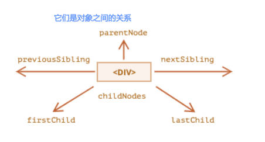
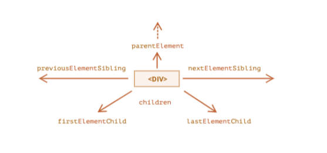
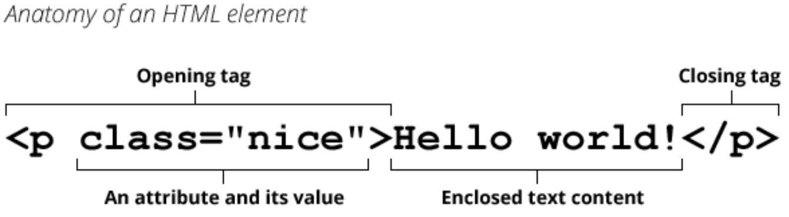

# DOM 基本使用（一）

document 对象中，有两个概念：**节点（Node）**和**元素（Element）**，

- 节点（Node）中包含了**元素，文本，注释**等内容。
- 元素（Element）指的是 **HTML 中的元素**。

## 一、节点操作一

### 1.节点导航

节点（Node）之间的导航（navigator），指的是：获取到一个节点（Node）对象后，根据这个节点对象，去获取其他的节点对象。

节点之间存在如下的关系（api）：

- 父节点：`parentNode`
- 前兄弟节点：`previousSibling`
- 后兄弟节点：`nextSibling`
- 所有子节点：`childNodes`
- 第一个子节点：`firstChild`
- 最后一个子节点：`lastChild`

它们之间是对象的关系。

```javascript
var bodyEl = document.body

var bodyElFirstChild = bodyEl.firstChild // 获取 body 下第一个节点（Node）对象
```

理解图片。



## 二、元素操作一

### 1. 元素导航

元素（Element）之间的导航（navigator），指的是：获取到一个元素（Element）对象后，根据这个元素获取其他的元素对象。

元素之间存在如下关系（api）：

- 父元素：`parentElement`
- 前兄弟节点：`previousElementSibling`
- 后兄弟节点：`nextElementSibling`
- 子节点：`children` 返回一个 array-like 对象。
- 第一个子节点：`firstElementChild`
- 最后一个子节点：`lastElementChild`

```javascript
var bodyEl = document.body

var childElements = bodyEl.children // 获取 body 元素所有子元素(element)对象。
```

理解图片。



> vue，react 前端框架，底层也要操作 DOM，因为在这两个框架中通过虚拟 DOM（Virtual DOM）来优化这个过程，从而减少直接的 DOM 操作和回流（reflow）。通过虚拟 DOM，Vue 和 React 将多个 DOM 操作合并为一次批量更新，从而减少回流的次数。

#### 1.table 元素导航

HTML 中的表格（table）元素的导航（navigator）关系如下：

table 元素支持以下属性：

- `table.rows`，表示 tr 元素的集合；
- `table.caption/tHead/tFoot`，表示引用元素 caption，thead，tfoot；
- `table.tBodies`，表示 tbody 元素的集合，table 中可能有多个 tbody；

thead，tfoot，tbody 元素提供了 `rows` 属性

- 比如：`tbody.rows`，表示表格内部 tr 元素的集合；

tr

- `tr.cells`，表示在给定 tr 中的 td 和 th 单元格的集合；
- `tr.sectionRowIndex`，表示给定的 tr 在封闭的 thead/tbody/tfoot 中的位置（索引）；
- `tr.rowIndex`，表示在整个表格中 tr 的编号（包括表格的所有行）；

td 和 th：

- `td.cellIndex`，表示在封闭的 tr 中单元格的编号。

完成案例练习。

```html
<!DOCTYPE html>
<html lang="en">
  <head>
    <meta charset="UTF-8" />
    <meta name="viewport" content="width=device-width, initial-scale=1.0" />
    <title>九九乘法表</title>
    <style>
      table {
        border-collapse: collapse;
      }
      td {
        border: 1px #000 solid;
        padding: 8px 16px;
      }
    </style>
  </head>
  <body>
    <table>
      <tr>
        <td>哈哈</td>
        <td>哈哈</td>
        <td>哈哈</td>
      </tr>
      <tr>
        <td>哈哈</td>
        <td>哈哈</td>
        <td>哈哈</td>
      </tr>
      <tr>
        <td>哈哈</td>
        <td>哈哈</td>
        <td>哈哈</td>
      </tr>
    </table>

    <script>
      var tableEl = document.body.firstElementChild // body 元素的第一个子元素，是一个表格

      for (var i = 0; i < tableEl.rows.length; i++) {
        var rowEl = tableEl.rows[i]
        var cellEl = rowEl.cells[i]

        cellEl.style.backgroundColor = 'red'
        cellEl.style.color = 'white'
      }
    </script>
  </body>
</html>
```

> 在 VSCode 编辑工具中，利用 TypeScript 断言语法，增强提示功能（运行 JavaScript 代码时，要将它删除）。
>
> ```javascript
> var tableEl = document.body.firstElementChild as HTMLTableElement
>
> tableEl.rows // 有提示
> ```

#### 2.form 元素导航

表单（form）元素的导航（navigator）关系如下：

```html
<form action="">
  <input name="account" type="text" />
</form>
```

form 元素可以直接通过 `document` 对象的 `forms` 属性，来获取

- 比如：`document.forms`

```javascript
var formEl = document.forms[0]
```

form 元素中的子元素对象集合，可以通过 form 元数对象的 `elements` 属性，来获取。

- 比如：`form.elements`

```javascript
var elements = formEl.elements
```

form 子元素对象集合中的子元素对象，可以通过子元素的 name 属性来获取。

- 比如：`elements.[name]`

```javascript
var inputEl = elements.account
```

## 二、节点操作二

### 1.节点搜索

当元素彼此靠近或者相邻时，DOM 导航属性（navigation property）非常有用。

然而，在实际开发中，我们希望可以任意的获取到某一个元素对象，应该如何操作呢？

DOM  （document 对象）中，为我们提供了获取元素的方法：

| 方法名                         | 搜索方式     | 在元素上调用（查找该元素后代） | 返回的对象是实时的 |
| ------------------------------ | ------------ | ------------------------------ | ------------------ |
| querySelector                  | CSS-selector | ✔                              | ❌                 |
| querySelectorAll               | CSS-selector | ✔                              | ❌                 |
| getElementById（偶尔用）       | id           | ❌                             | ❌                 |
| getElementsByName（不常用）    | name         | ❌                             | ✔                  |
| getElementsByTagName（偶尔用） | tag or \*    | ✔                              | ✔                  |
| getElementsByClassName         | class        | ✔                              | ✔                  |

`querySelectorAll` 方法，返回的是 NodeList 对象，它不是一个数组，而是一个 array-like 对象，可用 `forEach` 方法进行遍历。

`getElementById` 方法，偶尔会使用，通常用于适配一些低版本浏览器时；

```html
<!DOCTYPE html>
<html lang="en">
<head>
  <meta charset="UTF-8">
  <meta name="viewport" content="width=device-width, initial-scale=1.0">
  <title>demo</title>
</head>
<body>
  <div id="haha">哈哈</div>

  <script>
    var hahaEl1 = document.getElementById('haha')
    var hahaEl2 = document.querySelector('#haha')

    console.log(hahaEl1 === hahaEl2) // true
  </script>
</body>
</html>
```

节点导航和节点搜索，在实际开发中应如何选择？

- 当元素彼此靠近或相邻时，并需要拿一组元素对象集合时，选择导航的方式。
- 当需要任意的精确的获取某一个元素对象，通常使用 `document` 对象上，搜索元素的 5 种方法。

### 2.节点属性

现在，我们已经可以获取到节点对象了，接下来看一下节点中有哪些常见的属性：

当然，不同的节点类型，有不同的属性；

这里我们主要讨论节点共有的属性；

#### 1.nodeType

节点（Node）的 `nodeType` 属性，用于获取节点的类型；它有一个数值型值（numeric value）；

| 常量                    | 值   | 描述                                                         |
| ----------------------- | ---- | ------------------------------------------------------------ |
| Node.ELEMENT_NODE       | 1    | 一个元素节点，例如 \<p\> 和 \<div\>                          |
| Node.TEXT_NODE          | 3    | Element 或者 Attr 中实际的文字                               |
| Node.COMMENT_NODE       | 8    | 一个 Comment 节点.                                           |
| Node.DOCUMENT_NODE      | 9    | 一个 Document 节点。                                         |
| Node.DOCUMENT_TYPE_NODE | 10   | 描述文档类型的 DocumentType 节点。例如 `<!DOCTYPEhtml>` 就是用于 HTML5 的文档声明。 |

#### 2.nodeName、tagName

节点（Node）有属性 `nodeName` 和 `tagName`

- `tagName`，用于获取元素的标签名，该属性仅适用于元素（Element）节点，获取元素的标签名。
- `nodeName`，用于获取节点的名字，是为任意 Node 节点定义的。
  - 对于元素，该属性的意义与 `tagName` 属性相同，所以使用哪一个都是可以的；
  - 对于其他节点类型（比如：文本，注释...），它拥有一个对应节点类型的字符串；

#### 3.innerHTML

节点（Node）有属性 `innerHTML`，它用于：

- 将元素中的 HTML 获取为字符串形式；
- 也可设置元素中的内容；

#### 4.outerHTML

节点（Node）有属性 `outerHTML`，它用于：

- 包含了元素的完整 HTML 字符串。
- 相当于 `innerHTML` 属性值，再加上元素本身；

#### 5.textContent

节点（Node）有属性 `textContent`，它用于：

- 获取元素中的文本内容；

`innerHTML` 属性和 `textContent` 属性有何区别：

- 使用 innerHTML 设值时，将值“作为 HTML 代码”插入到节点中，可以解析 HTML 标签。
- 使用 textContent 设值时，将值“作为文本”插入到节点中，所有符号（symbol）均按字面意义处理。

```javascript
divNode.innerHTML = '<h2>呵呵呵呵</h2>'

divNode.textContent = '<h2>嘿嘿嘿嘿</h2>'
```

#### 6.nodevalue、data

节点（Node）的属性 `data` 属性，与 `nodeValue` 属性效果一样，

用于获取非元素（Element）节点的数据。

```html
<!DOCTYPE html>
<html lang="en">
  <head>
    <meta charset="UTF-8" />
    <meta name="viewport" content="width=device-width, initial-scale=1.0" />
    <title>demo</title>
  </head>
  <body>
    <!-- 我是注释~ -->

    <script>
      var textNode = document.body.firstChild
      console.log('textNode value:', textNode.nodeValue) // ""

      var commentNode = textNode.nextSibling
      console.log('commentNode value:', commentNode.nodeValue) // 我是注释~
    </script>
  </body>
</html>
```

#### 7.hidden

节点（Node）有属性 `hidden`，同时也是 HTML 元素的全局属性（attribute）（布尔类型）。

```html
<!DOCTYPE html>
<html lang="en">
  <head>
    <meta charset="UTF-8" />
    <meta name="viewport" content="width=device-width, initial-scale=1.0" />
    <title>demo</title>
  </head>
  <body>
    <div id="box">哈哈哈哈哈</div>
    <button class="btn">切换</button>

    <script>
      // 1.获取元素
      var boxEl = document.querySelector('#box')
      var btnEl = document.querySelector('.btn')

      // 2.监听btn的点击
      btnEl.onclick = function () {
        boxEl.hidden = !boxEl.hidden
      }
    </script>
  </body>
</html>
```

## 三、元素操作二

### 1.元素属性

前面我们已经学习了如何获取节点，以及节点通常所包含的属性，接下来我们来仔细研究元素（Element）。

我们知道，一个元素除了有开始标签、结束标签、内容之外，还有很多的属性（attribute）。



常见的元素属性有：

- value 属性：
  - 一些表单元素有 value 属性，比如：input、select、textarea （HTMLInputElement，HTMLSelectElement……）
  - 用于获取这些表单元素的 value 值。

- href 属性：
  - 用于获取、设置 a 元素（HTMLAnchorElement）的 href 属性。

  ```html
  <!DOCTYPE html>
  <html lang="en">
    <head>
      <meta charset="UTF-8" />
      <meta name="viewport" content="width=device-width, initial-scale=1.0" />
      <title>demo</title>
    </head>
    <body>
      <a href="https://www.baidu.com">百度一下</a>

      <script>
        var aEl = document.querySelector('a')

        aEl.href = 'https://www.google.com'

        console.log('aEl.href:', aEl.href) // https://www.google.com/
      </script>
    </body>
  </html>

  ```

- id 属性
  - 用于获取、设值 html 所有元素（HTMLElement）的 “id”  属性（attribute）的值。

#### 1.元素属性（attribute）分类

浏览器在解析 HTML 元素时，会将元素的属性（attribute）也创建出来，放到对应的元素（Element）对象上。

- 比如 `id`、`class` 就是 HTML 元素的全局的属性（attribute），那么元素（Element）对象上，也会有对应的 `id`、`class` 属性；
- 比如 `href` 属性是针对 a 元素对象的，`type`、`value` 属性，是针对 input 元素的；

HTML 元素上的属性（attribute）可分为 2 类。

- **标准的 attribute**：某些 attribute 属性是标准的，比如 id、class、title、href、type、value 等；
- **非标准的 attribute**：某些 attribute 属性是自定义的，比如 abc、age、height 等；

```html
<div id="abc" class="box" title="box" age="18" height="1.88">哈哈哈</div>
```

上面代码中，div 元素上的

- id、class、title 属性（attribute）是标准属性；
- age、name 属性（attribute）是非标准属性。

#### 2.元素属性（attribute）操作

元素（Element）对象所有的属性（attribute）（标准和非标准） 都有的操作：

- `ele.hasAttribute(name)` 方法，检查属性是否存在。
- `ele.getAttribute(name)` 方法，获取这个属性值。
- `ele.setAttribute(name, value)` 方法，设置这个属性值。
- `ele.removeAttribute(name)` 方法，移除这个属性。
- `ele.attributes` 属性，attr 对象的集合，每个对象具有 `name`、`value` 属性；

```html
<!DOCTYPE html>
<html lang="en">
  <head>
    <meta charset="UTF-8" />
    <meta name="viewport" content="width=device-width, initial-scale=1.0" />
    <title>demo</title>
  </head>
  <body>
    <div id="abc" class="box" title="box" age="18" height="1.88">
      我是box
    </div>
    <input type="checkbox" checked />

    <script>
      var boxEl = document.querySelector('.box')
      // 1.所有的attribute都支持的操作
      console.log(boxEl.hasAttribute('AGE')) // true
      console.log(boxEl.hasAttribute('abc')) // false

      console.log(boxEl.getAttribute('AGE')) // 18
      console.log(boxEl.getAttribute('abc')) // null

      boxEl.setAttribute('id', 'cba')) // undefined
      boxEl.removeAttribute('id') // undefined

      console.log('------------------------------------------')

      var boxAttributes = boxEl.attributes
      for (var attr of boxAttributes) {
        console.log(attr.name, attr.value)
        // 输出结果：
        // class box
        // title box
        // age 18
        // height 1.88
      }

      console.log('------------------------------------------')

      // 2.getAttribute() 返回的是字符串类型
      var inputEl = document.querySelector('input')
      console.log(inputEl.getAttribute('checked')) // “”
    </script>
  </body>
</html>
```

#### 3.元素属性（attribute）特性

元素（Element）的属性（attribute）具备 2 点特性。

- 它们的名字是大小写不敏感的（”id“与”ID“相同）。
- 它们的值总是字符串类型的。

> 对于布尔类型的属性（attribute），比如 `checked`、`disabled`，取到的是空字符串，
>
> 如果要拿到显示的布尔值，要给元素（Element）对象的布尔类型属性（Attribute）显示的赋值。

### 2.元素对象属性（property）

JavaScript 中，对象上的属性称为“property”

所以 HTML 元素上的属性（attribute）在 DOM 对象上会抽象出同名的属性（property）。

- **标准的 attribute**，会在元素的 DOM 对象上，创建与其对应的 property 属性
- **非标准的 attribute**，则不会在元素的 DOM 对象上，创建与其对应的 property 属性。

```html
<!DOCTYPE html>
<html lang="en">
  <head>
    <meta charset="UTF-8" />
    <meta name="viewport" content="width=device-width, initial-scale=1.0" />
    <title>demo</title>
  </head>
  <body>
    <div id="abc" class="box" title="box" age="18" height="1.88">
      我是box
    </div>
    <input type="checkbox" checked />

    <script>
      var boxEl = document.querySelector('.box')
      console.log('boxEl.id:', boxEl.id) // abc
      console.log('boxEl.title:', boxEl.title) // box

      console.log('boxEl.age:', boxEl.age) // undefined
      console.log('boxEl.height:', boxEl.height) // undefined
    </script>
  </body>
</html>
```

#### 1.元素属性（attribute）和元素对象属性（property）

对于元素上标准的属性（attribute），DOM 对象上会创建与其对应的 property 属性：

在大多数情况下，它们是相互作用的

- 在 DOM 对象上改变属性（property）的值，那么通过元素属性（attribute）操作，获取的元素属性值，也会随着改变；
- 通过元素属性（attribute）操作修改元素属性值，那么在 DOM 对象上使用属性（property）获取的值，也会随着改变；

> input 元素的 value 属性，只能通过元素属性（attribute）操作修改；

除非特别情况，大多数情况下，设置、获取元素的属性（attribute）值，推荐使用元素 DOM 对象上的属性（property）的方式：这是因为它默认情况下是有类型的；

```html
<!DOCTYPE html>
<html lang="en">
  <head>
    <meta charset="UTF-8" />
    <meta name="viewport" content="width=device-width, initial-scale=1.0" />
    <title>demo</title>
  </head>
  <body>
    <div id="abc" class="box" title="box" age="18" height="1.88">
      我是box
    </div>
    <input class="ck" type="checkbox" disabled="true" />
    <button class="toggle-btn">切换input选中</button>

    <script>
      const inputEl = document.querySelector('.ck')

      const toggleBtn = document.querySelector('.toggle-btn')
      toggleBtn.onclick = function () {
        inputEl.disabled  = !inputEl.disabled
      }
    </script>
  </body>
</html>
```

#### 2.元素对象属性 className、classList

DOM 中，元素对象上的属性 `className` 和 `classList`，用于表示 HTML 元素上的标准属性（attribute）`class`。

使用 DOM 动态修改元素样式，有两种方法：

方法一：使用 DOM 元素对象上的属性（property）`className`、`classList`，动态修改元素的样式。

首先，在 CSS 中编写好对应的样式。

```css
.active {
  color: red;
  font-size: 24px;
  background-color: green;
}
```

然后，动态的添加 class；

```javascript
var boxEl = document.querySelector('.box')

boxEl.className = 'active' // 不推荐的做法，会覆盖掉原有的 class 名。

boxEl.classList.add('active')
```

方法二：使用 DOM 元素对象上的属性 `style`，直接动态的修改 HTML 元素上的标准属性（attribute）`style` ；

```javascript
var boxEl = document.querySelector('.box')
var counter = 1

boxEl.onclick = function () {
  boxEl.style.width = 100 * counter++ + 'px'
}
```

这两种方法，在开发中如何选择？

- 大多数情况下，优先使用动态修改 class。
- 对于特殊情况，比如要精准修改某个 css 属性的值时，那么就直接修改 style 属性值；

> DOM 元素（Element）对象上的属性（property）`className`，为什么不叫“class”？
>
> - JavaScript 早期是不允许使用 class 这种保留字（现为关键字）来作为对象的属性，所以 DOM 规范使用了"className"；
> - 虽然现在 JavaScript 已经没有这样的限制，但依然在使用"className"这个名称；

DOM 元素（Element）对象的属性（property）`className` 和 `classList` 有何区别：

- 对 `className` 属性进行赋值，那么会整个替换 HTML 元素属性（attribute）class 中的字符串。
- 使用 `classList` 属性，可以添加或者移除  HTML 元素属性（attribute）class 中单个的 class 值。

classList 属性（property）的用法。

- `ele.classList.add(class)` ：添加一个类。
- `ele.classList.remove(class)`：移除一个类。
- `ele.classList.toggle(class)` ：如果类不存在就添加类，存在就移除它。
- `ele.classList.contains(class)`：检查给定类，返回 true / false。

```javascript
var boxEl = document.querySelector('.box')
var btnEl = document.querySelector('.btn')

btnEl.onclick = function () {
  boxEl.classList.toggle('active')
}
```

classList 属性的值，是可迭代对象，可以通过 for...of 进行遍历。

#### 3.元素对象属性 style

元素（Element）对象的属性（property）`style`，用于单独的修改某一个 CSS 属性。

- 对于多词（multi-word）属性，使用驼峰式 camelCase

  ```javascript
  boxEl.style.fontSize = '26px'
  ```

- 设置为空字符串，那么会使用 CSS 的默认样式：

  ```javascript
  boxEl.style.fontSize = '' // 使用默认 fontSize
  ```

- 多个样式的写法，使用 `cssText` 属性（不推荐这种写法，因为它会替换元素原来的行内样式）。

  ```javascript
  boxEl.style.cssText = 'font-size: 30px; color: red;'
  ```

##### 1.getComputedStyle 方法读取元素 style

全局函数 `getComputedStyle` 用于读取元素样式计算值（可获取行内样式以外的样式值）。

```javascript
var boxEl = document.querySelector('.box')

boxEl.style.backgroundColor // 获取行内样式中设值的 background-color

getComputedStyle(boxEl).fontSize // 获取所有样式中 font-size 的计算值。
```

#### 4.元素对象属性 dataset

HTML5 中有 `data-*` 自定义属性（attribute），它可以在 DOM 元素对象属性（property）`dataset` 中获取到。

```html
<body>
  <div id="abc" class="box" data-age="18" data-height="1.88"></div>

  <script>
    var boxEl = document.querySelector('.box')

    // 小程序开发中常使用
    console.log(boxEl.dataset.age)
    console.log(boxEl.dataset.height)
  </script>
</body>
```

`dataset` 元素对象属性，在小程序开发中，使用的非常多。
