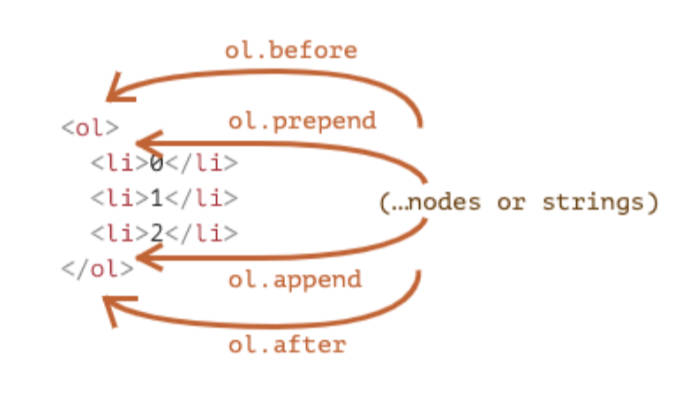
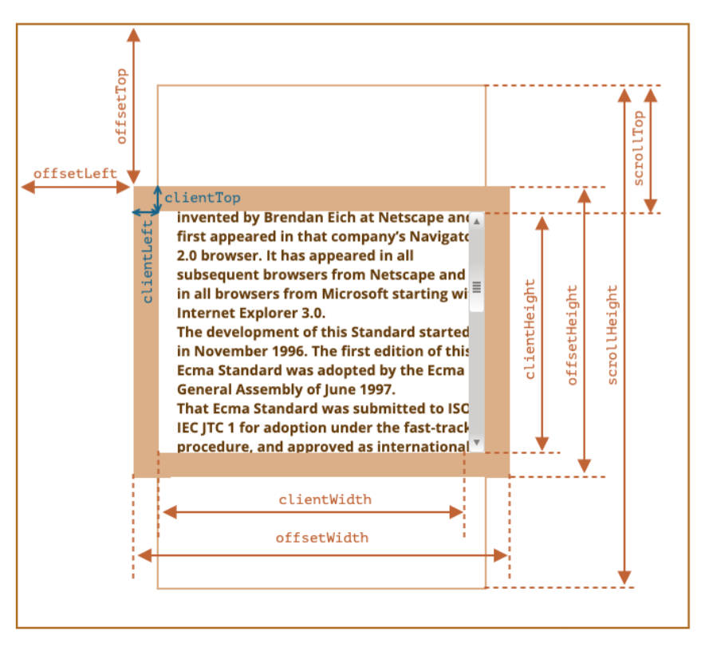
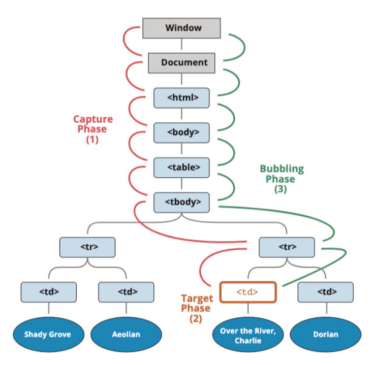

# 元素操作

创建元素不推荐的2个方法。有什么弊端。

- `document.write`，对于复杂的内容、元素关系拼接并不方便。早期没有DOM的时候使用的方案。
- `innerHTML`，增加解析字符串的步骤，插入的对象还要重新获取。

```javascript
var boxEl = document.querySelector(".box")
boxEl.innerHTML = `<h2 class="title">我是标题</h2>`
```

## 插入

插入元素推荐的方法步骤

1. 创建一个元素 `document.createElement(tag)`
2. 插入元素到 DOM 的某一个位置。

-----

插入元素的5个方法，它们有什么作用？

- `node.append(...nodes or strings)` —— 在 node 子元素末尾插入节点，
- `node.prepend(...nodes or strings)` —— 在 node 子元素开头插入节点，
- `node.before(...nodes or strings)` —— 在 node 前面 插入节点，
- `node.after(...nodes or strings)` —— 在 node 后面 插入节点，
- `node.replaceWith(...nodes or strings)` —— 将 node 替换为给定的节点。

```javascript
var boxEl = document.querySelector(".box")
var h2El = document.createElement("h2")
boxEl.append(h2El)
```

理解图片。




-----

了解旧的元素操作方法4个，对应新的方法是什么？
- `parentElem.appendChild(node)` - 在 parentElem 父元素最后位置添加一个子元素
- `parentElem.insertBefore(node, nextSibling)` - 在 parentElem 的nextSibling前面插入一个子元素；
- `parentElem.replaceChild(node, oldChild)` - 在 parentElem 中，新元素替换之前的oldChild元素；
- `parentElem.removeChild(node)` - 在 parentElem 中，移除某一个元素；

-----

## 移除

移除元素的1个方法。

- 调用元素本身的 `remove` 方法。

```javascript
var boxEl = document.querySelector(".box")
var btnEl = document.querySelector(".remove-btn")
btnEl.onclick = function() { // 监听点击，移除元素。
  boxEl.remove()
}
```

-----

## 克隆

克隆元素的1个方法，

- 调用元素本身的 `cloneNode` 方法，传入一个布尔值，决定是否深度克隆（克隆子元素）。

```javascript
var boxEl = document.querySelector(".box")
var newNode = boxEl.cloneNode(true)
```

-----

## 计数器案例

一般将DOM对象放在全局，而不是放在某个回调函数中，提高性能。实现计数器案例。

```javascript
let count = 0
const h2El = document.querySelector(`h2`)
const btnAddEl = document.querySelector(`.add`)
const btnSubEl = document.querySelector(`.sub`)
btnAddEl.onclick = function () {
  h2El.textContent = ++count
}
btnSubEl.onclick = function () {
  h2El.textContent = --count
}
```

-----

## 元素属性

了解元素的大小，滚动对应的属性。

### 大小属性

- `clientWidth`：contentWith+padding（不包含滚动条） 
- `clientHeight`：contentHeight+padding 
- `offsetWidth`：元素完整的宽度
- `offsetHeight`：元素完整的高度 
- `offsetLeft`：距离最近定位元素的x 
- `offsetTop`：距离最近定位元素的y
- `clientTop`：border-top 的宽度 
- `clientLeft`：border-left 的宽度

### 滚动属性

- `scrollHeight`：整个可滚动的区域高度
- `scrollTop`：滚动部分的高度

理解图片



-----

# window

window 对象包含了整个浏览器，但它的事件只能在显示内容区域监听。

```javascript
var boxEl = document.querySelector(".box")
window.onclick = function() {
  console.log(boxEl.scrollTop)
}
```

-----

window 的大小，滚动属性和方法，

## 大小属性

- `innerWidth`、`innerHeight`：获取 window 窗口的宽度和高度（包含滚动条） 
- `outerWidth`、`outerHeight`：获取 window 窗口的整个宽度和高度（包括调试工具、工具栏）
- `documentElement.clientHeight`、`documentElement.clientWidth`：获取 html 的宽度和高度（不包含滚动条）

## 滚动属性

- `scrollX`：X轴滚动的位置（别名pageXOffset） 
- `scrollY`：Y轴滚动的位置（别名pageYOffset）

## 滚动方法

- 方法 `scrollBy(x,y)`：将页面滚动至相对于当前位置的 (x, y) 位置； 
- 方法 `scrollTo(pageX,pageY)`： 将页面滚动至绝对坐标；

## ''回到顶部“案例。

```html
<body>
  <button class="scroll-btn">回到顶部</button>
  <script>
    var scrollBtnEl = document.querySelector(".scroll-btn")
    window.onscroll = function() {
      scrollBtnEl.hidden = window.scrollY < 600
    }
    // 点击按钮后滚动到顶部
    scrollBtnEl.onclick = function() {
      window.scrollTo(0, 0)
    }
  </script>
</body>
```

-----

# 案例练习

## 动态创建列表案例。

```html
<body>
  <h1>动态创建列表</h1>
  <ul class="list"></ul>
  <script>
    var ulEl = document.querySelector(".list")
    var isFlag = true
    while (isFlag) {
      var message = prompt("请输入信息:")
      if (!message) {
        var liEl = document.createElement("li")
        liEl.textContent = message
        ulEl.append(liEl)
      } else {
        isFlag = false // 没有输入内容
      }
    }
  </script>
</body>
```

## 动态显示当前时间案例

```html
<body>
  <h1 class="time">2022-05-19 11:14:30</h1>
  <script>
    /** 封装了工具函数
    * content，要格式化的内容。
    * count，要补全的字符位数。
    * padStr，要补全的字符。
    */
    function padLeft(content, count = 2, padStr = '0') {
      return String(content).padStart(count, padStr)
    }
    // 1.获取时间的元素
    var timeEl = document.querySelector(".time")
    setInterval(function() { // 每隔1s执行一次
      // 2.获取具体的时间并且进行格式化
      var date = new Date()
      var year = date.getFullYear()
      var month = padLeft(date.getMonth() + 1)
      var day = padLeft(date.getDate())
      var hour = padLeft(date.getHours())
      var minute = padLeft(date.getMinutes())
      var second = padLeft(date.getSeconds())
      // 3.将时间放到timeEl中
      timeEl.textContent = `${year}-${month}-${day} ${hour}:${minute}:${second}`
    }, 1000);
  </script>
</body>
```

## 当前时间倒计时功能

```html
<body>
  <div class="countdown">
    <span class="time hour">00</span>
    <span class="split">:</span>
    <span class="time minute">00</span>
    <span class="split">:</span>
    <span class="time second">00</span>
  </div>
  <script>
    // 工具函数
    function padLeft(content, count = 2, padStr = '0') {
      return String(content).padStart(count, padStr)
    }
  </script>
  <script>
    // 1.获取元素
    var hourEl = document.querySelector(".hour")
    var minuteEl = document.querySelector(".minute")
    var secondEl = document.querySelector(".second")
    // 创建一天的结束时间对象（24点）
    var endDate = new Date().setHours(24, 0, 0, 0)
		// 每隔1分钟，计算结束时间 - 当前时间
    setInterval(function() {
      var nowDate = new Date()
      var intervalTime = Math.floor((endDate.getTime() - nowDate.getTime()) / 1000) // 结束时间 - 当前时间，获取间隔秒钟
      var hour = Math.floor(intervalTime / 3600) // 获取间隔小时
      var minute = Math.floor(intervalTime / 60) % 60 // 获取间隔分钟
      var second = intervalTime % 60 // 获取间隔秒钟
      // 2.设置内容
      hourEl.textContent = padLeft(hour)
      minuteEl.textContent = padLeft(minute)
      secondEl.textContent = padLeft(second)
    }, 1000)
  </script>
</body>
```

-----

# 事件处理

什么是事件？

- 如用户点击某个按钮、用户在输入框里面输入某个文本、用户鼠标经过了某个位置；

## 监听事件（3种方式）

监听事件的3种方式，前两个方式存在的弊端。

1. 在元素对应的 attribute 中写 script 代码直接监听

   - 是阅读性太差； 

   ```html
   <button onclick="console.log('按钮1发生了点击~');">按钮1</button>
   ```

2. DOM属性（property），通过元素对象的 `onxxx` 属性（property）来监听事件，

   - 不能添加多个事件，后一个事件会覆盖前一个事件；

   ```javascript
   btn2El.onclick = function() {
     console.log("按钮2发生了点击~")
   }
   btn2El.onclick = function() {
     console.log("按钮2的第二个处理函数")
   }
   ```

3. 通过 EventTarget 中的 `addEventListener` 来监听；

   ```javascript
   btn3El.addEventListener("click", function () {
     console.log("第一个btn3的事件监听~")
   }
   ```

-----

## 常见的事件

- 鼠标事件： 
  - `click` ——当鼠标点击一个元素时（触摸屏设备会在点击时生成）。 
  - `mouseover` / `mouseout` ——当鼠标指针移入/离开一个元素时。 
  - `mousedown` / `mouseup` ——当在元素上按下/释放鼠标按钮时。 
  - `mousemove` ——当鼠标移动时。
- 键盘事件： 
  - `keydown` 和 `keyup` ——当按下和松开一个按键时。
- 表单（form）元素事件： 
  - `submit` ——当访问者提交了一个 \<form\> 时。 
  - `focus` ——当访问者聚焦于一个元素时，例如聚焦于一个 \<input\>。
- Document 事件： 
  - `DOMContentLoaded` ——当 HTML 的加载和处理均完成，DOM 被完全构建完成时。
- CSS 事件：
  - `transitionend` ——当一个 CSS 动画完成时。

-----

## 事件流

为什么会产生事件流。

- 因为HTML元素是存在父子元素叠加层级的

-----

什么是事件捕获？

- 事件由外层向内层传递。

什么是事件冒泡？

- 事件由内层向外层传递。

事件监听默认事件流为事件冒泡，如何监听事件捕获？传入第3个布尔类型的参数为 `true`

```javascript
spanEl.addEventListener("click", function() {
  console.log("span元素发生了点击~捕获")
}, true)
```

-----

事件流过程是怎样的，理解图片。
1. 捕获阶段（Capturing phase），事件（从 Window）向下走近元素。
2. 目标阶段（Target phase），事件到达目标元素。
3. 冒泡阶段（Bubbling phase），事件从元素上开始冒泡。



-----

## 事件对象

什么是事件对象？

- 当一个事件发生时，就会有和这个事件相关的很多信息，被封装到一个 `event` 对象中

如何获取事件对象？

- event 对象会在传入的事件处理（event handler）函数回调时，被系统传入； 可在回调函数中拿到它；

```javascript
divEl.onclick = function(event) {}
```

事件对象中的属性。

- `type`：事件的类型； 
- `target`：当前事件发生的元素； 
- `currentTarget`：当前处理事件的元素； 
- `eventPhase`：事件所处的阶段； 
- `offsetX`、`offsetY`：事件发生在元素内的位置； 
- `clientX`、`clientY`：事件发生在客户端内的位置； 
- `pageX`、`pageY`：事件发生在客户端相对于 document 的位置；

- `screenX`、`screenY`：事件发生相对于屏幕的位置；

事件对象中的方法

- `preventDefault`：取消事件的默认行为； 
- `stopPropagation`：阻止事件的进一步传递（冒泡或者捕获都可以阻止）；

-----

## 事件处理中 this 指向

事件处理函数中，this 的指向，代码演示。

```javascript
var divEl = document.querySelector("div")
divEl.onclick = function(event) {
  console.log(this)
  console.log(event.currentTarget)
  console.log(divEl)
 	// 它们是同一个对象。
}
```

-----

## EventTarget 类

Window 类也继承自 EventTarget 类。

EventTarget 类有什么用？

- 用于添加，删除，派发 Event 事件

常见的3个方法。

- `addEventListener`：注册某个事件类型以及事件处理函数； 
- `removeEventListener`：移除某个事件类型以及事件处理函数；
- `dispatchEvent`：派发某个事件类型到EventTarget上；

如何派发事件，代码实现。

```javascript
var boxEl = document.querySelector('.box')
window.addEventListener('zzt', function(event) {
  console.log('监听到zzt事件', event)
})
boxEl.addEventListener('click', function () {
  window.dispatchEvent(new Event('zzt'))
})
```

-----

# 事件委托

什么是利用事件冒泡实现事件委托的思想。

- 事件委托模式，也是一种设计模式。
- 当子元素被点击时，父元素可以通过事件冒泡监听到子元素的点击； 并通过 `event.target` 获取到当前需要监听的子元素。

## 排他思想案例实现

- 点击 li 元素为它添加类 active, 其他 li 元素取消类 active

```html
<body>
  <ul>
    <li>1</li>
    <li>2</li>
    <li>3</li>
    <li>4</li>
    <li>5</li>
    <li>6</li>
    <li>7</li>
    <li>8</li>
    <li>9</li>
    <li>10</li>
  </ul>
  <script>
    var ulEl = document.querySelector("ul")
    var activeLiEl = null
    ulEl.onclick = function(event) {
      activeLiEl && activeLiEl.classList.remove("active") // 1.变量记录的方式
      event.target.classList.add("active") // 2.给点击的元素添加active
      activeLiEl = event.target // 3.记录最新的active对应的li
    }
  </script>
</body>
```

## 事件委托标记 data-xxx

- 某些事件委托可能需要对具体的子组件进行区分，这个时候可使用 `data-*` 对其进行标记

```html
<!-- 多个按钮的点击，区分点击了哪一个按钮： -->
<body>
  <div class="box">
    <button data-action="search">搜索~</button>
    <button data-action="new">新建~</button>
    <button data-action="remove">移除~</button>
    <button>1111</button>
  </div>
  <script>
    var boxEl = document.querySelector(".box")
    boxEl.onclick = function(event) {
      switch (event.target.dataset.action) {
        case "remove":
          console.log("点击了移除按钮")
          break
        case "new":
          console.log("点击了新建按钮")
          break
        case "search":
          console.log("点击了搜索按钮")
          break
        default:
          console.log("点击了其他")
      }
    }
  </script>
</body>
```


