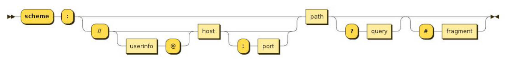

# 案例

京东侧边栏展示案例，采用禁止事件的方案 `pointer-events: none;`。

- 利用 CSS 属性，禁止 item 中的 icon 和 name 的事件。

- 如果 item 中的 name 采用绝对定位，那么鼠标移动到 name 上时，没有弹出效果，因为绝对定位不向父元素汇报宽高。

```html
<head>
  <style>
    .icon {
      pointer-events: none;
    }
    .name {
      pointer-events: none;
    }
  </style>
</head>
<body>
  <div class="tool-bar">
    <div class="item">
      <i class="icon icon01"></i>
      <div class="name">购物车</div>
    </div>
    <div class="item">
      <i class="icon icon02"></i>
      <div class="name">收藏</div>
    </div>
    <div class="item">
      <i class="icon icon03"></i>
      <div class="name">限时活动</div>
    </div>
    <div class="item">
      <i class="icon icon04"></i>
      <div class="name">大礼包</div>
    </div>
  </div>
  <script>
    // 1.动态给 icon 设置 backgroundPosition
    var iconEls = document.querySelectorAll(".icon")
    for (var i = 0; i < iconEls.length; i++) {
      iconEls[i].style.backgroundPosition = `-48px -${50*i}px`
    }
    // 2.实现鼠标进入动画
    var toolbarEl = document.querySelector(".tool-bar")
    toolbarEl.onmouseover = function(event) {
      var nameEl = event.target.children[1]
      nameEl.style.width = "62px"
      event.target.style.width = `${62 + 35}px`
    }
    toolbarEl.onmouseout = function(event) {
      var nameEl = event.target.children[1]
      nameEl.style.width = "0"
      event.target.style.width = `${35}px`
    }
  </script>
</body>
```

-----

王者荣耀轮播图案例，
- 鼠标离开图片或下方标题，自动轮播，鼠标悬浮图片或下方标题，停止轮播。
- 图片层叠抽取，而不是挨个位移。调整图片样式，做成王者默认轮播效果。
- 绝对定位 left，百分数相对于自身宽度。

```html
<body>
  <div class="main main_wrapper">
    <div class="news-section">
      <div class="banner">
        <ul class="image-list">
          <li class="item">
            <a href="">
              
            </a>
          </li>
          <li class="item">
            <a href="">
              
            </a>
          </li>
          <li class="item">
            <a href="">
              
            </a>
          </li>
          <li class="item">
            <a href="">
              
            </a>
          </li>
          <li class="item">
            <a href="">
              
            </a>
          </li>
        </ul>
        <ul class="title-list">
          <li class="item active">
            <a href="#">桑启的旅途故事</a>
          </li>
          <li class="item">
            <a href="#">启示之音抢先听</a>
          </li>
          <li class="item">
            <a href="#">谁成为版本之子</a>
          </li>
          <li class="item">
            <a href="#">观赛体验升级</a>
          </li>
          <li class="item">
            <a href="#">季后赛开战</a>
          </li>
        </ul>
      </div>
      <div class="news"></div>
      <div class="download">
        <a class="download-btn" href="#"></a>
        <a class="guard-btn" href="#"></a>
        <a class="experience-btn" href="#"></a>
      </div>
    </div>
  </div>
  <script>
    // 1.获取元素
    var titleListEl = document.querySelector(".title-list")
    var imageListEl = document.querySelector(".image-list")
    var bannerEl = document.querySelector(".banner")
    // 定义变量保存一些的状态
    var activeTitleEl = titleListEl.querySelector(".active")
    var currentIndex = 0 // 记录当前轮播图 index
    var previousIndex = 0 // 记录上一张轮播图 index
    var timerID = null // 自动轮播定时器
    // 2.底部 titles 的切换, 同时进行轮播
    titleListEl.onmouseover = function(event) {
      // 1.1.确定发生鼠标进入的元素
      var itemEl = event.target.parentElement
      if (!itemEl.classList.contains("item")) return
      // 1.2.获取对应的索引index
      var index = Array.from(titleListEl.children).findIndex( item => item === itemEl )
      previousIndex = currentIndex
      currentIndex = index
      // 1.3.调用切换的函数
      switchBanner()
    }
    // 3.定时器: 定时轮播
    startTimer()
    // 监听banner的事件
    bannerEl.onmouseenter = function() {
      clearInterval(timerID)
    }
    bannerEl.onmouseleave = function() {
      startTimer()
    }
    // 封装一个添加定时器的函数
    function startTimer() {
      timerID = setInterval(function() {
        previousIndex = currentIndex++
        if (currentIndex === titleListEl.children.length) currentIndex = 0
        // 调用切换的函数
        switchBanner()
      }, 3000);
    }
    // 封装一个切换轮播的函数
    function switchBanner() {
      // 第一件事情: 让 imageListEl 滚动
      // 1.1.让imageListEl修改位置，其他内容需要调整
      for (var i = 0; i < imageListEl.children.length; i++) {
        var itemEl = imageListEl.children[i]
        if (i === currentIndex) { // 当前要展示的 imageItem
          itemEl.style.transition = "left 300ms ease"
          itemEl.style.left = "0"
        } else if (i < currentIndex) { // 需要放到左侧的imageItem
          if (i !== previousIndex) itemEl.style.transition = "none"
          itemEl.style.left = "-100%"
        } else { // 需要放到右侧的imageItem
          if (i !== previousIndex) itemEl.style.transition = "none"
          itemEl.style.left = "100%"
        }
      }
      // 第二件事情: 改变title选中
      // 1.2.移除之前的 active
      activeTitleEl.classList.remove("active")
      // 1.3.将 active 添加到鼠标进入的元素
      var currentItemEl = titleListEl.children[currentIndex]
      currentItemEl.classList.add("active")
      // 1.4.让activeItemEl指向最新的元素
      activeTitleEl = currentItemEl
    }
  </script>
</body>
```

-----

书籍购物车案例实现。

```html
<body>
  <table>
    <thead>
      <tr>
        <th>编号</th>
        <th>书籍名称</th>
        <th>出版日期</th>
        <th>价格</th>
        <th>购买数量</th>
        <th>操作</th>
      </tr>
    </thead>
    <tbody>
    </tbody>
  </table>
  <h2 class="price">
    总价格: ¥<span class="price-count">0</span>
  </h2>
  <script>
    // 1.从服务器获取数据 ajax/fetch
    var books = [
      { id: 1,name: '《算法导论》',date: '2006-09',price: 85.00,count: 3},
      { id: 2,name: '《UNIX编程艺术》',date: '2006-02',price: 59.00,count: 2 },
      { id: 3,name: '《编程珠玑》',date: '2008-10',price: 39.00,count: 5 },
			{ id: 4,name: '《代码大全》',date: '2006-03',price: 128.00,count: 8 }
    ]
    // 2.对数据展示
    // 到底通过html直接编写, 还是通过 JavaScriptDOM 操作创建元素
    // 1> 对于固定的, 直接通过html编写(能通过html编写, 尽量通过html直接编写)
    // 2> 对于那些大量的数据, 有规律的数据, 可以通过JavaScript编写
    var tbodyEl = document.querySelector("tbody")
    // 2.2. 动态添加 tr 以及内部数据
    for (var i = 0; i < books.length; i++) {
      var trowEl = document.createElement("tr")
      // 2.3. 放具体数据
      var book = books[i]
      var bookKeys = Object.keys(book)
      for (var j = 0; j < bookKeys.length; j++) {
        var key = bookKeys[j]
        var value = book[key]
        var tdEl = document.createElement("td")
        tdEl.textContent = key === "price" ?  "¥" + value : value
        trowEl.append(tdEl)
      }
      // 2.4. 添加删除按钮
      var deleteTdEl = document.createElement("td")
      var deleteBtnEl = document.createElement("button")
      deleteBtnEl.textContent = "删除"
      deleteTdEl.append(deleteBtnEl)
      trowEl.append(deleteTdEl)
      // 2.5.监听删除按钮的点击
      deleteBtnEl.onclick = function() {
        // 1.删除对应的trow
        var deleteTRowEl = this.parentElement.parentElement
        var deleteTrIndex = deleteTRowEl.sectionRowIndex // 先拿到删除行的索引，再进行删除
        deleteTRowEl.remove()
        // 2.删除对应books中的数据
        books.splice(deleteTrIndex, 1)
        // 3.重新计算一次价格
        calcTotalPrice()
      }
      tbodyEl.append(trowEl)
    }
    // 3.计算总价格
    var priceCountEl = document.querySelector(".price-count")
    calcTotalPrice()
    // 封装计算价格的函数
    function calcTotalPrice() {
      var totalPrice = books.reduce((accumulate, item) => accumulate + item.count * item.price, 0)
      priceCountEl.textContent = totalPrice
    }
  </script>
</body>
```

-----

# BOM

BOM全称：浏览器对象模型（Browser Object Model）

它是什么？

- 由浏览器提供的用于处理文档（document）之外的所有内容的其他对象；
- 连接 JavaScript 脚本与浏览器窗口的桥梁。

-----

BOM主要包括哪些对象模型？

- `window`：包括全局属性、方法，控制浏览器窗口相关的属性、方法；
- `location`：浏览器连接到的对象的位置（URL）；
- `history`：操作浏览器的历史；
- `navigator`：用户代理（浏览器）的状态和标识（很少用到）；
- `screen`：屏幕窗口信息（很少用到）；

-----

看待 window 对象的两个角度。

1. 全局对象（在 Node 中是 `global`，浏览器和 Node 中都可以用 `globalThis` 表示）。
2. 浏览器窗口对象，提供了浏览器操作相关的API。

-----

window对象包含哪4方面内容？

1. 包含大量的属性，localStorage、console、location、history、screenX、scrollY 等等（大概60+个属性）；
2. 包含大量的方法，alert、scrollTo，close、open 等等（大概40+个方法）；
3. 包含大量的事件，focus、blur、load、hashchange 等等（大概30+个事件）；
4. 包含从EventTarget继承过来的方法，addEventListener、removeEventListener、dispatchEvent 方法；

-----

MDN文档中API前面的3种符号。

- 删除符号：表示这个API已经废弃，不推荐继续使用了；
- 点踩符号(感叹号)：表示这个API不属于W3C规范，某些浏览器有实现（有兼容性的问题）；
- 实验符号：该API是实验性特性，以后可能会修改，并且存在兼容性问题；

-----

window 对象中的 open 和 close 方法 。

```javascript
var openBtnEl = document.querySelector("button")
var closeBtnEl = document.querySelector(".close")
openBtnEl.onclick = function() {
  window.open("./page/new.html", "_blank")
}
closeBtnEl.onclick = function() {
  window.close() // 只能关闭由 open 方法打开的页面
}
```

-----

window上的事件 focus，blur，hashchange

```javascript
window.onfocus = function() {
  console.log("窗口获取到焦点")
}
window.onblur = function() {
  console.log("窗口失去了焦点")
}
window.onhashchange = function() {
  console.log("hash值发生改变")
}
```

-----

location 对象有什么用，

- 用于表示window上当前链接到的URL信息。

它有哪些属性？

- `href`: 当前window对应的超链接URL, 整个URL；
- `protocol`: 当前的协议；
- `host`: 主机地址；
- `hostname`: 主机地址(不带端口)；
- `port`: 端口；
- `pathname`: 路径；
- `search`: 查询字符串；
- `hash`: 哈希值；
- username：URL中的 username（很多浏览器已经禁用）；
- password：URL中的 password（很多浏览器已经禁用）

理解 location 是 URL 抽象图解。



-----

location 的3个方法，有什么用，代码演示。

- `assign`：赋值一个新的URL，并且跳转到该URL中；
- `replace`：打开一个新的URL，并且跳转到该URL中（不同的是不会在浏览记录中留下之前的记录）；
- `reload`：重新加载页面，可以传入一个Boolean类型；

```javascript
var btns = document.querySelectorAll("button")
btns[0].onclick = function() {
  location.assign("http://www.baidu.com")
}
btns[1].onclick = function() {
  location.replace("http://www.baidu.com")
}
btns[2].onclick = function() {
  location.reload()
}
```

-----

`URLSearchParams` 构造函数（类）有什么用，

- 定义了一些实用的方法来处理 URL 的查询字符串

它有哪些方法？

- `get`：获取搜索参数的值；
- `set`：设置一个搜索参数和值；
- `append`：追加一个搜索参数和值；
- `has`：判断是否有某个搜索参数；
- `toString`：将对象转成字符串。

```javascript
var searchParams = new URLSearchParams("?name=zzt&age=18&height=1.88")
searchParams.get("name")
searchParams.append("address", "广州市")
searchParams.toString()
```

-----

URL中如果有中文，会使用 `encodeURIComponent` 和 `decodeURIComponent` 进行编码和解码。

```javascript
encodeURIComponent('深圳市') // '%E6%B7%B1%E5%9C%B3%E5%B8%82'
decodeURIComponent('%E6%B7%B1%E5%9C%B3%E5%B8%82') // 深圳市
```

-----

前端路由的核心概念：修改了 URL（history / hash），但页面不刷新。

-----

history 对象（HTML5新特性）

2个属性

- `length`：会话中的记录条数；
- `state`：当前保留的状态值；

5个方法。案例实现。

- `back()`：返回上一页，等价于history.go(-1)；
- `forward()`：前进下一页，等价于history.go(1)；
- `go()`：加载历史中的某一页；
- `pushState()`：打开一个指定的地址；页面不刷新。
- `replaceState()`：打开一个新的地址，并且使用 replace；不能后退，页面不刷新。

```javascript
var btnEl = document.querySelector("button")
btnEl.onclick = function() {
  /**
	 * arg1：状态对象
	 * arg2：标题，大多数浏览器忽略，一般传空字符串。
	 * arg3：url
	 */
  // history.pushState({ name: "zzt", age: 18 }, "", "/zzt")
  history.replaceState({ name: "zzt", age: 18 }, "", "/zzt")
}
```

-----

了解 navigator 和 screen 对象有什么用。

- navigator 对象表示用户代理的状态和标识等信息。
- screen 主要记录的是浏览器窗口外面的客户端显示器的信息
  - 如屏幕的逻辑像素 `screen.width`、`screen.height`；

-----

什么是 JSON（JavaScript Object Notation）

- 一种数据格式，不是编程语言，算是JavaScript的一个子集。

除了JSON还有什么传输格式？
- XML：在早期的网络传输进行数据交换，在解析、传输等各方面都弱于JSON，目前已很少被使用；（多见于后端框架配置文件）
- Protobuf：在网络传输中目前已经越来越多使用的传输格式，直到2021年的3.x版本才支持JavaScript，目前在前端使用的较少；

JSON的使用场景。

- 网络数据的传输；
- 项目的某些配置文件；
- 非关系型数据库（NoSQL）将 json 作为存储格式；

-----

JSON的顶层支持3种类型的值。

- 简单值：数字（Number）、字符串（String，不支持单引号）、布尔类型（Boolean）、null类型；**没有 undefined**
- 对象值：由key、value组成，key是字符串类型，必须加双引号，值可以是简单值、对象值、数组值；
- 数组值：数组的值可以是简单值、对象值、数组值；

-----

什么是JSON的序列化和反序列化？

- 对象类型转化成JSON格式的字符串，将JSON格式字符串转成对象类型。

对应的方法。（JSON是ES5中的全局对象）

- JSON.stringify()：将JavaScript类型转成对应的JSON字符串； 
- JSON.parse()：解析JSON字符串，转回对应的JavaScript对象类型；

-----

JSON.stringify() 的 replace 参数，space 参数，

- `JSON.stringify(obj[, replace[, space]])`
- replace，可传函数或数组，用于序列化时做处理。
- space，可传字符或数字。用于格式化生成的字符串，

JSON 对象的 `toJSON` 方法。

```javascript
var obj = {
  name: "zzt",
  age: 18,
  friend: {
    name: "CR7"
  },
  toJSON: function() {
    return "123"
  }
}
// 1.replacer参数
var objJSONString = JSON.stringify(obj, (key, value) =>  key === 'name' ? 'zt2tzzt' : value, 2) // 123
```

-----

JSON.parse() 的 reviver 参数。

- `JSON.parse(text[, reviver])`
- reviver，只能传入函数，用于反序列化时做处理

```javascript
var newObj = JSON.parse(str, (key, value) => key === "age" ? value * 2 : value)
```

