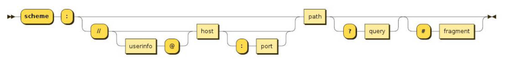
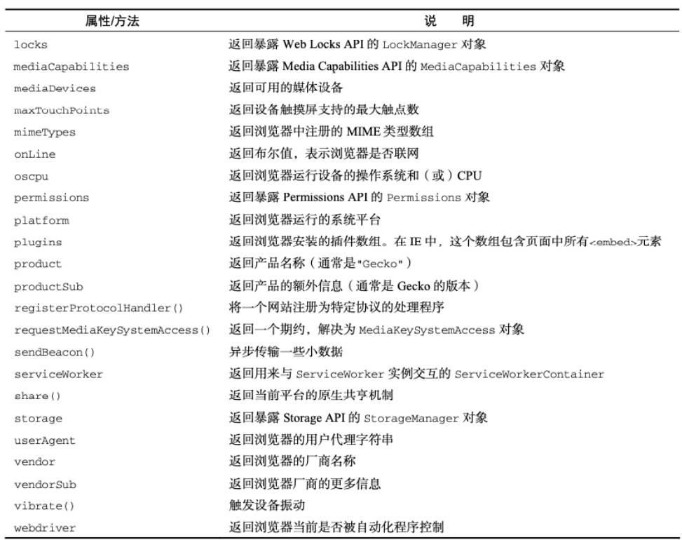
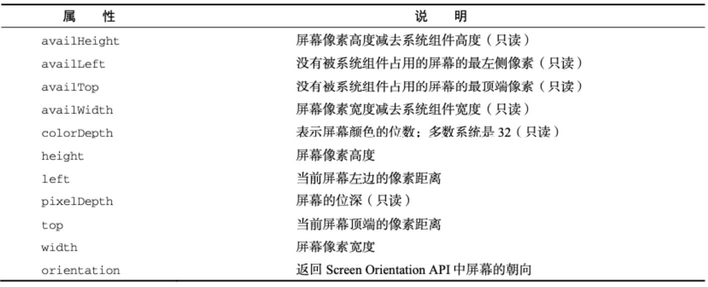

# 综合案例、BOM、JSON

## 一、事件处理

### 1.CSS 属性 pointer-events

CSS 属性 `pointer-events: none;` 的主要作用是使元素不可被点击或响应任何指针事件。具体来说：

- **禁用点击事件**：元素不再响应鼠标点击、悬停等指针事件。
- **鼠标穿透**：鼠标事件会传递给其下层的元素，就像这个元素不存在一样。

这个属性在以下场景中非常有用：

- **不可点击的覆盖层**：你可以创建一个覆盖层，防止用户与其下的内容交互，同时允许鼠标事件通过这个层传递到下面的元素。
- **禁用特定元素**：当你想暂时禁用某个元素的交互而不改变其外观时，可以使用这个属性。
- **SVG 中的应用**：在复杂的 SVG 图形中，可以使用该属性来控制哪些部分可以响应鼠标事件。

例如，下面的代码演示了一个覆盖层的应用：

```html
<div class="overlay"></div>
<button>Click Me</button>
```

```css
.overlay {
  position: absolute;
  top: 0;
  left: 0;
  width: 100%;
  height: 100%;
  background-color: rgba(0, 0, 0, 0.5);
  pointer-events: none; /* 禁用指针事件 */
}
```

在这个例子中，`.overlay` 覆盖层将不会响应鼠标点击事件，点击事件会传递到覆盖层下的按钮上。

### 2.王者荣耀轮播图增强

在前面的王者荣耀轮播图案例基础上，实现以下增强功能：

1. 添加定时器，实现轮播图的自动轮播。
2. 代码重构，封装一个切换轮播图的函数。
3. 当鼠标悬停在轮播图上，或者轮播图 title 上时，取消定时器，停止轮播。鼠标离开后，开始轮播。
4. 实现王者荣耀首页轮播图的默认效果，淡入、淡出效果（图片层叠抽取，而不是挨个位移。调整图片样式，做成王者默认轮播效果）。

> CSS 中，绝对定位元素的 `left` 属性，百分数相对于定位父元素宽度。

```html
<!DOCTYPE html>
<html lang="zh-CN">
  <head>
    <meta charset="UTF-8" />
    <meta http-equiv="X-UA-Compatible" content="IE=edge" />
    <meta name="viewport" content="width=device-width, initial-scale=1.0" />
    <title>王者荣耀-main-news</title>
    <link rel="stylesheet" href="./css/reset.css" />
    <link rel="stylesheet" href="./css/common.css" />

    <style>
      .main {
        height: 100px;
      }

      .news-section {
        display: flex;
        height: 342px;
      }

      .news-section .banner {
        width: 605px;
        background-color: #000;
        overflow: hidden;
      }

      .news-section .banner .image-list {
        position: relative;
        display: flex;
        width: 604px;
        height: 298px;
      }

      .news-section .banner .image-list .item {
        position: absolute;
        left: 100%;
        flex-shrink: 0;
        width: 100%;
      }

      .news-section .banner .image-list .item:first-child {
        left: 0;
        transition: left 300ms ease;
      }

      .news-section .banner .image-list .item a {
        display: block;
      }

      .news-section .banner .image-list .item a img {
        width: 100%;
      }

      .news-section .banner .title-list {
        display: flex;
        height: 44px;
        line-height: 44px;
      }

      .news-section .banner .title-list .item {
        flex: 1;
        text-align: center;
      }

      .news-section .banner .title-list .item a {
        display: block;
        font-size: 14px;
        color: #b1b2be;
      }
      .news-section .banner .title-list .item.active a,
      .news-section .banner .title-list .item a:hover {
        color: #f3c258;
        background-color: rgba(255, 255, 255, 0.15);
      }

      .news-section .news {
        flex: 1;
        background-color: purple;
      }

      .news-section .download {
        width: 236px;
        background-color: skyblue;
      }

      .news-section .download a {
        display: block;
        background: url(./img/main_sprite.png) no-repeat;
      }

      .news-section .download a.download-btn {
        height: 128px;
        background-position: 0 -219px;
      }

      .news-section .download a.guard-btn {
        height: 106px;
        background-position: 0 -350px;
      }

      .news-section .download a.experience-btn {
        height: 108px;
        background-position: 0 -461px;
      }
    </style>
  </head>
  <body>
    <div class="main main_wrapper">
      <div class="news-section">
        <div class="banner">
          <ul class="image-list">
            <li class="item">
              <a href="">
                
              </a>
            </li>
            <li class="item">
              <a href="">
                
              </a>
            </li>
            <li class="item">
              <a href="">
                
              </a>
            </li>
            <li class="item">
              <a href="">
                
              </a>
            </li>
            <li class="item">
              <a href="">
                
              </a>
            </li>
          </ul>
          <ul class="title-list">
            <li class="item active">
              <a href="#">桑启的旅途故事</a>
            </li>
            <li class="item">
              <a href="#">启示之音抢先听</a>
            </li>
            <li class="item">
              <a href="#">谁成为版本之子</a>
            </li>
            <li class="item">
              <a href="#">观赛体验升级</a>
            </li>
            <li class="item">
              <a href="#">季后赛开战</a>
            </li>
          </ul>
        </div>
        <div class="news"></div>
        <div class="download">
          <a class="download-btn" href="#"></a>
          <a class="guard-btn" href="#"></a>
          <a class="experience-btn" href="#"></a>
        </div>
      </div>
    </div>

    <script></script>

    <script>
      // 获取元素
      var titleListEl = document.querySelector('.title-list')
      var imageListEl = document.querySelector('.image-list')
      var bannerEl = document.querySelector('.banner')

      var activeTitleEl = titleListEl.querySelector('.active')
      var currentIndex = 0 // 记录当前轮播图
      var previousIndex = 0
      var timerId = null

      // 底部 titles 的切换, 同时进行轮播
      titleListEl.onmouseover = function (event) {
        // 确定发生鼠标进入的元素
        var itemEl = event.target.parentElement
        if (!itemEl.classList.contains('item')) return

        var index = Array.from(titleListEl.children).findIndex(function (item) {
          return item === itemEl
        })

        previousIndex = currentIndex
        currentIndex = index

        switchBanner()
      }

      startTimer()

      // 经停 banner 的事件
      bannerEl.onmouseenter = function () {
        clearInterval(timerId)
      }
      bannerEl.onmouseleave = function () {
        startTimer()
      }

      // 代码重构，封装一个切换轮播图的函数。
      function switchBanner() {
        for (var i = 0; i < imageListEl.children.length; i++) {
          var itemEl = imageListEl.children[i]

          if (i === currentIndex) {
            // 当前要展示的轮播图
            itemEl.style.transition = 'left 300ms ease'

            itemEl.style.left = '0'
          } else if (i < currentIndex) {
            // 需要放在左侧的轮播图
            if (i !== previousIndex) {
              itemEl.style.transition = 'none'
            }

            itemEl.style.left = '-100%'
          } else {
            // 需要放在右侧的轮播图
            if (i !== previousIndex) {
              itemEl.style.transition = 'none'
            }

            itemEl.style.left = '100%'
          }
        }

        // 排他思想
        activeTitleEl.classList.remove('active')

        var currentItemEl = titleListEl.children[currentIndex]
        currentItemEl.classList.add('active')

        activeTitleEl = currentItemEl
      }

      // 1.添加定时器，实现轮播图的自动轮播。
      function startTimer() {
        timerId = setInterval(function () {
          previousIndex = currentIndex
          currentIndex++

          if (currentIndex === titleListEl.children.length) currentIndex = 0

          switchBanner()
        }, 1000)
      }
    </script>
  </body>
</html>
```

### 3.书籍购物车案例

知识点总结：

- [HTMLTableRowElement.](https://developer.mozilla.org/zh-CN/docs/Web/API/HTMLTableRowElement/rowIndex)，用于获取 table row 元素对象上的属性。

```html
<!DOCTYPE html>
<html lang="en">
  <head>
    <meta charset="UTF-8" />
    <meta http-equiv="X-UA-Compatible" content="IE=edge" />
    <meta name="viewport" content="width=device-width, initial-scale=1.0" />
    <title>书籍购物车</title>
    <style>
      table {
        border-collapse: collapse;
      }

      thead {
        background-color: #f5f5f5;
      }

      th,
      td {
        border: 1px solid #aaa;
        padding: 8px 12px;
        text-align: center;
      }
    </style>
  </head>

  <body>
    <table>
      <thead>
        <tr>
          <th>编号</th>
          <th>书籍名称</th>
          <th>出版日期</th>
          <th>价格</th>
          <th>购买数量</th>
          <th>操作</th>
        </tr>
      </thead>
      <tbody></tbody>
    </table>
    <h2 class="price">总价格: ¥<span class="price-count">0</span></h2>

    <script>
      // 模拟从服务器获取数据 ajax/fetch
      var books = [
        {
          id: 1,
          name: '《算法导论》',
          date: '2006-09',
          price: 85.0,
          count: 3
        },
        {
          id: 2,
          name: '《UNIX编程艺术》',
          date: '2006-02',
          price: 59.0,
          count: 2
        },
        {
          id: 3,
          name: '《编程珠玑》',
          date: '2008-10',
          price: 39.0,
          count: 5
        },
        {
          id: 4,
          name: '《代码大全》',
          date: '2006-03',
          price: 128.0,
          count: 8
        }
      ]

      // 对数据展示
      // 到底通过html直接编写, 还是通过JavaScriptDOM操作创建元素
      // 1> 对于固定的, 直接通过html编写(能通过html编写, 尽量通过html直接编写)
      // 2> 对于哪些大量的数据, 有规律的数据, 可以通过JavaScript编写
      var tbodyEl = document.querySelector('tbody')

      // 动态添加tr以及内部数据
      for (var i = 0; i < books.length; i++) {
        var trowEl = document.createElement('tr')

        // 放具体数据
        var book = books[i]
        var bookKeys = Object.keys(book)
        for (var m = 0; m < bookKeys.length; m++) {
          var key = bookKeys[m]
          var value = book[key]
          var tdEl = document.createElement('td')
          if (key === 'price') {
            value = '¥' + value
          }
          tdEl.textContent = value
          trowEl.append(tdEl)
        }

        // 添加删除按钮
        var deleteTdEl = document.createElement('td')
        var deleteBtnEl = document.createElement('button')
        deleteBtnEl.textContent = '删除'
        deleteTdEl.append(deleteBtnEl)
        trowEl.append(deleteTdEl)

        // 监听删除按钮的点击
        deleteBtnEl.onclick = function () {
          // 删除对应的 trow
          var deleteTRowEl = this.parentElement.parentElement
          var deleteTrIndex = deleteTRowEl.sectionRowIndex
          deleteTRowEl.remove()

          // 删除对应 books 中的数据
          books.splice(deleteTrIndex, 1)

          // 重新计算一次价格
          calcTotalPrice()
        }

        tbodyEl.append(trowEl)
      }

      // 3.计算总价格
      var priceCountEl = document.querySelector('.price-count')

      calcTotalPrice()

      // 封装计算价格的函数
      function calcTotalPrice() {
        var totalPrice = books.reduce(function (preValue, item) {
          return preValue + item.count * item.price
        }, 0)
        priceCountEl.textContent = totalPrice
      }
    </script>
  </body>
</html>
```

## 二、BOM

BOM（Browser Object Model）表示浏览器对象模型

- 由浏览器提供的用于处理文档（document）之外的所有内容的其他对象；
- 比如 navigator、location、history 等对象；

JavaScript 有一个非常重要的运行环境，就是浏览器：

- 浏览器本身又作为一个应用程序，需要对其进行操作；
- 所以通常浏览器会有对应的对象模型，即 BOM（Browser Object Model）；
- 我们可以将 BOM，看成是连接 JavaScript 脚本与浏览器窗口的桥梁；

BOM 主要包括哪些对象模型？

- `window`：包括全局属性、方法，控制浏览器窗口相关的属性、方法；
- `location`：浏览器连接到的对象的位置（URL）；
- `history`：操作浏览器的历史；
- `navigator`：用户代理（浏览器）的状态和标识（很少用到）；
- `screen`：屏幕窗口信息（很少用到）；

### 1.window 对象

window 对象在浏览器中，可以从两个视角来看待：

- 视角一：全局对象。我们知道 ECMAScript 其实是有一个全局对象的：这个全局对象：

  - 在 NodeJs 环境中是 `global`；
  - 在浏览器环境中，就是 `window` 对象；

- 视角二：浏览器窗口对象。
  - 作为浏览器窗口时，提供了对浏览器操作的相关的 API；

> 事实上，对于浏览器环境和 NodeJs 环境中，全局对象名称不一样的情况，目前已经指定了对应的标准，称之为 "globalThis"，并且大多数现代浏览器都支持它；
>
> 在现代 JavaScript 中，浏览器环境和 Node 环境中都可以用 `globalThis` 表示这个全局对象。

当然，这两个视角存在大量重叠的地方，所以不需要刻意去区分它们：

- 放在 `window` 对象上的所有属性，在全局作用域都可以被访问；
- 使用 var 关键字定义的变量，会被添加到 `window` 对象中；
- `window` 对象，默认给我们提供了全局的函数和类，比如：`setTimeout`（函数）、`Math`（对象）、`Date`（类）、`Object`（类）等。

事实上 `window` 对象上，肩负的重担是非常大的：

- 第一：包含大量的属性。比如：

  - `localStorage`、`console`、`location`、`history`、`screenX`、`scrollX` 等等（大概 60+ 个属性）；

- 第二：包含大量的方法，比如：

  - `alert`、`close`、`scrollTo`、`open` 等等（大概 40+ 个方法）；

- 第三：包含大量的事件，比如：

  - `focus`、`blur`、`load`、`hashchange` 等等（大概 30+ 个事件）；

- 第四：包含从 EventTarget 接口上实现的方法，比如：
  - `addEventListener`、`removeEventListener`、`dispatchEvent` 方法；

这些大量的属性、方法、事件在，在 [MDN 文档](https://developer.mozilla.org/zh-CN/docs/Web/API/Window) 查看。在 API 文档中，我们可能会发现有很多不同的符号，它们分别代表的意思如下：

- 删除符号：表示这个 API 已经废弃，不推荐继续使用了；
- 感叹（点踩）符号：表示这个 API 不属于 W3C 规范，某些浏览器有实现（所以存在兼容性的问题）；
- 实验符号：表示该 API 是实验性特性，以后可能会修改，并且存在兼容性问题；

#### 1.open、close 方法

window 对象中的 open 和 close 方法 。

- [Window：open()](https://developer.mozilla.org/zh-CN/docs/Web/API/Window/open)，用指定的名称将指定的资源加载到新的或已存在的浏览上下文（标签、窗口或 [iframe](https://developer.mozilla.org/zh-CN/docs/Web/HTML/Element/iframe)）中。
- [Window.close()](https://developer.mozilla.org/zh-CN/docs/Web/API/Window/close)，该方法只能由 [Window.open()](https://developer.mozilla.org/zh-CN/docs/Web/API/Window/open) 方法打开的窗口的 `window` 对象来调用，用于闭当前窗口或某个指定的窗口。

```javascript
var openBtnEl = document.querySelector('button')
var closeBtnEl = document.querySelector('.close')

openBtnEl.onclick = function () {
  window.open('./page/new.html', '_blank')
}

closeBtnEl.onclick = function () {
  window.close() // 只能关闭由 open 方法打开的页面
}
```

#### 2.focus、blur、hashchange 事件

window 上的事件 focus，blur，hashchange

```javascript
window.onfocus = function () {
  console.log('窗口获取到焦点')
}

window.onblur = function () {
  console.log('窗口失去了焦点')
}

window.onhashchange = function () {
  console.log('hash值发生改变')
}
```

### 2.location 对象

location 对象，用于表示 window 上当前链接到的 URL 信息。

它有哪些属性？

- `href`: 当前 window 对应的超链接 URL, 整个 URL；
- `protocol`: 当前的协议；
- `host`: 主机地址；
- `hostname`: 主机地址（不带端口）；
- `port`: 端口；
- `pathname`: 路径；
- `search`: 查询字符串；
- `hash`: 哈希值；
- `username`：URL 中的 username（很多浏览器已经禁用）；
- `password`：URL 中的 password（很多浏览器已经禁用）。

location 对象，是浏览器上 URL 抽象，如下图所示：



location 有如下 3 个常见方法：

- `assign`：赋值一个新的 URL，并且跳转到该 URL 中；
- `replace`：打开一个新的 URL，并且跳转到该 URL 中（不同的是不会在浏览记录中留下之前的记录）；
- `reload`：重新加载页面，可以传入一个 Boolean 类型；

```html
<!DOCTYPE html>
<html lang="en">
  <head>
    <meta charset="UTF-8" />
    <meta name="viewport" content="width=device-width, initial-scale=1.0" />
    <title>Demo</title>
  </head>
  <body>
    <button>百度</button>
    <button>百度</button>
    <button>刷新</button>

    <script>
      var btns = document.querySelectorAll('button')

      btns[0].onclick = function () {
        location.assign('http://www.baidu.com')
      }

      btns[1].onclick = function () {
        location.replace('http://www.baidu.com')
      }

      btns[2].onclick = function () {
        location.reload()
      }
    </script>
  </body>
</html>
```

#### 1.URLSearchParams 接口

[URLSearchParams](https://developer.mozilla.org/zh-CN/docs/Web/API/URLSearchParams) 接口实现的 URLSearchParams 构造函数（类），定义了一些实用的方法来处理 URL 的查询字符串。

- 可以将一个字符串，转化成 URLSearchParams 类型；
- 也可以将一个 URLSearchParams 类型，转成字符串；

URLSearchParams 的实例对象，常见的方法有如下几个：

- `get`：获取搜索参数的值；
- `set`：设置一个搜索参数和值；
- `append`：追加一个搜索参数和值；
- `has`：判断是否有某个搜索参数；
- `toString`：将对象转成字符串。

```javascript
var searchParams = new URLSearchParams('?name=zzt&age=18&height=1.88')

searchParams.get('name')
searchParams.append('address', '广州市')
searchParams.toString()
```

浏览器的 URL 中，如果有中文，会使用 `encodeURIComponent` 和 `decodeURIComponent` 进行编码和解码。

```javascript
encodeURIComponent('深圳市') // '%E6%B7%B1%E5%9C%B3%E5%B8%82'

decodeURIComponent('%E6%B7%B1%E5%9C%B3%E5%B8%82') // 深圳市
```

### 3.history 对象

history 对象，是 HTML5 的新特性，允许我们访问浏览器曾经的会话历史记录。

history 对象的两个属性：

- `length`：会话中的记录条数；
- `state`：当前保留的状态值；

history 对象的五个方法：

- `back()`：返回上一页，等价于 `history.go(-1)`；
- `forward()`：前进下一页，等价于 `history.go(1)`；
- `go()`：加载历史中的某一页；
- `pushState()`：打开一个指定的地址；页面不刷新。
- `replaceState()`：打开一个新的地址，并且使用 replace；不能回退，页面不刷新。

```javascript
var btnEl = document.querySelector('button')

btnEl.onclick = function () {
  /**
   * arg1：状态对象
   * arg2：标题，大多数浏览器忽略，一般传空字符串。
   * arg3：url
   */
  // history.pushState({ name: "zzt", age: 18 }, "", "/zzt")
  history.replaceState({ name: 'zzt', age: 18 }, '', '/zzt')
}
```

> 在现代的前端矿建（vue、react、...）中，前端路由的核心概念：就是修改了浏览器 URL，但页面不刷新。主要用到 history 对象和 location 对象的 hash。

### 4.navigator、screen 对象

navigator 对象表示用户代理的状态和标识等信息。



screen 主要记录的是浏览器窗口外面的客户端显示器的信息

- 如屏幕的逻辑像素 `screen.width`、`screen.height`；



## 三、JSON

JSON（全称 JavaScript Object Notation），表示 JavaScript 对象符号，是一种非常重要的数据格式，它并不是编程语言，而是一种可以在服务器和客户端之间传输的数据格式。

- JSON 是由 Douglas Crockford 构想和设计的一种轻量级资料交换格式，算是 JavaScript 的一个子集；
- JSON 被提出来的时候是主要应用于 JavaScript 中，但是目前已经独立于编程语言，可以在各个编程语言中使用；
- 很多编程语言都实现了将 JSON 转成对应模型的方法；

> 除了 JSON 以外，还有哪些数据传输格式：
>
> - XML 格式
>   - 在早期的网络传输中主要是使用 XML 来进行数据交换的。
>   - 这种格式在解析、传输等各方面都弱于 JSON，所以目前已经很少在被使用了；
> - Protobuf 格式：
>   - 另外一个在网络传输中，已经越来越多使用的传输格式是。
>   - 直到 2021 年的 3.x 版本，才支持 JavaScript，所以目前在前端使用的较少；

JSON 被使用的场景有很多：

- 网络数据的传输 JSON 格式的数据；
- 项目的某些配置文件；
- 非关系型数据库（NoSQL）将 json 作为存储格式；

### 1.JSON 基本语法

JSON 的顶层支持 3 种类型的值。

- 简单值。

  - 即数字（Number）、字符串（String，仅支持双引号的表示方式）、布尔类型（Boolean）、null 类型（没有 undefined）

  ```json
  123
  ```

- 对象值：

  - 即由 key、value 组成键值对，key 是字符串类型，必须加双引号，值可以是简单值、对象值、数组值；

  ```json
  {
    "name": "zetian",
    "age": 18,
    "friend": {
      "name": "kobe"
    }
  }
  ```

- 数组值：

  - 数组中的元素的值可以是简单值、对象值、数组值；

  ```json
  [
    123,
    "abc",
    {
      "name": "zetian"
    }
  ]
  ```

### 2.JSON 序列化

某些情况下，我们希望将 JavaScript 中的复杂类型（对象类型、引用类型）转化成 JSON 格式的字符串，这样方便对其进行处理：

- 比如：我们希望将一个对象保存到浏览器的 localStorage 中；

如果我们直接存放一个对象，这个对象会被转化成 `[object Object]` 格式的字符串，并不是我们想要的结果。

在 **ES5** 中内置了 **JSON 全局对象**，该对象有两个常用的方法：

- [JSON.stringify()](https://developer.mozilla.org/zh-CN/docs/Web/JavaScript/Reference/Global_Objects/JSON/stringify) 方法：用于将 JavaScript 类型，转成对应的 JSON 字符串；
- [JSON.parse()](https://developer.mozilla.org/zh-CN/docs/Web/JavaScript/Reference/Global_Objects/JSON/parse) 方法：解析 JSON 字符串，转成对应的 JavaScript 类型；

那么上面的代码，我们可以通过如下的方法来使用：

```html
<!DOCTYPE html>
<html lang="en">
  <head>
    <meta charset="UTF-8" />
    <meta name="viewport" content="width=device-width, initial-scale=1.0" />
    <title>Demo</title>
  </head>
  <body>
    <h1>哈哈</h1>

    <script>
      var info = {
        name: 'zzt',
        age: 18
      }

      var infoStr = JSON.stringify(info)
      localStorage.setItem('info', infoStr)

      var infoStr2 = localStorage.getItem('info')
      var infoObj = JSON.parse(infoStr2)
      console.log('infoObj:', infoObj)
    </script>
  </body>
</html>
```

#### 1.stringfy 方法的 replace 参数

JSON.stringify() 方法的语法是：`JSON.stringify(obj[, replace[, space]])`，其中有 replace 参数，space 参数，

`replace`，可传函数或数组，用于序列化时做处理。

- 如果指定了一个 replacer 函数，则可以选择性地替换值；
- 如果指定的 replacer 是数组，则可选择性地仅包含数组指定的属性；

```javascript
var obj = {
  name: 'zzt',
  age: 18,
  friend: {
    name: 'kobe'
  },
  hobbies: ['唱', '跳', 'rap', '篮球']
}

var objStr1 = JSON.stringify(obj)
console.log('objStr1:', objStr1) // {"name":"zzt","age":18,"friend":{"name":"kobe"},"hobbies":["唱","跳","rap","篮球"]}

// replace 参数，是一个数组
var objStr2 = JSON.stringify(obj, ['name', 'age'])
console.log('objStr2:', objStr2) // {"name":"zzt","age":18}

var objStr3 = JSON.stringify(obj, (key, value) => {
  console.log('key', key, 'value', value)
  /**
   * key  value {name: 'zzt', age: 18, friend: {…}, hobbies: Array(4)}
     key name value zzt
     key age value 18
     key friend value {name: 'kobe'}
     key name value kobe
     key hobbies value (4) ['唱', '跳', 'rap', '篮球']
     key 0 value 唱
     key 1 value 跳
     key 2 value rap
     key 3 value 篮球
    */

  return key === 'name' ? 'zetian' : value
})
console.log('objStr3:', objStr3) // {"name":"zetian","age":18,"friend":{"name":"zetian"},"hobbies":["唱","跳","rap","篮球"]}
```

#### 2.stringfy 方法的 space 参数

`space` 参数，可传字符或数字。用于格式化生成的字符串，

```javascript
var obj = {
  name: 'zzt',
  age: 18,
  friend: {
    name: 'CR7'
  }
}

// 1.replacer参数
var objStr1 = JSON.stringify(obj, (key, value) => (key === 'name' ? 'zt2tzzt' : value), 2)

console.log('objStr1:', objStr1)
/**
 * objStr1: {
 *   "name": "zt2tzzt",
 *   "age": 18,
 *   "friend": {
 *     "name": "CR7"
 *   }
 * }
 */
```

#### 3.JavaScript 对象中的 toJSON 方法

如果 JavaScript 对象本身包含 `toJSON` 方法，那么，`JSON.stringfy()` 方法，会直接使用 `toJSON` 方法的结果：

```javascript
var obj = {
  name: 'zzt',
  age: 18,
  friend: {
    name: 'CR7'
  },
  toJSON: function () {
    return '123'
  }
}

// 1.replacer参数
var objStr1 = JSON.stringify(obj, (key, value) => (key === 'name' ? 'zt2tzzt' : value), 2)
console.log('objstr1', objStr1) // "123"
```

### 2.JSON 反序列化

JSON 反序列化，是将 JSON 字符串转换回 JavaScript 对象或值的过程。使用 `JSON.parse()` 方法可以实现这一操作。

JSON.parse() 语法：`JSON.parse(text[, reviver])`

#### 1.parse 方法的 reviver 参数

`reviver` 参数，只能传入函数，用于反序列化时做处理。

```javascript
var newObj = JSON.parse(str, (key, value) => {
  return key === 'age' ? value * 2 : value
}
```

> 利用 JSON 全局对象的方法，可以实现对象的深拷贝，后续介绍。
