# this面试题、浏览器运行原理、JS 运行原理

## 一、this 面试题

JavaScript 中的函数 this 绑定，有如下四道经典的面试题：

### 1.面试题一

```javascript
var name = 'window'

var person = {
  name: 'person',
  sayName: function () {
    console.log(this.name)
  }
}

function sayName() {
  var sss = person.sayName;

  sss() // window

  person.sayName() // person

  (person.sayName)() // person

  (b = person.sayName)() // window
}

sayName()
```

### 2.面试题二

```javascript
var name = 'window'

var person1 = {
  name: 'person1',
  foo1: function () {
    console.log(this.name)
  },
  foo2: () => console.log(this.name),
  foo3: function () {
    return function () {
      console.log(this.name)
    }
  },
  foo4: function () {
    return () => {
      console.log(this.name)
    }
  }
}

var person2 = { name: 'person2' }

person1.foo1() // person1
person1.foo1.call(person2) // person2

person1.foo2() // window
person1.foo2.call(person2) // window

person1.foo3()() // window
person1.foo3.call(person2)() // window
person1.foo3().call(person2) // person2

person1.foo4()() // person1
person1.foo4.call(person2)() // person2
person1.foo4().call(person2) // person1
```

### 3.面试题三

```javascript
var name = 'window'

function Person(name) {
  this.name = name
  this.foo1 = function () {
    console.log(this.name)
  }
  this.foo2 = () => console.log(this.name)
  this.foo3 = function () {
    return function () {
      console.log(this.name)
    }
  }
  this.foo4 = function () {
    return () => {
      console.log(this.name)
    }
  }
}

var person1 = new Person('person1')
var person2 = new Person('person2')

person1.foo1() // person1
person1.foo1.call(person2) // person2

person1.foo2() // person1
person1.foo2.call(person2) // person1

person1.foo3()() // window
person1.foo3.call(person2)() //window
person1.foo3().call(person2) // person2

person1.foo4()() // person1
person1.foo4.call(person2)() // person2
person1.foo4().call(person2) // person1
```

### 4.面试题四

```javascript
var name = 'window'

function Person(name) {
  this.name = name

  this.obj = {
    name: 'obj',
    foo1: function () {
      return function () {
        console.log(this.name)
      }
    },
    foo2: function () {
      return () => {
        console.log(this.name)
      }
    },
  }
}

var person1 = new Person('person1')
var person2 = new Person('person2')

person1.obj.foo1()() // window
person1.obj.foo1.call(person2)() // window
person1.obj.foo1().call(person2) // person2

person1.obj.foo2()() // obj
person1.obj.foo2.call(person2)() // person2
person1.obj.foo2().call(person2) // obj
```

## 二、网页解析过程图解

一个网页 URL，从输入浏览器中到显示，经历了下载 html 文件并解析的过程。如下图所示：

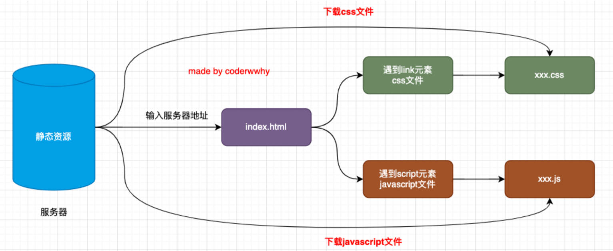

> JavaScript 属于编程语言中的高级语言。
>
> 高级语言分为编译型和解释型：
>
> - 编译型：如 C, C++, Java 把代码编译成可执行文件再执行。
> - 解释型：如 JavaScript, Python 边读源代码边做解释，再执行。

## 三、浏览器内核（回顾）

网页解析，由浏览器内核完成，常见的浏览器内核有：

- Gecko（壁虎）：早期被 NetScape 和 Mozilla FireFox 浏览器使用。
- Trident （三叉戟）：微软开发，被 IE4-IE11 使用（edge 浏览器已转向 Blink）
- Presto（急板乐曲）-> Blink （眨眼）：Opera
- Webkit ：苹果基于 KHTML 开发，开源的，用于 Safari,，早期的 Google Chrome。
- Blink ：是 Webkit 的一个分支，由 Google 开发，应用于 Chrome，edge，opera 等浏览器。

浏览器内核的别称。

- 排版引擎（layout engine）。
- 浏览器引擎（browser engine）。
- 页面渲染引擎（rendering engine）。
- 样版引擎。

一个网页下载到本地后，就是由浏览器引擎来解析的。

## 四、JavaScript 引擎（回顾）

常见的 JavaScript 引擎有：

- SpiderMonkey：第一款 JavaScript 引擎，由 Brendan Eich 开发（也是 Javascript 作者）。
- Chakra：微软开发，用于 IE 浏览器。
- JavaScriptCore：WebKit 浏览器引擎中的 Javascript 引擎，Apple 公司开发。
- V8：Google 开发的强大的 Javascript 引擎，帮助 Chrome 浏览器从众多浏览器中脱颖而出。

## 五、浏览器内核渲染页面的流程

浏览器引擎在拿到一个页面后，如何解析整个页面并且最终呈现出我们的网页呢？

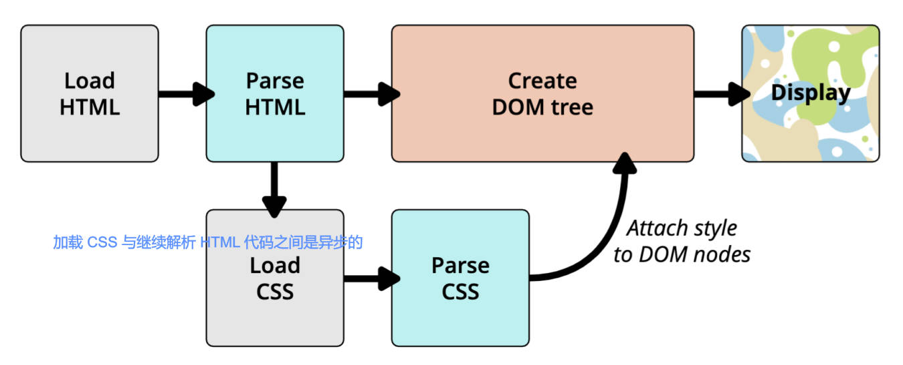

我们之前介绍过上面的这幅图，现在让我们更加详细的学习它的过程；

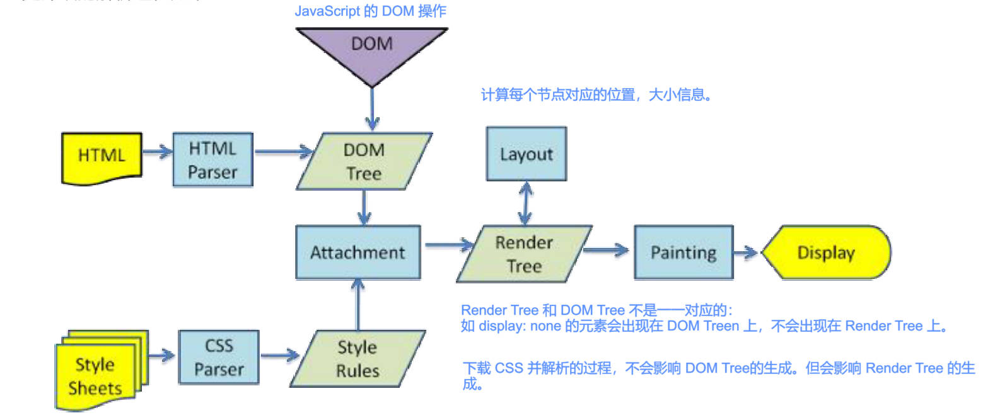

### 1.HTML 解析，DOM Tree 固件

因为默认情况下，服务器会给浏览器返回 index.html 文件，所以解析 HTML 是所有步骤的开始：

解析HTML，会构建DOM Tree：

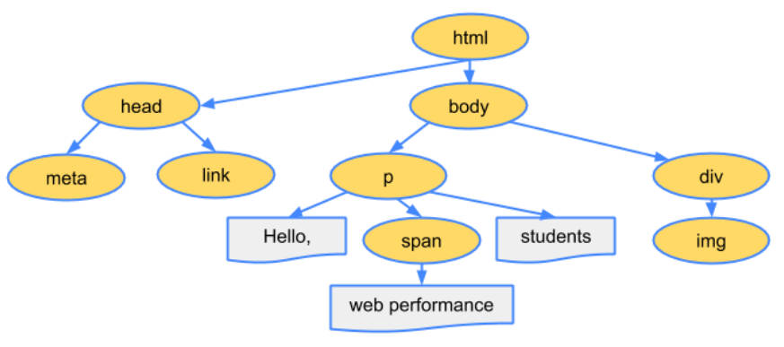

### 2.CSS 规则生成，CSSOM Tree 构建

在解析 HTML 的过程中，如果遇到 link 元素链接了 CSS 的外部样式表，那么会由浏览器负责下载对应的 CSS 文件：

- 注意：下载 CSS 文件是不会影响 DOM 的解析的；

浏览器下载完 CSS 文件后，就会对 CSS 文件进行解析，解析出对应的规则树：我们可以称之为 CSSOM（CSS Object Model，CSS 对象模型）；

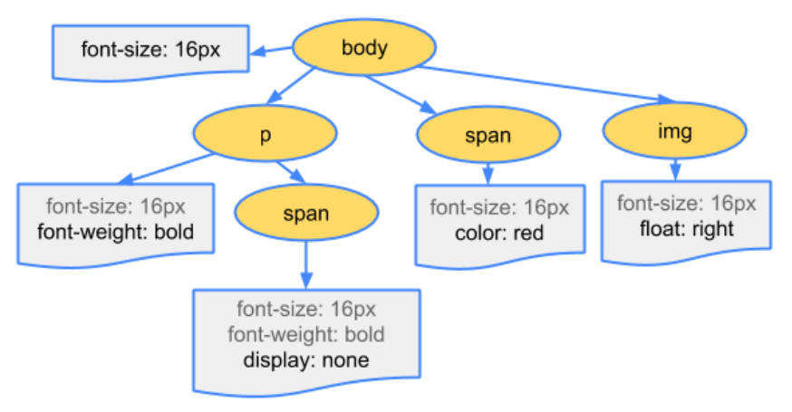

### 3.Render Tree 构建

当有了 DOM Tree 和 CSSOM Tree 后，就可以将它们两个结合起来，构建 Render Tree了。

注意一：CSS 规则生成，不会阻塞 DOM Tree 的构建过程，但是会阻塞 Render Tree 的构建过程。

- 这是因为 Render Tree 在构建时，需要对应的 CSSOM Tree；
- 然而，当加载时间过长时，浏览器会做一定的优化，并不会一直等待，

注意二：Render Tree 和 DOM Tree 并不是一一对应的关系，比如对于 `display: none;` 的元素，压根不会出现在 Render tree 中

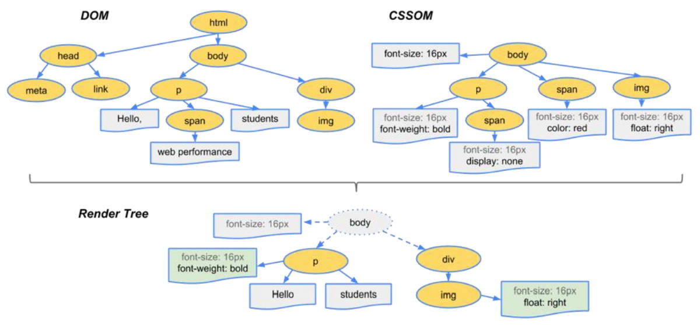

### 4.布局（layout）

第四步是在渲染树（Render Tree）上，运行布局（Layout）以计算每个节点的几何体。

渲染树中，有要显示的节点，以及其他样式，但是没有每个节点的尺寸、位置等信息；

布局是确定渲染树中所有节点的宽度、高度（尺寸）和位置信息；

### 5.绘制（paint）

第五步是将每个节点绘制（Paint）到屏幕上

在绘制阶段，浏览器将布局阶段计算的每个 frame 转为屏幕上实际的像素点；

包括将元素的可见部分，进行绘制，比如文本、颜色、边框、阴影、替换元素（比如 img）

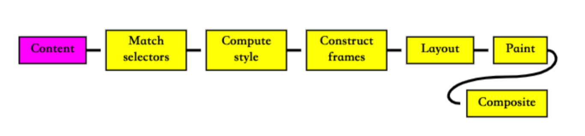

总结：6 步解析。

1. 默认情况下，服务器给浏览器返回 index.html，解析 HTML 是所有步骤的开始，解析 HTML，构建 DOM Tree。
2. 解析 HTML 时遇到 link 元素链接到 CSS 的外部样式表，就会由浏览器异步的下载对应的 CSS 文件（不会影响 DOM 的解析），下载完 CSS 文件后，解析 CSS，生成对应的规则树，可称为 CSSOM（CSS 对象模型）。
3. 当有了 DOM Tree 和 CSSOM Tree 后，就可以将它们两个组合，构建 Render Tree 了。
4. 在 Render Tree 上运行布局（Layout）以计算每个节点的几何体（尺寸，位置信息）。
5. 将每个节点绘制（Paint）到屏幕上，浏览器将布局阶段计算的每个 frame 转为屏幕上实际的像素点，包括将元素的可见部分进行绘制，比如：文本、颜色、边框、阴影、替换元素（比如 img）。

> link 元素链接的 CSS 外部样式表，不会阻塞 DOM Tree 的构建过程，但是会阻塞 Render Tree 的构建过程。
>
> 因为 Render Tree 在构建时，需要对应的 CSSOM Tree（当加载时间过长，浏览器会做一定优化，先展示 DOM Tree，不会一直等待）。
>
> Render Tree 和 DOM Tree 并不是一一对应的关系，比如对于设置了 `display: none;` 的元素，压根不会出现在 Render Tree 中；

## 七、回流、重绘

### 1.回流

**回流（reflow）**，也称为重排。

- 第一次确定节点的大小和位置，称之为**布局（layout）**。
- 之后对节点的大小、位置进行修改，重新计算，称之为**回流（reflow）**。

引起回流的情况：

- DOM 结构发生改变（添加新的节点或者移除节点）；
- 节点的布局发生改变（比如：修改了 width、height、padding、font-size 等值）。
- window 窗口 resize（修改了窗口的尺寸）。
- 调用 `getComputedStyle` 方法，获取尺寸、位置信息；

### 2.重绘

**重绘（repaint）**是什么意思？

- 第一次渲染内容称之为**绘制（paint）**。
- 之后重新渲染称之为**重绘（repaint）**。

引起重绘的情况：

- 回流一定会引起重绘。
- 修改背景色、文字颜色、边框颜色、等样式；

所以，回流（reflow）是一件很消耗性能的事情。

### 3.避免回流、重绘

开发时，应尽量避免回流，重绘。

可以采取的措施如下：

- 修改样式时尽量一次性修改
  - 比如：通过 `cssText` 修改；
  - 比如：通过动态添加 class 修改。

- 尽量避免频繁的操作 DOM
  - 可以在一个 DocumentFragment 或者父元素中，将要 DOM 操作全部完成后，再一次性的操作。
  - 现代前端框架（vue、react）中的虚拟 DOM，很好的做到了这一点。

- 尽量避免通过 `getComputedStyle` 获取尺寸、位置等信息；

- 对某些元素使用 `position: absolute / fixed`。
  - 这么做虽然会引起回流，但是开销相对较小，不会对其他元素造成影响。

## 十、composite 合成

composite 合成，是浏览器的特殊解析方式，也是一种优化手段。

在绘制（Paint）的过程中，浏览器将布局（layout）后的元素，绘制到多个合成图层中。

默认情况下，标准流中的内容，都是被绘制在同一个图层（Layer）中的；

一些特殊的元素或 CSS 属性，会创建一个新的合成层（ CompositingLayer ），并且新的合成图层，可以利用 GPU 来加速绘制；

每个合成层都是单独渲染的；

以下特殊元素，或 CSS 属性，会形成新的合成层。

- CSS 属性：3D transforms

  ```css
  .container {
    transform: translateZ(0);
  }
  ```

- HTML5 元素：video、canvas、iframe 元素

- CSS 属性：animation 或 transition 设置了 opacity、transform 的动画转换时；

  ```css
  .container {
    transition: opacity 1s ease;
  }
  ```

- CSS 属性：`position: fixed;`

- CSS 属性 will-change：这是一个实验性的属性，用于提前告诉浏览器元素可能发生哪些变化；

  ```css
  .container {
    will-change: transform;
  }
  ```

分层确实可以提高性能，但是它以内存管理为代价，因此不应作为 web 性能优化策略的一部分过度使用。

> 在浏览器中查看图层模型。
>
> - 浏览器调试工具 -> 右上角 3 点 -> More tools -> Layers

## 十一、script 元素和页面解析

上面介绍了 HTML 文件的解析流程和规则，但 HTML 文件中的 script 元素，又是怎么解析的？

1. 事实上，浏览器在解析 HTML 的过程中，遇到 script 元素，是不会继续构建 DOM 树的；
2. 它停止继续构建 DOM Tree，然后去下载 JavaScript 文件，并且执行 JavaScript 的脚本；
3. 只有等到 JavaScript 脚本执行结束后，才会继续解析 HTML，构建 DOM Tree；

为什么会是这样的顺序呢？

- 这是因为 JavaScript 的作用之一，就是操作 DOM，并且可以修改 DOM；
- 如果我们等到 DOM 树构建完成，并且渲染到页面上后，再执行 JavaScript，会造成严重的回流和重绘，影响页面的性能；
- 所以浏览器在解析 HTML 文件时，在遇到 script 元素后，优先下载和执行 JavaScript 代码，再继续构建 DOM 树；

这也往往会带来新的问题，特别是现代页面开发中：

1. 在现代前端框架的开发模式中（比如 Vue、React），脚本往往比 HTML 页面更“重”，处理时间需要更长；
2. 所以会造成页面的解析阻塞，在脚本下载、执行完成之前，用户在界面上什么都看不到；

为了解决这个问题，HTML 中的 script 元素，提供了两个属性（attribute）：`defer` 和 `async`。

### 1.script 元素上的 defer 属性

`defer` 属性：用于告诉浏览器，不要等待脚本下载，而是继续解析 HTML，构建 DOM Tree

`defer` 属性，仅适用于外部脚本引入，对于 script 元素中的默认 JavaScript 内容无效。

如果有 `defer` 属性的 script 标签引入的外部脚本下载好了，那么它会等到 DOM Tree 构建完成后，并在 window 的 `DOMContentLoaded` 事件之前，执行。

所以 `DOMContentLoaded` 事件处理函数，总是会等到有 `defer` 属性的 script 标签引入的外部脚本执行完成后，再执行。

./haha.js

```javascript
console.log('哈哈') // 先打印
```

./demo.html

```html
<!DOCTYPE html>
<html lang="en">
<head>
  <meta charset="UTF-8">
  <meta name="viewport" content="width=device-width, initial-scale=1.0">
  <title>demo</title>

  <script defer src="./haha.js"></script>
</head>

<body>
  <h1>哈哈</h1>

  <script>
    window.addEventListener('DOMContentLoaded', () => {
      console.log('嘿嘿') // 后打印
    })
  </script>
</body>
</html>
```

多个带 `defer` 属性的 script 标签中的脚本，是可以保持正确的顺序执行的。

./heihei.js

```javascript
console.log('嘿嘿')
```

./demo.html

```html
<!DOCTYPE html>
<html lang="en">
<head>
  <meta charset="UTF-8">
  <meta name="viewport" content="width=device-width, initial-scale=1.0">
  <title>demo</title>

  <script defer src="./haha.js"></script>
  <script defer src="./heihei.js"></script>
</head>

<body>
  <h1>哈哈</h1>
</body>
</html>
```

从某种角度来说，有 `defer` 属性的 script 元素，可以提高页面的性能，并且推荐将它放到 head 元素中；

 通常用于需要在文档解析后，进行 DOM 操作的 JavaScript 代码，并且若有多个带 `defer` 属性的 script 文件，那么会有顺序要求的；

### 2.script 元素上的 async 属性

浏览器解析 HTML 文件，不会因带有 `async` 属性的 script 脚本而阻塞（与 `defer` 属性类似）；

带有 `async` 属性的 script 元素，是一个完全独立的脚本。

- 带有 `async` 属性的 script 脚本不能保证顺序，它独立下载、独立运行，不会等待其他脚本；
- 带有 `async` 属性的 script 脚本也不能保证在 `DOMContentLoaded` 之前或者之后执行；

```html
<!DOCTYPE html>
<html lang="en">
<head>
  <meta charset="UTF-8">
  <meta name="viewport" content="width=device-width, initial-scale=1.0">
  <title>demo</title>
</head>
<body>
  <h1>哈哈</h1>

  <script async src="./haha.js"></script>
  <script async src="./heihei.js"></script>
</body>
</html>
```

带有 `async` 属性的 script 脚本，通常用于独立的脚本代码，它对其他脚本，DOM 都没有依赖；

## 十二、JavaScript 运行原理

### 1.JavaScript 引擎

浏览器内核包含 2 部分，以 webkit 浏览器引擎举例，其中包含：

- WebCore：负责 HTML 解析、布局、渲染等等相关的工作；
- JavaScriptCore：解析、执行 JavaScript 代码；

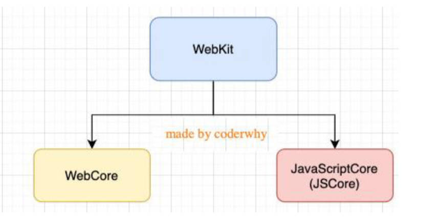

### 2.V8 引擎

V8 是用 C++ 编写的高性能 JavaScript 和 WebAssembly 引擎，它由 Google 编写并开源，用于 Chrome 和 Node.js 环境。

V8 实现 ECMAScript 和 WebAssembly 规范，并在 Windows7 或更高版本，macOS 10.12+ 和使用 x64，IA-32，ARM 或 MIPS 处理器的 Linux 系统上运行（跨平台运行）。

V8 可以独立运行，也可以嵌入到任何 C++ 应用程序中。

#### 1.V8 引擎的架构

V8 引擎执行 JavaScript 代码的流程原理，如下图所示：

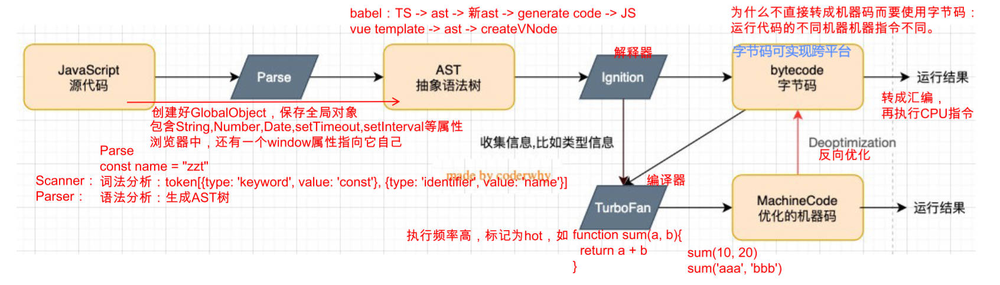

V8 引擎本身的源码非常复杂，大概有超过 100 万行 C++ 代码，通过了解它的架构，我们可以知道，它是如何执行 JavaScript 的：

理解 V8 引擎的架构。

- `Parse` 模块，会将 JavaScript 代码转成 AST（抽象语法树），再交由 ignition（解释器），这是因为 ignition（解释器）并不直接识别 JavaScript 代码。
  - 如果 JavaScript 代码中的一个函数，没有被调用，那么这个函数是不会转成 AST（抽象语法树）的。
- `Ignition` 是一个解释器，将 AST（抽象语法树）编译成字节码（ByteCode）
  - 同时会收集 TurboFan 优化所需要信息（比如：函数的参数类型信息，有了类型，才能进行真实的运算。
  - 如果函数只执行一次，ignition（解释器）会执行解释，再执行 bytecode（字节码）
- `Turbofan` 是一个编译器，它将 bytecode（字节码）编译成 CPU 可以直接执行的机器码。
  - 如果一个函数，被多次调用，那么会被标记为**热点函数**，会经过 Turbofan（编译器）转换成优化后的机器码，提高代码的执行性能。
  - 但是，机器码实际上也会被还原为 Bytecode（字节码），这是因为，如果后续执行函数的过程中，函数参数类型发生了变化，之前优化好的机器码，并不能正确的处理运算，就会逆向的转换成字节码。

#### 2.词法分析、语法分析

V8 引擎解析 JavaScript 代码的流程，如下图所示：

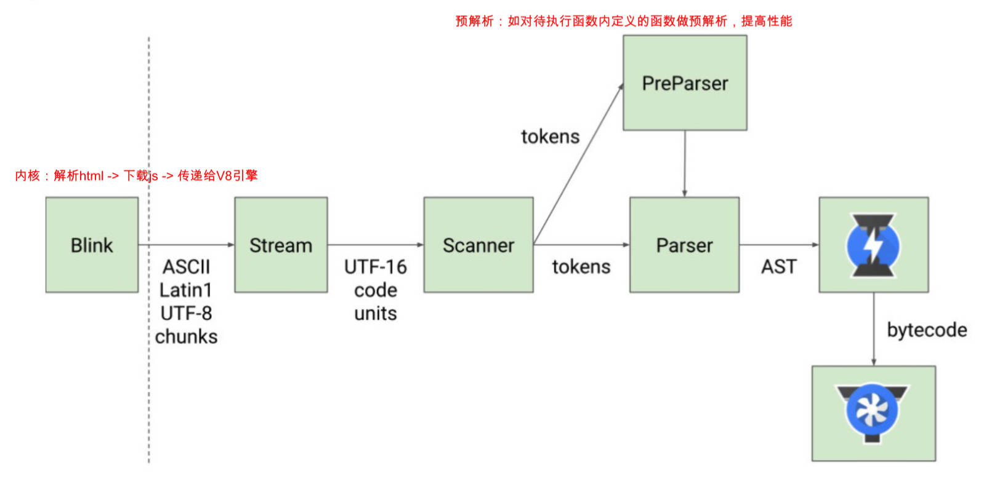

上图中有词法分析，语法分析的概念。

词法分析（lexical analysis）

- 将 JavaScript 代码的字符序列，转换成 token 序列的过程（token 是记号化 （tokenization）的缩写）。
- 词法分析器（lexical analyzer，简称 lexer），也叫扫描器（scanner）

语法分析（syntactic analysis，也叫 parsing）语法分析器也可以称之为 parser。

#### 3.V8 执行 JavaScript 的细节

说说 V8 执行 JavaScript 的细节 4 点。

1. Blink 将源码交给 V8 引擎，Stream 获取到源码并进行编码转换。
2. Scanner 会进行词法分析（lexical analysis），词法分析会将代码转换成 tokens。
3. 经过 Parser 和 PreParser，tokens 会转换成 AST 树结构。
    1. Parser 就是直接将 tokens 转成 AST 树结构。
    2. PreParser 称之为预解析，为什么需要预解析。
        1. 对所有 JS 代码解析，必然会影响网页的运行速度。所以并非所有 JS 代码，在一开始就会执行。
        2. V8 引擎实现了 Lazy Parsing（延迟解析）的方案，它的作用是将不必要的函数进行预解析，而对函数的全量解析是在函数被调用时才会进行的。
4. 生成的 AST 树，会被 ignition 转成字节码（bytecode），之后的过程就是代码的执行过程

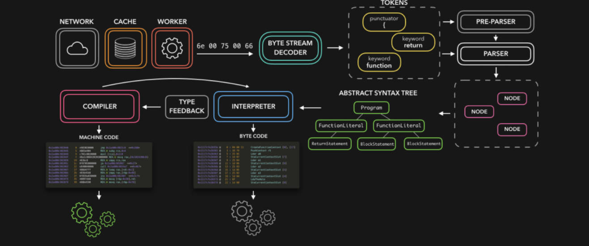

### 3.JavaScript 代码执行原理（3 个版本）

不同的 ECMAScript 版本，对于 JavaScript 代码执行的原理描述，也有不同。

事实上，它们只是在对某些概念上的描述不太一样，在整体思路上都是一致的

我们将按照：

- ECMAScript3 版本 - 介绍 JavaScript 执行原理、作用域、作用域链、闭包。
- ECMAScript5 版本 - 介绍块级作用域、let、const。
- TC39 版本（ECMAScript 未来版本）
