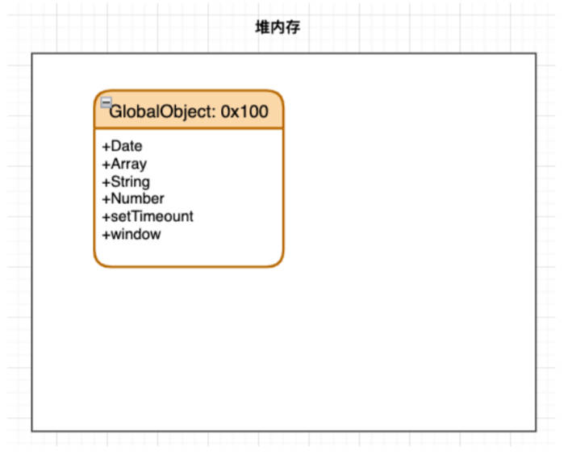
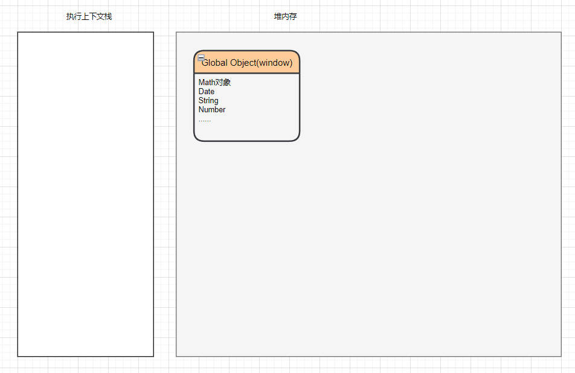
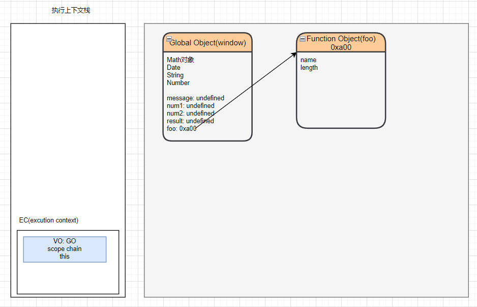
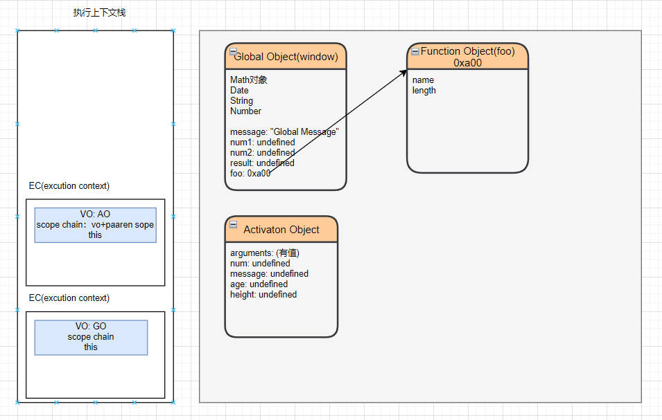
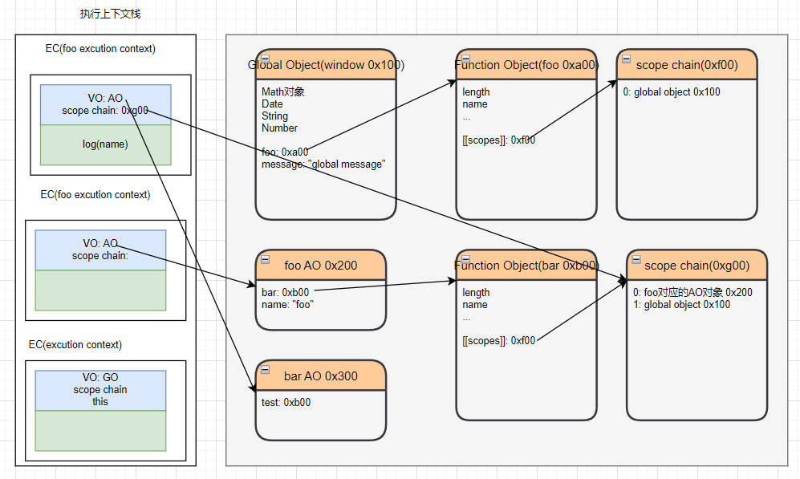
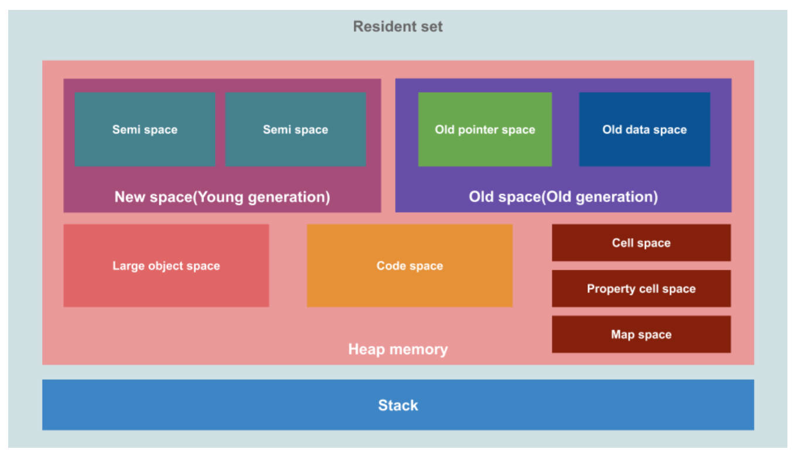
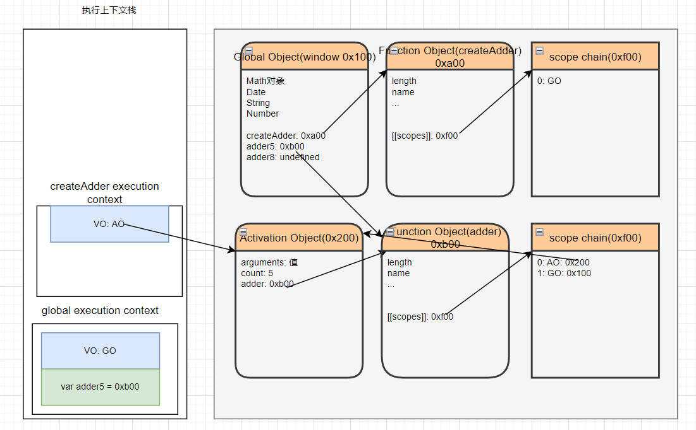
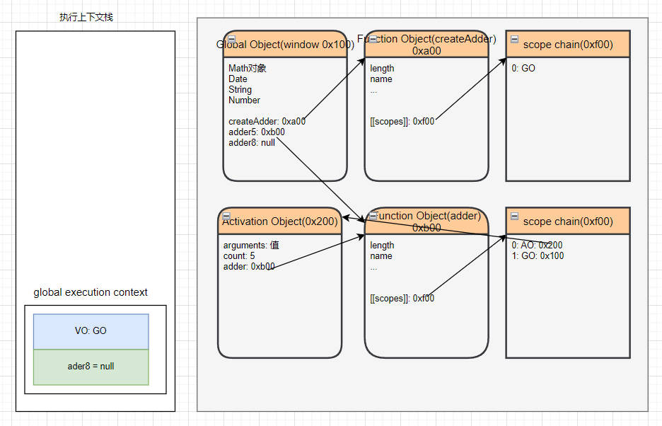

# JavaScript 执行过程内存表现

## 1.堆内存中，创建 GO 对象

JS引擎在执行代码之前会在堆内存中创建一个全局对象（Global Object GO），理解3点。理解内存图。

- GO 所有的作用域（scope）都可以访问；（作用域链最顶层）
- GO 包含 Date、Array、String、Number、setTimeout、setInterval 等等；（也都在全局执行上下文的 VO 中，也就是 GO 中）
- GO 其中还有一个window属性指向自己；（全局 this 也指向 window）



-----

JS引擎中有一个执行上下文栈（Execution Contexts Stack ECS，它是用于执行代码的调用栈。理解图片。



-----

## 2.栈内存中，创建全局执行上下文栈

接下来执行全局代码块，为此构建一个全局执行上下文（Global Execution Context GEC），将它压入到 ECS 中，理解图片。该过程包含2部分内容。

1. 在代码执行前，在 Parse 转成 AST 的过程中，会将全局定义的变量，函数等加入到 GO 中，但是并不会赋值，这个过程也称之为变量的作用域提升（hoisting）



2. 在代码执行中，对变量赋值，或者执行其他的函数。

-----

（全局）执行上下文包含的3样东西。

- VO - GO
- scope chain
- this

-----

每一个执行上下文，都会关联一个 VO（Variable Object） 对象，理解。

- 函数会添加到 VO 中，并且提前（最早）声明，如果后续有同名的变量，会把函数覆盖。
- 函数的参数也会作为属性添加到 VO 中。
- 变量也会作为属性添加到 VO 中。
- 在执行上下文栈中，执行基本数据类型的赋值，在栈空间中分配内存，执行完后销毁，但在 VO 中会被保存。

-----

## 3.函数的执行

函数是如何被执行的？

- 执行到函数时，根据函数体，创建一个函数执行上下文（Function Execution Context FEC），并压入到 ECS 中

每个执行上下文都会关联 VO，函数执行上下文关联的 VO 是 AO（Activation Object）

1. 当进入一个函数执行上下文时，会创建一个 AO 对象（Activation Object）；
2. 这个 AO 对象会使用 arguments 作为初始化，并且初始值是传入的参数；
3. 这个 AO 对象会作为执行上下文的 VO 来存放变量的初始化；



函数执行完后，函数对应的 FEC 会弹出 ECS。函数对应的 VO(AO) 是否销毁取决于内存回收机制。

-----

# 作用域链

作用域链创建的时机，

- 进入一个执行上下文时，会关联（创建）一个作用域链（Scope Chain）
- 这个作用域链，根据代码类型（全局代码，函数体代码块，with 代码块，try...catch 代码块，eval 代码块），添加一系列的对象。

什么是作用域链？

- 一个对象列表，在堆内存中函数对象的[[scope]]上。

理解下方代码对应的内存图解。

```javascript
var message = "global message"
function foo() {
  var name = "foo"
  function bar() {
    console.log(name)
  }
  return bar
}
var bar = foo()
bar()
```



> 作用域和作用域链与函数的**定义位置**有关，与函数的调用位置和调用方式无关。

> JavaScript 在执行时，内存管理为什么会采用以上设计哲学？——为了实现闭包。

-----

# 作用域提升的5道面试题

-----

# JavaScript 的内存管理

## 2种形式

不管什么编程语言，在代码执行过程中，都是需要给它分配内存的，2种形式。

1. 自动管理内存，如 Java，JavaScript，Python，Swift，Dart。
2. 手动管理内存，如C, C++，早期的 OC，都是需要手动管理内存的申请和释放的。

-----

## 生命周期。

1. 分配申请需要的内存。
2. 使用分配的内存（存放一些东西，比如对象）
3. 不需要使用时，对其进行释放。

-----

## JS为变量分配内存的2种方式。

- 基本数据类型，在执行时，直接在栈空间进行分配。
- 复杂数据类型，在堆内存中开辟一块空间，并且将这块空间的指针返回值变量引用。

-----

## 垃圾回收器（GC）

垃圾回收器的英文名Garbage Collection，简称GC，最早源于 Lisp 语言，

-----

### 常见的 GC 算法

常见的GC算法2个，并介绍。

 1. 引用计数，（用于 OC, Swift）
	- 当一个对象，有一个引用指向它时，那么这个对象的引用就+1，当一个对象的引用为0时，这个对象就可以被销毁掉。
	- 这个算法有一个很大的弊端，就是会产生循环引用。
 2. 标记清除（核心思想：**可达性** Reachability）
	- 这个算法是设置一个根对象（root object），垃圾回收器会定期从这个根开始，找所有从根开始有引用的对象，对于那些没有引用的对象，就认为是不可用的对象。
	- 这个算法可以很好解决循环引用的问题。
	- JS引擎比较广泛的采用的就是标记清除的算法。当然类似于V8引擎为了进行更好的优化，它在算法的实现细节上也会结合一些其它的算法。

-----

### 其它的 GC 算法

V8 中常见的其他 GC 算法优化。

- 标记整理（Mark-Compact）和“标记－清除”相似；
	- 不同的是，回收期间同时会将保留的存储对象搬运汇集到**连续的内存空间**，从而整合空闲空间，**避免内存碎片化**；
- 分代收集（Generational collection）——对象被分成两组：“**新生代**”和“**旧生代**”。
	- 许多对象出现，完成它们的工作并很快死去，它们可以很快被清理；
	- 那些长期存活的对象会变得“老旧”，而且被检查的频次也会减少；
- 增量收集（Incremental collection）
	- 如果有许多对象，并且我们试图一次遍历并标记整个对象集，则可能需要一些时间，并在执行过程中带来明显的延迟。
	- 所以引擎试图将垃圾收集工作分成几部分来做，然后将这几部分会逐一进行处理，这样会有许多微小的延迟而不是一个大的延迟；
- 闲时收集（Idle-time collection）

	- 垃圾收集器只会在 CPU 空闲时尝试运行，以减少可能对代码执行的影响。

理解 V8 引擎详细内存图。



-----

# 闭包

## 认识闭包

闭包的概念由来。

- 最早实现闭包的语言是 Schema，JavaScript 中有大量的设计来源于 Schema。

组成闭包的2部分。

- 函数 + 可以访问的自由变量

闭包被捕捉时，它的自由变量会被确定。即使脱离了捕捉时的上下文，闭包也能照样运行。

-----

闭包定义的3点总结。

1. 一个普通的函数，如果它可以访问外层作用域的自由变量，那么这个函数就是一个闭包。
2. 从广义的角度来说，JavaScript 中的函数都是闭包；
3. 从狭义的角度来说，如果 Javascript 中的函数访问了外层作用域的变量，那么它是一个闭包；

-----

理解 createAdd 函数案例的内存图。

```javascript
function createAdder(count) {
  function adder(num) {
    return count + num
  }
  return adder
}
var adder5 = createAdder(5)
adder5(100)
var adder8 = createAdder(8)
```



当 createAdd 执行完后，它的 AO 没有被回收，因为 GO 中还有引用指向它。这样可能导致内存泄漏。



------

## 闭包的内存泄露

什么是闭包的内存泄漏？

- 引用闭包的外层作用域变量（函数），不会再使用，但闭包关联的对象无法释放的情况，称为闭包的内存泄漏。
- 以上案例中，`adder5, adder8` 函数如果不再使用，那么会造成内存泄漏。

-----

## 如何解决闭包的内存泄露

怎么解决闭包的内存泄露？

- 将全局中引用了闭包的变量（函数）置为 null，那么该函数作用域链中，上层作用域 AO 对象就不可达了，
- 在 GC 的下一次检测中，它们会被释放。

-----

## 内存泄漏实验

内存泄漏实验，3点注意事项。

- 浏览器调试工具中 Memory 可以生成内存占用快照。
- V8 引擎的实现中，一个整数占据4个字节（原来是8个）
- ECMA 规范中闭包依赖的整个词法环境都不会被消除，而 V8 引擎中删除了没有依赖的变量。