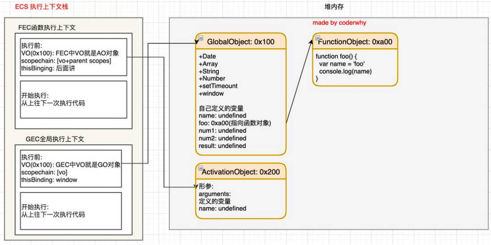

# JavaScript 执行过程、作用域链、JavaScript 内存管理、JavaScript 闭包

## 一、JavaScript 全局代码执行过程

下面的代码，是如何执行的？

```javascript
var name = 'zzt'

function foo() {
  var name = 'foo'
  console.log(name) // foo
}

var num1 = 20
var num2 = 30
var sum = num1 + num2

console.log(sum) // 50

foo()
```

### 1.在堆内存中，初始化全局对象（GO）

js 引擎，在执行代码之前，会在堆内存中，创建一个全局对象：**Global Object（GO）**

- GO 可以被所有的作用域（scope）访问；（GO 是作用域链最顶层）
- GO 里面包含 Date、Array、String、Number、setTimeout、setInterval 等等全局属性；（它们也都在全局执行上下文的 VO 中，也就是 GO 中）
- GO 里面还有一个 window 属性，指向自己；（全局 this 也指向 window）


### 2.栈内存中，创建全局执行上下文（GEC）

#### 1.执行上下文栈（ECS）

js 引擎内部，有一个**执行上下文栈（Execution Context Stack，ECS）**的概念，它是用于执行代码的调用栈。


那么现在，它要执行的是全局的代码块：

#### 2.全局执行上下文（GEC）

全局的代码块为了执行，会构建一个**全局执行上下文（Global Execution Context，GEC）**；

全局执行上下文（GEC），会被压入到执行上下文栈（ECS）中执行；这个过程中，需要理解两点：

1. 代码执行前，JavaScript 引擎中，在代码经由 parser 模块，转成抽象语法树（AST）的过程中，会将全局定义的变量、函数等等全局属性，加入到 Global Object（GO）中，但是并不会赋值；这个过程也称之为变量的**作用域提升（hoisting）**。
2. 在代码执行中，对变量赋值，或者执行其他的函数；


全局执行上下文（GEC），或者说所有的执行上下文中，都包含了 3 样东西：

- VO 对象（全局执行上下文（GEC）中就是 GO 对象）
- 作用域链 scope chain
- this

#### 3.VO 对象

每一个执行上下文，都会关联一个 VO（Variable Object） 对象，他表示一个变量对象。

- 执行上下文中的函数，会添加到 VO 中，并且提前（最早）声明，如果后续有同名的变量，会把函数覆盖。
- 执行上下文中的函数的参数，也会作为属性添加到 VO 中。
- 执行上下文中的变量，也会作为属性添加到 VO 中。
- 执行上下文中，基本数据类型的赋值，会在栈空间中分配内存，执行上下文执行完成后直接被销毁，但它们在 VO 中会被保存。

总结：JavaScript 全局代码执行过程，

在执行前：


在执行后：


## 二.JavaScript 函数的执行过程

在 JavaScript 代码执行的过程中，执行到函数时，根据函数体，创建一个**函数执行上下文（Function Execution Context，FEC）**，并压入到执行上下文栈（ECS）中。

### 1.在栈内存中，创建函数执行上下文（FEC）

每个执行上下文，都会关联 VO 对象。

函数执行上下文（FEC），关联的 VO 是 AO（Activation Object）对象。

#### 1.AO 对象

1. 当进入一个函数执行上下文执行代码时，会创建一个 AO 对象（Activation Object）；
2. 这个 AO 对象，会使用函数的 arguments 对象属性，来初始化；并且初始值是传入的参数；
3. 这个 AO 对象，会作为执行上下文的 VO，来存放变量的初始化；


总结：Javascript 函数执行的过程：

执行之前：



执行之后：


函数执行完后，函数对应的函数执行上下文（FEC），会弹出执行上下文栈（ECS）。

函数执行上下文中，对应的 VO（AO）是否销毁，取决于内存回收机制。

## 三、作用域、作用域链

当进入到一个执行上下文时，执行上下文也会关联（创建）一个作用域链（Scope Chain）

作用域链，是一个对象列表，在堆内存中函数对象的 `[[scope]]` 上，用于变量标识符的求值；

这个作用域链，根据代码类型（全局代码，函数体代码块，with 代码块，try...catch 代码块，eval 代码块）的不同，添加一系列不同的对象。

现有一段代码如下：

```javascript
var message = 'global message'

function foo() {
  var name = 'foo'

  function bar() {
    console.log(name)
  }

  return bar
}

var bar = foo()

bar()
```

上方代码，对应的内存图解如图所示：


作用域和作用域链，与函数的**定义位置**有关，与函数的调用位置和调用方式无关。

JavaScript 在执行时，内存管理采用以上的设计哲学，实际上是为了实现闭包。

## 四、作用域提升面试题

### 1.面试题一

```javascript
var n = 100

function foo() {
  n = 200
}

foo()

console.log(n) // 200
```

### 2.面试题二

```javascript
function foo() {
  console.log(n) // undefined

  var n = 200

  console.log(n) // 200
}

var n = 100

foo()
```

### 3.面试题三

```javascript
var a = 100

function foo() {
  console.log(a) // undefined

  return

  var a = 200
}

foo()
```

### 4.面试题四

```javascript
function foo() {
  var a = b = 10
}

foo()

console.log(a); // 报错：a is not defined
console.log(b) // 10
```

> 作用域知识点补充：
>
> ```javascript
> function foo() {
>   m = 100 // v8 引擎会将没加 var 定义的变量，放到全局对象上。
> }
>
> foo()
> console.log(m)
> ```

### 5.面试题五

```javascript
var n = 100

function foo1() {
  console.log(n) // 100
}

function foo2() {
  var n = 200
  console.log(n) // 200
  foo1()
}

foo2()
console.log(n) // 100
```

## 五、内存管理

不管什么样的编程语言，在代码的执行过程中，都是需要给它分配内存的，不同的是：

- 某些编程语言，需要开发者**手动管理内存**，
  - 比如：C、C++，包括早期的 OC，都是需要手动来管理内存的申请和释放的（比如使用 `malloc` 和 `free` 函数）；

- 某些编程语言，可以**自动管理内存**：
  - 比如：Java、JavaScript、Python、Swift、Dart 等等，它们会自动帮助开发者管理内存；

### 1.内存管理的生命周期

不管以什么样的方式，来管理内存，都会有如下的生命周期：

- 第一步：分配需要申请的内存（申请）；
- 第二步：使用分配的内存（存放一些东西，比如对象……）；
- 第三步：不需要使用内存时，对其进行释放；

不同的编程语言，对于内存管理生命周期中的第一步和第三步，会有不同的实现：

## 六、JavaScript 内存管理

对于开发者来说，JavaScript 的内存管理是自动的、无形的。

- 我们创建的原始值、对象、函数……这一切都会占用内存；
- 然而，我们并不需要手动来对它们进行管理，JavaScript 引擎，会帮助我们处理好它；

JavaScript 会在定义数据时，为它自动分配内存。不同数据类型，内存分配方式也不同：

- 对于原始数据类型，内存的分配会在执行时，直接在栈空间进行分配；
- 对于复杂数据类型，内存的分配会在堆内存中开辟一块空间，并且将这块空间的指针返回值变量引用；

### 1.JavaScript 的垃圾回收器（GC）

垃圾回收器（Garbage Collection，GC），是最早源于 Lisp 语言的一种概念，用于内存的释放，

计算机的内存是有限的，当分配的内存不再需要使用的时候，应对其进行释放，以便腾出更多的内存空间。

在手动管理内存的语言中，我们需要通过一些方式，自己来释放不再需要的内存，比如 `free` 函数：

- 这种手动管理的方式，其实非常的低效，影响开发者编写代码业务逻辑的效率；
- 并且这种方式，对开发者的要求也很高，一不小心就会产生内存泄露；

所以大部分现代的编程语言，都是有自己的垃圾回收机制：

- 对于那些不再使用的占用内存的数据（通常是对象），我们都称之为是垃圾，它需要被回收，以释放更多的内存空间；
- 而我们的语言运行环境，比如 Java 的运行环境 JVM，JavaScript 的运行环境 JS 引擎，都有内存垃圾回收器；

这里又出现了另外一个很关键的问题：GC 怎么知道哪些数据（通常是对象）是不再使用的呢？这就涉及到 GC 的实现，以及对应的算法了。

### 2.垃圾回收器（GC）的算法

常见的 GC 算法有 2 个：

#### 1.引用计数算法

被用于 OC, Swift 等等编程语言。

- 当一个对象，有一个引用指向它时，那么这个对象的引用就 +1；
- 当一个对象的引用为 0 时，这个对象就可以被销毁掉。

这个算法有一个很大的弊端，就是无法解决循环引用的问题。


#### 2.标记清楚算法

核心思想是：**可达性（Reachability）**

- 这个算法是设置一个根对象（root object），垃圾回收器会定期从这个根开始，找所有有引用的对象，对于那些没有引用的对象，就认为是不可用的对象。
- 这个算法可以很好解决循环引用的问题。

JS 引擎，比较广泛采用的，就是标记清除的算法。


当然类似于 V8 这样的引擎，为了进行更好的优化，它在算法的实现细节上，也会结合一些其它的算法。

#### 3.其它的 GC 算法

V8 引擎中，常见的其他 GC 算法优化。

- **标记整理（Mark-Compact）**和“标记清除”相似；
  - 不同的是，垃圾回收期间，同时会将保留的存储对象，搬运汇集到**连续的内存空间**，从而整合空闲空间，**避免内存碎片化**；
- **分代收集（Generational collection）**——对象被分成两组：“**新生代**”和“**旧生代**”。
  - 许多对象出现，完成它们的工作并很快死去，它们可以很快被清理；
  - 那些长期存活的对象，会变得“老旧”，而且被检查的频次也会减少；
- **增量收集（Incremental collection）**
  - 如果有许多对象，并且我们试图一次遍历并标记整个对象集，则可能需要一些时间，并在执行过程中带来明显的延迟。
  - 所以引擎试图将垃圾收集工作分成几部分来做，然后将这几部分会逐一进行处理，这样会有许多微小的延迟而不是一个大的延迟；
- **闲时收集（Idle-time collection）**
- 垃圾收集器只会在 CPU 空闲时尝试运行，以减少可能对代码执行的影响。

理解 V8 引擎详细内存图。


## 七、JavaScript 闭包

闭包是 JavaScript 中一个非常容易让人迷惑的概念：

### 1.JavaScript 函数式编程

在前面我们说过，JavaScript 是支持函数式编程的

在 JavaScript 中，函数是非常重要的，它是一等公民：那么就意味着

- 在 JavaScript 中，函数的使用，是非常灵活的；
- 在 JavaScript 中，函数可以作为另外一个函数的参数，也可以作为另外一个函数的返回值来使用；

所以 JavaScript 中，存在很多的高阶函数，我们可以：

- 自己编写高阶函数；
- 使用内置的高阶函数。

> 目前在 vue3、react 开发中，也都在趋向于函数式编程：
>
> - vue3 composition api: setup 函数 -> 代码（函数 hook，定义函数）；
> - react：class -> function -> hooks

### 2.闭包的定义

在计算机科学中，和在 JavaScript 编程语言中，都有对“闭包”概念的定义：

在计算机科学中，对闭包的定义（维基百科）：

- 闭包（英语：Closure），又称词法闭包（Lexical Closure）或函数闭包（function closures）；
- 是在支持头等函数的编程语言中，实现词法绑定的一种技术；
- 闭包在实现上是一个结构体，它存储了一个函数和一个关联的环境（相当于一个符号查找表）；
- 闭包跟函数，最大的区别在于，当捕捉闭包的时候，它的自由变量会在捕捉时被确定，这样即使脱离了捕捉时的上下文，它也能照常运行；

闭包的概念，出现于 60 年代，最早实现闭包的程序是 Scheme，那么我们就可以理解为什么 JavaScript 中有闭包：因为 JavaScript 中有大量的设计，是来源于 Scheme 的；

我们再来看一下 MDN 对 JavaScript 闭包的解释：

- 一个函数和对其周围状态（lexical environment，词法环境）的引用捆绑在一起（或者说函数被引用包围），这样的组合就是闭包（closure）；
- 也就是说，闭包让你可以在一个内层函数中，访问到其外层函数的作用域；
- 在 JavaScript 中，每当创建一个函数，闭包就会在函数创建的同时，被创建出来；

那么我的理解和总结：

- 一个普通的函数 function，如果它可以访问外层作用域的自由变量，那么这个函数和周围环境，就是一个闭包；
- 从广义的角度来说：JavaScript 中的函数都是闭包；
- 从狭义的角度来说：JavaScript 中的一个函数，如果访问到了外层作用域的变量，那么它才是一个闭包；

组成闭包的 2 部分。

- 函数 + 可以访问的自由变量

### 2.闭包的访问过程

现有一段代码如下。

```javascript
function createAdder(count) {

  function adder(num) {
    return count + num
  }

  return adder
}

var adder5 = createAdder(5)

adder5(100)

var adder8 = createAdder(8)
```

代码执行前，闭包的访问过程如下：


### 3.闭包的访问过程

函数开始执行：

- 当 createAdder 函数执行完毕，正常情况下它的执行上下文关联的 AO 对象，会被释放；
- 但是，因为在 GO 中有 0xb00 的引用（`adder5` 函数）中有作用域引用，指向了这个AO对象，所以它不会被 GC 释放掉；

当 `createAdd` 函数执行完后，它的 AO 没有被回收，因为 GO 中还有引用指向它。这样可能导致内存泄漏。


### 4.闭包的内存泄露

那么我们为什么经常会说闭包是有内存泄露的呢？

- 在上面的案例中，如果后续我们不再使用 `adder5`、`adder8` 函数了，那么该函数对象，应该要被销毁掉，并且其引用着的父作用域AO也应该被销毁掉；
- 但是，目前因为在全局作用域下，`adder5` 变量对 `0xb00` 的函数对象有引用；
- 而 `0xb00` 的作用域中，有对 AO（`0x200`）的引用，所以最终会造成这些内存都是无法被释放掉；
- 我们经常说的闭包会造成内存泄露，其实就是因为上述情况中，作用域链中引用的对象（AO）无法被释放掉；

闭包的内存泄漏，总结来说：

- 以上案例中，`adder5, adder8` 函数如果不再使用，那么会造成内存泄漏。
- 引用闭包的外层作用域变量（函数），不会再使用，但闭包关联的对象无法释放的情况，称为闭包的内存泄漏

那么，怎么解决闭包的内存泄漏这个问题呢？

- 将全局的 `adder5`，`adde8` 引用设置为 `null` 时，就不再对函数对象 `0xb00` 有引用；
- 那么对应的 AO 对象 `0x200` 也就不可达了；
- 在 GC 的下一次检测中，它们就会被销毁掉；

### 5.闭包的内存泄漏实验

内存泄漏实验，3 点注意事项。

- 浏览器调试工具中 Memory 可以生成内存占用快照。
- V8 引擎的实现中，一个整数占据 4 个字节（原来是 8 个）
- ECMA 规范中闭包依赖的整个词法环境都不会被消除，而 V8 引擎中删除了没有依赖的变量。
