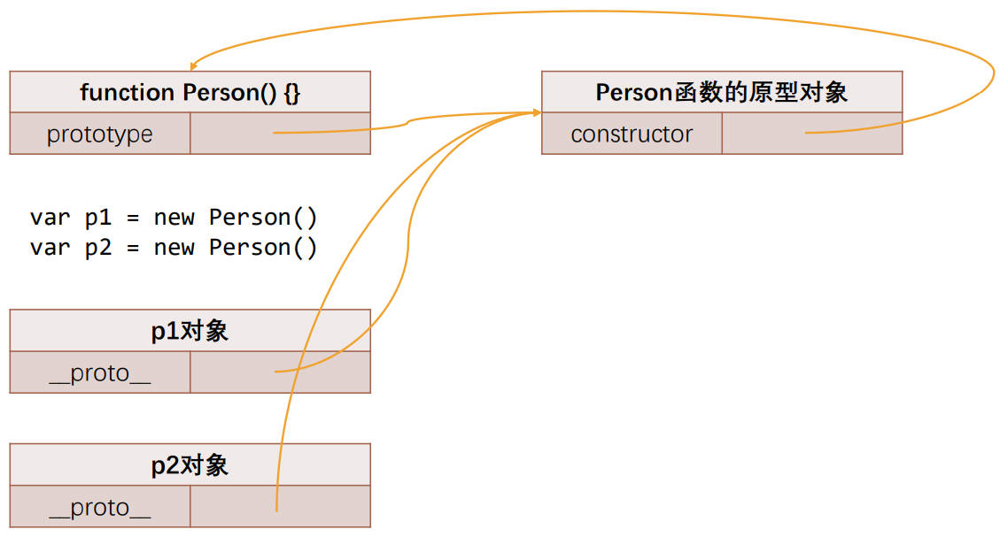
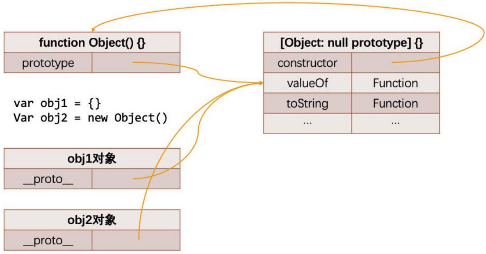
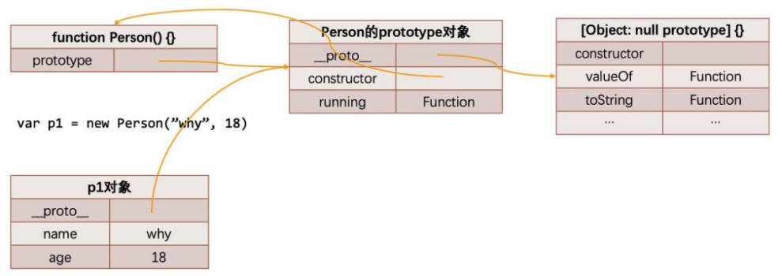

# 原型、面向对象、ES5 继承

## 一、对象的原型

JavaScript 中，每个对象都有一个特殊的内置属性 [[prototype]]，它被称为对象的**隐式原型**，这个特殊的对象可以指向另外一个对象。

当我们通过引用对象的属性 key 来获取对应的 value 时，会触发 [[Get]] 的操作；这个操作，会首先检查该对象是否有对应的属性：

- 如果有的话，就使用它；

- 如果没有，那么会访问对象隐式原型 [[prototype]] 内置属性指向的对象上的属性；

通过字面量，直接创建一个对象，这个对象也会有这样一个 [[prototype]] 内置属性；只要是对象就都会有。

获取对象的隐示原型 [[prototype]] 的方式有两种：

- 方式一：通过对象的 `__proto__` 属性，可以获取到（这种方式是早期浏览器添加的，存在一定的兼容性问题）；
- 方式二：通过 [Object.getPrototypeOf()](https://developer.mozilla.org/zh-CN/docs/Web/JavaScript/Reference/Global_Objects/Object/getPrototypeOf) 方法可以获取到；

```javascript
const obj = { name: 'zzt', age: 18 }

obj.__proto__ === Object.getPrototypeOf(obj) // true
```

## 二、函数的原型

上述对象的隐式原型，对于构造函数创建对象来说，有着重要的意义。

这里要引入一个新的概念：在 JavaScript 中，所有的函数（除箭头函数）都有一个`prototype` 的属性（注意：不是 `__proto__`），称为**显示原型**。

并非因为函数是一个对象，所以它有 `prototype` 的属性，而是因为它是一个函数，才有了这个特殊的属性；

```javascript
function foo() {}

console.log(foo.prototype)
```

构造函数，在通过 `new` 操作符，创建对象时，将这个显式原型，赋值给创建出来对象的隐式原型。

我们前面讲过 `new` 操作符和构造函数创建对象，会经历如下步骤：

1. 在内存中创建一个新的空对象；
2. 这个空对象的隐式原型 [[prototype]] 会指向构造函数的显示原型 `prototype`（即新对象会被执行 prototype 连接）；
3. 这个空对象会绑定到函数调用的 this 上（this 的绑定在这个步骤完成）；
4. 执行构造函数中的代码。
5. 如果构造函数没有返回其他对象，表达式会返回这个新对象；

那么也就意味着我们通过 Person 构造函数，创建出来的所有对象的 [[prototype]] 隐式原型，都指向 `Person.prototype`：

```javascript
function Person(name, age) {
  this.name = name
  this.age = age
}

Person.prototype.running = function () {
  console.log(this.name + 'running')
}
```

 将所有的实例方法定义，放到构造函数的显式原型上，当构造函数创建多个实例对象时，

- 可节省内存中函数占用的空间；
- 也方便用于继承。

### 1.prototype 的 constructor 属性

函数的显示原型对象 `prototype` 上，有一个 `constructor` 属性，它指向当前的函数对象。

```javascript
function Foo() {}

Foo.prototype.constructor === Foo // true
```



下面的代码创建对象的内存表现如图所示：

```javascript
function Person(name, age) {
  this.name = name
  this.age = age
}

Person.prototype.running = function () {
  console.log('running~')
}

var p1 = new Person('why', 18)
var p2 = new Person('kobe', 30)

// 新增属性
Person.prototype.address = '中国'
p1.__proto__.info = '中国很美丽!'
p1.height = 1.88
p2.isAdmin = true

// 获取属性
console.log(p1.address) // 中国
console.log(p2.isAdmin) // true
console.log(p1.isAdmin) // undefined
console.log(p2.info) // 中国很美丽

// 修改 address
p1.address = '广州市'
console.log(p2.address) // 中国
```


### 2.prototype 重写

当需要在函数的原型对象上，添加过多的属性时，通常我们会重写整个原型对象。比如：

- 为 `Foo` 构造函数的 `prototype` 赋值一个新对象时，这个新对象的 `constructor` 属性，会指向 `Object` 构造函数，而不是 `Foo` 构造函数。

如果希望 `constructor` 属性，指向 `Person` 构造函数，需要使用属性描述符，进行手动添加，如下方代码所示：

```javascript
function Foo() {}

Foo.prototype = {
  message: 'Hello Foo',
  running: function () {}
}

Object.defineProperty(Foo.prototype, 'constructor', {
  configurable: true,
  writable: true,
  // 当使用 defineProperty 方法设置属性描述符时，enumerable 默认为 false
  value: Foo
})
```

因为函数原型对象 `prototype` 上的 `constructor` 属性，默认是不可枚举的，所以使用 `Object.defineProperty` 方法，对函数原型对象 `prototype` 进行设置。

### 3.构造函数和它的 prototype

使用构造函数的方式，创建对象时，有一个弊端：如果将对象要共用的函数，放在 this 对象中，那么当创建多个对象时，也会创建出重复的函数，

- 比如 `running`、`eating` 这些函数。

```javascript
function Person(name, age, height, address) {
  this.name = name
  this.age = age
  this.height = height
  this.address = address

  this.eating = function () {
    console.log(this.name, 'eating')
  }
  this.running = function () {
    console.log(this.name, 'running')
  }
}
```

对上方代码，进行优化：

将这些函数，放到构造函数的原型对象上（比如：`Foo.prototype`），那么就可以让所有创建出的对象，共享这些函数。

```javascript
function Person(name, age, height, address) {
  this.name = name
  this.age = age
  this.height = height
  this.address = address
}

Person.prototype.eating = function () {
  console.log(this.name, 'eating')
}

Person.prototype.running = function () {
  console.log(this.name, 'running')
}

var p1 = new Person('zzt', 18, 1.88, '深圳市')
var p2 = new Person('kobe', 38, 1.98, '北京市')

p1.eating()
p2.running()
```

## 三、面向对象

面向对象的 3 大特性。

- **封装**：可以将属性和方法，封装到一个类（构造函数）中，这个过程称之为封装；
- **继承**：不仅可以将重复代码抽取到父类中，也是多态前提（纯面向对象中）；
- **多态**：不同的对象，在执行同一操作时表现出不同的形态；

### 1.继承

这里我们核心介绍继承，它与后面要讲的 JavaScript 原型链有关。

- 继承可以将重复的代码和逻辑，抽取到父类中，子类只需要直接继承过来使用即可；
- 在很多编程语言中，继承也是多态的前提；

JavaScript 当中要实现继承，就需要使用 JavaScript 原型链的机制；

## 四、JavaScript 继承

### 1.JavaScript 原型链

在实现继承之前，我们先来理解一个非常重要的概念：**原型链**。

- 我们知道，从一个对象上获取属性，如果在该对象中没有获取到，就会去它的原型上面获取：

事实上，当我们直接使用字面量 `{}` 的方式，创建一个对象时，它的隐式原型 [[prototype]] 就指向了 `Object` 构造函数的显示原型对象 `prototype`，

`Object` 构造函数的显示原型 `prototype` 对象上，有很多默认的属性和方法，该对象上也有隐式原型 [[prototype]]，但是它已经指向 `null`，也就是已经是顶层原型了；



我们可以为对象的隐式原型，赋值一个新对象，来组成原型链，如下方代码所示：

```javascript
const obj = { name: 'zzt', age: 18 }

obj.__proto__ = {}

obj.__proto__.__proto__ = {}

obj.__proto__.__proto__.__proto__ = { address: '北京市' }
```

上方代码的内存表现，如下图所示：


### 2.Object 类

在 JavaScript 中，`Object` 类（构造函数）是所有类（构造函数）的父类。

从上面的 `Object` 构造函数的原型，我们可以得出一个结论：原型链最顶层的原型对象，就是 `Object` 的原型对象。

```javascript
function Person(name, age) {
  this.name = name;
  this.age = age;
}

Person.prototype.running = function () {
  console.log(this.name, "running");
};

var p1 = new Person('zzt', 18)

console.log(p1)
console.log(p1.valueOf())
console.log(p1.toString())
```

上方代码，在原型链上的表现如下：



### 3.JavaScript 构造函数（类）属性继承

定义一个 `Person` 构造函数，再定义一个 `Student` 构造函数，使它继承 `Person` 构造函数。

#### 1.方式一：重写属性

在子类中，重新写一遍需要继承的属性；

```javascript
// Person 构造函数(类)
function Person(name, age, height, address) {
  this.name = name
  this.age = age
  this.height = height
  this.address = address
}

Person.prototype.running = function () {
  console.log('running~')
}
Person.prototype.eating = function () {
  console.log('eating~')
}

// Student 构造函数（类）
function Student(name, age, height, address, sno, score) {
  this.name = name
  this.age = age
  this.height = height
  this.address = address
  this.sno = sno
  this.score = score
}
```

这种方式显然不好，有过多的重复操作。

#### 2.方式二：借用构造函数（推荐）

**借用构造函数（constructor stealing）**也称之为**经典继承**或者**伪造对象**，用它来实现构造函数属性的继承，代码如下：

做法非常简单：就是在子类型构造函数的内部，调用父类型构造函数.

- 因为函数可以在任意的时刻被调用；所以通过 `apply` 和 `call` 方法，也可以在新创建的对象的同时，执行父类构造函数；

```javascript
// Person 构造函数(类)
function Person(name, age, height, address) {
  this.name = name
  this.age = age
  this.height = height
  this.address = address
}

Person.prototype.running = function () {
  console.log('running~')
}
Person.prototype.eating = function () {
  console.log('eating~')
}

// Student 构造函数（类）
function Student(name, age, height, address, sno, score) {
  // 重点: 借用构造函数
  Person.call(this, name, age, height, address)

  this.sno = sno
  this.score = score
}
```

### 2.JavaScript 构造函数（类）函数继承

定义一个 `Person` 构造函数，再定义一个 `Student` 构造函数，使它继承 `Person` 构造函数。

#### 1.方式一：原型链继承

这种方式，有 2 种错误的写法.

写法一（错误）：父类原型直接赋值给子类原型。

- 这显然是错误的做法，父类和子类共享同一个原型对象，修改了任意一个，另外一个也被修改。

```javascript
// Person 类
function Person() {
  this.name = 'zzt'
}

Person.prototype.running = function () {
  console.log(this.name, 'running')
}

// Students 类
function Student() {
  this.sno = 111
}

Student.prototype = Person.prototype

Student.prototype.studying = function () {
  console.log(this.sno, 'studying')
}

Student.prototype = Person.prototype
```

写法二（有缺陷）：创建一个父类的实例对象 ，用这个实例对象来作为子类的原型对象

- 这是有缺陷的做法，子类原型上，会有很多父类实例对象上的属性，是无用的。

```javascript
// Person 类
function Person() {
  this.name = 'zzt'
}

Person.prototype.running = function () {
  console.log(this.name, 'running')
}

// Students 类
function Student() {
  this.sno = 111
}

// 创建父类对象，并且作为子类的原型对象。
var p = new Person()

Student.prototype = p  // 该行代码不能调换顺序。

Student.prototype.studying = function () {
  console.log(this.sno, 'studying')
}
```

将**借用构造函数（constructor stealing）继承**和**原型链继承**组合起来实现继承的方式，称为**组合借用继承**。它存在以下问题：

- 无论在什么情况下，都会调用两次父类构造函数：
  - 一次在创建子类（构造函数）原型对象的时候，比如：`var p = new Person()`；
  - 另一次在子类（构造函数）内部，也就是每次创建子类实例的时候，比如：`Person.call(this, name, age, height, address)`；

- 所有的子类实例，事实上会拥有两份父类的属性：
  - 一份在子类的实例对象里面（也就 `stu`）；
  - 另一份在子类的实例对象的隐式原型对象中（也就是 `stu.__proto__` 里面）；

当然，这两份属性，我们无需担心访问出现问题，因为默认一定是访问实例本身这一部分的；

#### 2.方式二：原型式继承（推荐）

原型式继承的渊源，要从道格拉斯·克罗克福德（Douglas Crockford，JSON 的创立者）在 2006 年写的一篇文章说起:
《Prototypal Inheritance in JavaScript》（《在 JavaScript 中使用原型式继承》）

- 在这篇文章中，它介绍了一种继承方法，而且这种继承方法，不是通过构造函数来实现的。

为了理解这种方式，我们先再次回顾一下 JavaScript 想实现继承的目的：

- 重复利用另外一个对象的属性和方法.。
- 最终的目的：子类实例对象的原型链上，有父类（构造函数）的显示原型对象。

实现原型式继承，创建子类的原型链，将它与父类的原型对象关联，有三 种方案。

第一种方案

```javascript
Object.create(Supertype.prototype) // 返回一个对象，这个对象的隐式原型指向obj对象
```

第二种方案

```javascript
function createObj1(obj) {
  var newObj = {}

  Object.setPrototypeOf(newObj, obj)

  return newObj
}

createObj1(Supertype.prototype)
```

第三种方案，道格拉斯的写法，兼容性最好的写法。

```javascript
function cerateObj2(obj) {
  function Fn() {}

  Fn.prototype = obj

  return new Fn()
}

cerateObj2(Supertype.prototype)
```

##### 1.寄生式继承

寄生式继承函数，是由道格拉斯提出的，它是与原型式继承紧密相连的思想。

它是结合原型式继承和工厂模式的一种实现方式。

即创建一个封装继承过程的函数，该函数在内部以某种方式来增强对象，最后再将这个对象返回；

```javascript
// 寄生式函数
function inherit(Subtype, Supertype) {
  Subtype.prototype = createObject2(Supertype.prototype)

  Object.defineProperty(Subtype.prototype, 'constructor', {
    configurable: true,
    writable: true,
    value: Subtype
  })
}
```

##### 2.寄生组合式继承（最终方案）

现在，寄生式继承可以解决**原项链继承**的问题，

那么，将**寄生式继承**结合**借用构造函数继承**，就可实现**寄生组合式继承**。

- 你需要先明确一点: 当我们在子类型的构造函数中，调用 `父类型.call(this, 参数)` 这个函数的时候，就会将父类型中的属性和方法，复制一份到子类型中，所以父类型本身里面的内容，我们不再需要。
- 这个时候, 我们还需要获取到一份父类型的原型对象中的属性和方法。

实现**寄生组合式继承**的最终继承方案。

```javascript
/*
寄生式继承，要满足的条件:
  1.必须创建出来一个对象
  2.这个对象的隐式原型，必须指向父类的显式原型
  3.将这个对象赋值给子类的显式原型
*/

function cerateObj2(obj) {
  function Fn() {}
  Fn.prototype = obj
  return new Fn()
}

function inherit(Subtype, Supertype) {
  Subtype.prototype = createObject2(Supertype.prototype)

  Object.defineProperty(Subtype.prototype, 'constructor', {
    configurable: true,
    writable: true,
    value: Subtype
  })
}

// 父类
function Person(name, age, height) {
  this.name = name
  this.age = age
  this.height = height
}

Person.prototype.running = function () {
  console.log('running~')
}
Person.prototype.eating = function () {
  console.log('eating~')
}

// 子类
function Student(name, age, height, sno, score) {
  Person.call(this, name, age, height)
  this.sno = sno
  this.score = score
}

// 子类继承父类
inherit(Student, Person)

Student.prototype.studying = function () {
  console.log('studying')
}
```

## 五、函数、对象原型继承关系图


由上图可知：

1. `f1` 是 `Foo` 的实例对象。
2. `obj` 是 `Object` 的实例对象。
3. `Function` / `Object` / `Foo` 都是 `Function` 的实例对象。
4. 原型对象默认创建时，隐式原型都是指向 `Object` 构造函数的显示原型的，而 `Object` 构造函数的显示原型中的隐式原型指向 `null`。
5. `Object` 是 `Foo` / `Function` 的父类。

## 六、JavaScript 常用对象操作

[Object.prototype.hasOwnProperty()](https://developer.mozilla.org/zh-CN/docs/Web/JavaScript/Reference/Global_Objects/Object/hasOwnProperty) 方法，用于判断对象是否有某一个属于自己的属性（不包含原型上的属性）

```javascript
info.hasOwnProperty('address')
```

`in` 操作符，`for in` 操作符，用于判断某个属性，是否在某个对象或者对象的原型上。

```javascript
'address' in info
```

`instanceof` 操作符，用于检测构造函数（类）的 `pototype`，是否出现在某个实例对象的原型链上

```javascript
const stu = new Student()
console.log(stu instanceof Student) // true
console.log(stu instanceof Object) // true
```

[Object.prototype.isPrototypeOf()](https://developer.mozilla.org/zh-CN/docs/Web/JavaScript/Reference/Global_Objects/Object/isPrototypeOf) 方法，用于检测某个对象，是否出现在某个实例对象的原型链上

```javascript
Student.prototype.isPrototypeOf(stu)

Person.prototype.isPrototypeOf(stu)
```

> 总结对象属性的获取方法：
>
> - [Object.prototype.hasOwnProperty()](https://developer.mozilla.org/zh-CN/docs/Web/JavaScript/Reference/Global_Objects/Object/hasOwnProperty)  方法，用于判断对象自身是否有可枚举属性。
> - [Object.keys()](https://developer.mozilla.org/zh-CN/docs/Web/JavaScript/Reference/Global_Objects/Object/keys) 方法，用于获取对象自身的可枚举属性
> - `in`、`for...in` 操作符，用于获取对象和对象原项链上的可枚举属性。
> - [Object.getOwnPropertyNames()](https://developer.mozilla.org/zh-CN/docs/Web/JavaScript/Reference/Global_Objects/Object/getOwnPropertyNames) 方法，用于获取对象自身的所有属性（包括不可枚举属性，但不包括使用 symbol 值作为名称的属性）。
