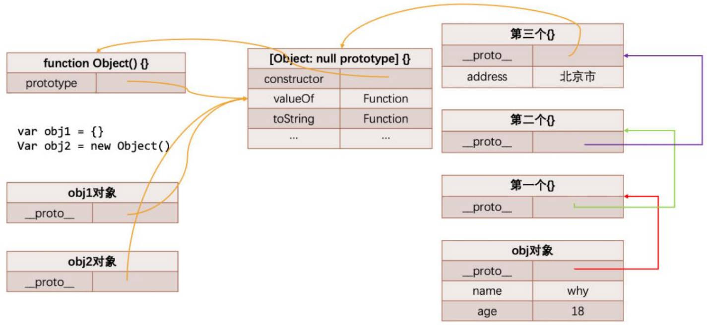

# 原型的理解

对象获取隐示原型的2种方式。

- 通过对象的 `__proto__` 属性可以获取到（但是这个是早期浏览器自己添加的，存在一定的兼容性问题）； 
- 通过 `Object.getPrototypeOf` 方法可以获取到；

```javascript
const obj = { name: 'zzt', age: 18 }
obj.__proto__ === Object.getPrototypeOf(obj) // true
```

-----

JavaScript 中每个对象都有内置属性`[[prototype]]`，称为隐式原型。

-----

使用[[Get]]操作获取对象某个 key 对应的 value，2步骤。

1. 首先检查该对象是否有对应的属性，如果有的话就使用它。
2. 如果对象中没有该属性，那么会访问对象`[[prototype]]`内置属性指向的对象上的属性。

-----

JavaScript中所有函数（除箭头函数）都有属性 `prototype`，称为显示原型。有什么用？

- 在通过 new 操作创建对象时, 将这个显式原型赋值给创建出来对象的隐式原型。

```javascript
function Person(name, age) {
  this.name = name
  this.age = age
}
// 将所有的实例方法定义，放到显式原型上，当创建多个实例对象时，可节省内存中函数占用的空间，也方便用于继承。
Person.prototype.running = function() {
  console.log(this.name + 'running')
}
```

-----

函数的显示原型 `prototype` 上有一个属性 `constructor`，有什么用？

- 这个 constructor 指向当前的函数对象

```javascript
function Foo() {}
Foo.prototype.constructor === Foo // true
```

-----

理解下方代码创建对象的内存表现图解。

```javascript
function Person(name, age) {
  this.name = name
  this.age = age
}
Person.prototype.running = function() {
  console.log("running~")
}
var p1 = new Person("why", 18)
var p2 = new Person("kobe", 30)
// 新增属性
Person.prototype.address = "中国"
p1.__proto__.info = "中国很美丽!"
p1.height = 1.88
p2.isAdmin = true
// 获取属性
console.log(p1.address) // 中国
console.log(p2.isAdmin) // true
console.log(p1.isAdmin) // undefined
console.log(p2.info) // 中国很美丽
// 修改address
p1.address = "广州市"
console.log(p2.address) // 中国
```


-----

通过对象，不能修改它的隐式原型上的属性。

-----

重写原型对象的场景：

- 当需要在原型上添加过多的属性时。

注意事项。

- 给 prototype 重新赋值一个对象，那么这个新对象的 constructor 属性, 会指向 Object 构造函数, 而不是 Person 构造函数。
- 如果希望 constructor 指向 Person，需要手动添加：
- 原生的 constructor 属性是不可枚举的，使用 `Object.defineProperty()` 函数进行设置。

```javascript
function Foo() {}
Foo.prototype = {
  message: "Hello Foo",
  running: function() {},
}
Object.defineProperty(Foo.prototype, "constructor", {
  configurable: true,
  writable: true,
  value: Foo
})
```

-----

面向对象的3大特性。

- 封装：我们前面将属性和方法封装到一个类中，可以称之为封装的过程； 
- 继承：不仅可以将重复代码抽取到父类中，也是多态前提（纯面向对象中）；
- 多态：不同的对象在执行同一操作时表现出不同的形态；

-----

什么是 JavaScript 的原型链，理解代码，理解图片。

```javascript
const obj = { name: 'why', age: 18 }
obj.__proto__ = {}
obj.__proto__.__proto__ = {}
obj.__proto__.__proto__.__proto__ = { address: '北京市' }
```



-----

Object 构造函数的显示原型2点特殊的性质。

- 该对象有原型属性，但是它的隐式原型属性已经指向的是 `null`，也就是已经是顶层原型了； 
- 该对象上有很多默认的属性和方法；

-----

# 原型链实现继承

通过原型链实现继承，2种错误的写法。有什么弊端？

```javascript
// 定义Person构造函数(类)
function Person(name, age, height, address) {
  this.name = name
  this.age = age
  this.height = height
  this.address = address
}
Person.prototype.running = function() {
  console.log("running~")
}
Person.prototype.eating = function() {
  console.log("eating~")
}
// 定义学生类
function Student(name, age, height, address, sno, score) {
  this.name = name
  this.age = age
  this.height = height
  this.address = address
  this.sno = sno
  this.score = score
}
```

错误方式一：父类原型直接赋值给子类原型。

```javascript
Student.prototype = Person.prototype
// 缺点: 父类和子类共享同一个原型对象, 修改了任意一个, 另外一个也被修改。
```

错误方式二：创建一个父类的实例对象(new Person()), 用这个实例对象来作为子类的原型对象··

```javascript
var p = new Person("zzt", 18)
Student.prototype = p // 代码不能调换顺序。
Student.prototype.studying = function() {
  console.log("studying~")
}
// 缺点：子类原型上，会有很多父类实例对象上的属性，是无用的。
```

-----

借用构造函数（constructor stealing）实现继承。

```javascript
// 定义Person构造函数(类)
function Person(name, age, height, address) {
  this.name = name
  this.age = age
  this.height = height
  this.address = address
}
Person.prototype.running = function() {
  console.log("running~")
}
Person.prototype.eating = function() {
  console.log("eating~")
}
// 定义学生类
function Student(name, age, height, address, sno, score) {
  // 重点: 借用构造函数
  Person.call(this, name, age, height, address)
  this.sno = sno
  this.score = score
}
```

-----

什么是组合借用继承。

- 将原型链继承和借用构造函数（constructor stealing）继承组合起来实现继承。

它存在的问题？

- 无论在什么情况下，都会调用两次父类构造函数。
  1.  一次在创建子类原型的时候；
  2. 另一次在子类构造函数内部(也就是每次创建子类实例的时候)；
- 所有的子类实例事实上会拥有两份父类的属性
  1. 一份在当前的实例自己里面(也就是 Student 本身的)；
  2. 另一份在子类对应的原型对象中(也就是 `Student.__proto__` 里面)； 
- 当然，这两份属性我们无需担心访问出现问题，因为默认一定是访问实例本身这一部分的；

-----

实现原型式继承函数，3种。

- 第一种方法

  ```javascript
  Object.create(obj) // 返回一个对象，这个对象的隐式原型指向obj对象
  ```

- 第二种方法

  ```javascript
  function createObj1(obj) {
  	var newObj = {}
  	Object.setPrototypeOf(newObj, obj)
  	return newObj
  }
  ```

- 第三种方法，道格拉斯的写法，兼容性最好的写法。

  ```javascript
  function cerateObj2(obj) {
    function Fn() { }
    Fn.prototype = obj
    return new Fn()
  }
  ```

实现寄生式继承函数（由道格拉斯提出，与原型式继承紧密相连的思想，结合原型式继承和工厂模式的一种方式）。

```javascript
// 寄生式函数
function inherit(Subtype, Supertype) {
  Subtype.prototype = createObject2(Supertype.prototype)
  Object.defineProperty(Subtype.prototype, "constructor", {
    configurable: true,
    writable: true,
    value: Subtype
  })
}
```

实现寄生组合式继承的最终继承方案。

```javascript
/*
满足什么条件:
  1.必须创建出来一个对象
  2.这个对象的隐式原型必须指向父类的显式原型
  3.将这个对象赋值给子类的显式原型
*/
function cerateObj2(obj) {
	function Fn() { }
	Fn.prototype = obj
	return new Fn()
}
function inherit(Subtype, Supertype) {
  Subtype.prototype = createObject2(Supertype.prototype)
  Object.defineProperty(Subtype.prototype, "constructor", {
    configurable: true,
    writable: true,
    value: Subtype
  })
}
// 父类
function Person(name, age, height) {
  this.name = name
  this.age = age
  this.height = height
}
Person.prototype.running = function() {
  console.log("running~")
}
Person.prototype.eating = function() {
  console.log("eating~")
}
// 子类
function Student(name, age, height, sno, score) {
  Person.call(this, name, age, height)
  this.sno = sno
  this.score = score
}
// 继承
inherit(Student, Person)
Student.prototype.studying = function() {
  console.log("studying")
}
```

-----

理解原型继承关系图。


-----

对象额外方法补充4个。
- `hasOwnProperty` - 对象是否有某一个属于自己的属性（不是在原型上的属性）

  ```javascript
  info.hasOwnProperty("address")
  ```

- `in` / `for in` 操作符 - 判断某个属性是否在某个对象或者对象的原型上

  ```javascript
  "address" in info
  ```

- `instanceof` - 用于检测构造函数（Person、Student类）的 `pototype`，是否出现在某个实例对象的原型链上

  ```javascript
  const stu = new Student()
  console.log(stu instanceof Student) // true
  console.log(stu instanceof Object) // true
  ```

- `isPrototypeOf` - 用于检测某个对象，是否出现在某个实例对象的原型链上

  ```javascript
  Student.prototype.isPrototypeOf(stu)
  Person.prototype.isPrototypeOf(stu)
  ```
  