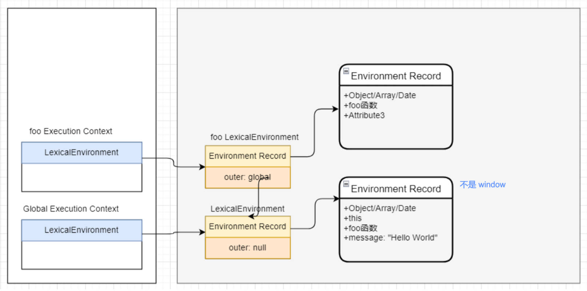
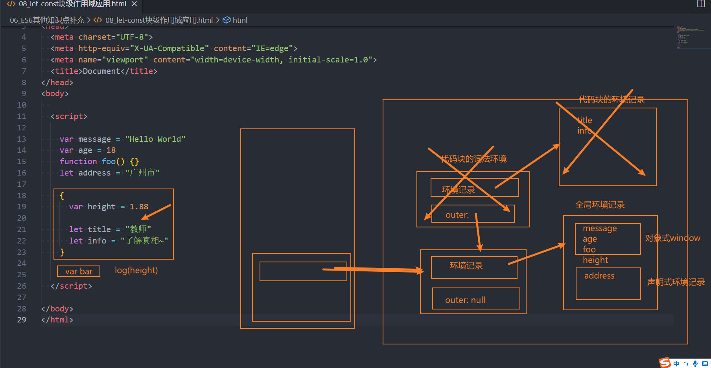
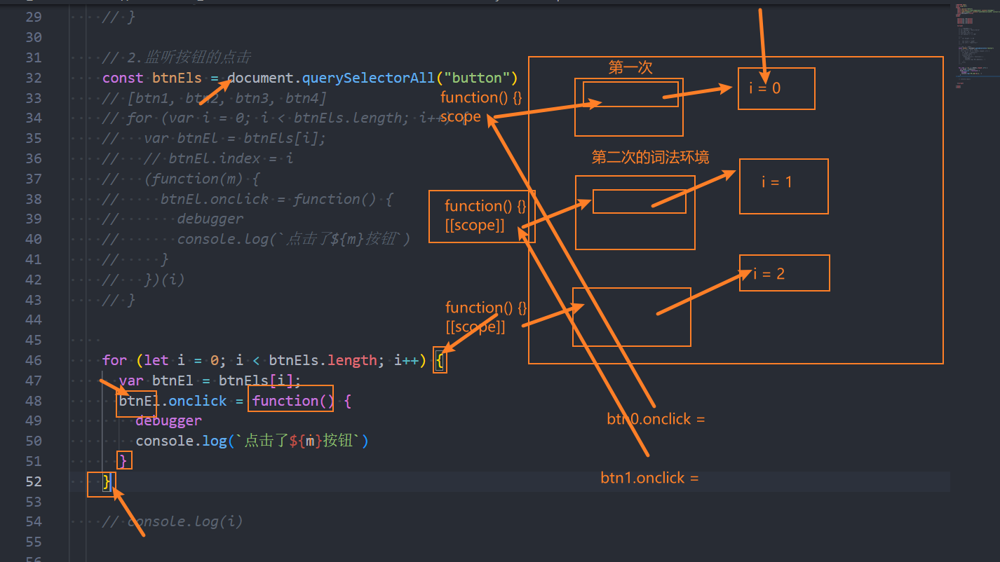

## 一、ECMA 文档术语回顾

在执行学习 JavaScript 代码执行过程中，我们学习了很多 ECMA 文档的术语：

- **执行上下文栈（Execution Context Stack）**，用于执行上下文的栈结构；
- **执行上下文（Execution Context）**，JavaScript 代码在执行之前，会先创建对应的执行上下文；
- **变量对象（Variable Object，VO）**，执行上下文关联的 VO 对象，用于记录函数和变量声明；
- **全局对象（Global Object，GO）**，全局执行上下文关联的 VO 对象；
- **激活对象（Activation Object）**，函数执行上下文关联的 VO 对象；
- **作用域链（scope chain）**，作用域链，用于关联执行上下文的变量查找；

## 二、新 ECMA 文档代码执行描述

新的 ECMAScript 描述中（ES5 之后），对于代码执行流程描述发生了变化。

- 执行上下文栈，和执行上下文是相同的；
- 执行上下文，通常会关联对应的**词法环境**和**变量环境**。

新 ECMA 描述内存图如下图所示：



### 1.词法环境（Lexical Environment）

词法环境是一种规范类型，用于在词法嵌套结构中，定义关联的变量、函数等标识符；

- 是一种规范类型，用于词法嵌套结构中定义关联的变量、函数等标识符；
- 词法环境是由**环境记录（Environment Record）**和一个**外部词法环境（outer Lexical Environment）**组成；
- 词法环境经常用于关联一个函数声明、代码块语句、try-catch 语句，当它们的代码被执行时，词法环境被创建出来。

ES5 之后，一个执行上下文会关联 2 个环境。

- **词法环境**（Lexical Environment）用于处理 `let`、`const` 关键字声明的标识符，会生成暂时性死区（社区定义的词）：
- **变量环境**（Variable Environment）用于处理 `var`、`function` 声明的标识符，产生作用域提升。：

### 2.环境记录（Environment Record）

最新规范中，有两种主要的环境记录值：**声明式环境记录（decelerative Environment）**和**对象环境记录（object Environment）**。

- **声明式环境记录**：用于定义 ECMAScript 语言语法元素的效果，如函数声明、变量声明和直接将标识符绑定与 ECMAScript 语言值关联起来的 Catch 子句。
- **对象式环境记录**：用于定义 ECMAScript 元素的效果，例如 WithStatement（with 语句），它将标识符绑定与某些对象的属性关联起来。

获取环境记录中的值时，

- 如果获取的是用 `var` 定义的值，会直接返回；
- 如果获取的是用 `let` / `const` 定义的值，会判断该值有没有被初始化，如果没有则会报错。

## 三、ES6 新特性

### 1.let、const 关键字

在 ES5 中，我们声明变量都是使用的 `var` 关键字，从 ES6 开始新增了两个关键字可以声明变量，分别是：`let`、`const`

`let`、`const` 在其他编程语言中，都是有的，所以也并不是新鲜的关键字；

`let` 关键字：

- 从直观的角度来说，`let` 和 `var` 是没有太大的区别的，都是用于声明一个变量

`const` 关键字：

- `const` 关键字是 constant 的单词的缩写，表示常量、衡量的意思；
- 它表示保存的数据一旦被赋值，就不能被修改；
- 但是如果赋值的是引用类型，那么可以通过引用找到对应的对象，修改对象的内容；

  ```javascript
  const obj = {
    name: 'zzt',
    age: 18
  }
  
  obj.name = 'kobe'
  ```

#### 1.let、const 和 var 的区别

##### 1.变量的重复声明

 用 `var` 关键字，声明的变量，可以进行重复声明；最后一次声明的变量值，会覆盖前面声明的变量值。

```javascript
var foo = 'haha'

var foo = 'heihei'

console.log(foo); // heihei
```

用 `let`、`const` 关键字声明的变量，都不允许重复声明；

```javascript
let foo = 'haha'

let foo = 'heihei' // 报错
```

##### 2.变量的作用域提升

用 `var` 关键字声明的变量，会进行作用于提升；用 `let`、`const` 则不会

- 用 `var` 声明的变量，在声明之前访问不会报错；
- 用 `let`、`const` 关键字在声明的变量，在声明之前访问会报错（有暂时性死区）。

> **暂时性死区（temporal dead zone，TDZ）**，指的是从块作用域的顶部，一直到变量声明完成之前的区域；变量在该区域不能被访问？

现有如下代码：

```javascript
console.log(foo) // Cannot access 'foo' before initialization

let foo = 'foo'
```

全局作用域下，用 `let` 声明的 `foo` 变量，在声明前进行访问，报错了。

是否意味着 `foo` 变量，只有在代码执行阶段，才会被创建呢？

- 事实上并非这样，我们可以看一下 ECMA262 对 `let` 和 `const` 的描述；
- 这些变量，会被创建在包含他们的词法环境被实例化时，但是是不可以访问它们的，直到词法绑定被求值；

从上面我们可以看出，在执行上下文的词法环境创建出来的时候，变量事实上已经被创建了，只是这个变量是不能被访问的。

那么变量已经有了，但是不能被访问，是不是一种作用域的提升呢？

事实上维基百科并没有对作用域提升有严格的概念解释，那么我们自己从字面量上理解；

- 作用域提升：在声明变量的作用域中，如果这个变量可以在声明之前被访问，那么我们可以称之为作用域提升；
- 在这里，它虽然被创建出来了，但是不能被访问，我认为不能称之为作用域提升；

所以我的观点是 `let`、`const` 没有进行作用域提升，但是会在解析阶段被创建出来

##### 3.变量存放位置

在全局通过 `var` 关键字，来声明一个变量，事实上会在 `window` 对象上，添加一个属性：

在全局通过 `let`、`const` 是不会给 `window` 对象上添加任何属性的。

那么这个变量，保存在哪里呢？

我们先回顾一下最新的 ECMA 标准中，对执行上下文的描述。

- 早期 ECMA 官方文档中，每一个执行上下文，会被关联到一个变量对象（variable object, VO）；
- 在源代码中的变量，函数以及函数的参数声明，会被作为属性添加到 VO 中，

也就是说我们声明的变量和环境记录，是被添加到变量环境中的：

- 但是标准有没有规定这个对象是 `window` 对象或者其他对象呢？
- 其实并没有，那么 JS 引擎在解析的时候，其实会有自己的实现；
- 比如 v8 中其实是通过 VariableMap 的一个 hashmap 来实现它们的存储的。
- 那么 window 对象呢？而 window 对象是早期的 GO 对象，在最新的实现中仅仅是浏览器添加的全局对象，并且一直保留了 window 和 var 之间值的相等性。
- V8 引擎通过 variableMap 的一个 hashmap 来实现它们的存储。

最新的文档：每一个执行上下文会，都会关联两个环境，在执行代码中，变量和函数的声明，会作为环境记录（Environment Record），添加到关联的环境中。


### 3.声明变量保存位置

我们知道，在全局通过 `var` 关键字，来声明一个变量，事实上会在 `window` 对新啊上，添加一个属性：

但是 `let`、`const` 是不会给 `window` 对象上添加任何属性的。


### 4.var 的块级作用域

在我们前面的学习中，JavaScript 只会形成两个作用域：全局作用域和函数作用域。

```javascript
// 全局作用域
var foo = 'foo'

function bar() {
  // 函数作用域
  console.log('bar')
}
```

ES5 中放到一个代码中定义的变量，外面是可以访问的：

```javascript
{
  var foo = 'foo'
}

console.log(foo) // foo
```

### 5.let、const 块级作用域

在 ES6 中新增了块级作用域，并且通过 `let`、`const`、`function`、`class` 声明的标识符，是具备块级作用域的限制的：

但是我们会发现函数拥有块级作用域，但是外面依然是可以访问的：

- 这是因为，JS 引擎会对函数的声明进行特殊的处理，允许像 var 那样进行提升；

```javascript
{
  let foo = 'foo'

  function bar() {
    console.log('bar')
  }

  class Person {

  }
}

console.log(foo); // foo is not defined

bar() // bar

var p = new Person() // Person is not defined
```

let、const 关键字块级作用域的应用。

```html
<!DOCTYPE html>
<html lang="en">
  <head>
    <meta charset="UTF-8" />
    <meta name="viewport" content="width=device-width, initial-scale=1.0" />
    <title>demo</title>
  </head>
  <body>
    <h1>哈哈</h1>
    <button>按钮1</button><button>按钮2</button><button>按钮3</button><button>按钮4</button
    ><button>按钮5</button>

    <script>
      var btns = document.getElementsByTagName("button");

      for (let i = 0; i < btns.length; i++) {
        btns[i].onclick = function () {
          console.log('第', i, '个按钮被点击');
        }
      }
    </script>
  </body>
</html>
```

使用 var 的情况下：

```html
<!DOCTYPE html>
<html lang="en">
  <head>
    <meta charset="UTF-8" />
    <meta name="viewport" content="width=device-width, initial-scale=1.0" />
    <title>demo</title>
  </head>
  <body>
    <h1>哈哈</h1>
    <button>按钮1</button><button>按钮2</button><button>按钮3</button><button>按钮4</button
    ><button>按钮5</button>

    <script>
      var btns = document.getElementsByTagName("button");

      for (var i = 0; i < btns.length; i++) {
        (function (n) {
          btns[n].onclick = function () {
            console.log('第', n, '个按钮被点击');
          }
        })(i)
      }
    </script>
  </body>
</html>
```

### 6.var、let、const 关键字

那么在开发中，我们到底应该选择使用哪一种方式来定义我们的变量呢？

对于 var 的使用：

- 我们需要明白一个事实，var所表现出来的特殊性：比如作用域提升、window全局对象、没有块级作用域等都是一些历史遗
留问题；
- 其实是JavaScript在设计之初的一种语言缺陷；
- 当然目前市场上也在利用这种缺陷出一系列的面试题，来考察大家对 JavaScript 语言本身以及底层的理解；
- 但是在实际工作中，我们可以使用最新的规范来编写，也就是不再使用 var 来定义变量了；

对于 let、const：

- 对于 let 和 const 来说，是目前开发中推荐使用的；
- 我们会有限推荐使用 const，这样可以保证数据的安全性不会被随意的篡改；
- 只有当我们明确知道一个变量后续会需要被重新赋值时，这个时候再使用 let；
- 这种在很多其他语言里面也都是一种约定俗成的规范，尽量我们也遵守这种规范；


`let` 关键字和 `const` 关键字的区别：

1. 
2. - 

3. - 

4. 块级作用域的区别：

   - 用 var 声明的标识符，没有快级作用域。
   - 用 `let`, ` const`, `function`, `class` 声明的标识符是有块级作用域的 （为兼容 ES6 以下的语法，JS 引擎会对 function 声明进行特殊处理，允许像 var 那样提升, 但不能提前访问）。

   ```javascript
   foo() // 会报错
   {
     var message = 'Hello World'
     let age = 18
     function foo() {
       console.log('foo function')
     }
   }
   foo() // 正常调用
   ```

---

# 作用域

## ES5

ES5 中产生作用域的两种情况：

1.  全局作用域
2.  函数作用域

---

## ES6

ES6 中的块级作用域应用场景举例：

- for 循环
- if(){}
- switch
- 代码块{}

---

## 代码内存图解

理解全局代码块执行内存图（上课画图）

- 每个代码块，都会关联一个词法环境。
- 代码执行完后，如果关联的词法环境，没有被其他地方引用，那么会被销毁。



---

理解块级作用域应用内存图（上课画图）

- 每个 function 都关联了词法环境，其中有 let 定义的 i 变量。


