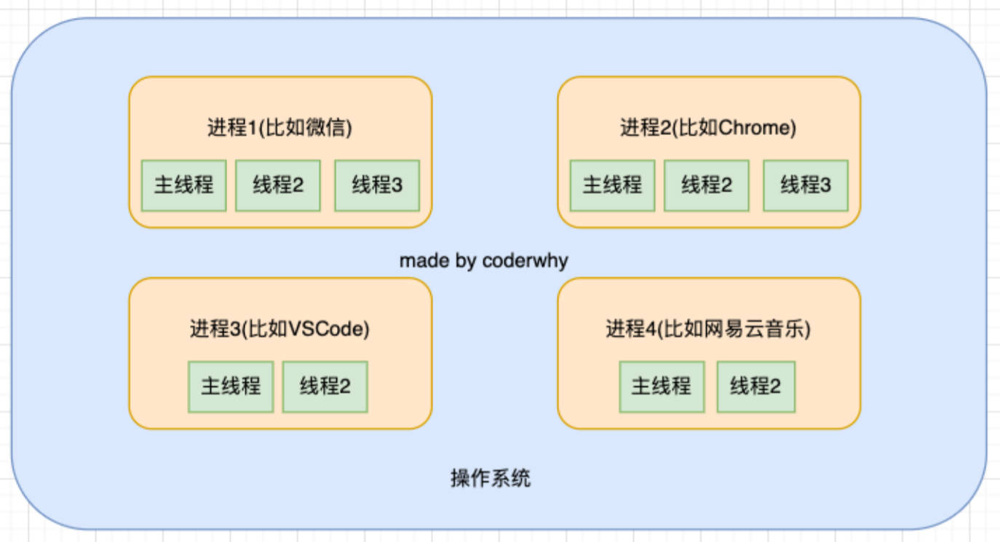

# generator

什么是回调地狱，代码体现。

```javascript
function requestData(url) {
	return new Promise(resolve => {
		setTimeout(() => {
			resolve(url)
		}, 1000);
	})
}
// 回调地狱写法。
function getData() {
  // 1.第一次请求
  requestData("zzt").then(res1 => {
    console.log("第一次结果:", res1)
    // 2.第二次请求
    requestData(res1 + "kobe").then(res2 => {
      console.log("第二次结果:", res2)
      // 3.第三次请求
      requestData(res2 + "james").then(res3 => {
        console.log("第三次结果:", res3)
      })
    })
  })
}
getData()
```

-----

使用 Promise 的特性优化回调地狱的代码，使用链式调用的形式。

```javascript
function getData() {
  requestData("zzt").then(res1 => {
    console.log("第一次结果:", res1)
    return requestData(res1 + "kobe") // then 方法传入的回调函数中返回一个 Promise
  }).then(res2 => {
    console.log("第二次结果:", res2)
    return requestData(res2 + "james")
  }).then(res3 => {
    console.log("第三次结果:", res3)
  })
}
getData()
```

-----

使用生成器函数优化以上代码。

```javascript
function* getData() {
  const res1 = yield requestData("zzt")
  console.log("res1:", res1)
  const res2 = yield requestData(res1 + "kobe")
  console.log("res2:", res2)
  const res3 = yield requestData(res2 + "james")
  console.log("res3:", res3)
}
const generator = getData()
generator.next().value.then(res1 => {
  generator.next(res1).value.then(res2 => {
    generator.next(res2).value.then(res3 => {
      generator.next(res3)
    })
  })
})
```

-----

使用 `async...await` 优化以上代码。

- async...await 就是生成器函数和 yield 的语法糖。

```javascript
async function getData() {
  const res1 = await requestData("zzt")
  console.log("res1:", res1)
  const res2 = await requestData(res1 + "kobe")
  console.log("res2:", res2)
  const res3 = await requestData(res2 + "james")
  console.log("res3:", res3)
}
getData()
```

-----

使用递归的思想优化生成器执行函数，达到自动处理的效果。

```javascript
function* getData() {
	const res1 = yield requestData('zzt')
	console.log(res3);
	const res2 = yield requestData(res1 + 'kobe')
	console.log(res3);
	const res3 = yield requestData(res2 + 'james')
	console.log(res3);
}
function execGeneratorAuto(execFn) {
	const generator = execFn()
	function exec(res) {
		const { done, value } = generator.next(res)
		if (done) return value
		value.then(res => {
			exec(res)
		})
	}
	exec()
}
execGeneratorAuto(getData)
```

-----

# async

异步函数的执行流程是怎样的？

- 异步函数的内部代码执行过程和普通的函数是一致的，**默认情况下也是会被同步执行。**

-----

异步函数和普通函数最大的区别：返回值的区别；3种情况。

1. 异步函数的返回值相当于被包裹到 `Promise.resolve` 中；
2. 如果异步函数的返回值是 Promise，状态会由 Promise 决定；
3. 如果异步函数的返回值是一个对象并且实现了 thenable，那么会由对象的 then 方法来决定；

-----

异步函数返回的 promise 的3种状态，对应异步函数执行的3个时机。

1. `pending`，异步函数执行过程中。
2. `fulfilled`，异步函数有返回普通值。
3. `rejected`，异步函数执行时抛出错误。

-----

异步函数抛出异常会怎么处理？

- 并不会像普通函数一样报错，而是会作为返回的 promise 的 reject 来传递。

-----

# await

await 关键字使用的2个场景。

- async （异步）函数中。
- 顶层模块中（ES13）新特性。

-----

await 后面跟上的值，4种情况。

- 一个普通的值，那么会直接返回这个值；（这么写没有意义）
- 一个 thenable 的对象，那么会根据对象的 then 方法调用来决定后续的值；
- 一个表达式，返回的 Promise，那么 await 会等到 Promise 的状态变成 fulfilled 状态，之后继续执行异步函数；
- 一个表达式，返回的 Promise 是 reject 的状态，那么会将这个 reject 结果直接作为异步函数返回的 Promise 的 reject 值；

-----

await 后面跟上的值是 rejected 状态，怎么处理，2种方法。

1. 在异步函数返回的 promise 上，使用 catch 方法捕获异常。

   ```javascript
   async function foo() {
     await promise
   }
   foo().catch(err => {...})
   ```

2. 在异步函数中，使用 `try...catch` 语句捕获 await 语句代码抛出的异常。

   ```javascript
   async function foo() {
     try {
       await promise
     } catch(err) {
       ...
     }
   }
   ```

-----

await 和 async 结合使用。

```javascript
function bar() {
  console.log("bar function")
  return new Promise((resolve) => {
    setTimeout(() => {
      resolve("bar")
    }, 2000);
  })
}
async function foo() {
  const res = await bar()
  console.log('res', resj)
}
```

-----

# 进程、线程

线程和进程是操作系统的2个概念，说明并解释。

- 进程（process）：
	- 计算机已经运行的程序，是操作系统管理程序的一种方式。
	- 启动一个应用程序，就会默认启动一个或多个进程。
- 线程（thread）：
	- 操作系统能够运行运算调度的最小单位，通常境况下，它包含在进程中。
	- 每一个进程中，都会启动至少一个线程来执行代码，这个线程被称之为主线程。

-----

理解操作系统进程线程图。

- 操作系统类似于一个大工厂；
- 工厂中有很多车间，这个车间就是进程；
- 每个车间可能有一个以上的工人在工作，这个工人就是线程；



-----

操作系统如何做到同时让多个进程工作，3点。

1. CPU运算速度很快，可以在多个进程之间迅速的切换。（多核 CPU 可以做到真正的并行）
2. 进程中的线程获取到时间片时，就可以快速执行编写的代码。
3. 对于用户来说是感受不到这种快速切换的。

-----

浏览器中 JavaScript 的进程管理。

- JavaScript 是单线程的，但是JS应该有自己的容器进程：浏览器或 Node
  1. JS是单线程执行的，在同一个时刻只能做一件事。
  2. 如果一件事很耗时，意味着当前线程会被阻塞。
- 说明真正耗时的操作，不是由Javascript执行的，2点。
  1. 浏览器每个进程都是多线程的，那么其它线程可以来完成这个耗时的操作。
  2. 比如网络请求，定时器，JS只需要在特定的时候执行应该有的回调即可。
- 介绍浏览器中的进程管理，2点：
  1. 多数浏览器都是多进程的，打开一个tab页时，就会开启一个新进程，防止一个页面卡死整个浏览器无响应。
  2. 每个进程中又有很多线程，其中包括执行 JavaScript 代码的线程。

