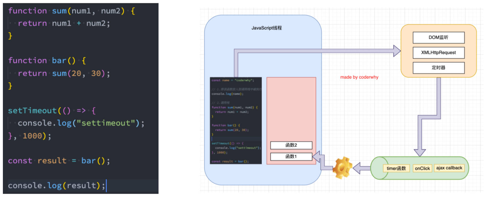

# 浏览器事件队列

## 事件循环举例

使用 setTimeou 和按钮点击进行举例，理解事件循环的过程。

1. 执行 setTimeout 语句，JavaScript 线程会将计时任务交给浏览器中另一个线程，
2. 计时结束后，该线程将回调函数**放入到队列中**。

```javascript
setTimeout(() => {
  console.log("setTimeout")
}, 0);
console.log('Hello World') // 先执行
```

执行事件的回调函数时，线程也会将该回调函数**放入到队列中，再执行**。

```javascript
const btn = document.querySelector("button")
btn.onclick = function () {
  console.log("btn click event")
}
```

> 队列这种数据结构的特点——先进先出。

## 理解浏览器事件循环图



## 浏览器事件循环中存在2个队列

举例对应的事件。

宏任务队列（macrotask queue）：
- ajax
- setTimeout
- setInterval
- DOM 监听
- UI Rendering 等 

微任务队列（microtask queue）：
- Promise 的 then 回调
- Mutation Observer API
- queueMicrotask() 等

## 浏览器事件循环中，代码执行的优先级

1. main script 中的代码优先执行。
2. 在执行宏任务之前，必须保证微任务队列是空的。

## 浏览器事件循环4道面试题。

# 异常处理

## 基本使用

工具函数 sum 举例。

开发中我们会封装一些工具函数，封装之后给别人使用： 
- 在其他人使用的过程中，可能会传递一些参数； 
- 对于函数来说，需要对这些参数进行验证，否则可能得到的是我们不想要的结果；

很多时候我们可能验证到不是希望得到的参数时，就会直接 return： 
- 但是 return 存在很大的弊端：调用者不知道是因为函数内部没有正常执行，还是执行结果就是一个 undefined； 
- 事实上，正确的做法应该是如果没有通过某些验证，那么应该让外界知道函数内部报错了；

如何可以让一个函数告知外界自己内部出现了错误呢？

- 通过 throw 关键字，抛出一个异常；

```javascript
function sum(num1) {
	if (typeof num1 !== "number") {
		throw "type error: num1传入的类型有问题, 必须是number类型"
	}
  //...
}
```

## throw 语句

throw 语句有什么用？

- throw 语句用于抛出一个用户自定义的异常

代码遇到 throw 语句怎么执行？

- 当遇到 throw 语句时，当前的函数执行会被停止（ throw 后面的语句不会执行）。

throw 语句后面可以跟上哪些数据类型？

- 基本数据类型：比如 number、string、boolean 
- 对象类型：对象类型可以包含更多的信息。

## 封装一个抛出错误的类

封装一个自己的错误类，用于抛出错误信息。

```javascript
class ZtError {
	constructor(message, code) {
		this.errMessage = message
		this.errCode = code
	}
}
function foo() {
	console.log('hello~')
	throw new ZtError('find error', 101)
	console.log('bye~')
}
```

## Error 内置类

Error 类包含的3个属性，有什么用？

- `messsage`：创建 Error 对象时传入的  message； 
- `name`：Error 的名称，通常和类的名称一致；
- `stack`：整个 Error 的错误信息，包括函数的调用栈，当我们直接打印 Error 对象时，打印的就是 stack；

```javascript
throw new Error("我是错误信息message")
```

举例3个 Error 的子类，并介绍

- `RangError`：下标值越界时使用的错误类型。
- `SyntaxError`：解析语法错误时，使用的错误类型。
- `TypeError`：出现类型错误时，使用的错误类型。

## 代码中抛出的异常是如何传递的

1. 在调用一个函数时，这个函数抛出了异常，但是并没有对这个异常进行处理，那么这个异常会继续传递到上一个函数调用中；
2. 而如果到了最顶层（全局）的代码中依然没有对这个异常的处理代码，这个时候就会报错并且终止程序的运行；

## 如何进行异常捕获

- 使用 `try...catch...finally`。
- finally 表示最终一定会被执行的代码结构
- 如果 try 和 finally 中都有返回值，那么会使用 finally 中的返回值。

```javascript
try {
	foo()
	console.log("try 后续的代码")
} catch(err) {
	console.log("catch 中的代码")
} finally {
	console.log("finally 代码")
}
```