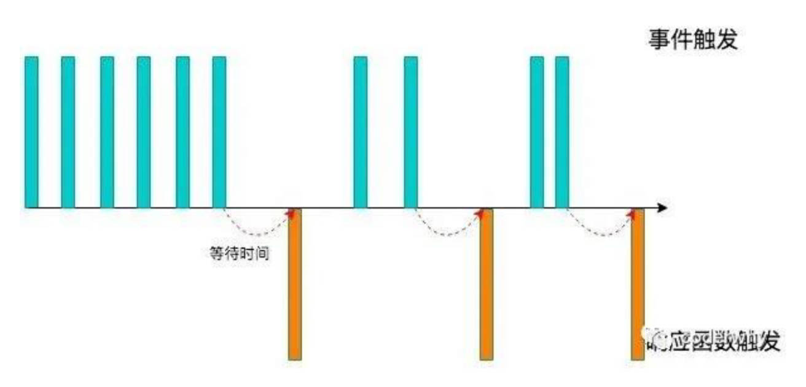
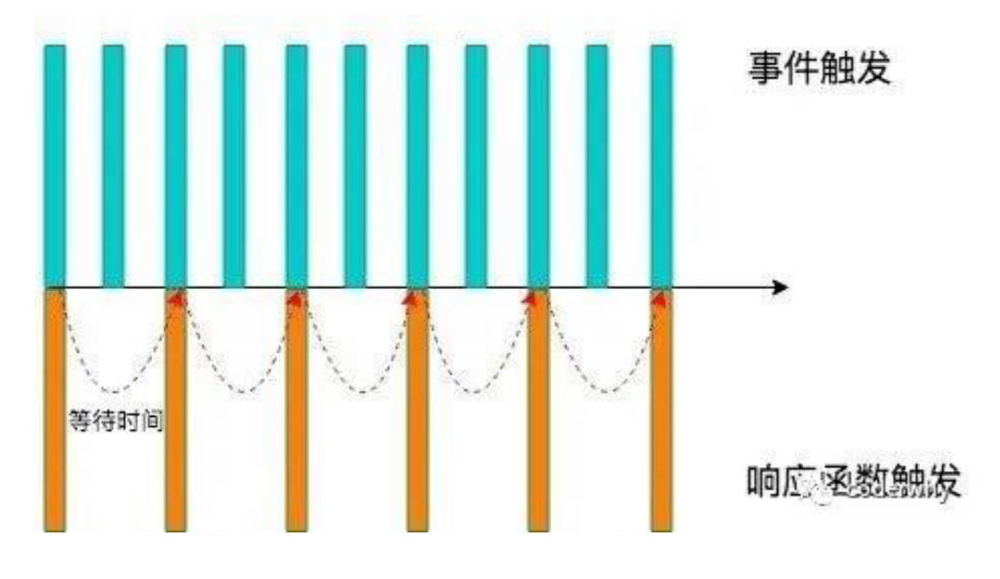

# 防抖

什么是防抖？

1. 当事件触发时，相应的函数并不会立即触发，而是会等待一定的时间；
2. 当事件密集触发时，函数的触发会被频繁的推迟；
3. 只有等待了一段时间也没有事件触发，才会真正的执行响应函数；

理解图解，




防抖有哪些应用场景？

- 输入框中频繁的输入内容，搜索或者提交信息；
- 频繁的点击按钮，触发某个事件；
- 监听浏览器滚动事件，完成某些特定操作；
- 用户缩放浏览器的 resize 事件；

-----

封装工具函数需要考虑的3点问题

1. 需要接收哪些参数。
2. 有什么返回值。
3. 内部实现。

-----

# 手写防抖

## 手写防抖函数的基本功能实现。

```html
<script>
  function ztDebounce(fn, delay) {
    let timer = null // 1.用于记录上一次事件触发的 timer
    const _debounce = () => { // 2.触发事件时执行的函数
      if (timer) clearTimeout(timer) // 2.1.如果有再次触发(更多次触发)事件, 那么取消上一次的事件
      timer = setTimeout(() => { // 2.2.延迟去执行对应的fn函数(传入的回调函数)
        fn()
        timer = null // 执行过函数之后, 将timer重新置null
      }, delay);
    }
    return _debounce // 返回一个新的函数
  }
</script>
<script>
  // 1.获取input元素
  const inputEl = document.querySelector("input")
  // 3.自己实现的防抖
  let counter = 1
  inputEl.oninput = ztDebounce(function () {
    console.log(`发送网络请求${counter++}`)
  }, 1000)
</script>
```

-----

`_debounce` 函数会赋值给 oninput 事件，需要绑定 this，所以不能使用箭头函数。

-----

## 手写防抖函数的 this 和参数绑定。

```html
<script>
  function ztDebounce(fn, delay) {
    let timer = null // 1.用于记录上一次事件触发的timer
    const _debounce = function(...args) { // 2.触发事件时执行的函数
      if (timer) clearTimeout(timer) // 2.1.如果有再次触发(更多次触发)事件, 那么取消上一次的事件
      timer = setTimeout(() => { // 2.2.延迟去执行对应的fn函数(传入的回调函数)
        fn.apply(this, args)
        timer = null // 执行过函数之后, 将timer重新置null
      }, delay);
    }
    return _debounce // 返回一个新的函数
  }
</script>
<script>
  // 1.获取input元素
  const inputEl = document.querySelector("input")
  // 2.自己实现的防抖
  let counter = 1
  inputEl.oninput = ztDebounce(function(event) {
    console.log(`发送网络请求${counter++}:`, this, event)
  }, 1000)
</script>
```

-----

## 手写防抖函数的取消功能。

```html
<script>
  function ztDebounce(fn, delay) {
    let timer = null // 1.用于记录上一次事件触发的timer
    const _debounce = function(...args) { // 2.触发事件时执行的函数
      if (timer) clearTimeout(timer) // 2.1.如果有再次触发(更多次触发)事件, 那么取消上一次的事件
      timer = setTimeout(() => { // 2.2.延迟去执行对应的fn函数(传入的回调函数)
        fn.apply(this, args)
        timer = null // 执行过函数之后, 将timer重新置null
      }, delay);
    }
    _debounce.cancel = function() { // 3.给_debounce绑定一个取消的函数
      if (timer) clearTimeout(timer)
      timer = null
    }
    return _debounce // 返回一个新的函数
  }
</script>
<script>
  // 1.获取input元素
  const inputEl = document.querySelector("input")
  const cancelBtn = document.querySelector(".cancel")
  // 2.自己实现的防抖
  let counter = 1
  const debounceFn = ztDebounce(function(event) {
    console.log(`发送网络请求${counter++}:`, this, event)
  }, 5000)
  inputEl.oninput = debounceFn
  // 3.实现取消的功能
  cancelBtn.onclick = function() {
    debounceFn.cancel()
  }
</script>
```

-----

封装函数的原则：

- 一个函数尽量用于做一件事清。
- 一个参数尽量用于记录一种状态。

-----

## 手写防抖函数的立即执行功能。

```html
<script>
  function ztDebounce(fn, delay, immediate = false) {
    let timer = null // 1.用于记录上一次事件触发的timer
    let isInvoke = false
    const _debounce = function(...args) { // 2.触发事件时执行的函数
      if (timer) clearTimeout(timer) // 2.1.如果有再次触发(更多次触发)事件, 那么取消上一次的事件
      if (immediate && !isInvoke) { // 第一次操作是不需要延迟
        fn.apply(this, args)
        isInvoke = true
        return
      }
      timer = setTimeout(() => { // 2.2.延迟去执行对应的fn函数(传入的回调函数)
        fn.apply(this, args)
        timer = null // 执行过函数之后, 将timer重新置null
        isInvoke = false
      }, delay);
    }
    _debounce.cancel = function() { // 3.给_debounce绑定一个取消的函数
      if (timer) clearTimeout(timer)
      timer = null
      isInvoke = false
    }
    return _debounce // 返回一个新的函数
  }
</script>
<script>
  // 1.获取input元素
  const inputEl = document.querySelector("input")
  const cancelBtn = document.querySelector(".cancel")
  // 2.自己实现的防抖
  let counter = 1
  const debounceFn = ztDebounce(function(event) {
    console.log(`发送网络请求${counter++}:`, this, event)
  }, 100)
  inputEl.oninput = debounceFn
  // 3.实现取消的功能
  cancelBtn.onclick = function() {
    debounceFn.cancel()
  }
</script>
```

-----

## 手写防抖函数返回值获取，异常捕获。

```html
<script>
  function ztDebounce(fn, delay, immediate = false, resultCallback) {
    let timer = null // 1.用于记录上一次事件触发的timer
    let isInvoke = false
    const _debounce = function(...args) { // 2.触发事件时执行的函数
      return new Promise((resolve, reject) => {
        try {
          if (timer) clearTimeout(timer) // 2.1.如果有再次触发(更多次触发)事件, 那么取消上一次的事件
          let res = undefined // 第一次操作是不需要延迟
          if (immediate && !isInvoke) {
            res = fn.apply(this, args)
            if (resultCallback) resultCallback(res) // 第一种方案，使用回调函数传递返回值。
            resolve(res) // 第二种方案，使用 Promise 传递返回值。
            isInvoke = true
            return
          }
          timer = setTimeout(() => { // 2.2.延迟去执行对应的fn函数(传入的回调函数)
            res = fn.apply(this, args)
            if (resultCallback) resultCallback(res)
            resolve(res)
            timer = null // 执行过函数之后, 将timer重新置null
            isInvoke = false
          }, delay);
        } catch (error) {
          reject(error)
        }
      })
    }
    _debounce.cancel = function () { // 3.给_debounce绑定一个取消的函数
      if (timer) clearTimeout(timer)
      timer = null
      isInvoke = false
    }
    return _debounce // 返回一个新的函数
  }
</script>
<script>
  // 1.获取input元素
  const inputEl = document.querySelector("input")
  const cancelBtn = document.querySelector(".cancel")
  // 2.手动绑定函数和执行
  const myDebounceFn = ztDebounce(function(name, age, height) {
    console.log("----------", name, age, height)
    return "zzt 哈哈哈哈"
  }, 1000, false)
  inputEl.onclick = function (...args) {
    muDebounceFn.apply(this, args).then(res => {
    console.log("拿到执行结果:", res)
  }
</script>
```

-----

# 节流

什么是节流？

1. 当事件触发时，会执行这个事件的响应函数；
2. 如果这个事件会被频繁触发，那么节流函数会按照一定的频率来执行函数；
3. 不管在这个中间有多少次触发这个事件，执行函数的频率总是固定的；

理解图解，



节流有哪些应用场景？

- 监听页面的滚动事件；
- 鼠标移动事件；
- 用户频繁点击按钮操作；
- 游戏中的一些设计；

-----

使用 underscore 实现节流。

```html
<script src="https://cdn.jsdelivr.net/npm/underscore@1.13.4/underscore-umd-min.js"></script>
<script>
  // 1.获取input元素
  const inputEl = document.querySelector("input")
  // 2.节流处理代码
  let counter = 1
  inputEl.oninput = _.throttle(function() {
    console.log(`发送网络请求${counter++}:`, this.value)
  }, 1000)
</script>
```

-----

# 手写节流

## 手写节流函数的基本功能实现。

```html
<script>
	function ZtThrottle(fn, interval) {
		let startTime = 0
		const _throttle = function() {
			const nowTime = new Date().getTime()
			const waitTime = interval - (nowTime - startTime)
			if (waitTime <= 0) {
				fn()
				startTime = nowTime
			}
		}
		return _throttle
	}
</script>
<script>
	// 1.获取input元素
	const inputEl = document.querySelector("input")
	// 3.自己实现的节流函数
	let counter = 1
	inputEl.oninput = ZtThrottle(function() {
		console.log(`发送网络请求${counter++}:`, this.value)
	}, 1000)
</script>
```

-----

## 手写节流函数的 this 和参数绑定。

```html
<script>
	function ZtThrottle(fn, interval) {
		let startTime = 0
		const _throttle = function(...args) {
			const nowTime = new Date().getTime()
			const waitTime = interval - (nowTime - startTime)
			if (waitTime <= 0) {
				fn.apply(this, args)
				startTime = nowTime
			}
		}
		return _throttle
	}
</script>
<script>
	// 1.获取input元素
	const inputEl = document.querySelector("input")
	// 3.自己实现的节流函数
	let counter = 1
	inputEl.oninput = ZtThrottle(function(event) {
		console.log(`发送网络请求${counter++}:`, this.value, event)
	}, 1000)
</script>
```
-----

## 手写节流函数的立即执行控制。

```html
<script>
	function ZtThrottle(fn, interval, leading = true) {
		let startTime = 0
		const _throttle = function(...args) {
			const nowTime = new Date().getTime() // 1.获取当前时间
			if (!leading && startTime === 0) { // 对立即执行进行控制，考虑非立即执行的情况
				startTime = nowTime
			}
			const waitTime = interval - (nowTime - startTime) // 2.计算需要等待的时间执行函数
			if (waitTime <= 0) {
				fn.apply(this, args)
				startTime = nowTime
			}
		}
		return _throttle
	}
</script>
<script>
	// 1.获取input元素
	const inputEl = document.querySelector("input")
	// 3.自己实现的节流函数
	let counter = 1
	inputEl.oninput = ZtThrottle(function(event) {
		console.log(`发送网络请求${counter++}:`, this.value, event)
	}, 1000)
</script>
```