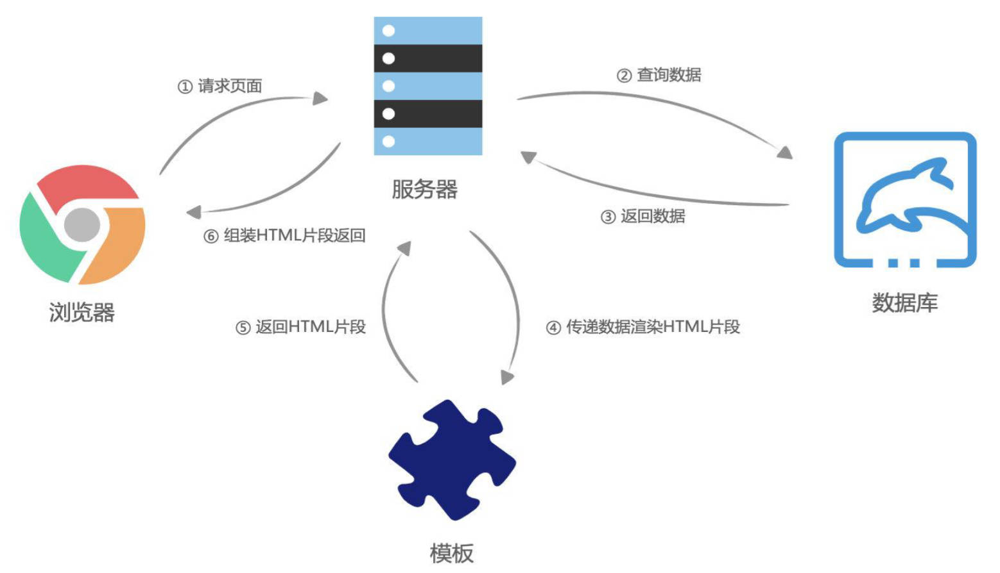
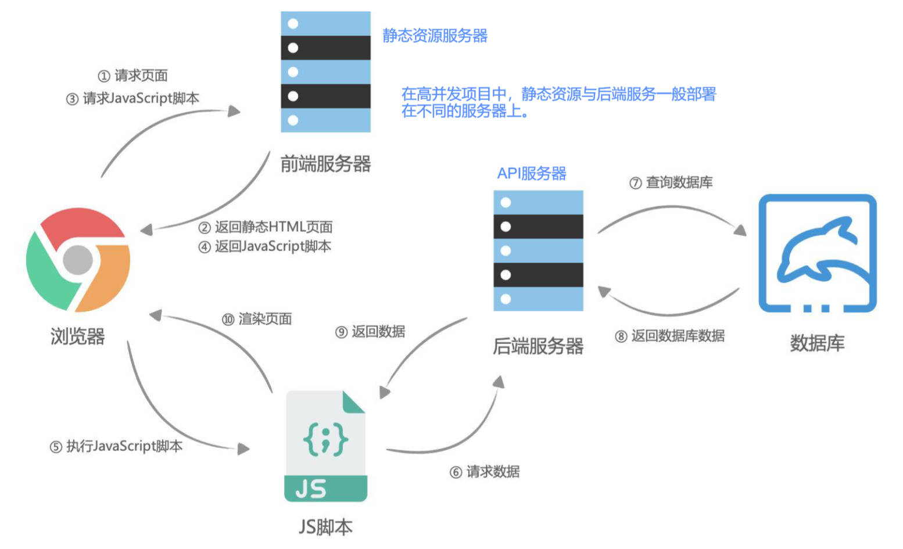
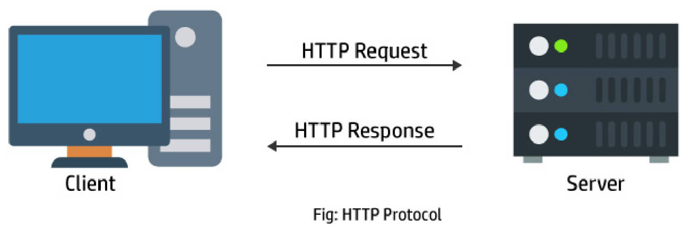
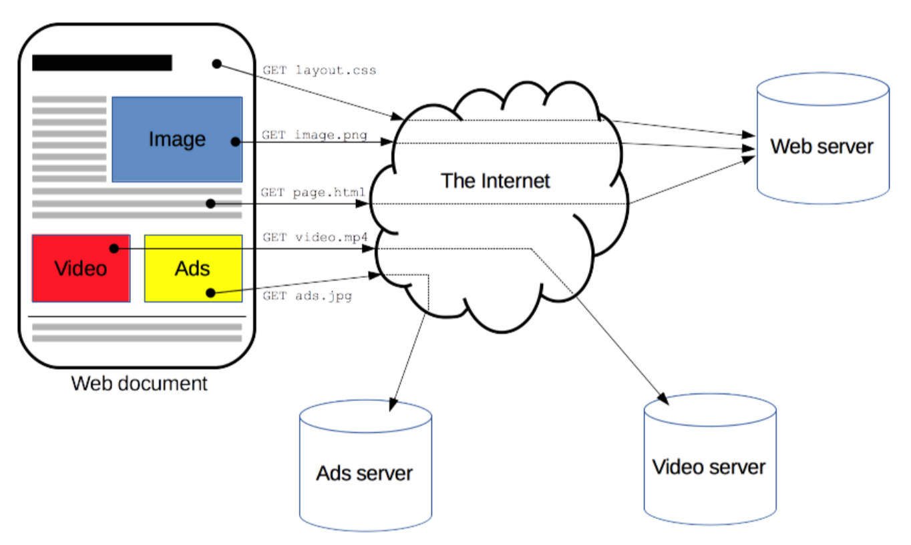
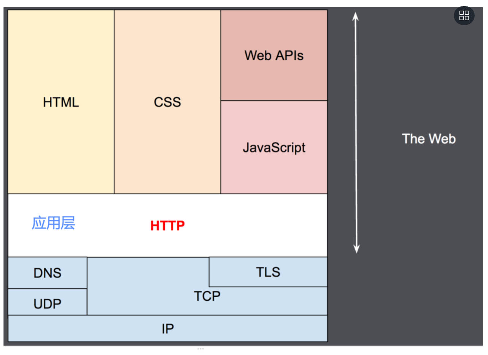
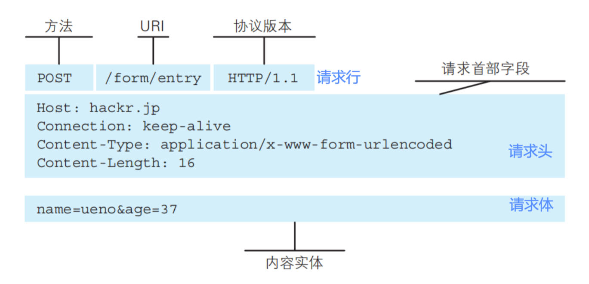
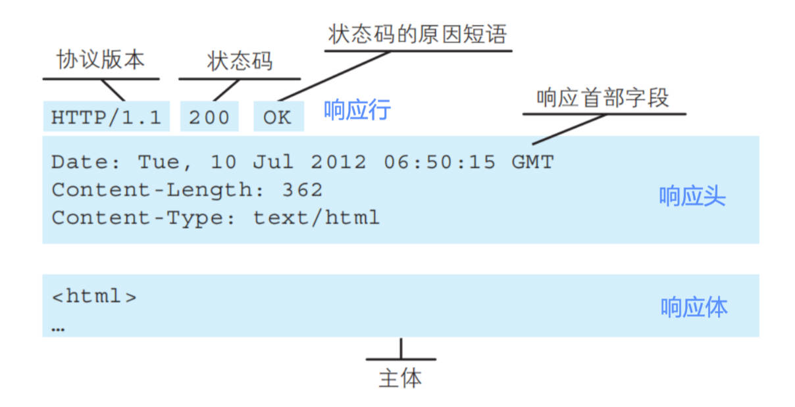
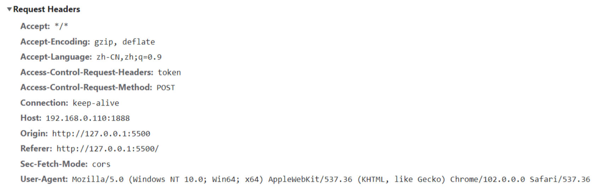

什么是后端渲染（服务端渲染）？理解图解。

- 早期的网页都是通过后端渲染来完成的：服务器端渲染（SSR，server side render）：
- 客户端发出请求 -> 服务端接收请求并返回相应渲染好的 HTML 文档 -> 页面刷新，客户端加载新的 HTML 文档；



---

后端渲染有什么缺点？

- 当用户点击页面中的某个按钮向服务器发送请求时，页面本质上只是一些数据发生了变化，而此时服务器却要将重绘的整个页面再返 回给浏览器加载，这显然有悖于程序员的“DRY（ Don‘t repeat yourself ）”原则；
- 而且明明只是一些数据的变化却迫使服务器要返回整个 HTML 文档，这本身也会给网络带宽带来不必要的开销。

---

AJAX 的由来。

- 有没有办法在页面数据变动时，只向服务器请求新的数据，并且在阻止页面刷新的情况下，动态的替换页面中展示的数据呢？答案正是“AJAX”。

什么是 AJAX？

- AJAX 是“Asynchronous JavaScript And XML”的缩写(异步的 JavaScript 和 XML)，是一种实现无页面刷新获取服务器数据的技术。AJAX 最吸引人的就是它的“异步”特性，也就是说它可以在不重新刷新页面的情况下与服务器通信，交换数据，或更新页面。

它有什么特点？

- 在不重新加载页面的情况下发送请求给服务器；
- 接受并使用从服务器发来的数据。

---

什么是前后端分离（客户端渲染）？理解图解。



---

什么是 HTTP？理解图解。

- 超文本传输协议（英语：HyperText Transfer Protocol，缩写：HTTP）是一种用于分布式、协作式和超媒体信息系统的**应用层协议**；
- HTTP 是万维网的数据通信的基础，设计 HTTP 最初的目的是为了提供一种发布和接收 HTML 页面的方法；
- 通过 HTTP 或者 HTTPS 协议请求的资源由统一资源标识符（Uniform Resource Identifiers，URI）来标识；

HTTP 有什么用？

- HTTP 是一个客户端（用户）和服务端（网站）之间请求和响应的标准。
- 通过使用网页浏览器、网络爬虫或者其它的工具，客户端发起一个 HTTP 请求到服务器上指定端口（默认端口为 80）；
  - 我们称这个客户端为**用户代理程序（user agent）**；
- 响应的服务器上存储着一些资源，比如 HTML 文件和图像。
  - 我们称这个响应服务器为源服务器（origin server）；



---

理解网页中资源的获取图解

- 网页中的资源通常是被放在 Web 资源服务器中，由浏览器自动发送 HTTP 请求来获取、解析、展示的。



理解网络分层架构图解。



---

理解 HTTP 组成的图解。

请求 Request 组成图解。



响应 Respose 组成图解。



---

HTTP 有哪些版本？

- HTTP/0.9
  - 发布于 1991 年；
  - 只支持 GET 请求方法获取文本数据，当时主要是为了获取 HTML 页面内容；
- HTTP/1.0
  - 发布于 1996 年；
  - 支持 POST、HEAD 等请求方法，支持请求头、响应头等，支持更多种数据类型(不再局限于文本数据) ；
  - 但是浏览器的每次请求都需要与服务器建立一个 TCP 连接，请求处理完成后立即断开 TCP 连接，每次建立连接增加了性能损耗；
- HTTP/1.1(目前使用最广泛的版本)
  - 发布于 1997 年；
  - 增加了 PUT、DELETE 等请求方法；
  - 采用持久连接(Connection: keep-alive)，多个请求可以共用同一个 TCP 连接；
- 2015 年，HTTP/2.0
- 2018 年，HTTP/3.0

---

HTTP 有哪些请求方式？有什么用？

在 RFC 中定义了一组请求方式，来表示要对给定资源执行的操作，通过同样的接口，如“/user”，根据不同的请求方式，可以发送不同的请求，服务器中就可以对应做不同的操作。

- `GET`：GET 方法请求一个指定资源的表示形式，使用 GET 的请求应该只被用于获取数据。
- `HEAD`：HEAD 方法请求一个与 GET 请求的响应相同的响应，但没有响应体。
  - 比如在准备下载一个文件前，先获取文件的大小，再决定是否进行下载；
- `POST`：POST 方法用于将实体提交到指定的资源。
- `PUT`：PUT 方法用请求有效载荷（payload）替换目标资源的所有当前表示；
- `DELETE`：DELETE 方法删除指定的资源；
- `PATCH`：PATCH 方法用于对应资源部分修改；
- `CONNECT`：CONNECT 方法建立一个到目标资源标识的服务器的隧道，通常用在代理服务器，网页开发很少用到。
- `TRACE`：TRACE 方法沿着到目标资源的路径执行一个消息回环测试。

---

在浏览器调试工具中查看网络请求 NetWork -> Fetch/XHR

---

HTTP Request Header 是什么，

- 在 request 对象的 header 中也包含很多有用的信息，客户端会默认传递过来一些信息：



---

什么是 HTTP Request Header 中 `content-type` ？

- content-type 是这次请求携带的数据的类型：

有哪些值，分别代表什么含义？

- `application/x-www-form-urlencoded`：表示数据被编码成以 '&' 分隔的键值对，同时以 '=' 分隔键和值
- `application/json`：表示是一个 json 类型；
- `text/plain`：表示是文本类型；
- `application/xml`：表示是 xml 类型；
- `multipart/form-data`：表示是上传文件；

---

HTTP Request Header 中还有哪些属性，分别有什么用？

- `content-length`：文件的大小长度
- `connection`：
  - http 是基于 TCP 协议的，发送请求时，会与服务器建立 TCP 协议的传输通道，建立通道连接，但是通常在进行一次请求和响应结束后会立刻中断通道，也就意味着有性能损耗。
  - 在 http1.0 中，如果想要继续保持连接：
    - 浏览器需要在请求头中添加 `connection: keep-alive`；
    - 服务器需要在响应头中添加 `connection: keey-alive`；
    - 当客户端再次发送请求时，就会使用同一个连接，防止一方中断连接；
  - 在 http1.1 中，所有连接默认是 `connection: keep-alive` 的；
    - 不同的 Web 服务器会有不同的保持 keep-alive 的时间；
    - Node 中默认是 5s 中；
- `accept-encoding`：告知服务器，客户端支持的文件压缩格式，比如 js 文件可以使用 gzip 编码，对应 .gz 文件；
- `accept`：告知服务器，客户端可接受文件的格式类型，可理解为数据的格式。
- `user-agent`：客户端相关的信息；

---

HTTP Response 响应状态码有什么用，有哪些，代表什么含义？

| 常见 HTTP 状态码 | 状态描述              | 信息说明                                             |
| ---------------- | --------------------- | ---------------------------------------------------- |
| 200              | OK                    | 客户端请求成功                                       |
| 201              | Created               | POST 请求，创建新的资源                              |
| 301              | Moved Permanently     | 请求资源的 URL 已经修改，响应中会给出新的 URL        |
| 400              | Bad Request           | 客户端的错误，服务器无法或者不进行处理               |
| 401              | Unauthorized          | 未授权的错误，必须携带请求的身份信息                 |
| 403              | Forbidden             | 客户端没有权限访问，被拒接                           |
| 404              | Not Found             | 服务器找不到请求的资源。                             |
| 500              | Internal Server Error | 服务器遇到了不知道如何处理的情况。                   |
| 503              | Service Unavailable   | 服务器不可用，可能处理维护或者重载状态，暂时无法访问 |

- \> 400，一般代表客户端发生错误
- \> 500，一般代表服务器端发生错误。

---

服务器响应错误的不同方式处理 2 种。

1. http status code: 401
2. http status code: 200，自行设计 错误码
	```json
	{
		code: -1004
		message: '您没有登录，请登陆后操作'
	}
	```

---

使用浏览器直接发送请求，输入 url，默认是 GET 请求。

---

AJAX 可以发送哪些格式的请求？

- AJAX 是异步的 JavaScript 和 XML（Asynchronous JavaScript And XML），它可以使用 JSON，XML，HTML 和 text 文本等格式发送和接收数据；

有哪些步骤？


1. 创建网络请求的 AJAX 对象（使用 XMLHttpRequest ）
2. 监听 XMLHttpRequest 对象状态的变化，或者监听 `onload `事件（请求完成时触发）； 
3. 配置网络请求（通过 open 方法）；
4. 发送 send 网络请求；

基本使用。

```javascript
// 1.创建 XMLHttpRequest 对象
const xhr = new XMLHttpRequest()
// 2.监听状态的改变(宏任务)
xhr.onreadystatechange = function () {
	if (xhr.readyState !== XMLHttpRequest.DONE) return
	const res = JSON.parse(xhr.response) // 将字符串转成js对象
}
// 3.配置请求open
xhr.open("get", "http://123.207.32.32:8000/home/multidata")
// 4.发送请求(浏览器帮助发送对应请求)
xhr.send()
```
