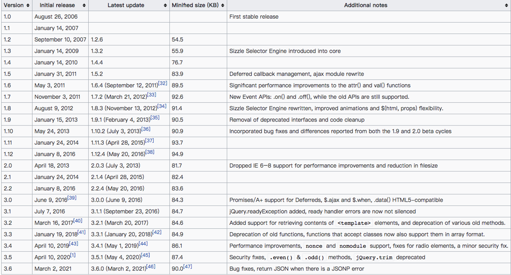
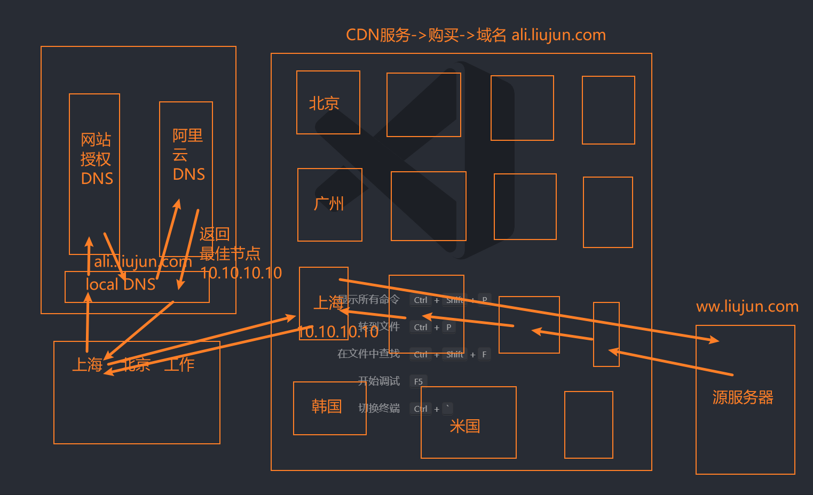

理解JS高级高频面试题有哪些？

-----

# 认识 jQuery

什么是 jQuery?

- 一个快速、小型且功能丰富的 JavaScript 库。

有什么用？

- 使 **HTML 文档遍历、操作、事件处理**、**动画** 和 **Ajax** 之类的事情变得更加简单。
- 具有易于使用的 API，做了多浏览器适配。

-----

为什么会出现库（library）和框架（framework）？

- JavaScript 社区认识到代码中存在非常多相同的逻辑是可复用的。
- 因此社区就开始将这些相同逻辑的代码封装到一个 JavaScript 文件中。
- 这个封装好的 JavaScript 文件就称为 JavaScript 库或 JavaScript 框架。

什么是库（library）

- JavaScript 库是一个预先编写好并实现了一些特定功能的代码片段的集合。
- 一个库中会包含许多的函数、变量等，可根据需求引入到项目中使用。
- 一些常见的库有 jQuery、Day.js、Lodash 和 React 等。

什么是框架（framework）

- JavaScript 框架是一个完整的工具集，可帮助塑造和组织您的网站或应用程序。
- 提供一个结构来构建整个应用程序，开发人员可以在结构的规则内更安全、更高效地工作。
- 一些常见的框架有：Bootstrap、Angular、Vue、Next.js 等。

-----

jQuery 的优点

- 易于学习：相对于其它的前端框架，jQuery 更易于学习，它支持 JavaScript 的编码风格。
- 少写多做（Write less, do more）
	- jQuery 提供了丰富的功能( DOM 操作、过滤器、事件、动画、Ajax 等)。
	- 可以编写更少的代码和可读性高的代码来提高开发人员的工作效率。
- 优秀的 API 文档：jQuery 提供了优秀的在线 API 文档。
- 跨浏览器支持：提供出色的跨浏览器支持 (IE9+)，无需编写额外代码。

jQuery 的缺点。

- jQuery 代码库一直在增长（自 jQuery 1.5 起超过 200KB）
- 不支持组件化开发
- jQuery 更适合 DOM 操作，当涉及到开发复杂的项目时，jQuery 能力有限。

-----

了解 jQuery 的起源和历史。

1. 2005年8月22日，John Resig（一名从事自己项目的 Web 开发人员）首次提出**支持 CSS 选择器**的 JavaScript 库，其语法比当时现有的库（例如：Behaviour ）更简洁。
2. 在2006年之前，John Resig 对编写跨浏览器的 JavaScript 感到非常繁琐。
3. 直到2006年8月26才发布了1.0版本。原本打算使用 JSelect（JavaScript Selectors）命名该库，但域名都已被占用。

了解 jQuery 的历史版本特性。



-----

为什么要使用 jQuery？

1. jQuery 是一个非常受欢迎的 JavaScript 库，被全球约 7000 万个网站使用。它优秀的设计和架构思想非常值得我们去学习。
2. jQuery 的座右铭是“Write less , do more”，它易于学习，非常适合 JavaScript  开发人员学习的第一个库。
3. 前端 JavaScript 库非常多，学习 jQuery 有利于我们学习和理解其它的 JavaScript 库（例如：Day.js、Lodash.js 等）
4. 许多大型科技公司，虽然他们现在不会直接使用 jQuery 来做项目，但在项目中仍然会借鉴很多 jQuery 设计思想。

因此，了解 jQuery 依然是一个好主意。

-----

jQuery 的安装。

1. 在页面中，直接通过 CDN 的方式引入。
2. 下载 jQuery 的源文件，并在页面中手动引入。
3. 使用 npm 包管理工具安装到项目中。

jQuery 的使用步骤

1. 执行引入的 jQuery 文件中会给 window 对象添加一个 jQuery 函数（例如：`window.jQuery`）。
2. 接着我们就可以调用 jQuery 函数，或者使用该函数上的类方法。

-----

# 认识 CDN

什么是 CDN？它有什么用？

- CDN 称之为内容分发网络（Content Delivery Network 或 Content Distribution Network，缩写：CDN）
- 它是一组分布在不同地理位置的服务器相互连接形成的网络系统。
	1. 通过这个网络系统，将 Web 内容存放在距离用户最近的服务器。
	2. 可以更快、更可靠地将 Web 内容(文件、图片、音乐、视频等)发送给用户。
	3. CDN 不但可以提高资源的访问速度，还可以分担源站的压力。

总结：
1. CDN 会将资源缓存到遍布全球的网站，用户请求获取资源时；
2. 可就近获取 CDN 上缓存的资源，提高资源访问速度，同时分担源站压力。

常用的 CDN 服务可大致分为2种：

- 自己购买的 CDN 服务：需要购买开通 CDN 服务（会分配一个域名）。
	- 目前阿里、腾讯、亚马逊、Google 等都可以购买 CDN 服务。
- 开源的 CDN 服务
	- 国际上使用比较多的是 unpkg、JSDelivr、cdnjs、BootCDN 等。

-----

理解 CDN 工作原理图，它是怎么进行网络优化的？

- CDN 服务器 DNS 会返回最佳节点给客户端，让客户端去请求。



-----

# jQuery 的基本使用

## 引入和基本使用。

方式一：CDN

```html
 <!--
	integrity: 防止资源被篡改,如果浏览器发现资源被篡改 就不会加载该资源
	crossorigin: 加载不同源的资源时,浏览器是否需要携带用户凭证信息(cookie, ssl 证书等)
		anonymous: 不需要携带用户凭证信息
		user-credentail: 需要携带用户凭证信息
	-->
<script src="https://code.jquery.com/jquery-3.6.0.js" integrity="sha256-H+K7U5CnXl1h5ywQfKtSj8PCmoN9aaq30gDh27Xc0jk=" crossorigin="anonymous"></script>
<script>
	console.log("%O", jQuery) // 使用对象格式进行打印的写法
	console.log($ === jQuery) // true
	// 需求:在页面上显示 Hello World
	// 原生
	document.querySelector('body').textContent = 'Hello World'
	// jQuery
	var $body = jQuery('body')
	$body.text('hello jQuery')
	// or
	$('body').text('hello jQuery')
</script>
```

方式二：下载源码引入

- 官网下载：https://jquery.com/download/
- CDN连接地址下载： https://releases.jquery.com/jquery/
- GitHub仓库中下载：https://github.com/jquery/jquery

```html
<script src="../libs/jquery-3.6.0.js"></script>
<script>
  $('body').text('hello jquery') // textContent
</script>
```

方式三：npm 安装

```kotlin
npm install jquery
```

## 实现计数器案例

### 原生方式实现：

```html
<button class="sub">-</button>
<span class="counter">0</span>
<button class="add">+</button>
<script>
  var subEl = document.querySelector('.sub')
  var spanEl = document.querySelector('.counter')
  var addEl = document.querySelector('.add')
  var counter = 0
  subEl.addEventListener('click', function() {
    spanEl.innerText = --counter
  })
  addEl.addEventListener('click', function() {
    spanEl.innerText = ++counter
  })
</script>
```

### jQuery 实现：

```html
<button class="sub">-</button>
<span class="counter">0</span>
<button class="add">+</button>
<script src="../libs/jquery-3.6.0.js"></script>
<script>
  var $sub = jQuery('.sub')
  var $span = jQuery('.counter')
  var $add = jQuery('.add')
  var counter = 0
  $sub.on('click', function() {
    $span.text(--counter)
  })
  $add.on('click', function() {
    $span.text(++counter)
  })
</script>
```

## 监听文档加载实现

jQuery 监听文档（document）的 `DOMContentLoaded `事件的4种写法：

- `$( document ).ready( handler )`： deprecated

  ```javascript
  $(document).ready(function(){
    console.log('doc ready')
  })
  ```

- `$( "document" ).ready( handler )`： deprecated

  ```javascript
  $('document').ready(function(){
    console.log('doc ready')
  })
  ```

- `$().ready( handler )`：deprecated

  ```javascript
  $().ready(function(){
    console.log('doc ready')
  })
  ```

- `$( handler )`：推荐用这种写法，其它可以使用但是不推荐。

  ```javascript
  $(function() {
    console.log('doc ready')
  })
  ```

## 优化计数器案例

使用 jQuery 实现计数器案例

```javascript
$(function () {
	var $sub = jQuery('.sub')
  var $span = jQuery('.counter')
  var $add = jQuery('.add')
  var counter = 0
  $sub.on('click', function() {
    $span.text(--counter)
  })
  $add.on('click', function() {
    $span.text(++counter)
  })
})
```

jQuery 监听 window load 事件的写法。

```javascript
$(window).on('load', function() {
  console.log('图片加载完成')
})
```

## 解决 jQuery 与其它库的变量名冲突问题。

- 在 jQuery 中，$ 是 jQuery 的别名。 
- 如果我们在使用 jQuery 库之前，其它库已经使用了 $ 作为函数或者变量的标识符，这时就会出现冲突的情况。 
- 这时我们可以通过调用 jQuery 中的 `noConflict` 函数来解决冲突问题。
- jQuery 在初始化前会先备份一下全局其它库的 jQuery 和 $ 变量，调用 noConflict 函数只是恢复之前备份的 jQuery 和 $ 变量。

```html
<script>
	var $ = '我是hy-utils'
	var jQuery = '我是zt-utils jQuery'
</script>
<script>
  // 传一个布尔值，代表是否也处理 jQuery 标识符的冲突
	var newjQuery = jQuery.noConflict(true) // window.$ =  _$ ;  window.jQuery =  _jQuery
	console.log($) // 我是 hy-utils
	console.log(jQuery) // 我是 hy-utils
	console.log(newjQuery)
</script>
```

noConflict 的内部源码

```javascript
var
	// Map over jQuery in case of overwrite
	_jQuery = window.jQuery, // 备份其它库的相同变量

	// Map over the $ in case of overwrite
	_$ = window.$; // 备份其它库的相同变量
// noConflict#liujun
jQuery.noConflict = function( deep ) {
	if ( window.$ === jQuery ) {
		window.$ = _$; // 恢复
	}
	if ( deep && window.jQuery === jQuery ) {
		window.jQuery = _jQuery;  // 恢复
	}
	return jQuery;
};
```

