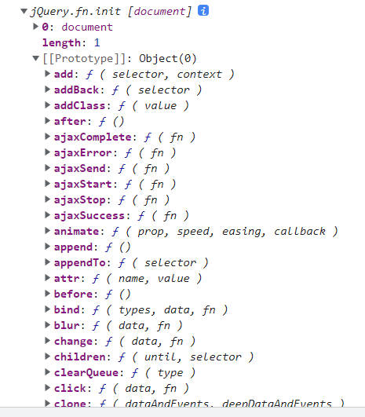

# 认识 jQuery 函数

什么是 jQuery 函数，它与 jQuery 对象是什么关系？

- jQuery 是一个工厂函数( 别名 $ )，调用该函数，会根据传入参数类型来返回匹配到元素的集合，一般把该集合称为 jQuery 对象。

---

jQuery 函数能传入哪些参数？分别返回什么值？

- 传入假值，如 `$('')`：返回一个空的集合。
- 传入选择器：返回在 documnet 中所匹配到元素的集合。
- 传入元素：返回包含该元素的集合。
- 传入 HTML 字符串，返回包含新创建元素的集合。
- 传入回调函数：返回的是包含 document 元素集合, 并且当文档加载完成会回调该函数。
- 因为函数也是对象，所以 jQuery 函数还包含了很多已封装好的类方法。如：`jQuery.noConflict`、`jQuery.ready` 等

jQuery 函数的参数

- jQuery( selector [, context ] ) ：selector 是字符串选择器；context 是匹配元素时的上下文，默认值为 document

  - `jQuery( selector [, context ] )`

    ```javascript
    jQuery('ul li') // 传入一个后代选择器
    ```

  - `jQuery( element )`

    ```javascript
    var bodyEl = document.querySelector('body')
    jQuery(bodyEl)
    ```

  - `jQuery( elementArray )`

  - `jQuery()`

- jQuery( html [, ownerDocument ] )

  - `jQuery( html [, ownerDocument ] )`

  - `jQuery( html )`

    ```javascript
    jQuery('<div>') // 创建了一个div元素
    // 相当于
    document.createElement('div')
    ```

- jQuery( callback )

  ```javascript
  // 监听文档解析完成后，执行的函数
  $(function () {})
  ```

---

# 认识 jQuery 对象

什么是 jQuery 对象？

- jQuery 对象是一个包含所匹配到元素的集合，该集合是类数组 ( array-like ) 对象。
- jQuery 对象是通过调用 jQuery 函数来创建的。
- jQuery 对象中会包含 N（>=0）个匹配到的元素。
- jQuery 对象原型中包含了很多已封装好的方法。例如：DOM 操作、事件处理、动画等方法。

如何创建 jQuery 对象

- `$()` 新建一个空的 jQuery 对象
- `$(document)` 新建一个包含 document 元素的 jQuery 对象
- `$('选择器')` 新建一个包含所选中 DOM 元素的 jQuery 对象

document 的 jQuery 对象



## jQuery 对象与 DOM Element 的区别

- 获取的方式不同
  - DOM Element 是通过原生方式获取，例如：`document.querySelector()`
  - jQuery 对象是通过调用 jQuery 函数获取，例如：`jQuery('')`
- jQuery 对象是一个类数组对象，该对象中会包含所选中的 DOM Element 的集合。
- jQuery 对象的原型上扩展非常多实用的方法，DOM Element 则是 W3C 规范中定义的属性和方法。

document 的 DOM Element 对象


---

## jQuery 对象与 DOM Element 对象的转换

- jQuery 对象转成 DOM Element

  - `$el[index]`：获取 jQuery 对象中某个索引中的 DOM 元素。
  - `$el.get(index)`：获取 jQuery 对象中某个索引中的 DOM 元素。
    - index 一个从零开始的整数，指示要检索的元素。
    - 如果 index 超出范围（小于负数元素或等于或大于元素数），则返回 undefined。
  - `$el.get()` : 没有参数，将返回 jQuery 对象中所有 DOM 元素的数组。

  ```javascript
  var $ul = jQuery('ul')
  // 方式一
  var ulEl = $ul[0] // 将 jQuery 对象转成 DOM Element
  console.log('%O', ulEl)
  // 方式二
  console.log($ul.get()) // 获取到匹配元素集合中所有的元素 [ul]
  console.log($ul.get(0)) // 获取到匹配元素集合中第一个元素 ul
  ```

- DOM Element 转成 jQuery 对象

  - 调用 jQuery 函数或者 $ 函数
  - 例如：$(元素)

  ```javascript
  $(document)
  ```

---

# jQuery 架构设计

理解 jQuery 架构设计图。


代码实现一个简单的 jQuery。

```javascript
// 立即执行函数（避免与全局变量冲突）
;(function (global, factory) {
  factory(global)
})(window, function (window) {
  function ZTjQuery(selector) {
    return new ZTjQuery.fn.init(selector)
  }
  // 原型方法
  ZTjQuery.prototype = {
    constructor: ZTjQuery,
    extend: function () {},
    text: function () {},
    ready: function () {}
    // 学习这里的的方法
  }
  // 类方法
  ZTjQuery.noConflict = function () {}
  ZTjQuery.isArray = function () {}
  ZTjQuery.map = function () {}
  // 学习这里的类方法

  // 将函数对象上的 fn 属性，指向函数的显示原型。
  ZTjQuery.fn = ZTjQuery.prototype

  // 构造函数（创建jQuery对象）
  ZTjQuery.fn.init = function (selector) {
    // css selector
    if (!selector) {
      return this
    }
    // 拿到 DOM Element 源码
    var el = document.querySelector(selector)
    this[0] = el
    this.length = 1
    return this
  }
  ZTjQuery.fn.init.prototype = ZTjQuery.fn
  window.ZTjQuery = window.$ = ZTjQuery
})
```

# jQuery 支持选择器传参

jQuery 支持使用哪些选择器

1. 通用选择器（\*）
2. 基本选择器（id, class, 元素）
3. 属性选择器（ [attr] , [atrr=”value ”] ）
4. 后代选择器（div > span, div span）
5. 兄弟选择器（div + span , div ~ span）
6. 交集选择器（div.container）
7. 伪类选择器（:nth-child()，:nth-of-type()，:not()， 但不支持状态伪类 :hover, :focus...）
8. 内容选择器（:empty，:has(selector)）, empty 指选中的元素没有子元素或文本； has 指选中的元素是否存在某个子元素
9. 可见选择器（:visible, :hidden）
10. jQuery 扩展选择器：（:eq(), :odd, :even, :first, :last ）
11. ...

> jQuery 特有的：:has(selector), :visible, :hidden, :eq(), :odd, :even, :first, :last

```html
<body>
  <ul id="list">
    <li class="li-1">li-1</li>
    <li class="li-2">li-2</li>
    <li class="li-3">li-3</li>
    <li class="li-4">li-4</li>
    <li class="li-5">li-5</li>
  </ul>

  <script src="../libs/jquery-3.6.0.js"></script>
  <script>
    // 1.基本的选择器
    console.log($('.li-1'))
    console.log($('#list'))
    // 2.伪元素选择器
    console.log($('ul li:nth-child(2)'))
    // 3.jQuery额外扩展的选择器
    document.querySelector('ul li:eq(1)') // 不会生效
    console.log($('ul li:eq(1)')) // li.li-2
    console.log($('ul li:first')) // li.li-1
    console.log($('ul li:last')) // li.li-5
    console.log($('ul li:odd')) // 代表索引的奇数，[li.li-2, li.li-4]
    console.log($('ul li:even')) // 代表索引的偶数，[li.li-1, li.li-3, li.li-5]
  </script>
</body>
```

> 了解 VSCode 生成代码片段的工具网站 [生成网站](https://snippet-generator.app/)。

# jQuery 中的过滤器

jQuery 中过滤器有哪些（即 jQuery 函数显示原型上的方法）？如何使用？

1. `eq(index)`: 从匹配元素的集合中，取索引处的元素， eq 全称 ( equal 等于)，返回 jQuery 对象。
2. `first() `: 从匹配元素的集合中，取第一个元素，返回 jQuery 对象。
3. `last()`: 从匹配元素的集合中，取最后一个元素，返回 jQuery 对象。
4. `not(selector)`: 从匹配元素的集合中，删除匹配的元素，返回 jQuery 对象。
5. `filter(selector)`: 从匹配元素的集合中，过滤出匹配的元素，返回 jQuery 对象。
6. `find(selector)`: 从匹配元素集合中，找到匹配的后代元素，返回 jQuery 对象。
7. `is(selector|element| . )`: 根据选择器、元素等检查当前匹配到元素的集合。集合中至少有一个与给定参数匹配则返回 true。
8. `odd()`: 将匹配到元素的集合减少为集合中的奇数，从零开始编号，返回 jQuery 对象。
9. `even()`: 将匹配到元素的集合减少到集合中的偶数，从零开始编号，返回 jQuery 对象。
10. 支持链式调用

```html
<body>
  <ul id="list" class="panel">
    <li class="li-1">li-1</li>
    <li class="li-2">li-2</li>
    <li class="li-3">li-3</li>
    <li class="li-4">li-4</li>
    <li class="li-5">li-5</li>
  </ul>

  <script src="../libs/jquery-3.6.0.js"></script>
  <script>
    // 1.监听文档完全解析完成
    $(function () {
      // 1.eq()
      console.log($('ul li:eq(2)')) // selector
      console.log($('ul li').eq(2)) // API -> 原型上的方法
      // 2.first()  last()
      console.log($('ul li').first())
      console.log($('ul li').last())
      // 3.not()
      console.log($('ul li').not('.li-1'))
      console.log($('ul li').not('.li-1, .li-2'))
      // 4. odd()  even()
      console.log($('ul li').odd())
      console.log($('ul li').even())
      // 5.filter()
      console.log($('ul li').filter('.li-4'))
      console.log($('ul li').filter('.li-4, .li-3'))
      // 6.jQuery 原型上的方法，大部分支持链式调用
      var $el = $('ul li').filter('.li-2, .li-3, .li-4').eq(1)
      console.log($el)
    })
  </script>
</body>
```

# jQuery 对文本操作的 api

- `.text()`、`.text(text)`

  - 获取匹配到元素集合中每个元素组合的文本内容，包括它们的后代，或设置匹配到元素的文本内容。
  - 相当与原生元素的 textContent 属性。

  ```javascript
  // 1.拿到 ul 中所有的文本
  console.log($('ul li').text()) // 获取值时，会获取匹配元素集合中所有的元素，如：li-1li-2li-3li-4li-5
  // 2.设置 li 中的文本
  $('ul li').text('我是li') // 设置值：一般是给选中所有元素设置
  ```

- `.html()`、`html(htmlString)`

  - 获取匹配到元素集合中第一个元素的 HTML 内容，包括它们的后代，或设置每个匹配元素的 HTML 内容。

- 相当于原生元素的 innerHTML 属性。

  ```javascript
  // 获取的时候 一般是拿到匹配元素集合中的第一个元素的数据
  console.log($('ul li').html())
  // 2.给 li 元素设置 html 的内容（ 设置 ），设置值：一般是给选中所有元素设置
  $('ul li').html(`
    <p>我是p元素</p>
    <span>我是一个span</span>
  `)
  ```

- `.val()`、`.val(value)`

  - 获取匹配到元素集合中第一个元素的当前值或设置每个匹配到元素的值。
  - 该 `.val()` 方法主要用于获取 input, select 等表单元素的值。
  - 相当于获取原生元素的 value 属性。

  ```html
  <input class="user" type="text" placeholder="请求输入用户名" />
  <input class="password" type="text" placeholder="请求输入密码" />
  <button class="login">登录</button>
  <button class="setUserPas">设置用户名密码</button>

  <script src="../libs/jquery-3.6.0.js"></script>
  <script>
    // 1.监听文档完全解析完成
    $(function () {
      // 1.获取表单数据
      $('.login').on('click', function () {})
      // 简写
      $('.login').click(function () {
        console.log($('.user').val())
        console.log($('.password').val())
      })
      // 2.给表单元素设置值
      $('.setUserPas').click(function () {
        $('.user').val('coder')
        $('.password').val('admin')
      })
    })
  </script>
  ```

# jQuery 对 css 操作的 api

- `.width()`、.`width(value)`

  - 获取匹配到元素集合中第一个元素的宽度或设置每个匹配到元素的宽度。

  ```javascript
  // 1.获取到元素的 width
  // width: content ;
  // innerWidth: content + padding;
  // outerWidth: content + padding + border
  console.log($('ul').width()) // 返回的结果是 number
  // 2.设置 ul 元素的 width
  $('ul').width(300) // 直接给 style 设置一个 width
  $('ul').width('500px') // 直接给 style 设置一个 width
  ```

- `.height()`、`height(value)`

  - 获取匹配到元素集合中第一个元素的高度或设置每个匹配到元素的高度。

- `.css(propertyName)`、`.css(propertyNamesArr)`

  - 获取匹配到元素集中第一个元素样式属性的值，底层是调用 `getComputedStyle` 函数获取。
  - .css( "width" ) 和 .width() 之间的区别:
    - width() 返回一个无单位的像素值（例如，400），而 css() 返回一个具有完整单位的值（例如，400px）

- `.css(propertyName, value)`、`.css(properties)Obj`

  - 为每个匹配到元素设置一个或多个 CSS 属性。

- 调用 css 方法添加样式会直接把样式添加到元素的 style 属性上。

  ```javascript
  // 1.获取ul元素的 width
  console.log($('ul').css('width')) // 返回的结果是 string 带单位 px
  console.log($('ul').css(['width', 'height'])) // 返回的结果是 string 带单位 px 。 {width: '223px', height: '105px'}
  // 2.给ul元素设置 width
  $('ul').css('width', '450px') // 设置的是一个属性
  $('ul').css({
    // 设置的是多个属性
    width: 100,
    height: 100,
    color: 'red'
  })
  $('ul li').css('color', 'green').odd().css({
    color: 'red'
  })
  ```

# jQuery 的 class 属性操作

- `.addClass(className)`、`.addClass(classNamesArr)`、`.addClass(funcntion)`
  - 将指定的类添加到匹配元素集合中的每个元素，每次都是追加 class。
  - 底层调用的是 `setAttribute( "class", finalValue )` 方法添加 class。
- `.hasClass(className)`
  - 是否给任意匹配到的元素分配了该类。
  - 底层是通过 `getAttribute( "class" ).indexOf()` 来判断是否存在。
- `.removeClass()`、`.removeClass(className)`、`.removeClass(classNamesArr)`、`.removeClass(function)`
  - 给匹配元素集中的每个元素删除单个类、多个类或所有类。
  - 底层调用的是 `setAttribute( "class", finalValue )` 方法。
- `.toggleClass()`、`.toggleClass(className[,state])`、`.toggleClass(classNames[,state])`
  - 根据类的存在或状态参数的值，在匹配到元素的集合中，给每个元素添加或删除一个或多个类。

```javascript
// 1.添加class
$('ul').addClass('list1 list2')
$('ul li').addClass(['list1', 'list2'])
// 2.判断是否存在弄个class
console.log($('ul').hasClass('active list')) // 这种写法判断的是相邻的 class
// 3.删除class
$('ul').removeClass() // 删除全部
$('ul').removeClass('list') // 删除指定的某一个
// 4.class的切换
$('.toggle').click(function () {
  // $('ul').toggleClass()
  $('ul').toggleClass('active')
})
```
