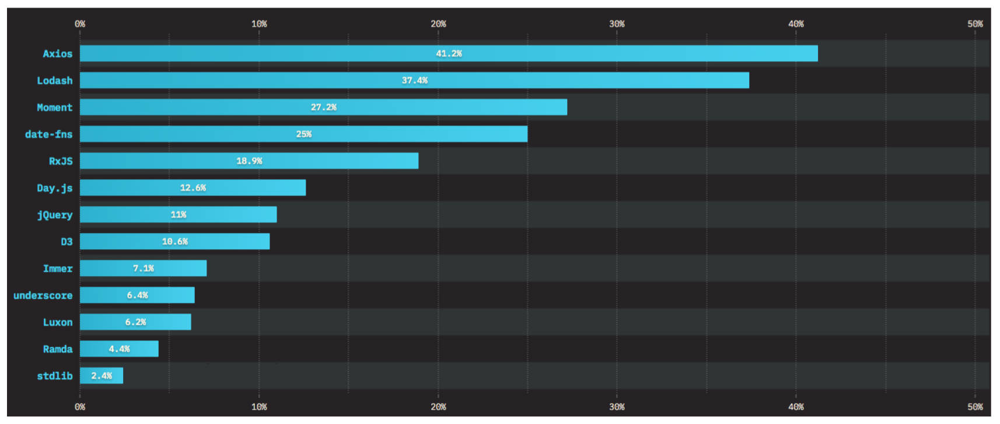

# jQuery AJAX

jQuery 请求参数以及含义：

- `url` - 指定发送请求的 URL。
- `method / type` - 用于指定请求的类型 (如 "POST", "GET", "PUT")，默认为 GET
- `data` - 指定要发送到服务器的数据（PlainObject or String or Array）
- `processData` - 默认为 true，表示当 data 是一个对象时，从该对象的键值对生成 query 字符串，例如，{ a: "bc", d: "e,f" }被转换为字符串"a=bc&d=e%2Cf"，。除非该 processData 选项设置为 false.
- `header` - 请求头的内容。
- `contentType` - 向服务器发送数据时指定内容类型。
  - `application/x-www-form-urlencoded; charset=UTF-8`：默认值，请求体的数据以查询字符串形式提交，如：a=bc&d=e%2Cf。
  - `application/json; charset=UTF-8` 指定为 json 字符串类型。
  - `false`，代表是 `multipart/form-data` 表单类型，一般用于上传文件。
- `dataType` - 期望服务器端发回的数据类型（json、xml、text....），默认会根据响应的类型来自动推断类型。
- `timeout` - 请求超时时间。它以毫秒为单位。
- `beforeSend` - 这是一个在发送请求之前运行的函数，返回 false 会取消网路请求。
- `success` - 请求成功回调的函数。
- `error` - 请求失败回调的函数。

## 基本使用

jQuery AJAX 初体验，

```javascript
$.ajax({
  url: 'http://httpbin.org/get',
  type: 'GET' // or method: 'GET'
  // dataType: 'json', // 自动推断(content-type)
})
```

错误处理，

```javascript
$.ajax({
  url: 'http://httpbin.org/status/500', // 500 (后台代码异常)
  method: 'POST',
  success: function (res) {
    console.log(res)
  },
  error: function (error) {
    console.log('error=>', error) // 会打印
  }
})
```

超时处理。取消请求。

```javascript
var jqXHR = $.ajax({
  url: 'http://httpbin.org/delay/7', // 后台需要在7秒后才会返回数据给我们
  method: 'POST',
  timeout: 5000, // 配置超时时间
  success: function (res) {
    console.log(res)
  },
  error: function (error) {
    console.log(error) //超时后，会回调 error 函数。
  }
})
// 取消这个请求
$('button').click(function () {
  // abort()
  jqXHR.abort() // 手动取消请求
})
```

## GET 请求

jQuery GET 请求处理几种常见情况。

url 提交请求参数

```javascript
$.ajax({
  url: 'http://httpbin.org/get?cityId=404100&keyWord=天河公园',
  method: 'GET'
})
```

data 提交请求参数

```javascript
$.ajax({
  url: 'http://httpbin.org/get',
  method: 'GET',
  data: {
    // processData 默认值为 true，会将 data 转成 query 字符串添加到 url 的后面。
    cityId: '504100',
    keyWord: '小蛮腰'
  }
})
```

添加请求头

```javascript
$.ajax({
  url: 'http://httpbin.org/get',
  method: 'GET',
  data: {
    cityId: '504100',
    keyWord: '小蛮腰'
  },
  headers: {
    token: 'aaaaabbbbbcccccc'
  },
  success: function (res) {
    console.log(res)
  }
})
```

GET 请求的简写

```javascript
// jQuery 封装的 ajax 相关 api，支持 Promise 风格。
$.get('http://httpbin.org/get')
  .then(function (res) {
    // jQuery 1.8
    console.log(res)
  })
  .catch(function () {
    //  fail
    console.log('catch')
  })
  .always(function () {
    // finally
    console.log('always')
  })
```

## POST 请求

jQuery POST 请求处理几种常见情况。

url 提交请求参数，

```javascript
$.ajax({
  url: 'http://httpbin.org/post?cityId=404100&keyWord=天河公园',
  method: 'POST'
})
```

data 提交请求参数，

```javascript
$.ajax({
  url: 'http://httpbin.org/post',
  method: 'POST',
  data: {
    cityId: '504100',
    keyWord: '小蛮腰'
  }
  // contentType: 'application/x-www-form-urlencoded; charset=UTF-8', // 默认值
  // dataType: 'json', // 自动推断, response content-type
})
```

data 提交 JSON 字符串，

```javascript
$.ajax({
  url: 'http://httpbin.org/post',
  method: 'POST',
  data: JSON.stringify({
    // 此时 data 为字符串，不需要设置 processData: false
    cityId: '504100',
    keyWord: '小蛮腰'
  }),
  contentType: 'application/json; charset=UTF-8'
})
```

data 提交 FormData，添加请求头，

```javascript
var formData = new FormData()
formData.append('cityId', 404100)
formData.append('keyWord', '小蛮腰')
// formData.append('file', 文件)
$.ajax({
  url: 'http://httpbin.org/post',
  method: 'POST',
  data: formData,
  processData: false, // processData:true, 会将 data 为对象的转成查询字符串
  contentType: false, // 使用 原生 XHR 默认的 contentType，也就是 multiparty/formdata
  headers: {
    token: 'xxxxxxxsssssssssssd'
  },
  success: function (res) {
    console.log(res)
  }
})
```

POST 请求的简写。

```javascript
$.post('http://httpbin.org/post', {
  cityId: '504100',
  keyWord: '小蛮腰'
}).then(function (res) {
  console.log(res)
})
```

# jQuery 的插件

什么是 jQuery 的插件？

- 编写的一些新方法，并将这些方法添加到 jQuery 的原型对象上。

编写 jQuery 插件的步骤。

1. 新建一个插件对应的 JS 文件（命名规范：`jquery.插件名.js`）
2. 在**立即执行函数**中编写插件，这样可以避免插件中的变量与全局变量冲突。
3. 在 jQuery 的原型对象上新增方法。
4. 最后在 html 中导入，就可以像其他 jQuery 对象实例方法一样使用了。

编写一个 jQuery 插件，在 a 元素文本后显示链接地址。

index.html

```html
<a href="https://www.jd.com">京东商城</a>
<a href="https://www.taobao.com">淘宝商城</a>
<a href="https://www.biyao.com">必要商城</a>
<script src="../libs/jquery-3.6.0.js"></script>
<script src="./utils/jquery.showlinklocation.js"></script>
<script>
  $(function () {
    $('a').showlinklocation().css('color', 'red')
  })
</script>
```

jquery.showlinklocation.js

```JavaScript
;(function (g, $) {
	// 1.在jQuery的原型上添加了一个 showlinklocation
	$.fn.showlinklocation = function() {
    console.log(this) // jQuery对象集合
		// 2.过滤出a元素的集合，遍历a元素
    this.filter('a').each(function() {
      var $a = $(this) // DOM Element -> jQuery 对象集合
      var link = $a.attr('href')
      $a.append(`(${link})`)
    })
    return this
  }
})(window, jQuery)
```

# 项目实战

项目实战：基于 $.ajax 封装网络请求。

封装网络请求的好处 3 点

1. 增加可扩展性和维护性。
2. 对共性代码进行封装，减少不必要的重复代码。
3. 统一请求：统一拦截请求，响应；统一处理异常。

---

项目实战：发送请求，获取搜索框联想数据，添加到 DOM 对象上。

---

项目实战：搜索栏的切换功能实现。

---

项目实战：动态渲染搜索栏上方关键字并绑定 key

---

项目实战：搜索框的优化：防抖实现。

---

# JavaScript 常用库

了解前端常见的 JavaScript 工具库有哪些？



---

了解 underscore 库和 lodash 库的异同。

相同点：都提供了非常多的函数来对数组、数字、对象、字符串等操作，非常适合如下操作：

- 迭代数组、对象和字符串。
- 操作和测试值。
- 创建复合函数。

不同点：

- Lodash 是 Underscore 的一个分支，并且仍然遵循 Underscore 的 API，但在底层已完全重写过，
- Lodash 还添加了许多 Underscore 没有提供的特性和功能，它已经成为 Underscore 的超集，足以成为 Underscore 替代品。
- Lodash 为数组、字符串、对象和参数对象提供更一致的**跨环境**迭代支持。
- Lodash 提供额外的功能（如 AMD 支持、深度克隆和深度合并）、更好的整体性能和大型数组/对象迭代的优化，以及自定义构建和模板预编译实用程序的更大灵活性。

---

lodash 库的安装和使用。

1. CDN 引入。

   ```html
   <script src="https://cdn.jsdelivr.net/npm/lodash@4.17.21/lodash.min.js"></script>
   ```

2. 下载源码。

引入后，会在 全局对象（如 window）上添加一个下划线属性`_`。

```javascript
console.log('%O', _)
console.log(_.VERSION) // 查看Lodash的版本号
console.log(_.join([2022, 06, 23], '-'))
```

---

手写一个简单的 lodash 库。

ztLodash.js

```javascript
;(function (g) {
  function Lodash() {}
  Lodash.VERSION = '1.0.0'
  // 添加类方法
  Lodash.join = function (arr, separater) {
    // todo ......
    return arr.join(separater)
  }
  Lodash.debounce = function () {}
  Lodash.throttle = function () {}
  Lodash.random = function () {}
  Lodash.endsWith = function () {}
  Lodash.clone = function () {}
  Lodash.cloneDeep = function () {}
  Lodash.merge = function () {}
  // ....
  g._ = Lodash
})(window)
```

---

loadsh 的基本使用，它有哪些 api？

字符串（String）

- `_.camelCase()` - 转换字符串 string 为驼峰写法。
- `_.capitalize(string)` - 转换字符串 string 首字母为大写，剩下为小写。
- `_.endWith(string, target)` - 检查字符串 string 是否以给定的 target 字符串结尾。
- `_.padStart(str, lenght, char)` - 如 string 字符串长度小于 length 则在左侧填充字符。如果超出 length 长度则截断超出的部分。
- `_.trim(string, chars)` - 从 string 字符串中移除前面和后面的空格或指定的字符。

数组（Array）

- `_.first(arr, level)` - 获取 array 中的第一个元素。
- `_.last(arr, [n=1])` - 获取 array 中的最后一个元素。
- `_.uniq(arr)` - 创建一个去重后的 array 数组副本。返回新的去重后的数组。
- `_.compact(arr)` - 创建一个新数组，包含原数组中所有的非假值元素。返回过滤掉假值的新数组。
- `_.flatten(arr)` - 减少一级 array 嵌套深度。返回新数组。

对象

- `_.pick(object, [props])` - 从 object 中选中的属性来创建一个对象。返回新对象。
- `_.omit(object, [props])` - 反向版\_.pick ; 删除 object 对象的属性。返回新对象。
- `_.clone(value)` - 支持拷贝 arrays、 booleans、 date 、map、 numbers， Object , regexes, sets, strings, symbols 等等。 arguments 对象的可枚举属性会拷贝为普通对象。 （注：也叫浅拷贝）返回拷贝后的值。
- `_.cloneDeep(value)` -这个方法类似\_.clone，除了它会递归拷贝 value。（注：也叫深拷贝）。返回拷贝后的值。

集合（Array | Object）

- `_.sample()` - 从 collection（集合）中获得一个随机元素。返回随机元素。
- `_.shuffle()` - 创建一个被打乱值的集合。
- `_.orderBy ` - 给数组排序，默认是升序 asc。
- `_.each() / _.forEach()` - 遍历(集合) 中的每个元素
- `_.filter( )` - 返回一个新的过滤后的数组。

函数

- `_.curry()` - 返回新的柯里化（curry）函数。
- `_.debounce()` - 返回新的 debounced（防抖动）函数。
- `_.throttle()` - 返回节流的函数。

---

了解 Moment.js 库和 Day.js 库有什么异同？

相同点：都可用于快速处理时间和日期。

不同点：

- Moment 对浏览器的兼容性比较好，例如，在 Internet Explorer 8+ 版本运行良好。
- Moment 不适用于“tree-shaking”算法，因此往往会增加 Web 应用程序包的大小。如果需要国际化或时区支持，Moment 可以变得相当大。
- Moment 团队也希望我们在未来的新项目中不要使用 Moment 。而推荐使用其它的替代品。例如：Day.js。
- Day.js 是 Moment 的缩小版，拥有与 Moment 相同的 API，并将其文件大小减少了 97%。
- Day.js 所有的 API 操作都将返回一个新的 dayjs 对象，这种设计能避免 bug 产生，减少调试时间。
- Day.js 对国际化支持良好。国际化需手动加载，多国语言默认是不会被打包到 Day.js 中的。

---

Day.js 的下载，安装；

- CDN 引入。
- 下载源码引入。

```html
<script src="./libs/dayjs.js"></script>
<script>
  console.log('%O', dayjs)
  console.log('%O', dayjs()) // 创建 dayjs 对象
  console.log(dayjs().format()) // 拿到当前的时间
</script>
```

---

手写一个简单的 Day.js 库。

ztDay.js

```javascript
;(function (g) {
  // browser -> window 全局对象，node -> global 全局对象
  // globalThis -> ES11
  g = typeof globalThis !== 'undefined' ? globalThis : g || self
  // 构造函数
  function Dayjs() {
    var date = new Date()
    this.$Y = date.getFullYear()
    this.$M = date.getMonth()
    this.$D = date.getDate()
  }
  // 原型上的方法
  Dayjs.prototype.format = function () {
    return `${this.$Y}-${this.$M + 1}-${this.$D}`
  }
  // 学习原型上的方法
  // ......原型的方法
  // 工厂函数
  function dayjs() {
    return new Dayjs()
  }
  dayjs.prototype = Dayjs.prototype
  // 统一导出
  g.dayjs = dayjs
})(this)
```

---

Day.js 的基本使用：获取，设置，操作时间。

```javascript
// 1.获取时间
var day = dayjs()
console.log(day.year(), day.month() + 1, day.date(), day.hour(), day.minute(), day.second())
// 2.设置时间
var day = dayjs().year(2021).month(5).date(1)
// 3.操作时间
var day = dayjs() // dayjs 对象
  .add(1, 'year') // 增加一年
  .add(2, 'month') // 增加2个月
  .add(-1, 'month') // 减去一个月
  .subtract(1, 'year') // 减去一年
  .subtract(1, 'month') // 减去一月
  .subtract(1, 'day') // 减去一天
  .startOf('year') // 一年的开始 2022-01-01 00:00:00
  .startOf('month') // 一月的开始
  .startOf('day') // 一天的开始
```

---

Day.js 的基本使用，解析时间。

```javascript
// 1.解析一个字符串(ISO 8601)类型的时间：YYYY-MM-DD HH:mm:ss、YYYY-MM-DD、YYYY/MM/DD、...
var day = dayjs('2021-2-2 12:00:10') // dayjs 对象
// 2.解析时间戳(毫秒)
var day = dayjs(1656206934331) // dayjs 对象
// 3.解析时间戳(秒)
var day = dayjs.unix(1656206934) // dayjs 对象
// 4.解析 Date 对象
var day = dayjs(new Date('2022-10-1')) // dayjs 对象
// 时间的格式化
console.log(day.format('YYYY/MM/DD HH/mm/ss'))
```

---

Day.js 的插件的使用。

- 添加 day.js 插件，用于显示现在相对于过去某一个时间，过了多久（如，"4 分钟前"，"2 小时前"，"1 天前"）

```html
<script src="./libs/dayjs.js"></script>
<script src="./libs/dayjs.relative-time.min.js"></script>
<!-- 会在 Dayjs 的原型上添加: fromNow 方法 -->
<script>
  // 1.安装插件
  dayjs.extend(dayjs_plugin_relativeTime)
  var day = dayjs(1656206934331) // dayjs 对象
  console.log(day.fromNow()) // 4 minutes ago
</script>
```

Day.js 插件实现国际化，原理理解（在对象中，维护了关键字对应的翻译词汇）。

```html
<script src="./libs/dayjs.js"></script>
<script src="./libs/dayjs.relative-time.min.js"></script>
<!-- 会在 Dayjs 的原型上添加: fromNow .... -->
<script src="./libs/dayjs.zh-cn.min.js"></script>
<!-- 给 Dayjs 的全局变量 Ls 添加了一个中文支持 -->
<script>
  // 1.安装插件
  dayjs.extend(dayjs_plugin_relativeTime)
  // 2.切换使用中文
  dayjs.locale('zh-cn')
  var day = dayjs(1656206934331) // dayjs 对象
  console.log(day.fromNow()) // 4分钟前
</script>
```
