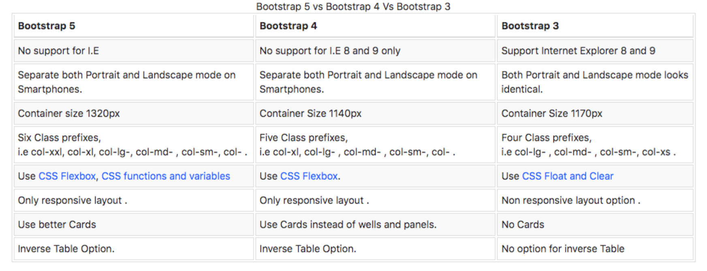

什么是 Bootstrap 框架？

- 是一个非常受欢迎的前端框架，官方网站将其描述为：最流行的HTML、CSS 和 JS 框架，用于在Web 上开发响应式、移动优先的项目。(v3.x)
	- 响应式页面：页面布局会随着屏幕尺寸的变化而自动调整布局，作用是适配各个屏幕。
- 是功能强大、可扩展，且功能丰富的前端工具包。（v5.x）
- 底层是使用 Sass 构建，支持定制（Sass、Color、CSS variable ....）。（v5.x）
- 其中的网格系统、组件以及强大的 JavaScript 插件可以让我们快速搭建响应式网站。(v5.x)
- Bootstrap是由HTML、CSS和JavaScript编写可复用代码的集合（包括全局样式、组件、插件等），它是一个前端框架，使用该框 架能够快速开发出响应的网站（即适配PC、平板和移动端的网站）。

它有什么用？

- 可以让我们免去编写大量的CSS 代码（Write less），让我们更专注于网站业务逻辑的开发。
- 是开源免费的，可以从 GitHub 直接拿到源码。

-----

了解 Bootstrap 的起源。

- Bootstrap 原名 Twitter Blueprint，由Twitter 公司的 Mark Otto 和 Jacob Thornton 编写。 他们的本意是想制作一套可以让网页保持统一风格的前端框架。
- 在 Bootstrap 之前，Twitter 团队在开发界面时，不同的项目组会使用不同的代码库。 这样就会很容易导致界面风格不一致等问题，从而增加了后期的维护成本。
- Mark Otto 发现自己设计的工具比别人设计的更强大，能够做更多的事情。几个月之后，Mark Otto 和一群开发人员做出了 Bootstrap 的原型。然后经过他们开发小组几个月之后的努力，大家把 Twitter Blueprint 改名为 Bootstrap。
- 在2011年8月19日将其作为开源项目发布。项目由 Mark Otto、Jacob Thornton 和核心开发小组维护。
- 在2012年1月31日发布 Bootstrap 2，增加了十二列网格系统和响应式组件，并对许多组件进行了修改。
- 在2013年8月19日发布 Bootstrap 3，开始将移动设备优先作为方针，并且开始使用扁平化设计，支持IE8-9。
- 在2018年1月7日发布 Bootstrap 4，增加了 Flexbox Grid、Cards、Spacing Utilities 等。
- 在2021年5月5日发布 Bootstrap 5，增强 Grid System、增强 Form elements、Not Support for IE、Bootstrap Icons 等

3和5版本有什么区别

-----

Bootstrap 框架有什么优缺点？

优点：
- 具有简单的文件结构，只需要懂 HTML、CSS 和 JS 的基本知识，就可以上手使用 Bootstrap，甚至阅读其源码，对于初学者来是说易于学习。
- 拥有一个强大的网格系统，它是由行和列组成，我们可以直接创建网格，无需自行编写媒体查询来创建。
- 预定义很多响应式的类。例如，给图片添加.`img-responsive` 类，图片将会根据用户的屏幕尺寸自动调整图像大小， 更方便我们去做各个屏幕的适配。另外 Bootstrap 还提供了很多额外的工具类辅助我们进行网页开发。
- Bootstrap框架提供的组件、插件、布局、栅格系统、响应式工具等等，可以为我们节省了大量的开发时间。

缺点：
- 不适合高度定制类型的项目，因为Bootstrap具有统一的视觉风格，高度定制类的项目需要大量的自定义和样式覆盖。 
- Bootstrap的框架文件比较大(61KB JS + 159KB CSS)，资源文件过大会增加网站首屏加载的时间，并加重服务器的负担。
- Bootstrap样式相对笨重，也会额外添加一些不必要的HTML元素，他会浪费一小部分浏览器的资源。

为什么要学习 Bootstrap？

- Bootstrap仍然是世界上使用较多的CSS 框架。如果你以前没有学习过CSS 框架，那么它将是一个很好的入门方式， Bootstrap它很容易上手，并且也有非常完整的中文文档。
- Bootstrap提供的组件、插件、布局、栅格系统、响应式工具等，可以为我们节省了大量的开发时间，不必从零开始搭建页面。 
- Bootstrap框架可以为各个平台和浏览器提供一致的展示效果，例如在 Firefox 中与在 Chrome 中可以展示相同的效果。 
- Bootstrap 提供开箱即用的响应式设计。因此，我们可以很快的开发出一套同时适配PC、iPad和移动端的网站。 
- Bootstrap使用 jQuery 与HTML 交互。对于初学者来说，它将是一个不错的入门方式。
- 同时Bootstrap框架优秀的设计和架构思想也是非常值得学习。

-----

Bootstrap 的安装方式有哪些。

-----

在 HTML 中引入 Bootstrap 后，需要添加的2个全局配置。

-----

了解 Bootstrap 软件包有哪些内容。

-----

Bootstrap 的基本使用。

-----

开发两个按钮，使用原生方式和使用 Bootstrap 来实现。

-----

了解 Bootstrap4 的架构图，框架中集成了哪些模块。

-----

什么是 Bootstrap 的屏幕尺寸的分割点？

-----

什么是 Bootstrap 的响应式容器 Containers？基本使用。

-----

什么是 Bootstrap 的网格系统？基本使用。