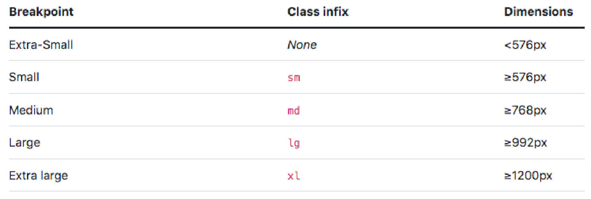
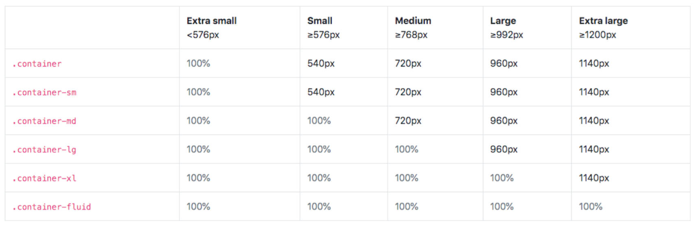

什么是 Bootstrap 框架？

- 是一个受欢迎的前端框架，官方网站将其描述为：最流行的 HTML、CSS 和 JS 框架，用于在 Web 上开发响应式、移动优先的项目。(v3.x)
	- 响应式页面：页面布局会随着屏幕尺寸的变化而自动调整布局，作用是适配各个屏幕。
- 功能强大、可扩展，且功能丰富的前端工具包。（v5.x）
- 底层是使用 Sass 构建，支持定制（Sass、Color、CSS variable ....）。（v5.x）
- 其中的网格系统、组件以及强大的 JavaScript 插件可以让我们快速搭建响应式网站。(v5.x)
- Bootstrap 是由 HTML、CSS 和 JS 编写可复用代码的集合（包括全局样式、组件、插件等），它是一个前端框架，使用该框架能够快速开发出响应的网站（即适配PC、平板和移动端的网站）。

它有什么用？

- 可以让我们免去编写大量的 CSS 代码（Write less），让我们更专注于网站业务逻辑的开发。
- 是开源免费的，可以从 GitHub 直接拿到源码。

-----

了解 Bootstrap 的起源。

- Bootstrap 原名 Twitter Blueprint，由 Twitter 公司的 Mark Otto 和 Jacob Thornton 编写。 他们的本意是想制作一套可以让网页保持统一风格的前端框架。
- 在 Bootstrap 之前，Twitter 团队在开发界面时，不同的项目组会使用不同的代码库。 这样就会很容易导致界面风格不一致等问题，从而增加了后期的维护成本。
- Mark Otto 发现自己设计的工具比别人设计的更强大，能够做更多的事情。几个月之后，Mark Otto 和一群开发人员做出了 Bootstrap 的原型。然后经过他们开发小组几个月之后的努力，大家把 Twitter Blueprint 改名为 Bootstrap。
- 在2011年8月19日将其作为开源项目发布。项目由 Mark Otto、Jacob Thornton 和核心开发小组维护。
- 在2012年1月31日发布 Bootstrap 2，增加了十二列网格系统和响应式组件，并对许多组件进行了修改。
- 在2013年8月19日发布 Bootstrap 3，开始将移动设备优先作为方针，并且开始使用扁平化设计，支持IE8-9。
- 在2018年1月7日发布 Bootstrap 4，增加了 Flexbox Grid、Cards、Spacing Utilities 等。
- 在2021年5月5日发布 Bootstrap 5，增强 Grid System、增强 Form elements、Not Support for IE、Bootstrap Icons 等

3和5版本有什么区别


-----

Bootstrap 框架有什么优缺点？

优点：
- 具有简单的文件结构，只需要懂 HTML、CSS 和 JS 的基本知识，就可以上手使用 Bootstrap，甚至阅读其源码，对于初学者来是说易于学习。
- 拥有一个强大的网格系统，它是由行和列组成，我们可以直接创建网格，无需自行编写媒体查询来创建。
- 预定义很多响应式的类。例如，给图片添加.`img-responsive` 类，图片将会根据用户的屏幕尺寸自动调整图像大小， 更方便我们去做各个屏幕的适配。另外 Bootstrap 还提供了很多额外的工具类辅助我们进行网页开发。
- Bootstrap 框架提供的组件、插件、布局、栅格（网格）系统、响应式工具等等，可以为我们节省了大量的开发时间。

缺点：
- 不适合高度定制类型的项目，因为 Bootstrap 具有统一的视觉风格，高度定制类的项目需要大量的自定义和样式覆盖。 
- Bootstrap 的框架文件比较大(61KB JS + 159KB CSS)，资源文件过大会增加网站首屏加载的时间，并加重服务器的负担。
- Bootstrap 样式相对笨重，也会额外添加一些不必要的 HTML 元素，他会浪费一小部分浏览器的资源。

为什么要学习 Bootstrap？

- Bootstrap 仍然是世界上使用较多的 CSS 框架。Bootstrap它很容易上手，并且也有非常完整的中文文档。
- Bootstrap 提供的组件、插件、布局、栅格（网格）系统、响应式工具等，节省了大量的开发时间，不必从零开始搭建页面。 
- Bootstrap 框架可以为各个平台和浏览器提供一致的展示效果，例如在 Firefox 中与在 Chrome 中可以展示相同的效果。 
- Bootstrap 提供开箱即用的响应式设计。因此，我们可以很快的开发出一套同时适配 PC、iPad 和移动端的网站。 
- Bootstrap 使用 jQuery 与 HTML 交互。对于初学者来说，它将是一个不错的入门方式。
- 同时 Bootstrap 框架优秀的设计和架构思想也是非常值得学习。

-----

Bootstrap 的安装前提

- Bootstrap 是一个前端框架。该框架主要是由 CSS 和 JS 组成，但是也会依赖一小部分的 HTML。 
- 因此在安装 Bootstrap 时，我们需要引入相应的 CSS 和 JS 文件，当然也需要添加一些全局的配置。 
- 在 Bootstrap 5 版本以前，Bootstrap 是依赖 jQuery 的。
- 那么如果使用的是 Bootstrap 5 以下的版本，需在引入 Bootstrap 之前先引入 jQuery 库。

Bootstrap 的安装方式有哪些。

1. 在页面中，直接通过 CDN 的方式引入。 
2. 下载 Bootstrap 框架，并在页面中手动引入。（没有网时，用这种方式）
3. 使用 npm 包管理工具安装到项目中（npm 在 Node 基础阶段会讲解）

-----

在 HTML 中引入 Bootstrap 后，需要添加的2个全局配置。

- HTML5 文档类型（DOCTYPE），Bootstrap 要求文档类型（DOCTYPE）是 HTML5。 
	
	- 如果没有设置这个，就会看到一些古怪的、不完整的样式，因此，正确设置文档类型（doctype）能轻松避免这些困扰。
- 添加视口（viewport） 
	- Bootstrap 采用的是移动设备优先（mobile first）的开发策略，为了网页能够适配移动端的设备，需在 \<head\> 标签中添加 viewport （视口）。
	
	- 在移动端会把 layout viewport 的宽度设置为设备的宽，并且不允许用户进行页面的缩放。 
	
	- ```html
	  <meta name="viewport" content="width=device-width, initial-scale=1.0,user-scalable=no,maximum-scale=1.0,minimum-scale=1.0,shrink-to-fit=no"><!-- shrink-to-fit=no，针对 safari 9+，禁止页面伸缩 -->
	  ```

CDN引入方式

```html
<!DOCTYPE html>
<html>
  <head>
    <meta charset="UTF-8">
    <meta http-equiv="X-UA-Compatible" content="IE=edge">
    <meta name="viewport" content="width=device-width, initial-scale=1.0, user-scalable=no, minimum-scale=1.0, maximum-scale=1.0, shrink-to-fit=no">
    <title>Document</title>
    <!-- 引入 Bootstrap 框架中的 CSS 文件: 有 box-size:border-box; 的效果 -->
    <link rel="stylesheet" href="https://cdn.jsdelivr.net/npm/bootstrap@4.6.1/dist/css/bootstrap.min.css">
  </head>
  <body>
    <!-- 基本使用 -->
    <h1 class="text-left border border-primary">Hello Bootstrap</h1>
    <!-- Bootstrap5 之前需要依赖 jQuery 库 -->
    <script src="https://cdn.jsdelivr.net/npm/jquery@3.5.1/dist/jquery.slim.min.js"></script>
    <!-- 引入 Bootstrap 的JS文件 -->
    <script src="https://cdn.jsdelivr.net/npm/bootstrap@4.6.1/dist/js/bootstrap.bundle.min.js"></script>
  </body>
</html>
```

-----

了解 Bootstrap 软件包有哪些内容。


-----

开发两个按钮，使用 Bootstrap 来实现。

```html
<!-- Bootstrap 内置了封装好的样式 -->
<div class="btn btn-primary">按钮1</div>
<div class="btn btn-warning">按钮2</div>
```

-----

了解 Bootstrap 4 的架构图，框架中集成了哪些模块。


-----

什么是 Bootstrap 的屏幕尺寸的分割点？

- Bootstrap 的一大核心就是响应式，即开发一套系统便可以适配不同尺寸的屏幕。它底层原理是使用媒体查询来为布局和页面创建合理的断点 (Breakpoints)，然后根据这些断点来给不同尺寸屏幕应用不同的 CSS 样式。
- Bootstrap 4设了5个断点来构建响应式系统，分别为 Extra-Small、Small、Medium、Large、Extra large
- 媒体查询是 CSS 的一项功能，它允许你根据浏览器的分辨率来应用不同的 CSS 样式，如 `@media (min-width: 576px){}`



-----

什么是 Bootstrap 的响应式容器 

- Containers 容器是 Bootstrap 中最基本的布局元素，并且该布局支持响应式。在使用默认网格系统时是必需的。 
- Containers 容器用于包含、填充，有时也会作为内容居中使用。容器也是可以嵌套，但大多数布局不需要嵌套容器。 
- Bootstrap 带有三个不同的Containers容器： 
	- .container: 它在每个断点处会设置不同的 max-width。 
	- .container-fluid：在所有断点处都是 width: 100%。
	- .container-{breakpoint}, 默认是 width: 100%，直到指定断点才会修改为响应的值。



Containers 基本使用。

```html
<div class="container">
  我是box
</div>
<div class="container-lg">
  我是box
</div>
<div class="container-fluid">
  我是box
</div>
```

-----

什么是 Bootstrap 的网格系统？

- 用来处理行和列排版的列表系统。
- Bootstrap 网格系统是用于构建移动设备优先的强大布局系统，可支持12列网格、5个断点和数十个预定义类。 
- 提供了一种简单而强大的方法来创建各种形状和大小的响应式布局。 
- 底层使用了强大的 flexbox 来构建弹性布局，并支持12列的网格布局。
- 网格系统是使用 container、row 和 col 类来布局，并且布局是支持响应的。

基本使用。

1. 编写一个 container 或 container-fluid 容器；
2. 在 container 容器中编写 row 容器；
3. 在 row 容器中编写列 col 容器。

```html
<div class="container">
<!-- 相当于 display: flex;	flex-wrap:wrap	-->
	<div class="row">
	<!-- 相当于 flex-grow: 1 -->
		<div class="col item">1</div>
		<div class="col item">2</div>
		<div class="col item">3</div>
	</div>
</div>

<!-- 网格系统(启用了12列,超出12列就会换行) 可以制定列的宽 -->
<div class="container">
	<div class="row">
		 <!-- 
			flex item:  
				flex-basis: xx%
				max-width: xx%
				flex-grow: 0,
				flex-shrink: 0
			-->
		<div class="col-4 item">1</div>
		<div class="col-4 item">2</div>
		<div class="col-4 item">3</div>
		<div class="col-6 item">4</div><!-- 会换行，因为一行有12个单位，上面已有3个4单位的col -->>
	</div>
</div>
```